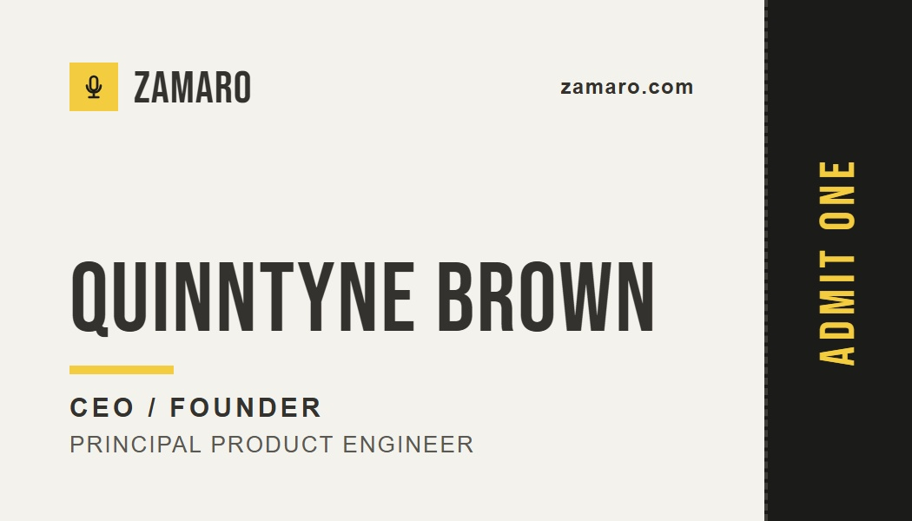
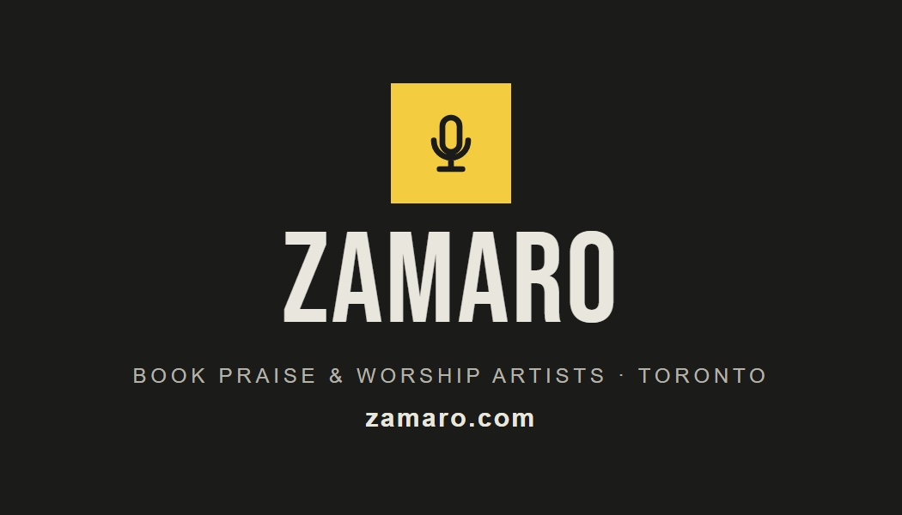
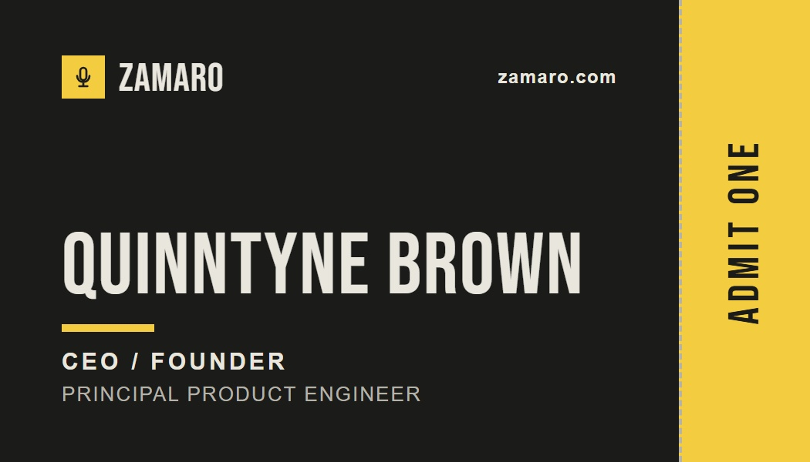

# Business cards

Quinntyne Brown, CEO / Founder, Principal Product Engineer. The cards use the Zamaro design system's
colours, its Bebas Neue display face and its microphone brand mark, and they come in two colourways.

| Colourway | Front | Back |
| --- | --- | --- |
| Light |  |  |
| Dark |  |  |

## Printing with VistaPrint

Upload the files in `print/`. Choose one colourway and upload its front and its back.

- **Product:** Standard business card, 3.5 × 2 in, horizontal, double-sided.
- **File size:** 3.61 × 2.11 in. This includes VistaPrint's bleed. The background runs to the bleed
  edge, and all text stays well inside the safe area.
- **Preferred files:** the `.pdf` files. They are vector, with the fonts embedded.
- **Fallback files:** the `.jpg` files, at 1083 × 633 px and 300 dpi.
- **Colour:** the files are RGB, and VistaPrint converts them to CMYK. Check the yellow on the
  proof before ordering.

The `preview/` images are trimmed to the finished size, 3.5 × 2 in. Don't upload them.

## Regenerating

Edit `source/card.html`, then run this command. It needs Python Playwright, Chromium and Pillow.

```bash
python -I docs/business-cards/source/render.py
```
