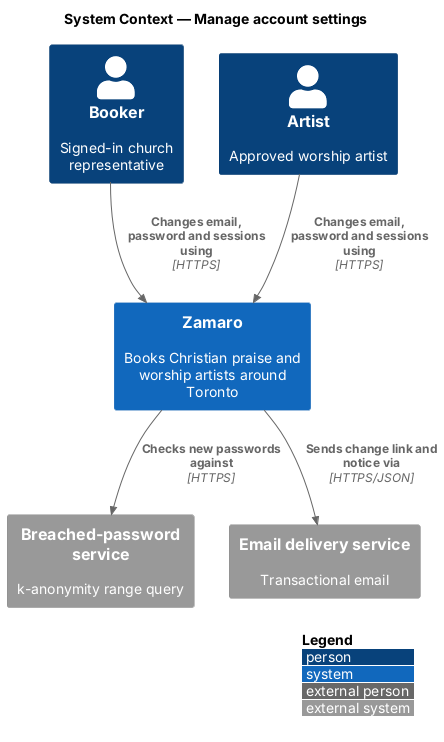
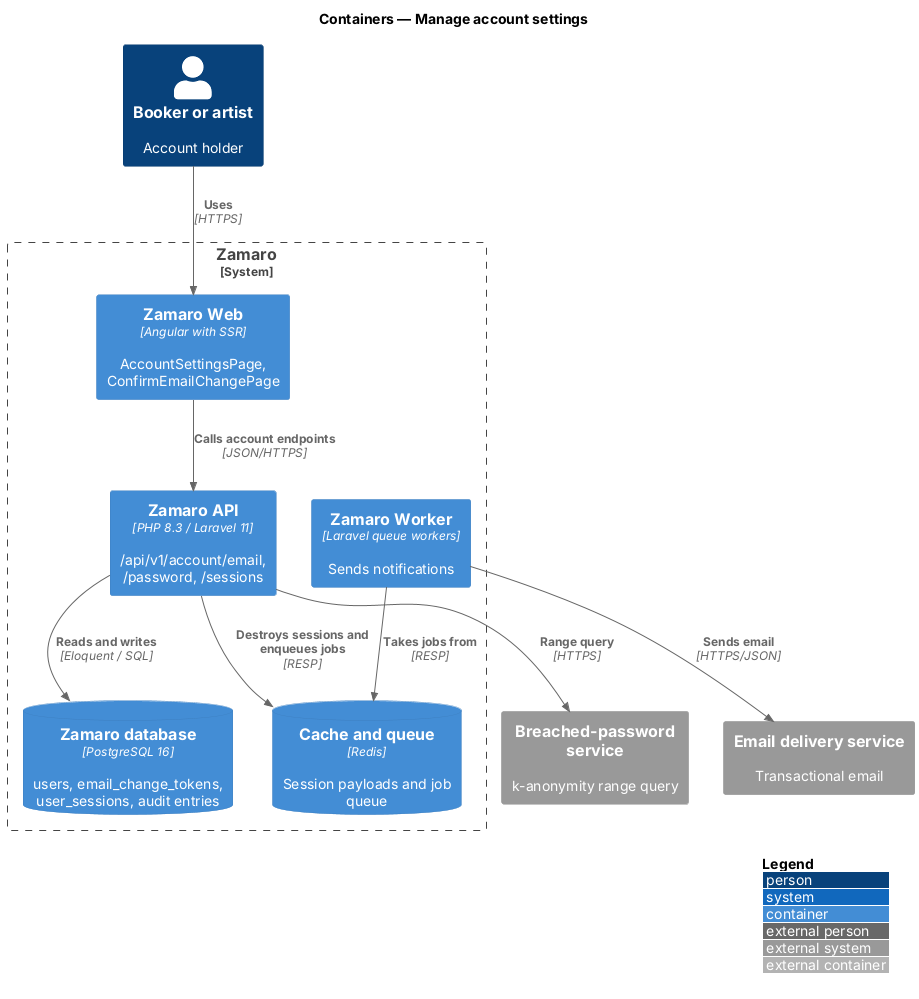
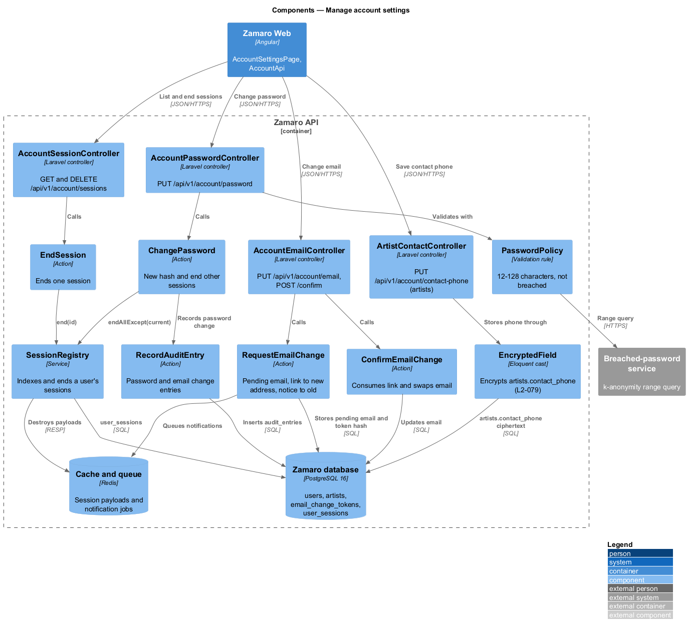
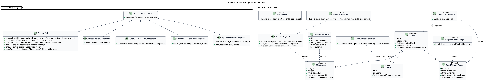
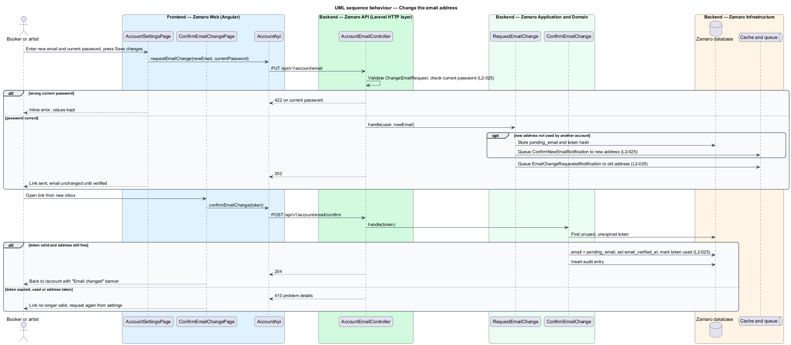
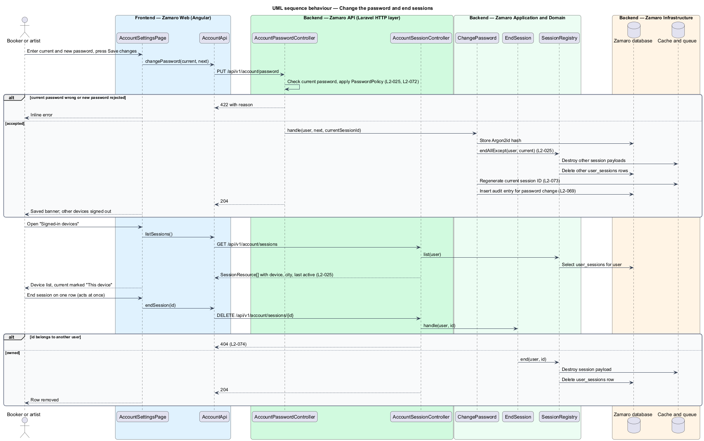

# Manage account settings

## Overview

Bookers and artists keep their own sign-in details current from one settings page.
This feature covers the changes L2-025 names: changing the account email,
changing the password while signed in, reviewing and ending the sessions listed
under "Signed-in devices", and an artist's private contact phone.

The slice runs from the account settings page in Zamaro Web to the account endpoints
in the Zamaro API. It builds on `accounts/sign-in-and-recover-access`, which defines
`PasswordPolicy` and `SessionRegistry`. The same page also hosts entry points owned
by other slices: the church (`accounts/manage-church-profile`), email preferences
(`notifications/manage-email-preferences`), two-step sign-in
(`accounts/sign-in-and-recover-access`), "Download my data"
(`privacy/export-personal-data`) and "Delete my account" (`privacy/delete-account`).

Terms used in this design:

- **account email** — verified address used for sign-in and all notifications
- **pending email** — new address that has been requested but not yet verified; the account email stays unchanged until it is
- **email change link** — single-use emailed link sent to the pending email that completes the change
- **re-authentication** — confirmation of the current password before a sensitive change
- **signed-in device** — one active session, described by device, approximate city and last-active time
- **current session** — the session making the request; it survives a password change while every other session ends
- **artist contact phone** — private North American phone an artist saves in the Contact section; never public, shown only to the booker of a Confirmed booking with the artist's account email (L2-046)

The email address only changes once the new address is proven (L2-025). A password
change ends every other session, so a device left signed in elsewhere is signed out.
An artist cannot accept a booking request until a contact phone is saved.

## Description

**Frontend (Zamaro Web, `features/account`)**

- **`AccountSettingsPage`** — routed page for `/account`, one page with a
  design-system settings navigation and these sections in order: Profile (`#profile`,
  the person's name), Church (`#church`, bookers) or Contact (`#contact`, artists),
  Email (`#email`), Password (`#password`),
  Email preferences (`#preferences`), Two-step sign-in (`#two-step`), Signed-in
  devices (`#devices`), Your data (`#data`) and Delete account (`#delete`). The
  Church section appears for bookers only; artists reach the same page from their
  account menu and see the Contact section in its place. The sections from Profile to Email preferences form one
  form with a sticky save bar: Save changes sends each changed section to its own
  endpoint, Discard resets them, and an invalid or failed save keeps every value with
  an error summary (L2-108). After a save a dismissible "Saved" banner confirms it.
  Two-step sign-in, devices, data and delete act at once from their own buttons.
- **`ChangeEmailFormComponent`** — new email and current password. On success it
  shows that a link was sent to the new address and that the account email stays the
  same until the link is opened.
- **`ChangePasswordFormComponent`** — current password and new password. It shows
  `PasswordPolicy` reasons inline (L2-072), and its section says that a new password
  signs out every other device.
- **`SignedInDevicesComponent`** — list of sessions with device label, approximate
  city and last-active time formatted through `FormatService` (L2-110). The current
  session is marked "This device". Every other row has an End session button that
  signs that device out at once, without a confirmation step.
- **`ConfirmEmailChangePage`** — routed page for `/account/email/confirm` that posts
  the token from the email change link. On success it returns to `/account` with an
  "Email changed" banner; a used or expired link says so and leaves the email
  unchanged.
- **`ContactSectionComponent`** — artists only. One required "Contact phone" field, validated
  as a North American number, with the help text "Churches see it only once a
  booking is confirmed. It's never on your public profile." It is saved through
  `PUT /api/v1/account/contact-phone` on `ArtistContactController` (L2-025). The
  "Add your contact phone before you accept." message of
  `bookings/respond-to-booking-request` links here (`/account#contact`).
- **Profile name** — the Profile section's name is saved through
  `PUT /api/v1/account/profile` on `AccountProfileController`, which validates it as
  required text.
- **`AccountApi`** — typed client for the account endpoints below.

**Mock screens** — the page is
[`pages/account`](../../../mocks/pages/account/default.html) in states default,
loading, error, [`invalid`](../../../mocks/pages/account/invalid.html), submitting,
[`success`](../../../mocks/pages/account/success.html) and
[`failed`](../../../mocks/pages/account/failed.html); an artist's page, without the
Church section and with the Contact section and Abigail's phone, is the
[`artist`](../../../mocks/pages/account/artist.html) state, and
the two-step section once it is on is the
[`two-step-on`](../../../mocks/pages/account/two-step-on.html) state. A
confirmed email change returns here with a success banner reading "Email changed. You
now sign in with {address}." The email change link lands on
[`pages/confirm-email`](../../../mocks/pages/confirm-email/default.html) in states
default, [`expired`](../../../mocks/pages/confirm-email/expired.html) and error.

**Backend (Zamaro API)**

- **`AccountEmailController`** — `PUT /api/v1/account/email` to request a change and
  `POST /api/v1/account/email/confirm` to complete it.
- **`ChangeEmailRequest`** — FormRequest that validates the new email format and
  checks `current_password` against the stored hash.
- **`RequestEmailChange`** — action that stores `pending_email` and a hashed
  `EmailChangeToken`, queues `ConfirmNewEmailNotification` to the new address, and
  queues `EmailChangeRequestedNotification` to the current address (L2-025). If the
  new address already belongs to another account, the response is unchanged and no
  link is sent, so the form does not reveal registered addresses.
- **`ConfirmEmailChange`** — action that consumes the token once, re-checks that the
  pending address is still free, moves `pending_email` into `email`, sets
  `email_verified_at`, and writes an audit entry.
- **`AccountPasswordController`** — `PUT /api/v1/account/password`.
- **`ChangePasswordRequest`** — FormRequest that checks `current_password` and applies
  `PasswordPolicy` to the new password (L2-072).
- **`ChangePassword`** — action that stores the new Argon2id hash, calls
  `SessionRegistry::endAllExcept` with the current session, regenerates the current
  session ID, and records the password change through `RecordAuditEntry` (L2-069).
- **`AccountSessionController`** — `GET /api/v1/account/sessions` and
  `DELETE /api/v1/account/sessions/{id}`. A session ID belonging to another user
  returns 404 (L2-074).
- **`EndSession`** — action that destroys the session payload in Redis and deletes
  its `user_sessions` row.
- **`SessionResource`** — serialises `id`, `deviceLabel`, `approximateCity`,
  `lastActiveAt` and `isCurrent`. It never exposes the session ID itself or the full
  IP address.
- **`ArtistContactController`** — `PUT /api/v1/account/contact-phone`, for users with
  the Artist role only; a booker receives `403`. `UpdateContactPhoneRequest`
  validates `contactPhone` as a North American number and the controller stores it
  in E.164 form on the signed-in artist's `Artist` row. The phone never appears in a
  public resource (`privacy/minimise-public-exposure`); `BookingResource` adds it to
  the contact card only for the booker of a Confirmed or Completed booking
  (`bookings/exchange-booking-messages`).
- **`TrackSessionActivity`** — middleware that updates `user_sessions.last_active_at`
  at most once per `<TO SUPPLY>` minutes, so activity tracking does not write on
  every request.

**Data**

- `users` — `email`, `pending_email`, `password`.
- `artists` — `contact_phone`, nullable, encrypted at the application level by the
  `EncryptedField` cast (L2-079, `security/protect-secrets-and-data`).
- `email_change_tokens` — `user_id`, `token_hash`, `new_email`, `expires_at`,
  `used_at`.
- `user_sessions` — defined in `accounts/sign-in-and-recover-access`.

The device label is derived from the user-agent string. The approximate city comes
from an IP geolocation lookup whose source is `<TO SUPPLY>`. The lifetime of an email
change link is `<TO SUPPLY>`.

## Requirements

The feature realises the following level-2 (L2) requirement, quoted from
`docs/specs/L2.md`.

| L2 ID | Refines (L1) | Requirement |
|-------|--------------|-------------|
| `L2-025` | `L1-004` | **Account settings.** Acceptance criteria: 1. Given a signed-in user changes their email, when they confirm with their current password, then a verification link goes to the new address and the email changes only after it is verified; the old address receives a notice. 2. Given a signed-in user changes their password, when they provide the correct current password, then the password is updated and all other sessions end. 3. Given a signed-in user, when they open "Signed-in devices", then they see each active session's device, approximate city and last-active time and can end any of them. 4. Given a signed-in artist, when they save a contact phone (valid North American number) in the Contact section of account settings, then it is stored as their private contact phone; it is required before they can accept a booking request, is never shown on their public profile, and is shown only to the booker of a Confirmed booking with the artist's account email (L2-046). |

## Diagrams

### System context

A booker or artist changes sign-in details in Zamaro. Zamaro checks new passwords
against the breached-password service and sends the email change link and notice
through the email delivery service.

### Containers

The settings page in Zamaro Web calls the account endpoints in the Zamaro API. The
API updates the database, ends sessions in Redis, and queues emails for the Zamaro
Worker.

### Components

Four controllers front four actions. `ChangePassword` and `EndSession` both work
through `SessionRegistry`, and `ArtistContactController` saves the artist's
encrypted contact phone.

### Class structure

A `User` owns `EmailChangeToken` rows and `UserSession` rows, and an artist's
`Artist` row holds the encrypted contact phone. `SessionResource` presents each
`UserSession` without exposing the session identifier.

### Behaviour — change the email address

The change is confirmed with the current password, and the account email changes
only when the link sent to the new address is opened. The old address receives a
notice.

### Behaviour — change the password and end sessions

A password change with the correct current password ends every other session. A
single session can also be ended from the signed-in devices list.

