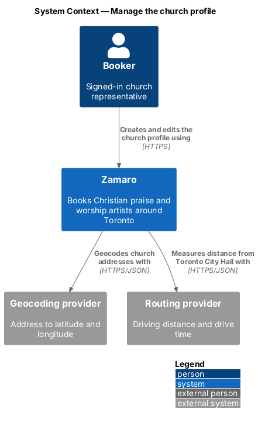
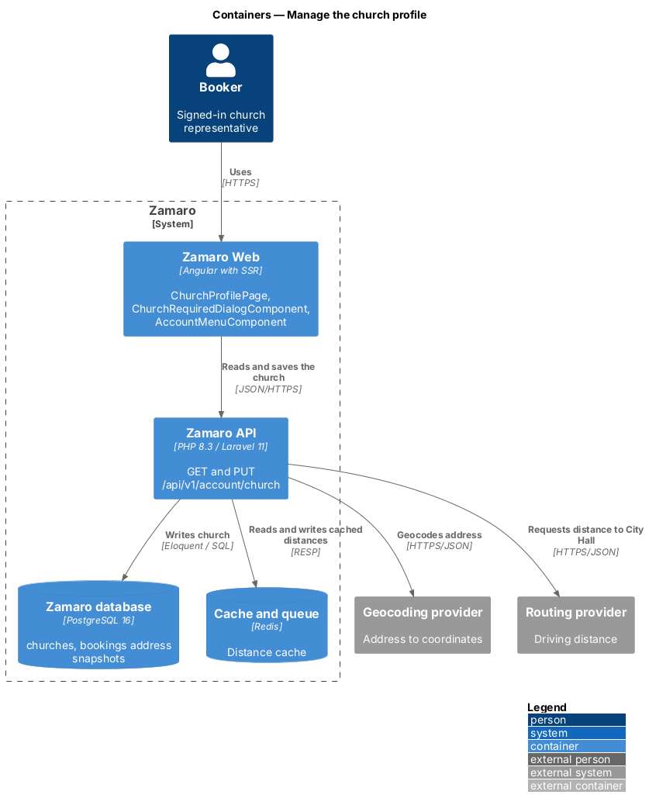
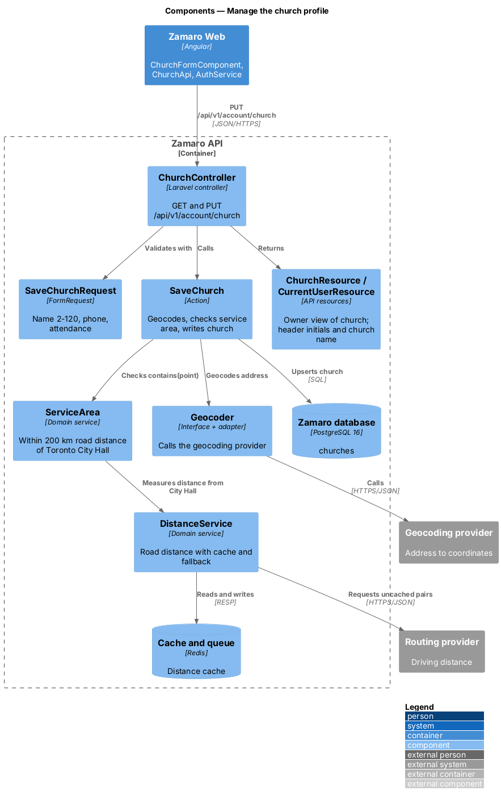
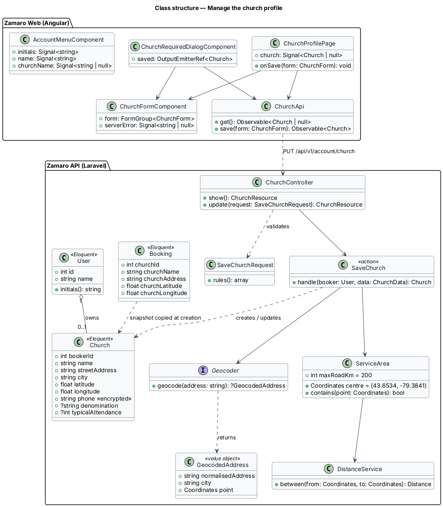
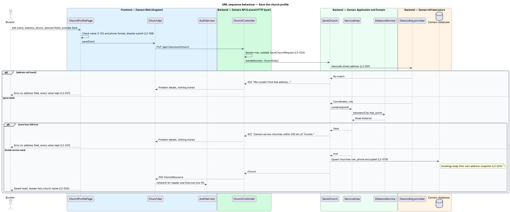
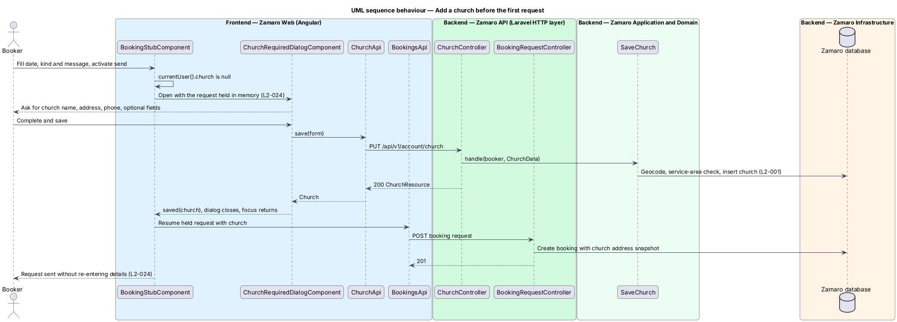

# Manage the church profile

## Overview

Every booking on Zamaro is made on behalf of a church. The church profile tells
artists who is asking, where the event is and how to reach the church once a booking
is confirmed. It also anchors search: Discover pre-fills a booker's church location
(`discovery/search-available-artists`).

This feature lets a booker create and edit that profile. It is asked for at the
moment it matters, the first time a booker sends a booking request, and the request
resumes as soon as the church is saved. Every church address is geocoded and checked
against the service area before it is stored. The request itself is a separate slice
(`bookings/send-booking-request`).

Terms used in this design:

- **church profile** — booker-owned record of church name, street address, coordinates, contact phone, and optional denomination and typical attendance
- **service area** — every address within 200 km road distance of Toronto City Hall (43.6534, -79.3841)
- **geocoding** — conversion of a street address into latitude and longitude by the geocoding provider
- **address snapshot** — copy of the church name and address stored on a booking when it is created, so later edits do not change it
- **initials** — first letters of a booker's given and family names, shown in the header avatar (for example "NF")

L2-001 makes the service area a hard boundary: an address outside it, or one that
cannot be geocoded, is rejected and nothing is stored. L2-024 requires that editing
the address leaves existing Requested, Accepted and Confirmed bookings untouched,
which the address snapshot guarantees.

## Description

**Frontend (Zamaro Web, `features/account`)**

- **`ChurchProfilePage`** — routed page for `/account/church` that loads the church,
  hosts `ChurchFormComponent`, and shows a success toast on save.
- **`ChurchFormComponent`** — reactive form with church name (2–120 characters),
  street address with type-ahead, contact phone (North American number),
  denomination (optional) and typical attendance (optional, whole number). It keeps
  every value when the server rejects the address (L2-001) and disables the submit
  button while saving (L2-108).
- **`ChurchRequiredDialogComponent`** — design-system dialog opened by the booking
  stub when `AuthService.currentUser().church` is null. It embeds
  `ChurchFormComponent`, and on save it closes and calls back into the booking stub,
  which resubmits the held request (L2-024).
- **`AccountMenuComponent`** — header avatar showing the booker's initials, with a
  menu that lists the booker's name and church name (L2-024).
- **`ChurchApi`** — typed client for `GET /api/v1/account/church` and
  `PUT /api/v1/account/church`.
- **`AuthService`** — refreshes `currentUser` after a save so the header and the
  Discover pre-fill read the new church.

**Backend (Zamaro API)**

- **`ChurchController`** — `show` and `update` for `/api/v1/account/church`, limited
  to the `Booker` role. Each booker has at most one church; `PUT` creates or
  replaces it.
- **`SaveChurchRequest`** — FormRequest that validates name length 2–120, address
  presence, phone through the `NorthAmericanPhone` rule, denomination length, and
  typical attendance as a positive integer.
- **`SaveChurch`** — action that geocodes the address through `Geocoder`, asks
  `ServiceArea` whether the point is inside, and only then writes the `Church` inside
  `DB::transaction`. A geocoding miss raises a 422 with "We couldn't find that
  address. Check the street and postal code." An address outside the area raises a
  422 with "Zamaro serves churches within 200 km of Toronto." Neither case stores
  anything (L2-001).
- **`Geocoder`** — interface with one adapter for the geocoding provider. It returns
  coordinates, a normalised address and the city, or null when the address cannot be
  resolved.
- **`ServiceArea`** — domain service with `contains(Coordinates): bool`. It measures
  road distance from Toronto City Hall with `DistanceService` and accepts 200 km or
  less. The artist application slice reuses it for artist base cities (L2-001).
- **`DistanceService`** — shared service defined in
  `discovery/search-available-artists`; it caches results and falls back to
  straight-line distance × 1.3 when the routing provider is unavailable.
- **`ChurchResource`** — serialises the church for its owner only. The phone is
  decrypted for the owner and never appears in any public resource (L2-083).
- **`CurrentUserResource`** — includes `initials`, `name` and `church.name` for the
  header (L2-024).

Editing the church never updates bookings. `SendBookingRequest` copies the church
name, address and coordinates onto the `Booking` row as the address snapshot when the
booking is created, so Requested, Accepted and Confirmed bookings keep the address
they were made with (L2-024).

**Data**

- `churches` — `booker_id` (unique), `name`, `street_address`, `city`, `province`,
  `postal_code`, `latitude`, `longitude`, `phone` (encrypted at application level,
  L2-079), `denomination`, `typical_attendance`, `updated_at`.
- `bookings` — `church_name`, `church_address`, `church_latitude`,
  `church_longitude` snapshot columns, written by the bookings subsystem.

The geocoding provider vendor, the type-ahead source, and the list of denomination
values (free text or a fixed list) are `<TO SUPPLY>`.

## Requirements

The feature realises the following level-2 (L2) requirements, quoted from
`docs/specs/L2.md`.

| L2 ID | Refines (L1) | Requirement |
|-------|--------------|-------------|
| `L2-024` | `L1-004` | **Church profile.** Acceptance criteria: 1. Given a booker without a church, when they first try to send a request, then they are asked for church name (2–120 characters), street address (inside the service area), contact phone (valid North American number) and optionally denomination and typical attendance, and the request is resumed after saving. 2. Given a booker with a church, when the header renders, then it shows their initials (for example "NF") and the account menu lists their name and church name. 3. Given a booker edits the church address, when it is saved, then existing Requested, Accepted and Confirmed bookings keep the address they were made with. |
| `L2-001` | `L1-001` | **Service area boundary.** The service area is every address within 200 km road distance of Toronto City Hall (43.6534, -79.3841). Church locations and artist base locations must fall inside it. Acceptance criteria: 1. Given a booker entering a church address in Burlington, ON (about 55 km away), when they save it, then the address is accepted and geocoded to latitude and longitude. 2. Given a booker entering an address in Ottawa, ON (about 450 km away), when they save it, then the save is rejected with the message "Zamaro serves churches within 200 km of Toronto." and nothing is stored. 3. Given an artist applicant whose base city is outside the service area, when they submit the application, then the application is rejected with the same service-area message. 4. Given an address that cannot be geocoded, when it is saved, then the save is rejected with "We couldn't find that address. Check the street and postal code." and the form keeps every value entered. |

## Diagrams

### System context

A booker maintains the church profile in Zamaro. Zamaro geocodes the address and
measures road distance from Toronto City Hall to enforce the service area.

### Containers

The church page and the booking-stub dialog in Zamaro Web call the church endpoint in
the Zamaro API. The API calls the geocoding and routing providers, uses Redis for the
distance cache, and stores the church in the database.

### Components

`ChurchController` validates with `SaveChurchRequest` and calls `SaveChurch`, which
combines `Geocoder` and `ServiceArea` before writing the `Church`.

### Class structure

A booker `User` owns at most one `Church`. A `Booking` holds its own address snapshot
and refers to the church only by identifier.

### Behaviour — save the church

The address is geocoded and checked against the 200 km service area before any
write. A failed lookup or an address outside the area returns the matching message
and keeps every value in the form.

### Behaviour — add a church before the first request

A booker without a church who submits the booking stub is asked for the church
first. Once it is saved, the held request is sent without re-entry.

