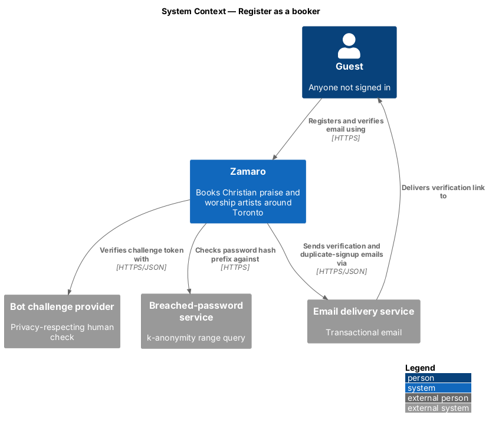
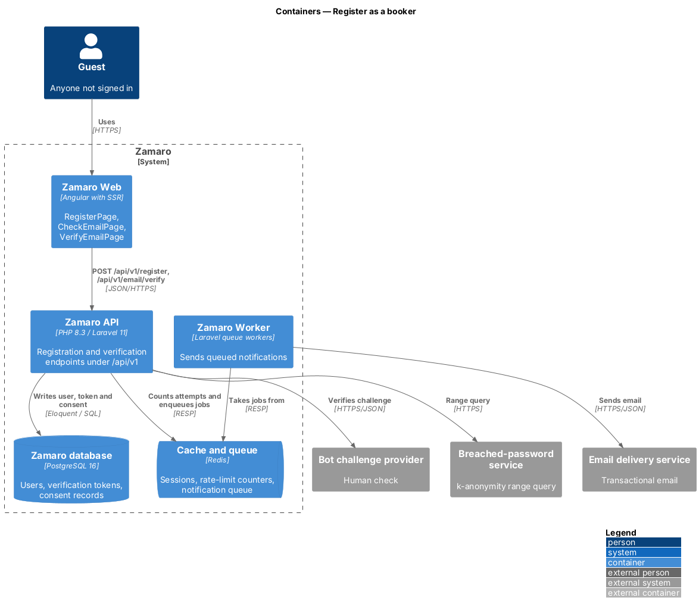
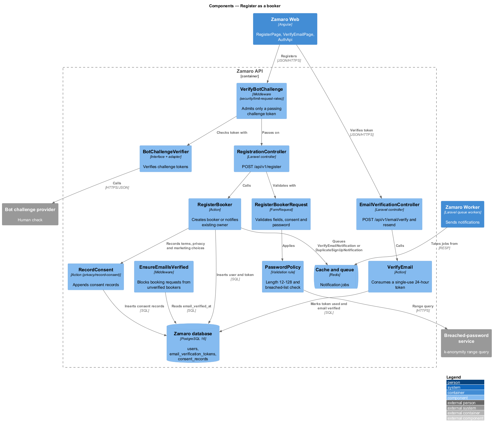
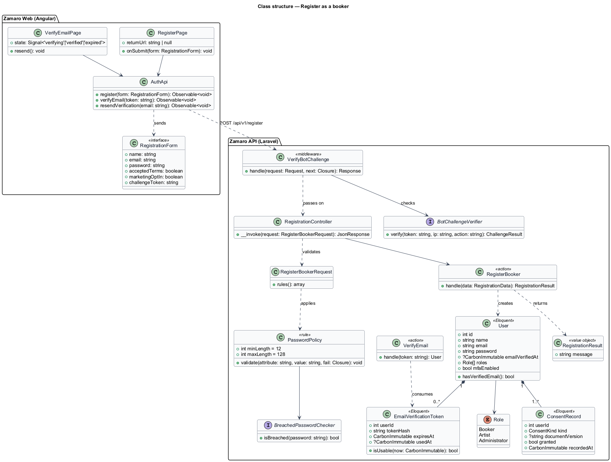
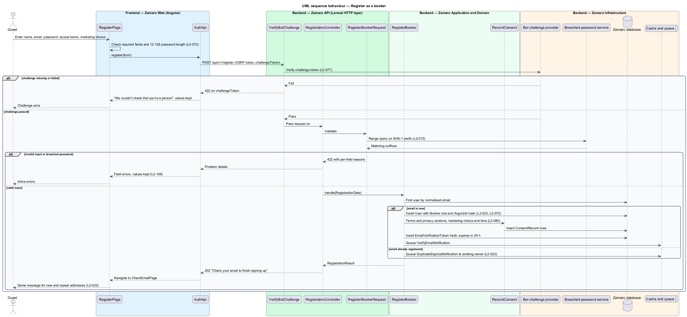
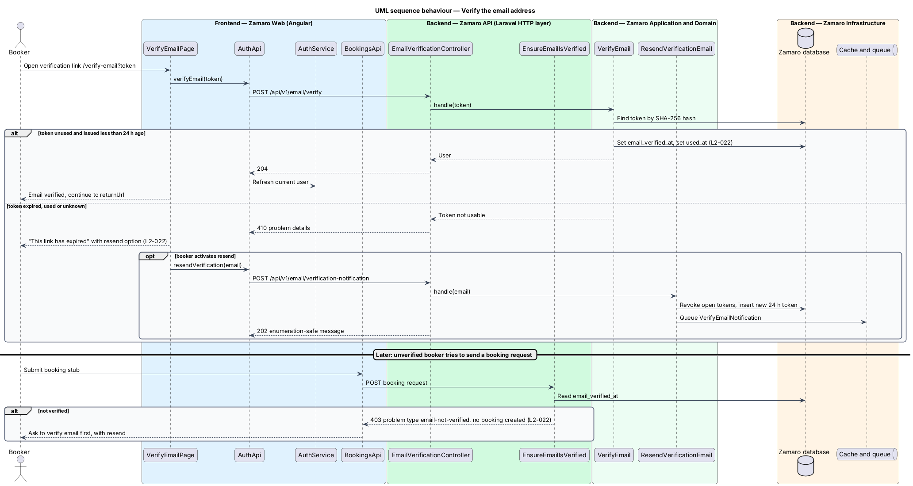

# Register as a booker

## Overview

Zamaro is a marketplace where churches in and around Toronto book Christian praise
and worship artists. Anyone may search and read profiles as a guest, but sending a
booking request, saving artists and seeing bookings call for a booker account.
This feature is the registration that turns a guest into a booker, and the email
verification that proves the booker controls the address they gave.

The slice runs from the registration page in Zamaro Web to the registration and
verification endpoints in the Zamaro API, the Zamaro database and the email delivery
service. Consent evidence captured on the same form is stored through
`privacy/record-consent`. Passwords follow the policy defined in
`accounts/sign-in-and-recover-access`. The church profile is added later, the first
time the booker sends a request (`accounts/manage-church-profile`).

Terms used in this design:

- **booker** — signed-in church representative who requests bookings
- **guest** — visitor who is not signed in
- **verification link** — single-use emailed link that marks an email address as verified, valid for 24 hours
- **verified booker** — booker whose `emailVerifiedAt` is set
- **enumeration-safe response** — reply that reads the same whether or not an email address already has an account, so the form cannot be used to discover who is registered
- **bot challenge** — privacy-respecting human check run by the bot challenge provider before a public form is accepted
- **consent record** — append-only row that stores which version of a legal document or which marketing choice a person accepted, and when

Two rules shape the flow. Registration never reveals whether an email is already in
use (L2-022): a repeat address receives the same on-screen message, and the existing
owner is told by email instead. An unverified booker can browse and save artists but
cannot send a booking request until the email is verified.

## Description

**Frontend (Zamaro Web, `features/account`)**

- **`RegisterPage`** — routed page for `/sign-up`. It hosts the registration form
  and carries a `returnUrl` query parameter so a guest who arrived from a Save or
  Book action returns to the same page after verifying.
- **`RegisterFormComponent`** — reactive form with full name, email, password,
  a required checkbox accepting the terms and privacy policy (each linked to its
  current version), a separate unchecked marketing email checkbox "Email me about
  new artists near my church" (L2-080), and the bot challenge widget. It checks the
  12–128 character password length on the client, shows server reasons for a
  breached password, and disables the submit button while the request is pending
  (L2-108). A failed bot challenge shows "We couldn't check that you're a person"
  and keeps every value.
- **`CheckEmailPage`** — confirmation view that reads "Check your email to finish
  signing up" and offers a resend action. It is shown for both new and repeat
  addresses.
- **`VerifyEmailPage`** — routed page for `/verify-email`. It reads the token from
  the link and posts it once. On success it navigates to the `returnUrl` (Discover by
  default), where a dismissible "Email verified" banner confirms it. A used or
  expired token shows "This link has expired" with a resend option.
- **Verify banner** — until the email is verified, every page shows a persistent
  "Verify your email" banner with a Resend email action, and the booking stub asks
  for verification instead of sending (L2-022).
- **`AuthApi`** — typed client for `POST /api/v1/register`,
  `POST /api/v1/email/verify` and `POST /api/v1/email/verification-notification`.
  It first calls `GET /sanctum/csrf-cookie` so the XSRF interceptor can attach the
  token (L2-073).
- **`AuthService`** — shared signal-based service holding the current user. It
  exposes `isVerified` so the booking stub can ask for verification before a request
  is sent.

**Mock screens** — registration is
[`pages/sign-up`](../../../mocks/pages/sign-up/default.html) in states default,
[`invalid`](../../../mocks/pages/sign-up/invalid.html), submitting, error,
[`challenge`](../../../mocks/pages/sign-up/challenge.html) (bot check failed) and
[`success`](../../../mocks/pages/sign-up/success.html), which is `CheckEmailPage`.
The link lands on [`pages/verify-email`](../../../mocks/pages/verify-email/default.html)
in states default, [`expired`](../../../mocks/pages/verify-email/expired.html) and
error. The banners are
[`notifications/system-banner/persistent`](../../../mocks/notifications/system-banner/persistent.html)
(verify your email), its
[`warning`](../../../mocks/notifications/system-banner/warning.html) state just after
Resend email, and
[`notifications/system-banner/success`](../../../mocks/notifications/system-banner/success.html)
(email verified). An unverified booker who presses Send request on the booking stub
sees [`pages/book/unverified`](../../../mocks/pages/book/unverified.html): the request
is refused and not created, an alert asks them to verify first with Resend email, and
every value stays (L2-022 AC4).

**Backend (Zamaro API)**

- **`RegistrationController`** — invokable controller for `POST /api/v1/register`,
  behind the registration rate limiter and the `VerifyBotChallenge` route middleware
  of `security/limit-request-rates`, which checks `challengeToken` through
  `BotChallengeVerifier` before the controller runs (L2-077). It returns
  `202 Accepted` with the same body for every valid submission.
- **`RegisterBookerRequest`** — FormRequest that validates name, email format,
  `accepted_terms` (rejected unless true), `marketing_opt_in`
  (boolean, default false), and the password through the `PasswordPolicy` rule
  (12–128 characters, not in the breached-password list; L2-072).
- **`RegisterBooker`** — action run inside `DB::transaction`. When the email is new
  it creates a `User` with the `Booker` role and an Argon2id password hash, calls
  `RecordConsent` for the terms, the privacy policy and the marketing choice, issues
  an `EmailVerificationToken`, and queues `VerifyEmailNotification`. When the email
  already exists it changes nothing and queues `DuplicateSignUpNotification` to the
  existing owner. Both paths return the same `RegistrationResult`.
- **`EmailVerificationController`** — `POST /api/v1/email/verify` and
  `POST /api/v1/email/verification-notification`.
- **`VerifyEmail`** — action that hashes the presented token, finds an unused,
  unexpired `EmailVerificationToken`, sets `users.email_verified_at`, and marks the
  token used. An unknown, used or expired token yields a `410 Gone` problem detail
  that the page renders as "This link has expired".
- **`ResendVerificationEmail`** — action that revokes outstanding tokens for the
  user and issues a fresh one. Its response is enumeration-safe and rate-limited.
- **`EnsureEmailIsVerified`** — route middleware on the booking request endpoint
  (`bookings/send-booking-request`). An unverified booker receives a `403` problem
  detail of type `email-not-verified`, and no booking is created (L2-022).
- **`VerifyEmailNotification`**, **`DuplicateSignUpNotification`** — queued
  notifications sent through the email delivery service with plain-text and HTML
  parts. The duplicate notice reads "Someone tried to sign up with your email" and
  links to sign-in and password reset.
- **`RecordConsent`** — action owned by `privacy/record-consent`; this slice calls it
  and does not define it.

**Data**

- `users` — `name`, `email` (unique, case-insensitive), `password` (hash),
  `email_verified_at`, `created_at`. The `Booker` role is held in `role_user`.
- `email_verification_tokens` — `user_id`, `token_hash` (SHA-256), `expires_at`
  (issue time plus 24 hours), `used_at`.
- `consent_records` — written through `RecordConsent`.

The response for a repeat address is generated without waiting on the email job, so
both paths return in comparable time. The exact Argon2id memory and iteration
settings are `<TO SUPPLY>`. The bot challenge vendor is `<TO SUPPLY>`.

## Requirements

The feature realises the following level-2 (L2) requirements, quoted from
`docs/specs/L2.md`.

| L2 ID | Refines (L1) | Requirement |
|-------|--------------|-------------|
| `L2-022` | `L1-004` | **Booker registration.** Acceptance criteria: 1. Given a guest provides full name, email, a password meeting L2-072, and accepts the terms and privacy policy, when they register, then an account with the Booker role is created and a verification email is sent. 2. Given an email already registered, when someone registers with it, then the response is identical to a new registration ("Check your email to finish signing up") and the existing owner receives a "Someone tried to sign up with your email" message. 3. Given the verification link, when it is opened within 24 hours, then the email is marked verified; after 24 hours or after one use it shows "This link has expired" with a resend option. 4. Given an unverified booker, when they try to send a booking request, then they are asked to verify their email first and the request is not created. |
| `L2-080` | `L1-017` | **Consent.** Acceptance criteria: 1. Given registration, when it completes, then the versions of the terms and privacy policy accepted and the time are stored. 2. Given registration, when the form renders, then marketing email consent is a separate unchecked checkbox, and its value and time are stored as evidence under CASL. 3. Given a new version of the terms, when a user next signs in, then they must accept it before continuing. 4. Given a signed-in user changes the marketing email choice in their email preferences, when they save, then a new consent record with the value and the time is stored and earlier records are kept. |

## Diagrams

### System context

Guests register with Zamaro, which checks the bot challenge and the breached-password
service, and sends verification and duplicate-signup emails through the email
delivery service.

### Containers

The registration page in Zamaro Web posts to the Zamaro API, which writes the user
and consent records to the database and queues email jobs that the Zamaro Worker
sends.

### Components

`VerifyBotChallenge` admits only submissions with a passing challenge token.
`RegistrationController` then validates with `RegisterBookerRequest` and calls
`RegisterBooker`, which creates the user, records consent and queues the
verification email. `VerifyEmail` later consumes the token.

### Class structure

A `User` owns zero or more `EmailVerificationToken` rows and `ConsentRecord` rows.
`RegisterBooker` returns one `RegistrationResult` for both new and repeat addresses.

### Behaviour — register

The bot challenge middleware and then validation run before any write. A new address creates the account, the consent
records and a verification email. A repeat address changes nothing and emails the
existing owner, while the guest sees the same message in both cases.

### Behaviour — verify the email address

The verification link is accepted once within 24 hours. An expired or used link
offers a resend, and an unverified booker who tries to send a request is asked to
verify first.

