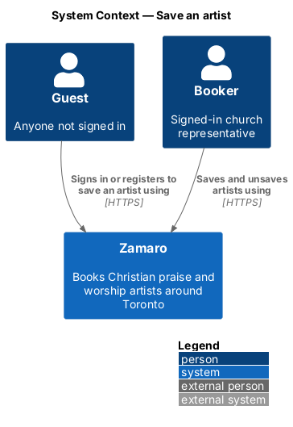
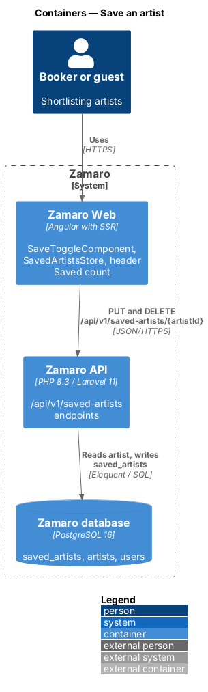
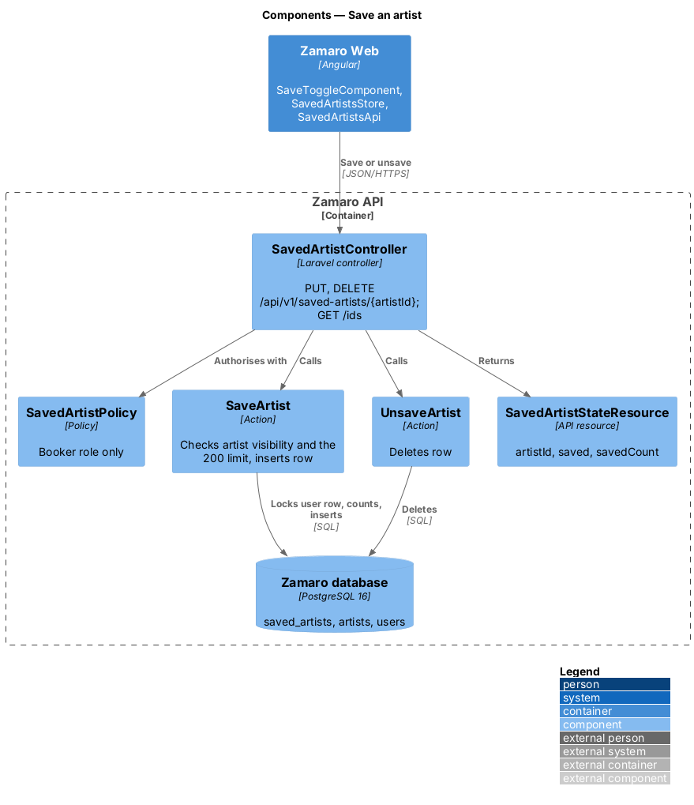
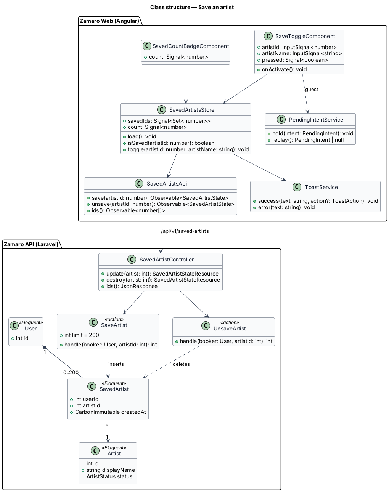
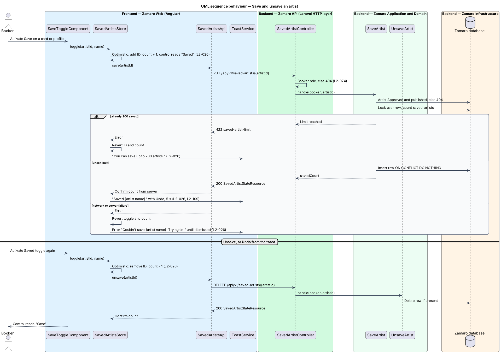
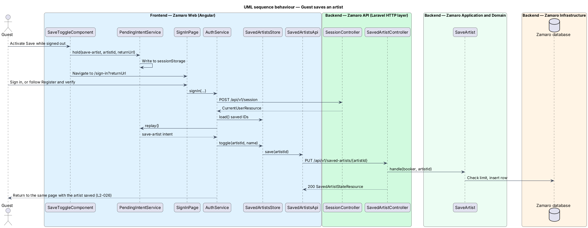

# Save an artist

## Overview

Church planners rarely decide on the first visit. They compare a few artists, check
with a worship pastor and come back. Saving gives a booker a personal shortlist of
artists to return to.

This feature is the Save toggle itself: the heart-shaped control on every ticket card
in the lineup and on every artist profile, the Saved count in the header, and the
toast that confirms each change. It is open to bookers. A guest who activates Save is
sent to sign in or register and comes back with the artist saved. The shortlist page
at `/saved` is a sibling slice (`accounts/view-saved-artists`). The toggle appears on
cards rendered by `discovery/search-available-artists` and on profiles.

Terms used in this design:

- **saved artist** — artist a booker has added to their shortlist, stored as one row per booker and artist
- **Save toggle** — design-system toggle with `aria-pressed`: the heart circle (`.save`) on ticket cards, named "Save {artist name} to your saved artists" or "Remove {artist name} from your saved artists", and the labelled button that reads "Save" or "Saved" on the profile
- **Saved count** — number of saved artists shown as a badge on the header's Saved link
- **optimistic update** — interface change applied before the server confirms it, reverted if the server refuses
- **pending intent** — action a guest started before signing in, held in the browser and replayed after sign-in
- **shortlist limit** — maximum of 200 saved artists per booker

Saving and unsaving are idempotent. Saving an artist already saved, or removing one
already removed, leaves one consistent state and returns the current count.

## Description

**Frontend (Zamaro Web, `shared/saved`)**

- **`SaveToggleComponent`** — design-system Save toggle. It takes the artist ID and
  display name, reads its pressed state from `SavedArtistsStore`, and sets
  `aria-label` to "Save {artist name} to your saved artists" or "Remove {artist name}
  from your saved artists". It is rendered by `TicketCardComponent`,
  `HeadlinerCardComponent` and `ArtistProfilePage` for signed-in bookers (L2-006),
  and for guests as a control that starts sign-in.
- **`SavedArtistsStore`** — signal-based store holding the set of saved artist IDs
  and the Saved count, loaded once after sign-in from
  `GET /api/v1/saved-artists/ids`. `toggle(artist)` applies an optimistic update,
  calls the API, and on failure restores the previous state and raises the error
  toast (L2-026).
- **`SavedArtistsApi`** — typed client for `PUT /api/v1/saved-artists/{artistId}`,
  `DELETE /api/v1/saved-artists/{artistId}` and the ID list.
- **`SavedCountBadgeComponent`** — the header's Saved link and count badge
  (`.badge--count`). The link reads "Saved {n} artists" to assistive technology: the
  visible "Saved" and count plus a visually hidden "artists".
- **`ToastService`** — shows "Saved {artist name}" with an Undo action that calls
  `toggle` again, dismissing after 5 seconds; "Removed {artist name}" with Undo after
  an unsave; "Saved artists are private" once, on the booker's first save; "You can
  save up to 200 artists." for the limit; and the error toast "Couldn't save {artist
  name}. Try again." with a Try again action, which stays until dismissed (L2-109).
  A save never queues while offline: it fails and reverts like any other error.
- **`PendingIntentService`** — stores `{ kind: 'save-artist', artistId, returnUrl }`
  in `sessionStorage` when a guest activates Save, then routes to
  `/sign-in?returnUrl=…`. After sign-in or registration, `AuthService` asks it to
  replay the intent: the store saves the artist and the router returns to the
  original page (L2-026).

**Backend (Zamaro API)**

- **`SavedArtistController`** — `update` (`PUT`), `destroy` (`DELETE`) and `ids`
  (`GET`) under `/api/v1/saved-artists`, limited to the `Booker` role. Other roles
  receive 404 (L2-074).
- **`SaveArtist`** — action run inside `DB::transaction`. It loads the artist and
  returns 404 unless the artist is `Approved` and published. It locks the booker's
  `users` row, counts saved artists, and refuses a 201st with a 422 problem detail of
  type `saved-artist-limit` (L2-026). It then inserts the row with
  `ON CONFLICT DO NOTHING` and returns the new count.
- **`UnsaveArtist`** — action that deletes the row if present and returns the new
  count.
- **`SavedArtistStateResource`** — `{ artistId, saved, savedCount }`, used by both
  writes so the header count always matches the server.

**Data**

- `saved_artists` — `user_id`, `artist_id`, `created_at`, with a unique index on
  `(user_id, artist_id)` and an index on `(user_id, created_at DESC)` for the list
  page.

**Mock screens** — the toasts are
[`notifications/saved-toast`](../../../mocks/notifications/saved-toast/success.html) in
states [`success`](../../../mocks/notifications/saved-toast/success.html) (Saved, with
Undo), [`with-action`](../../../mocks/notifications/saved-toast/with-action.html)
(Removed, with Undo), [`info`](../../../mocks/notifications/saved-toast/info.html)
(first save), [`warning`](../../../mocks/notifications/saved-toast/warning.html) (200
limit) and [`danger`](../../../mocks/notifications/saved-toast/danger.html) (failed).
The toggle and header count appear on
[`pages/discover`](../../../mocks/pages/discover/default.html) and
[`pages/artist`](../../../mocks/pages/artist/default.html).

Saving does not require a verified email; only booking requests do
(`accounts/register-booker`). `PendingIntentService` holds one intent at a time, and
a newer intent replaces an older one.

## Requirements

The feature realises the following level-2 (L2) requirement, quoted from
`docs/specs/L2.md`.

| L2 ID | Refines (L1) | Requirement |
|-------|--------------|-------------|
| `L2-026` | `L1-005` | **Save and unsave an artist.** Acceptance criteria: 1. Given a signed-in booker on a result card or profile, when they activate Save, then the artist is saved, the control reads "Saved", the header Saved count increases by 1 and a toast reads "Saved {artist name}" with an Undo action. 2. Given a saved artist, when the booker activates the toggle again, then the artist is removed and the count decreases by 1. 3. Given a guest activates Save, when they finish signing in or registering, then they return to the same page and the artist is saved. 4. Given a booker has 200 saved artists, when they try to save another, then the toast reads "You can save up to 200 artists." and nothing changes. 5. Given the save request fails, when the error returns, then the toggle reverts and an error toast reads "Couldn't save {artist name}. Try again." |

## Diagrams

### System context

A booker saves artists in Zamaro, and a guest who tries is routed through sign-in
first. No external system takes part.

### Containers

`SaveToggleComponent` in Zamaro Web calls the saved-artists endpoints in the Zamaro
API, which reads the artist and writes the shortlist in the database.

### Components

`SavedArtistController` calls `SaveArtist` or `UnsaveArtist` and returns a
`SavedArtistStateResource` that carries the new count.

### Class structure

`SavedArtistsStore` owns the saved-ID set and the count that every
`SaveToggleComponent` and the header read. On the server, a `SavedArtist` row joins
one booker `User` to one `Artist`.

### Behaviour — save and unsave

The toggle flips at once and the count changes. The server confirms the new count, or
refuses at the 200-artist limit, or fails; in the last two cases the toggle reverts
and a toast explains why.

### Behaviour — guest saves an artist

A guest's Save is held as a pending intent through sign-in or registration, then
replayed on return to the same page.

