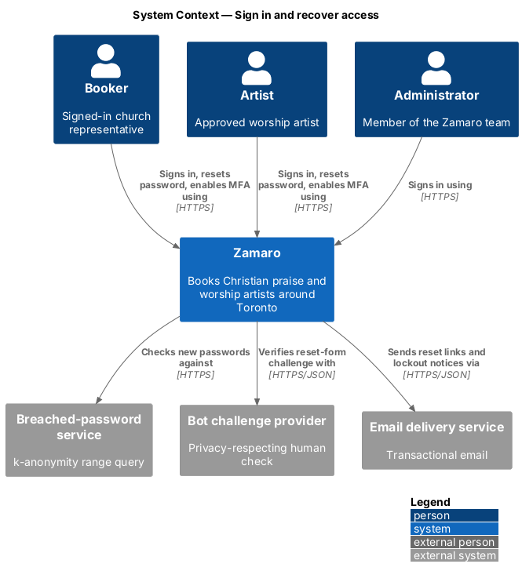
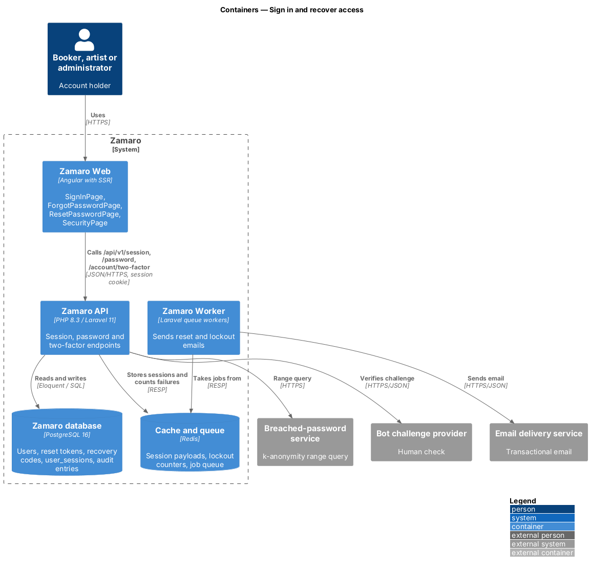
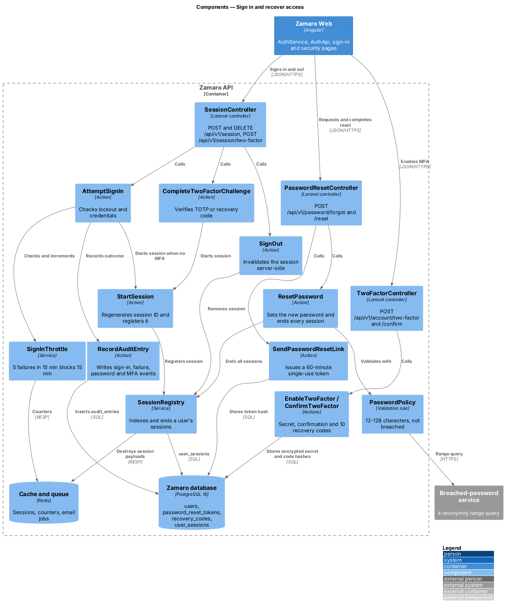
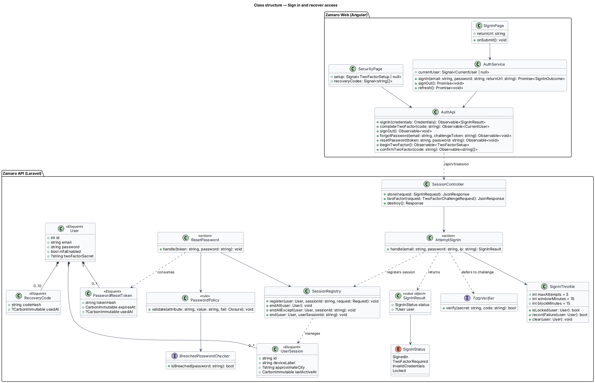
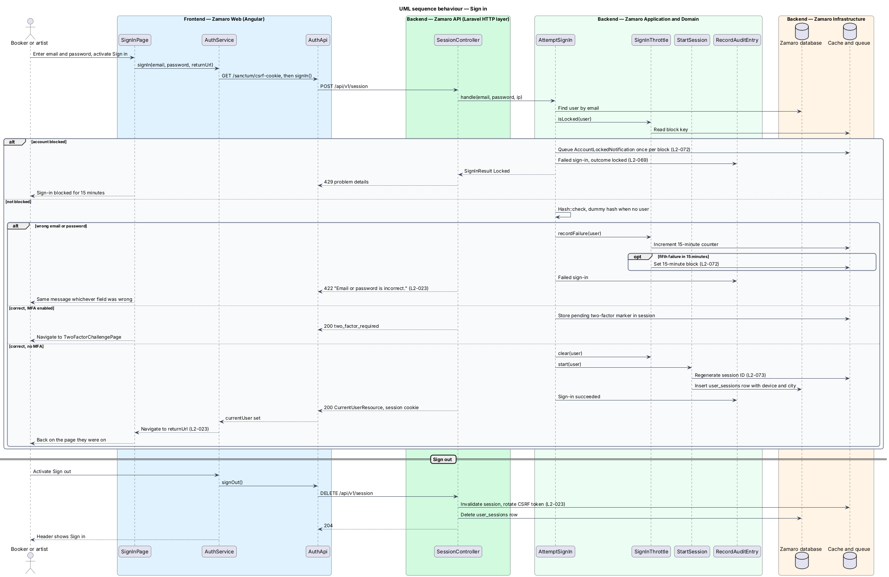
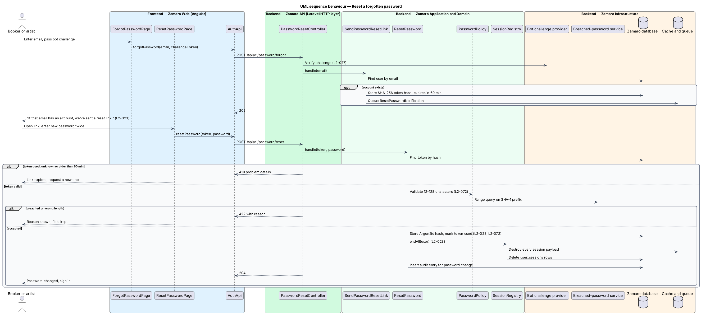
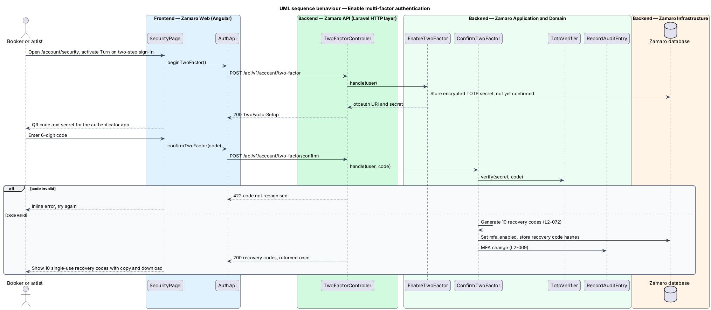

# Sign in and recover access

## Overview

Bookers, artists and administrators reach their private areas of Zamaro through one
sign-in. This feature covers starting and ending a session, recovering access with a
password reset, and the account protections that sit around those steps: the
password policy, password hashing, lockout after repeated failures, and optional
time-based one-time password (TOTP) multi-factor authentication.

The slice runs from the sign-in, reset and security pages in Zamaro Web to the
session, password and two-factor endpoints in the Zamaro API, with session state in
Redis and accounts in the Zamaro database. Registration is a sibling slice
(`accounts/register-booker`) that applies the same `PasswordPolicy`. Changing a
password while signed in, changing email and the "Signed-in devices" list live in
`accounts/manage-account-settings`, which reuses the `SessionRegistry` defined here.
Acceptance of updated terms at sign-in belongs to `privacy/record-consent`.

Terms used in this design:

- **session** — server-side record in Redis, identified by an `HttpOnly` cookie, that keeps a user signed in
- **session registry** — per-user index of active sessions, used to end every session but one
- **lockout** — 15-minute block on sign-in for one account after 5 failed attempts within 15 minutes
- **password reset link** — single-use emailed link that lets the owner set a new password, valid for 60 minutes
- **breached password** — password that appears in the breached-password service's corpus
- **k-anonymity range query** — lookup that sends only the first 5 hex characters of the password's SHA-1 hash and compares the returned suffixes locally
- **TOTP** — time-based one-time password from an authenticator app, as defined in RFC 6238
- **recovery code** — single-use code, issued in a set of 10, that substitutes for a TOTP code when the authenticator is lost
- **return URL** — path of the page the user was on before signing in

Sign-in never says which of email or password was wrong (L2-023). Password reset
never says whether an email has an account. A successful reset ends every other
session, so a stolen session cannot outlive a recovered account.

## Description

**Frontend (Zamaro Web, `features/account`)**

- **`SignInPage`** — routed page for `/sign-in`. It holds email and password fields,
  reads the `returnUrl` query parameter set by `authGuard`, and on success navigates
  back to it (L2-023). It shows "Email or password is incorrect." for any credential
  failure and a lockout message when the account is blocked.
- **`TwoFactorChallengePage`** — routed page for `/sign-in/two-factor`. It accepts a
  6-digit TOTP code or a recovery code.
- **`ForgotPasswordPage`** — routed page for `/forgot-password` with an email field
  and the bot challenge widget (L2-077). It always shows "If that email has an
  account, we've sent a reset link."
- **`ResetPasswordPage`** — routed page for `/reset-password` that reads the token
  from the link and asks for the new password twice.
- **`SecurityPage`** — routed page for `/account/security`. Its two-factor section
  starts enrolment, shows the QR code and secret, confirms with a code, and shows the
  10 recovery codes once with copy and download actions (L2-072).
- **`AuthService`** — shared service holding `currentUser` as a signal. It exposes
  `signIn`, `signOut` and `refresh`. After sign-out the header shows Sign in.
- **`authGuard`** — route guard for private routes that redirects a guest to
  `/sign-in?returnUrl=…`.
- **`AuthApi`** — typed client for the session, password and two-factor endpoints.
  It calls `GET /sanctum/csrf-cookie` before the first state-changing request.

**Backend (Zamaro API)**

- **`SessionController`** — `POST /api/v1/session` (sign in),
  `POST /api/v1/session/two-factor` (complete a challenge) and
  `DELETE /api/v1/session` (sign out).
- **`SignInRequest`** — FormRequest that validates email and password presence.
- **`AttemptSignIn`** — action that asks `SignInThrottle` whether the account is
  locked, checks the password with `Hash::check` (against a dummy hash when no user
  matches, so timing does not reveal existence), and on success either starts the
  session or, when `mfaEnabled` is true, stores a pending-challenge marker and returns
  `two_factor_required`. Each outcome writes an audit entry through
  `RecordAuditEntry` (L2-069).
- **`SignInThrottle`** — Redis counter keyed on the account. The fifth failure within
  15 minutes sets a 15-minute block. The next attempt is refused and queues
  `AccountLockedNotification` to the owner, once per block (L2-072).
- **`CompleteTwoFactorChallenge`** — action that verifies a TOTP code with
  `TotpVerifier` or consumes one hashed recovery code, then starts the session.
- **`StartSession`** — regenerates the session ID (L2-073), registers it in
  `SessionRegistry`, and returns `CurrentUserResource`.
- **`SignOut`** — action that invalidates the session in Redis, removes it from
  `SessionRegistry` and rotates the CSRF token (L2-023).
- **`PasswordResetController`** — `POST /api/v1/password/forgot` and
  `POST /api/v1/password/reset`, both behind the bot challenge and rate limiter.
- **`SendPasswordResetLink`** — action that, when the email matches a user, stores a
  SHA-256 hash of a random token with a 60-minute expiry in `password_reset_tokens`
  and queues `ResetPasswordNotification`. The response is identical either way.
- **`ResetPassword`** — action that consumes the token once, applies
  `PasswordPolicy`, stores the new hash, ends every session through
  `SessionRegistry::endAll`, and writes an audit entry.
- **`PasswordPolicy`** — validation rule shared with registration and account
  settings. It enforces 12–128 characters and asks `BreachedPasswordChecker` whether
  the password is breached, returning the reason for any rejection (L2-072).
- **`BreachedPasswordChecker`** — interface with one adapter for the
  breached-password service using a k-anonymity range query.
- **`SessionRegistry`** — service backed by the `user_sessions` table. It records
  each session's device, approximate city and last-active time, and ends one, all, or
  all but the current session.
- **`TwoFactorController`** — `POST /api/v1/account/two-factor` (begin),
  `POST /api/v1/account/two-factor/confirm` and `DELETE /api/v1/account/two-factor`.
- **`EnableTwoFactor`** — action that generates a TOTP secret, stores it encrypted,
  and returns an `otpauth://` URI. **`ConfirmTwoFactor`** verifies the first code,
  sets `mfaEnabled`, generates 10 recovery codes, stores their hashes and returns the
  plain codes once. Both write audit entries for the MFA change.

Passwords are hashed with Argon2id through Laravel's hasher (L2-072). Password
fields are excluded from request logging by the log redaction rules (L2-079). Lockout
emails and reset emails are queued notifications processed by the Zamaro Worker.

**Data**

- `users` — `password`, `mfa_enabled`, `two_factor_secret` (encrypted),
  `two_factor_confirmed_at`.
- `recovery_codes` — `user_id`, `code_hash`, `used_at`.
- `password_reset_tokens` — `user_id`, `token_hash`, `expires_at`, `used_at`.
- `user_sessions` — `id` (hash of the session ID), `user_id`, `device_label`,
  `approximate_city`, `ip_address`, `last_active_at`.
- Redis — session payloads and `SignInThrottle` counters.

The TOTP library, the clock-drift window and whether MFA is mandatory for administrators
are `<TO SUPPLY>`. The breached-password service vendor is `<TO SUPPLY>`.

## Requirements

The feature realises the following level-2 (L2) requirements, quoted from
`docs/specs/L2.md`.

| L2 ID | Refines (L1) | Requirement |
|-------|--------------|-------------|
| `L2-023` | `L1-004` | **Sign-in, sign-out and password reset.** Acceptance criteria: 1. Given valid credentials, when a user signs in, then a session starts and they return to the page they were on. 2. Given invalid credentials, when a user signs in, then the message is "Email or password is incorrect." regardless of which was wrong. 3. Given a password reset request, when it is submitted, then the response is always "If that email has an account, we've sent a reset link." and the link is single-use and expires after 60 minutes. 4. Given a successful password reset, when it completes, then every other session for that account is ended. 5. Given a signed-in user, when they sign out, then the session is invalidated server-side and the header shows Sign in. |
| `L2-072` | `L1-016` | **Passwords and multi-factor authentication.** Acceptance criteria: 1. Given a new password, when it is set, then it must be 12–128 characters and not appear in a known-breached password list (checked by k-anonymity range query), or it is rejected with the reason. 2. Given a password, when it is stored, then it is hashed with Argon2id or bcrypt (cost 12 or higher) and never logged or stored in plain text. 3. Given any booker or artist, when they open security settings, then they can enable TOTP multi-factor authentication and receive 10 single-use recovery codes. 4. Given 5 failed sign-ins for one account within 15 minutes, when a sixth is attempted, then sign-in for that account is blocked for 15 minutes and the owner is emailed. |

## Diagrams

### System context

Bookers, artists and administrators sign in to Zamaro. Zamaro checks new passwords
with the breached-password service, verifies the bot challenge on reset, and emails
reset links and lockout notices.

### Containers

Zamaro Web calls the session, password and two-factor endpoints in the Zamaro API.
The API keeps sessions and lockout counters in Redis and accounts in the database,
and the Zamaro Worker sends the emails.

### Components

`SessionController` delegates to `AttemptSignIn`, `CompleteTwoFactorChallenge` and
`SignOut`. `PasswordResetController` delegates to `SendPasswordResetLink` and
`ResetPassword`, which share `PasswordPolicy` and `SessionRegistry`.

### Class structure

A `User` owns its `RecoveryCode` rows, `PasswordResetToken` rows and `UserSession`
entries. `SignInResult` tells the frontend whether a session started, a two-factor
challenge is due or the account is locked.

### Behaviour — sign in

A locked account is refused before the password is checked. Wrong credentials count
toward the lockout and return one generic message. Correct credentials either start
the session or, with MFA enabled, lead to the two-factor challenge.

### Behaviour — reset a forgotten password

The forgot-password response is identical for every address. A valid, unused link
younger than 60 minutes sets the new password and ends every session for the
account.

### Behaviour — enable multi-factor authentication

Enrolment returns a secret for the authenticator app. The first valid code turns MFA
on and returns 10 single-use recovery codes, shown once.

