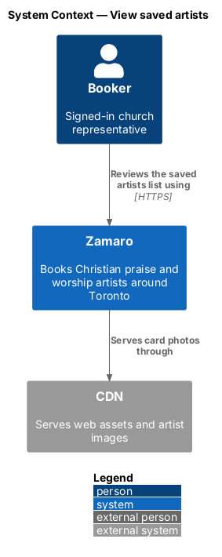
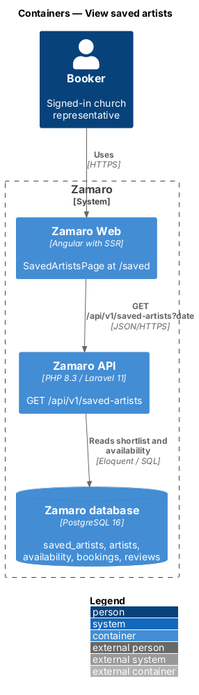
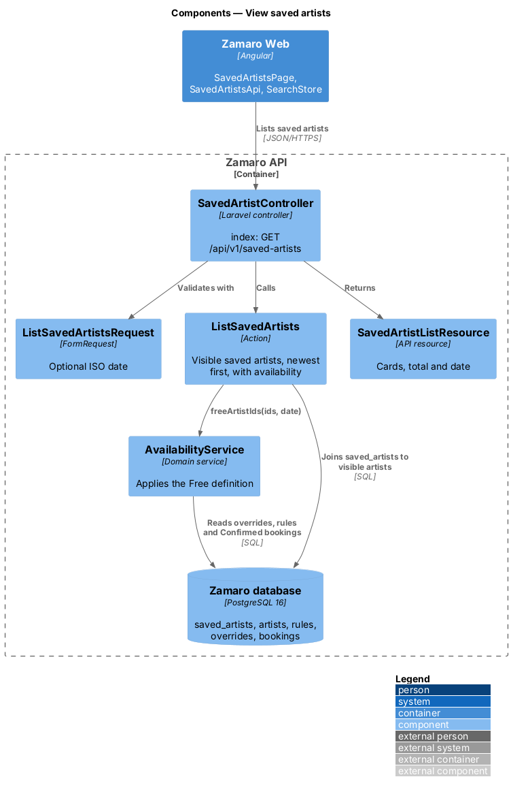
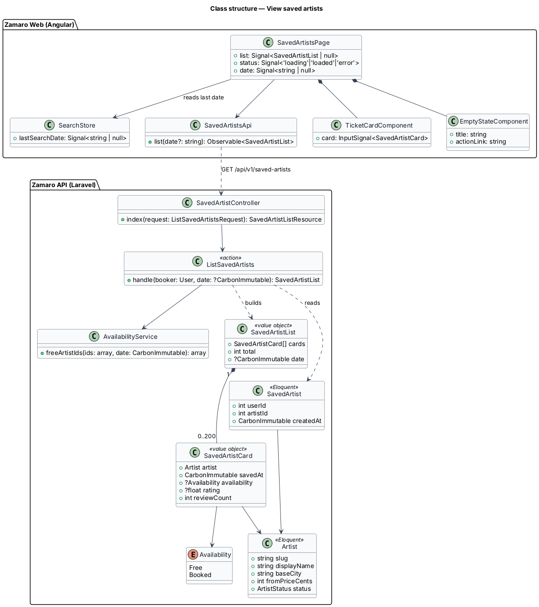
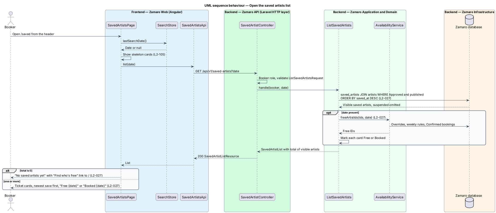

# View saved artists

## Overview

A booker's shortlist is only useful if it answers the question that brought them to
Zamaro: who is free on the date the church is planning for. This feature is the
`/saved` page. It lists every saved artist as a ticket card, newest save first, and
marks each one "Free {date}" or "Booked {date}" for the booker's most recent search
date.

Artists enter and leave the list through the Save toggle (`accounts/save-artist`).
The availability check reuses `AvailabilityService` from
`discovery/search-available-artists`, so the list and the lineup agree on who is
free. Each card opens the artist profile with the date carried forward, as cards in
the lineup do.

Terms used in this design:

- **saved artists list** — the `/saved` page that shows a booker's shortlist
- **most recent search date** — event date of the last search the booker ran on Discover in this browser
- **availability badge** — card label that reads "Free {date}" or "Booked {date}" for the most recent search date
- **visible artist** — artist whose status is `Approved` and whose profile is published; suspended or deleted artists are not visible
- **free** — state of an artist who is approved, not suspended, has not marked the date unavailable and has no Confirmed booking on that date

Two rules decide what the page shows. Artists who are no longer visible are left out
and do not count (L2-027). An artist the booker saved remains saved in the database
while suspended, so the card returns if the suspension is lifted.

## Description

**Frontend (Zamaro Web, `features/saved`)**

- **`SavedArtistsPage`** — routed page for `/saved`, behind `authGuard` and limited
  to bookers. It reads the most recent search date from `SearchStore`, requests the
  list, and renders a heading with the count and the date ("3 saved · free or booked
  on Sat 14 Nov, your last search"), a "Who's free on" date field with Check date
  that requests the list again for another date, the cards, or the empty state. It
  shows skeleton cards while loading (L2-105) and an error alert with Try again when
  the list fails.
- **`TicketCardComponent`** — design-system ticket card reused from Discover. On this
  page it shows when the artist was saved ("Saved Wed 7 Oct"), artist name, act type
  and style, base city with the road distance from the booker's church, "From"
  price, the availability badge ("Free {date}" or "Booked {date}"), a Request link
  when free or See free dates when booked, and `SaveToggleComponent`. Removing an
  artist with the toggle removes its card, lowers the count and offers Undo.
- **`EmptyStateComponent`** — design-system empty state reading "No saved artists
  yet" with a "Find who's free" link to `/` (L2-027).
- **`SearchStore`** — Discover store that remembers the last criteria in
  `localStorage`. This page reads only `lastSearchDate` from it.
- **`SavedArtistsApi`** — `list(date?)` for `GET /api/v1/saved-artists`.
- **`SavedArtistsStore`** — shared store from `accounts/save-artist`; the page keeps
  the header count in step with the list total it receives.

**Backend (Zamaro API)**

- **`SavedArtistController@index`** — `GET /api/v1/saved-artists?date=YYYY-MM-DD`,
  limited to the `Booker` role. The date is optional.
- **`ListSavedArtistsRequest`** — FormRequest that validates `date` as an ISO date.
- **`ListSavedArtists`** — action that selects the booker's `saved_artists` joined to
  visible `artists`, ordered by `saved_artists.created_at` descending (L2-027). With a
  date, it calls `AvailabilityService::freeArtistIds` once for the whole set and
  marks each entry free or booked. The total counts visible artists only (L2-027).
- **`AvailabilityService`** — shared domain service that applies weekly rules, date
  overrides and Confirmed bookings to decide whether an artist is free.
- **`SavedArtistCardResource`** — serialises each entry: slug, display name, act type,
  styles, base city, `distanceKm` from the booker's church (through
  `DistanceService`), rating and review count, from price, primary photo, `savedAt`,
  and `availability` (`free`, `booked` or `null` when no date was given).
- **`SavedArtistListResource`** — wraps the cards with `total` and the echoed `date`.

The list returns at most 200 entries, the shortlist limit, so it is not paged.

**Data**

The query reads `saved_artists`, `artists`, `artist_styles`, `artist_photos`, an
aggregate of visible `reviews`, and, through `AvailabilityService`,
`availability_rules`, `availability_overrides` and Confirmed `bookings`.

The most recent search date is held per browser. Storing it on the account instead,
so it follows the booker across devices, is an open choice: `<TO SUPPLY>`. The card
shows the distance from the booker's church, as lineup cards do.

**Mock screens** — the page is
[`pages/saved`](../../../mocks/pages/saved/default.html) in states default,
[`loading`](../../../mocks/pages/saved/loading.html),
[`empty`](../../../mocks/pages/saved/empty.html) and
[`error`](../../../mocks/pages/saved/error.html). Removing an artist shows
[`notifications/saved-toast/with-action`](../../../mocks/notifications/saved-toast/with-action.html).

## Requirements

The feature realises the following level-2 (L2) requirement, quoted from
`docs/specs/L2.md`.

| L2 ID | Refines (L1) | Requirement |
|-------|--------------|-------------|
| `L2-027` | `L1-005` | **Saved artists list.** Acceptance criteria: 1. Given a booker with saved artists, when they open `/saved`, then each saved artist is shown as a ticket card ordered by most recently saved. 2. Given the booker's most recent search date, when the list renders, then each card shows "Free {date}" or "Booked {date}" for that date. 3. Given a saved artist is later suspended, when the list renders, then that artist is omitted and the count excludes them. 4. Given no saved artists, when the list renders, then it shows "No saved artists yet" with a "Find who's free" link to Discover. |

## Diagrams

### System context

A booker opens the saved artists list in Zamaro. Card photos are served through the
CDN, and no other external system takes part.

### Containers

`SavedArtistsPage` in Zamaro Web calls the saved-artists list endpoint in the Zamaro
API, which reads the shortlist and availability from the database.

### Components

`SavedArtistController` calls `ListSavedArtists`, which filters to visible artists
and asks `AvailabilityService` which are free on the date.

### Class structure

`ListSavedArtists` turns a booker and an optional date into a `SavedArtistList` of
`SavedArtistCard` entries, each with an `Availability` value.

### Behaviour — open the saved artists list

The page sends the most recent search date with the request. The server omits
suspended artists, orders by most recent save, and labels each card free or booked.
An empty list shows the "Find who's free" link.

