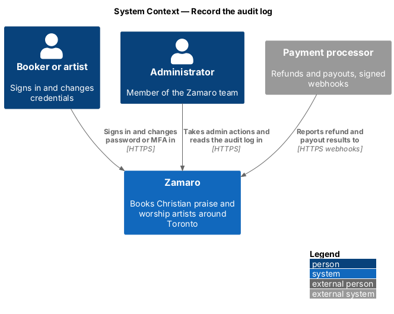
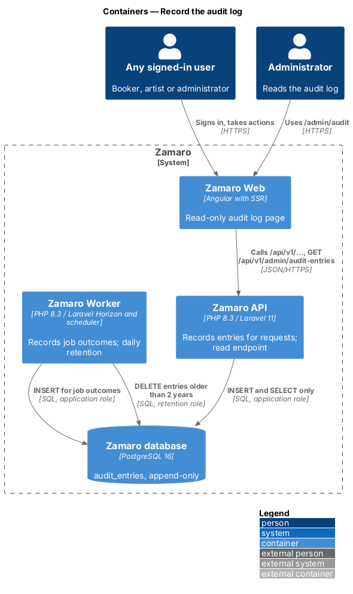
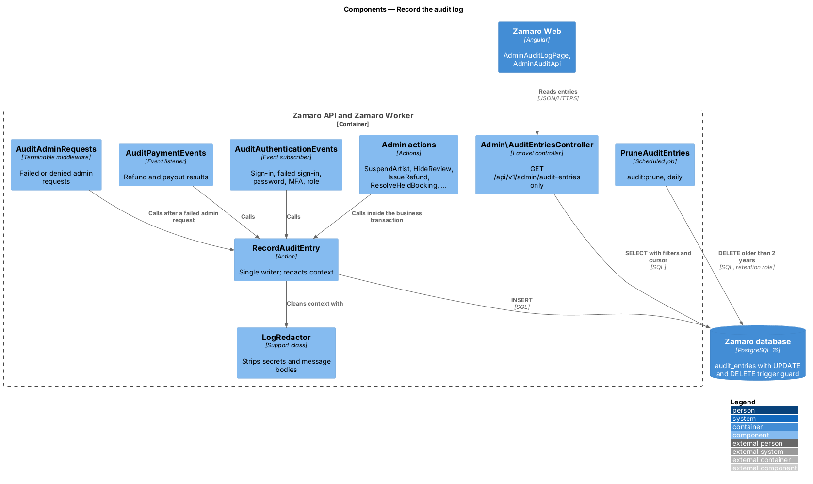
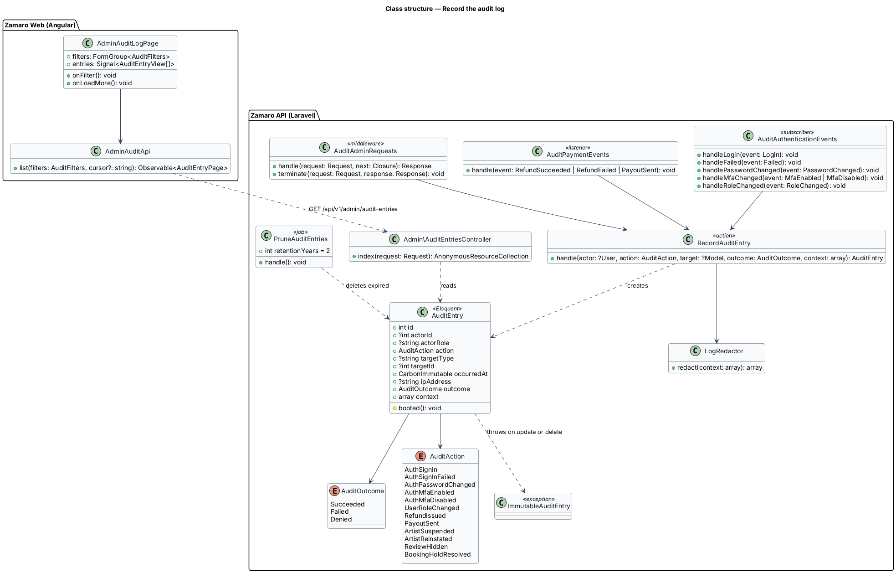
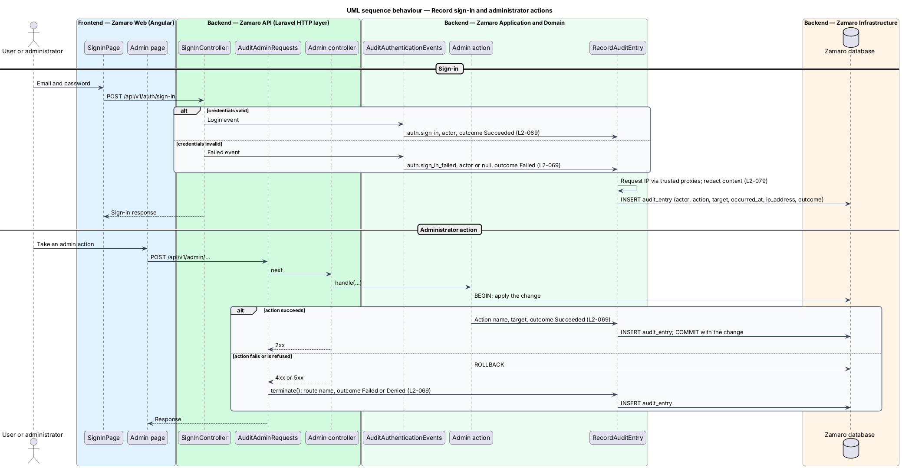
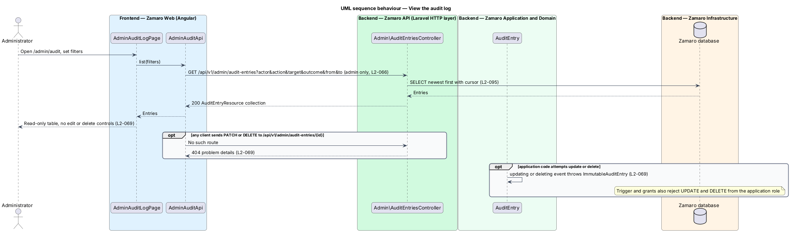
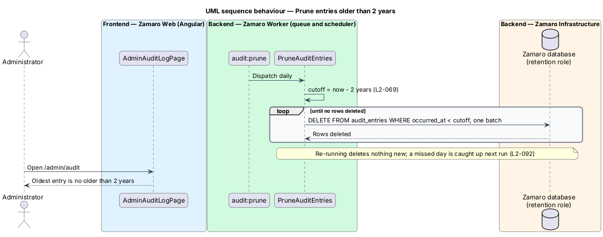

# Record the audit log

## Overview

Zamaro is a marketplace where churches in and around Toronto book Christian praise
and worship artists. Administrators can suspend artists, hide reviews and refund
money, and every account holder signs in and changes credentials. When something
goes wrong, the Zamaro team reconstructs who did what, to which record, from where,
and whether it worked.

This feature is that record. It defines the audit entry, the events that write one,
the guarantees that keep entries unchangeable, the 2-year retention job and a
read-only viewer for administrators. Every admin slice writes through it:
`administration/suspend-and-reinstate-artists`,
`administration/support-bookings-and-payments`,
`reviews/report-and-moderate-review`, and the sign-in and MFA steps in
`administration/secure-admin-access`.

Terms used in this design:

- **audit entry** — immutable record of one security-relevant event with actor, action, target, timestamp, IP address and outcome
- **actor** — user who caused the event, or none for a failed sign-in against an unknown email or a system job
- **audit action** — dotted event name such as `auth.sign_in`, `refund.issued` or `artist.suspended`
- **target** — record the event concerns, stored as a type and an ID
- **outcome** — result of the event: `Succeeded`, `Failed` or `Denied`
- **append-only** — property of a table into which the application inserts rows and from which it never updates or deletes them
- **retention period** — 2 years, after which an audit entry is deleted by a scheduled job

L2-069 sets three rules. Every administrator action, sign-in, failed sign-in,
password change, MFA change, role change, refund and payout writes an entry. No
operation in the application changes or deletes an entry, for anyone. A scheduled
job deletes entries at 2 years.

## Description

The slice consists of a recording action and its listeners in the Zamaro API and
Worker, an append-only table in the Zamaro database, a scheduled retention command,
and a read-only admin page in Zamaro Web.

**Recording (Zamaro API and Zamaro Worker)**

- **`RecordAuditEntry`** — action in `App\Actions\Audit\` with
  `handle(?User $actor, AuditAction $action, ?Model $target, AuditOutcome $outcome, array $context = [])`.
  It reads the IP address from the current request through the trusted-proxy
  configuration, or stores `null` for a queued job. It takes the timestamp from the
  database clock. It passes `context` through `LogRedactor`, which strips passwords,
  tokens, session IDs, payment identifiers beyond last 4 digits and message bodies
  (L2-079). Called inside a business transaction, it commits or rolls back with the
  change it describes.
- **`AuditAction`** — string-backed enum of every audited action. It includes
  `auth.sign_in`, `auth.sign_in_failed`, `auth.password_changed`,
  `auth.mfa_enabled`, `auth.mfa_disabled`, `auth.mfa_challenge`,
  `user.role_changed`, `refund.issued`, `payout.sent`, `artist.suspended`,
  `artist.reinstated`, `review.hidden`, `review_report.dismissed`,
  `booking_hold.resolved` and the application decisions from L2-048. The full list
  of admin actions grows with the admin slices.
- **`AuditOutcome`** — enum `Succeeded`, `Failed`, `Denied`.
- **`AuditAuthenticationEvents`** — event subscriber for Laravel's `Login` and
  `Failed` events and the application's `PasswordChanged`, `MfaEnabled`,
  `MfaDisabled` and `RoleChanged` events. A failed sign-in for an unknown email
  stores no actor and records the attempted email in `context`.
- **`AuditPaymentEvents`** — listener for `RefundSucceeded`, `RefundFailed` and
  `PayoutSent` raised by the payment slices (L2-039, L2-041). Admin-issued refunds
  are already recorded by `IssueRefund`, so the listener skips refunds that carry
  an `issued_by`.
- **`AuditAdminRequests`** — terminable middleware on the `/api/v1/admin` route
  group. For a state-changing request that ends in 4xx or 5xx, it records the route
  name as the action with outcome `Failed` or `Denied`, because the rolled-back
  action did not record it.

**Immutability**

- The `AuditEntry` model throws `ImmutableAuditEntry` from its `updating` and
  `deleting` model events, and no controller, route or action changes or deletes an
  entry (L2-069). An acceptance test asserts that no route other than the read
  endpoint touches `audit_entries`.
- In PostgreSQL the application role holds only `INSERT` and `SELECT` on
  `audit_entries`. A trigger rejects `UPDATE` for every role and rejects `DELETE`
  for every role except `zamaro_audit_retention`.

**Retention (Zamaro Worker)**

- **`audit:prune`** — scheduled command in `routes/console.php`, daily at a time
  `<TO SUPPLY>`. It runs `PruneAuditEntries` over a separate database connection
  that signs in as `zamaro_audit_retention`.
- **`PruneAuditEntries`** — job that deletes entries with `occurred_at` older than
  2 years in batches (batch size `<TO SUPPLY>`). Re-running it
  deletes nothing new, and a missed day is caught up on the next run (L2-092).

**Viewer (Zamaro Web and Zamaro API)**

- **`AdminAuditLogPage`** (`features/admin`) — routed page for `/admin/audit`. It
  shows a design-system table of entries, newest first, with filters for actor
  email, action, target, outcome and date range. It has no edit or delete
  controls.
- **`AdminAuditApi`** — typed client for `GET /api/v1/admin/audit-entries`.
- **`Admin\AuditEntriesController`** — `index` only, with cursor pagination
  (L2-095), behind the admin route group (L2-066). Whether viewing the audit log is
  itself audited is `<TO SUPPLY>`.
- **`AuditEntryResource`** — serialises the entry with the actor's name and email.

**Data**

- `audit_entries` — `id` (bigint identity), `actor_id` (nullable, no cascade),
  `actor_role`, `action`, `target_type`, `target_id`, `occurred_at`
  (timestamptz), `ip_address` (inet), `outcome`, `context` (jsonb). Indexes on
  `occurred_at`, `(actor_id, occurred_at)`, `(target_type, target_id)` and
  `action`.

When an account is deleted (L2-082, `privacy/delete-account`), its audit entries keep `actor_id` and are
removed only by retention. Whether that satisfies the erasure rule is `<TO SUPPLY>`.

## Requirements

The feature realises the following level-2 (L2) requirement. It refines the level-1
(L1) requirement shown, and the text is quoted from `docs/specs/L2.md`.

| L2 ID | Refines (L1) | Requirement |
|-------|--------------|-------------|
| `L2-069` | `L1-015` | **Audit log.** Acceptance criteria: 1. Given any administrator action, sign-in, failed sign-in, password change, MFA change, role change, refund or payout, when it occurs, then an audit entry records actor, action, target, timestamp, IP address and outcome. 2. Given the audit log, when anyone, including administrators, tries to change or delete an entry through the application, then no such operation exists. 3. Given audit entries, when they are 2 years old, then they are deleted by a scheduled job. |

## Diagrams

### System context

Every user's sign-in and every administrator's action in Zamaro produces audit
entries, and administrators read them. Refund and payout results from the payment
processor are recorded too.

### Containers

The Zamaro API and the Zamaro Worker both append entries to the Zamaro database.
The worker runs the retention job, and Zamaro Web shows the read-only viewer.

### Components

`RecordAuditEntry` is the only writer. Actions, event listeners and the admin
middleware call it, and `PruneAuditEntries` is the only deleter, through its own
database role.

### Class structure

An `AuditEntry` has an optional actor, a polymorphic target, an `AuditAction` and an
`AuditOutcome`. The model refuses updates and deletes.

### Behaviour — record sign-in and administrator actions

A sign-in, success or failure, writes one entry from the event subscriber. An
administrator action writes its entry in the same transaction as the change; a
failed admin request is recorded by the middleware.

### Behaviour — view the audit log

The viewer only reads. No endpoint changes or deletes an entry, and the database
rejects such statements from the application role.

### Behaviour — prune entries older than 2 years

The daily command deletes entries older than 2 years in batches through the
retention role. A repeated run has no further effect.

