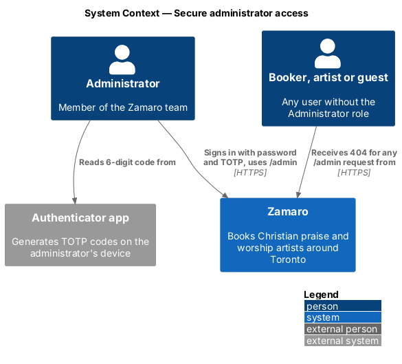
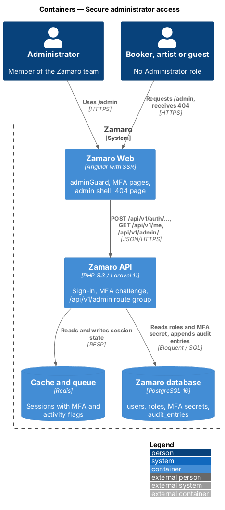
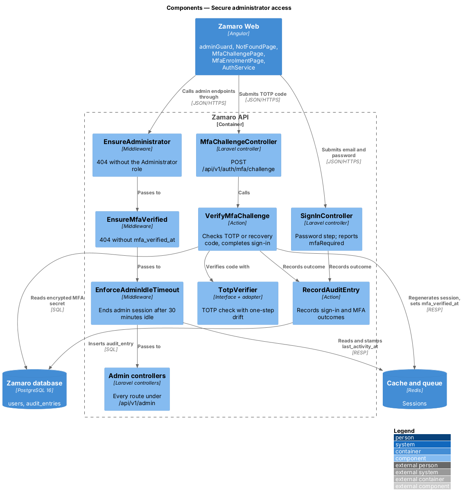
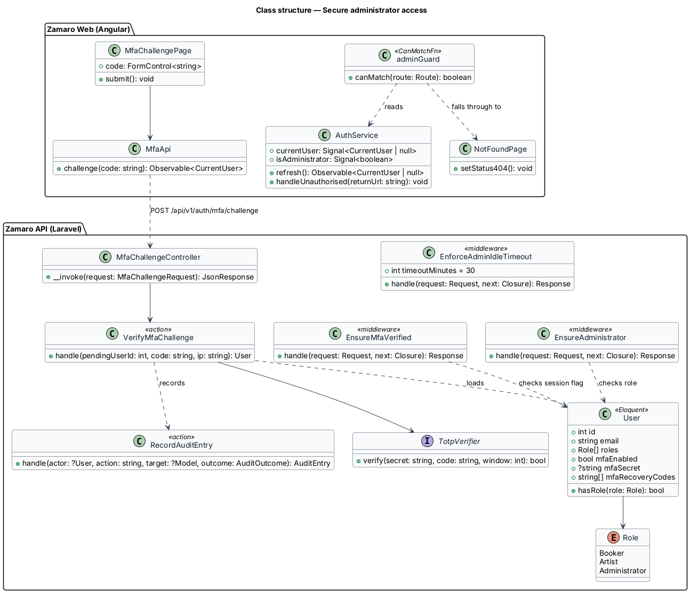
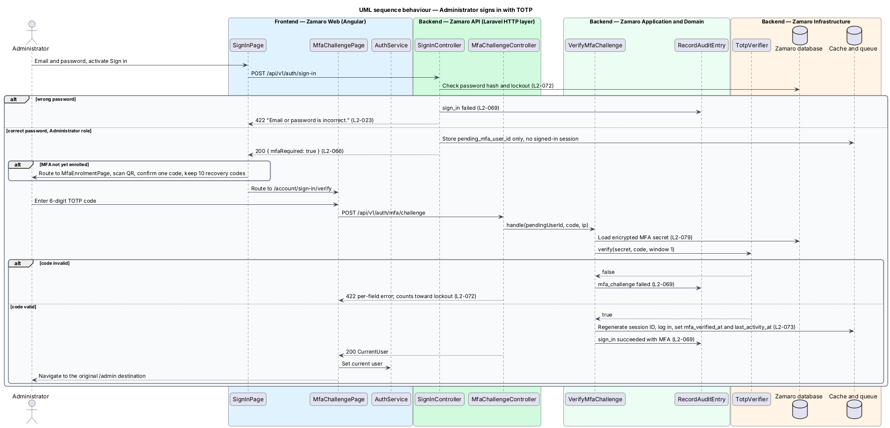
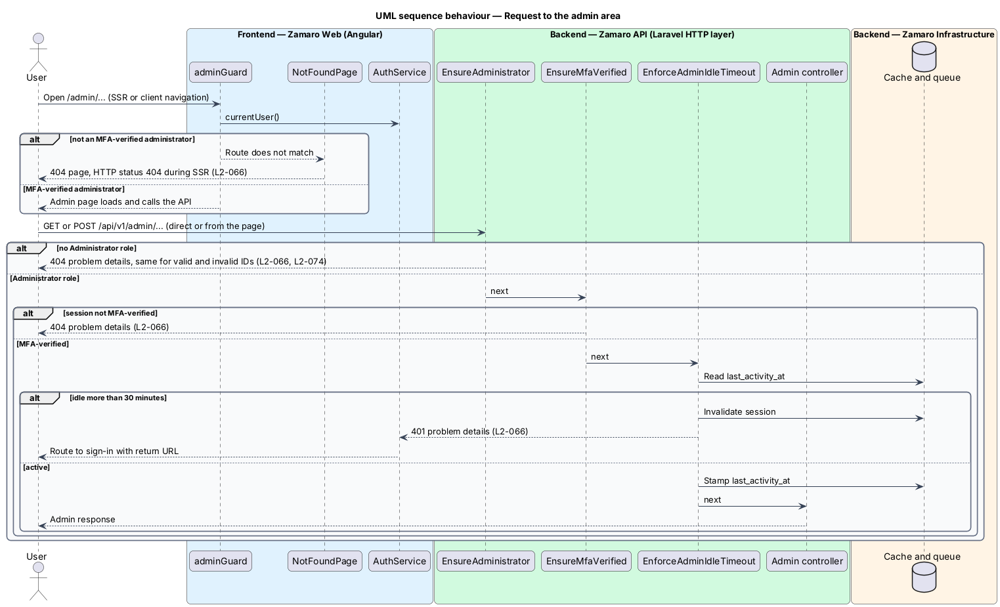

# Secure administrator access

## Overview

Zamaro is a marketplace where churches in and around Toronto book Christian praise
and worship artists. The Zamaro team runs it through an admin area that can suspend
artists, hide reviews, refund money and read the audit log. A stolen admin session
would expose every account and payment, so the admin area is guarded more tightly
than the rest of the platform.

This feature is that guard. It hides the admin area from everyone without the
Administrator role, requires a second factor at every administrator sign-in, and
ends an idle administrator session after 30 minutes. Every other admin slice sits
behind it: `administration/suspend-and-reinstate-artists`,
`administration/support-bookings-and-payments`, `administration/record-audit-log`
and the moderation part of `reviews/report-and-moderate-review`.

Terms used in this design:

- **administrator** — user holding the `Administrator` role; a member of the Zamaro team
- **admin area** — every web route under `/admin` and every API route under `/api/v1/admin`
- **concealed denial** — refusal that answers 404 Not Found, so the caller learns nothing about whether the resource exists
- **TOTP** — time-based one-time password, a 6-digit code from an authenticator app that changes every 30 seconds
- **MFA-verified session** — session in which the administrator entered a valid TOTP code after the password
- **idle timeout** — interval without any request after which the session ends; 30 minutes for administrators

L2-066 sets two rules. A non-administrator requesting any admin page or endpoint
receives 404. An administrator signs in with TOTP and the session ends after
30 minutes idle. Booker and artist sessions keep the longer limits in L2-073
(`security/manage-sessions-and-csrf`), and
TOTP stays optional for them (L2-072).

## Description

The slice spans the sign-in flow and the admin route shell in Zamaro Web, the
authentication endpoints and the admin route group in the Zamaro API, the session
store in Redis and the audit log.

**Frontend (Zamaro Web)**

- **`adminGuard`** (`core/auth`) — `CanMatchFn` on the lazy `/admin` route. It
  reads `AuthService.currentUser()` and matches only for an MFA-verified
  administrator. Otherwise the route does not match and the wildcard route renders
  `NotFoundPage`.
- **`NotFoundPage`** — the shared 404 page. During server-side rendering it sets the
  response status to 404 through Angular SSR's response-init token, so `/admin`
  returns a real 404 to a non-administrator (L2-066).
- **`SignInPage`** (`features/account`) — owned by `accounts/sign-in-and-recover-access` (L2-023). When
  the sign-in response reports `mfaRequired`, it routes to `MfaChallengePage`
  without completing sign-in.
- **`MfaChallengePage`** — routed page for `/account/sign-in/verify`. It takes a
  6-digit code or a recovery code, posts it, and on success navigates to the
  original destination.
- **`MfaEnrolmentPage`** — routed page for `/account/security/mfa`, reused from
  L2-072. An administrator without MFA is sent here before any admin page loads;
  it shows the QR code, confirms one code and lists the 10 recovery codes.
- **`AuthService`** — holds the current user signal from `GET /api/v1/me`. On a 401
  from any request it clears the user and routes to `SignInPage` with the return
  URL, which handles the idle timeout.
- **`AdminShellPage`** — layout for `/admin/*` with the design-system sidebar
  navigation. It shows a toast 2 minutes before the idle timeout (warning interval
  `<TO SUPPLY>`).

**Backend (Zamaro API)**

- **`routes/api.php` admin group** — every route under `/api/v1/admin` carries the
  middleware stack `auth:sanctum`, `EnsureAdministrator`, `EnsureMfaVerified`,
  `EnforceAdminIdleTimeout`.
- **`EnsureAdministrator`** — middleware that calls `abort(404)` when the user is
  missing or lacks `Role::Administrator`. It runs before route-model binding, so a
  valid ID and an invalid ID return the same 404 (L2-066, L2-074).
- **`EnsureMfaVerified`** — middleware that requires the session flag
  `mfa_verified_at`. Without it the response is 404 as well, so a half-signed-in
  session reveals nothing.
- **`EnforceAdminIdleTimeout`** — middleware registered globally for authenticated
  requests. For an administrator it compares now with the session's
  `last_activity_at`. Beyond 30 minutes it invalidates the session and returns 401;
  otherwise it stamps `last_activity_at`. Requests from the background polling of
  open admin pages do not count as activity (`<TO SUPPLY>`: list of polling
  endpoints).
- **`SignInController`** — owned by `accounts/sign-in-and-recover-access`. After the password check,
  `AuthenticateUser` returns `mfaRequired: true` for a user with MFA enabled or with
  the Administrator role. The session then holds only `pending_mfa_user_id`.
- **`MfaChallengeController`** — `POST /api/v1/auth/mfa/challenge`. It calls
  `VerifyMfaChallenge`, which checks the code with `TotpVerifier` (allowing one
  30-second step of clock drift) or consumes a recovery code. On success it
  regenerates the session ID (L2-073), logs the user in and sets `mfa_verified_at`.
  Failed codes count toward the account lockout in L2-072.
- **`TotpVerifier`** — interface in `App\Services\Auth\` with one adapter over a
  TOTP library (library `<TO SUPPLY>`). The TOTP secret is encrypted at the
  application level (L2-079).
- **`RecordAuditEntry`** — called for sign-in, failed sign-in and MFA challenge
  outcomes (L2-069), designed in `administration/record-audit-log`.

**Data and configuration**

- `users` — `mfa_secret` (encrypted), `mfa_enabled_at`, `mfa_recovery_codes`
  (hashed).
- Redis sessions — `pending_mfa_user_id`, `mfa_verified_at`, `last_activity_at`.
- `config/zamaro.php` — `admin.idle_timeout_minutes = 30`.

## Requirements

The feature realises the following level-2 (L2) requirement. It refines the level-1
(L1) requirement shown, and the text is quoted from `docs/specs/L2.md`.

| L2 ID | Refines (L1) | Requirement |
|-------|--------------|-------------|
| `L2-066` | `L1-015` | **Administrator access.** Acceptance criteria: 1. Given a user without the Administrator role, when they request any `/admin` page or `/api/v1/admin` endpoint, then the response is 404. 2. Given an administrator, when they sign in, then TOTP multi-factor authentication is required and their session ends after 30 minutes idle. |

## Diagrams

### System context

Administrators and all other users reach Zamaro over HTTPS. Only an administrator
with a valid TOTP code from an authenticator app reaches the admin area.

### Containers

Zamaro Web hides the admin routes and renders a 404 during server-side rendering.
The Zamaro API enforces the same rule on every admin endpoint and keeps session
state in Redis.

### Components

The admin route group runs three middleware in order: role, MFA, idle timeout.
`MfaChallengeController` completes a two-step sign-in and records each outcome in
the audit log.

### Class structure

The guard and the middleware read the same `User` role and session flags. The
`TotpVerifier` interface isolates the TOTP library.

### Behaviour — administrator signs in with TOTP

A correct password alone starts no session for an administrator. The TOTP step
regenerates the session ID and marks it MFA-verified; an administrator without MFA
enrols first.

### Behaviour — request to the admin area

Every admin request passes the role, MFA and idle checks. A non-administrator
receives 404, and an administrator idle for more than 30 minutes receives 401 and
signs in again.

