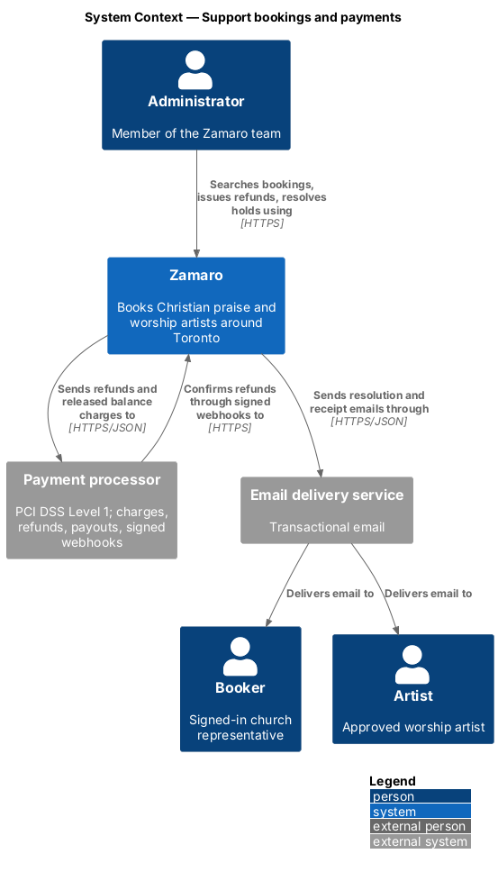
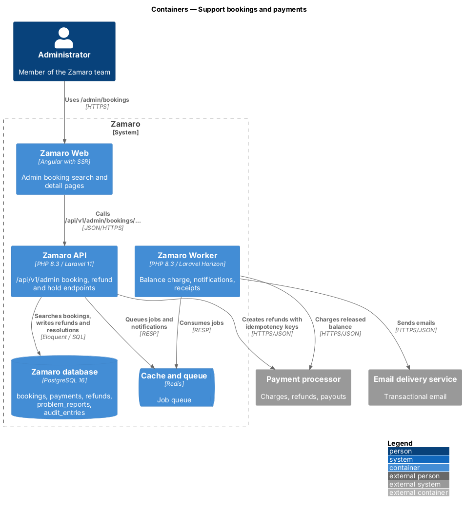
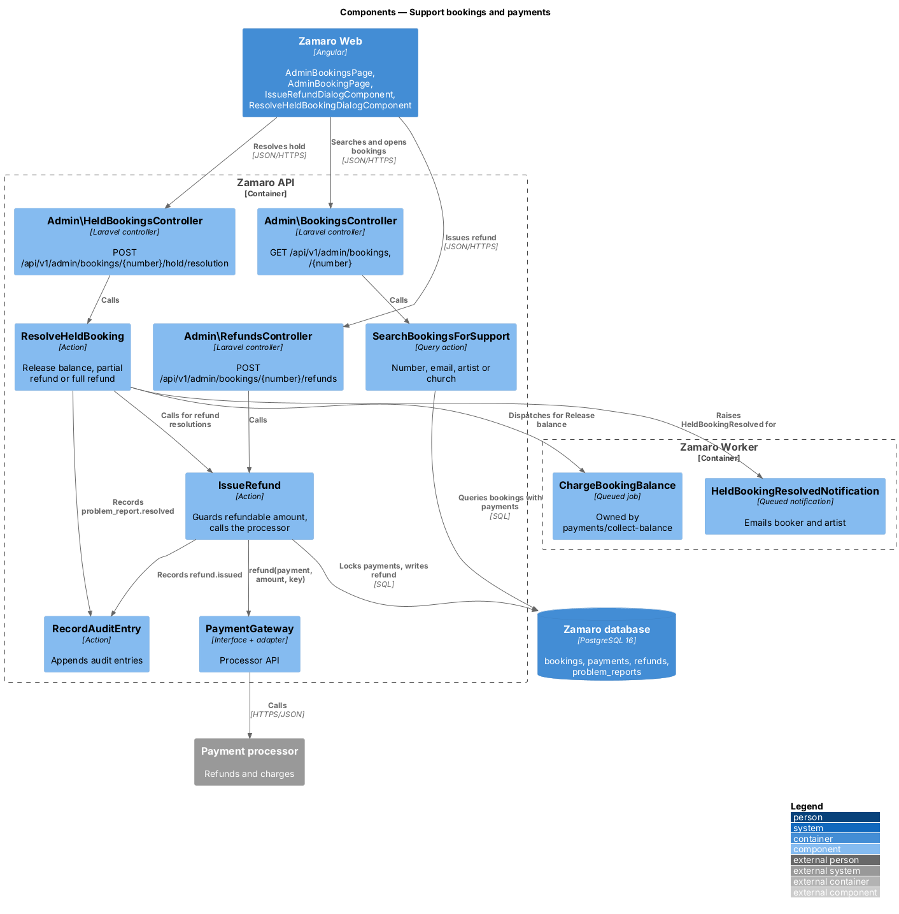
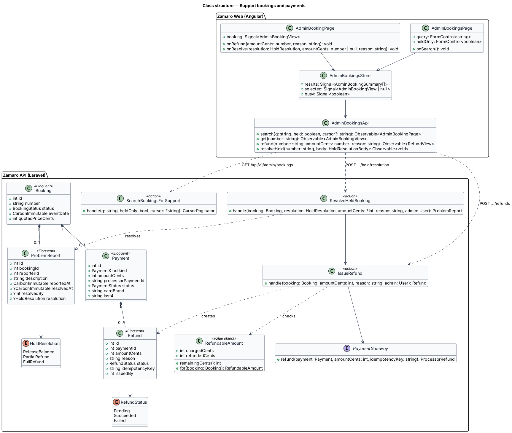
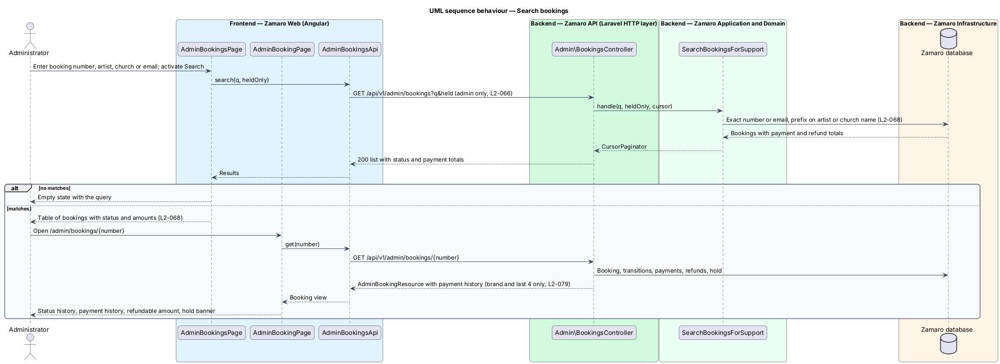
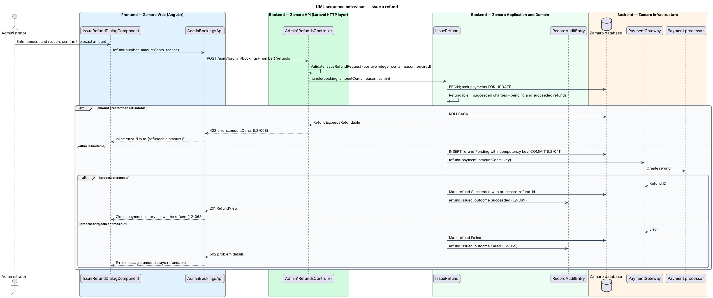
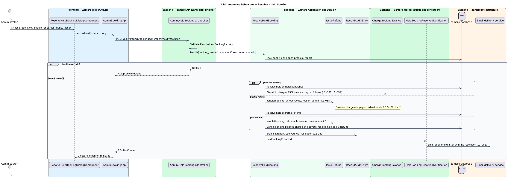

# Support bookings and payments

## Overview

Zamaro is a marketplace where churches in and around Toronto book Christian praise
and worship artists. Money moves in two steps: a 25% deposit confirms a booking,
and the 75% balance is charged 48 hours after the event (L2-037, L2-038). When a
church or artist contacts the Zamaro team about a booking, an administrator finds
it, checks what was paid, and returns money where the rules allow.

This feature is that support desk. It covers searching bookings, viewing their
status and payment history, issuing full or partial refunds, and resolving bookings
held after a reported problem. Access to the admin area is
`administration/secure-admin-access`; each refund and resolution is recorded by
`administration/record-audit-log`. Confirmed bookings left by a suspension arrive
here from `administration/suspend-and-reinstate-artists`. Charging, payouts,
receipts and webhooks belong to `payments/collect-balance`,
`payments/pay-out-artists`, `payments/issue-receipts` and
`payments/reconcile-payment-events`.

Terms used in this design:

- **booking number** — public identifier printed on every booking page, email and receipt (format `<TO SUPPLY>`)
- **payment history** — chronological list of a booking's charges and refunds with amount, kind, card brand, last 4 digits, status and date
- **refundable amount** — total of a booking's succeeded charges minus every refund that is pending or succeeded
- **partial refund** — refund of less than the refundable amount
- **held booking** — Completed booking whose balance charge and artist payout are paused because the booker reported a problem within 48 hours of the event (L2-038)
- **hold resolution** — administrator decision that ends a hold: release balance, partial refund or full refund

L2-068 sets three rules. Bookings are searchable by number, artist, church or email
and listed with status and payment history. A refund never exceeds the refundable
amount, carries a reason, goes to the payment processor and is recorded. A held
booking ends with one of three resolutions, and both parties are notified.

## Description

The slice runs from the admin booking pages in Zamaro Web to the admin booking
endpoints in the Zamaro API, the payment processor, the Zamaro database and the
Zamaro Worker.

**Frontend (Zamaro Web, `features/admin`)**

- **`AdminBookingsPage`** — routed page for `/admin/bookings`. It has one search
  field that accepts a booking number, artist name, church name or email, and a
  Held only filter. Results show in a design-system table with booking number,
  artist, church, event date, status, amount paid and amount refunded.
- **`AdminBookingPage`** — routed page for `/admin/bookings/:number`. It shows the
  booking summary, the status history (L2-029), the payment history, the hold
  banner when held, and the actions Issue refund and Resolve hold.
- **`IssueRefundDialogComponent`** — dialog with an amount field in dollars, the
  hint "Up to {refundable amount}", a required reason and Issue refund. It formats
  money through `FormatService` (L2-110) and converts to integer cents before
  sending. It requires a second confirmation that states the exact amount.
- **`ResolveHeldBookingDialogComponent`** — dialog with a radio group of Release
  balance, Partial refund (with an amount field) and Full refund, a reason field,
  and Resolve.
- **`AdminBookingsStore`** and **`AdminBookingsApi`** — store and typed client for
  the endpoints below. The store disables actions while a request runs (L2-108).

**Backend (Zamaro API)**

All routes sit in the `/api/v1/admin` group, which returns 404 to anyone but an
MFA-verified administrator (L2-066).

- **`Admin\BookingsController`** — `index` handles
  `GET /api/v1/admin/bookings?q=&held=&cursor=` with cursor pagination (L2-095);
  `show` handles `GET /api/v1/admin/bookings/{number}`.
- **`SearchBookingsForSupport`** — query action. It matches `q` exactly against
  the booking number and, case-insensitively, against the booker's email. It
  matches by prefix against artist display name and church name. Results order by
  event date descending. The text-search index choice is `<TO SUPPLY>`.
- **`AdminBookingResource`** — serialises the booking, its transitions, its hold
  and a `PaymentHistory` built from `Payment` and `Refund` rows. It shows card
  brand and last 4 digits only (L2-079).
- **`Admin\RefundsController`** — `store` handles
  `POST /api/v1/admin/bookings/{number}/refunds`.
- **`IssueRefundRequest`** — requires `amountCents` as a positive integer and a
  non-empty `reason`.
- **`IssueRefund`** — action in two steps. First, inside `DB::transaction`, it
  locks the booking's payments, computes the refundable amount and rejects a larger
  amount with 422 on `amountCents`. It then inserts a `Refund` with status
  `Pending`, the reason and an idempotency key derived from the booking and refund
  ID (L2-041). Second, after commit, it calls `PaymentGateway::refund`. It marks the
  refund `Succeeded` or `Failed` and calls `RecordAuditEntry` with `refund.issued`
  and the outcome (L2-069). The processor's refund webhook confirms the final state
  through `payments/reconcile-payment-events` (L2-041). How one refund splits across the
  deposit and balance charges is `<TO SUPPLY>`.
- **`Admin\HeldBookingsController`** — `resolve` handles
  `POST /api/v1/admin/bookings/{number}/hold/resolution`.
- **`ResolveHeldBookingRequest`** — requires `resolution` from the
  `HoldResolution` enum, `amountCents` for a partial refund, and a `reason`.
- **`ResolveHeldBooking`** — action that locks the booking and its open `ProblemReport` and rejects a
  booking whose `held_at` is empty with 409. For `ReleaseBalance` it clears the hold and
  dispatches `ChargeBookingBalance`, which charges the balance and leads to the payout
  (L2-038, L2-039). For `FullRefund` it calls `IssueRefund` for the refundable
  amount, cancels the pending balance charge and cancels the payout. For
  `PartialRefund` it calls `IssueRefund` for the entered amount; whether the balance
  is charged first and how the artist payout is reduced is `<TO SUPPLY>`. Each path
  stamps `resolved_at`, `resolved_by` and `resolution`, clears `bookings.held_at`, records
  `problem_report.resolved`, and dispatches `HeldBookingResolved`.
- **`PaymentGateway`** — interface in `App\Services\Payments\` with one adapter for
  the payment processor (vendor `<TO SUPPLY>`).

**Backend (Zamaro Worker)**

- **`HeldBookingResolvedNotification`** — queued email to the booker and the
  artist stating the resolution and any refund amount (L2-063).
- **`RefundReceiptNotification`** — queued receipt email for each succeeded refund
  (L2-040), owned by `payments/issue-receipts`.

**Data**

- `bookings`, `booking_transitions`, `payments`, `refunds` (`id`, `booking_id`,
  `payment_id`, `amount_cents`, `reason`, `status`, `processor_refund_id`,
  `idempotency_key` unique, `issued_by`, `created_at`).
- `problem_reports` — `id`, `booking_id`, `reporter_id`, `description`,
  `reported_at`, `resolved_at`, `resolved_by`, `resolution`, `resolution_reason`.
  The `payments/collect-balance` slice creates the row and sets `bookings.held_at`
  (L2-038); this slice fills the resolution columns and clears `bookings.held_at`.

## Requirements

The feature realises the following level-2 (L2) requirement. It refines the level-1
(L1) requirement shown, and the text is quoted from `docs/specs/L2.md`.

| L2 ID | Refines (L1) | Requirement |
|-------|--------------|-------------|
| `L2-068` | `L1-015` | **Booking and payment support.** Acceptance criteria: 1. Given an administrator, when they search bookings by booking number, artist, church or email, then matching bookings are listed with status and payment history. 2. Given an administrator issues a full or partial refund, when they enter an amount no greater than the amount still refundable and a reason, then the refund is sent to the processor and recorded. 3. Given a held booking (L2-038), when an administrator resolves it, then they choose release balance, partial refund or full refund, and the parties are notified. |

## Diagrams

### System context

Administrators support bookings in Zamaro, which sends refunds to the payment
processor and emails bookers and artists through the email delivery service.

### Containers

The admin booking pages in Zamaro Web call the Zamaro API. The API calls the
payment processor for refunds, and the Zamaro Worker sends notifications and
charges released balances.

### Components

`SearchBookingsForSupport` serves the search. `IssueRefund` guards the refundable
amount before calling `PaymentGateway`, and `ResolveHeldBooking` routes each of the
three resolutions.

### Class structure

A `Booking` has many `Payment` and `Refund` rows and at most one open
`ProblemReport`. `RefundableAmount` is computed from the payments and refunds, never
stored.

### Behaviour — search bookings

One search field matches booking number, email, artist or church. Each result
carries its status and payment totals, and the detail page adds the full payment
history.

### Behaviour — issue a refund

The refundable amount is checked under a row lock, and the pending refund is
committed before the processor call. The audit entry records the outcome either
way.

### Behaviour — resolve a held booking

The administrator chooses one of three resolutions. Release balance resumes the
normal charge and payout; the refund paths reuse `IssueRefund`; both parties are
emailed.

