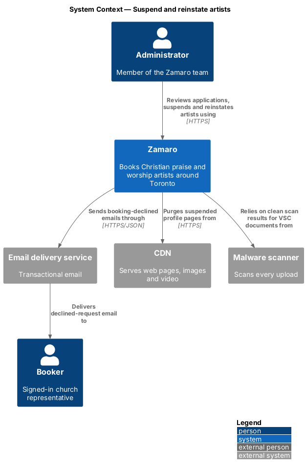
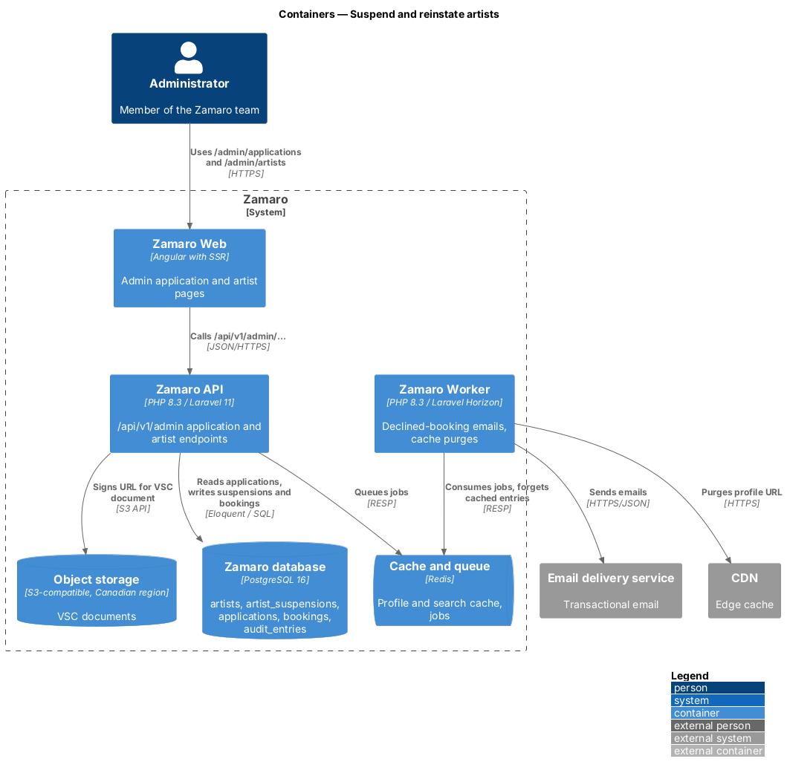
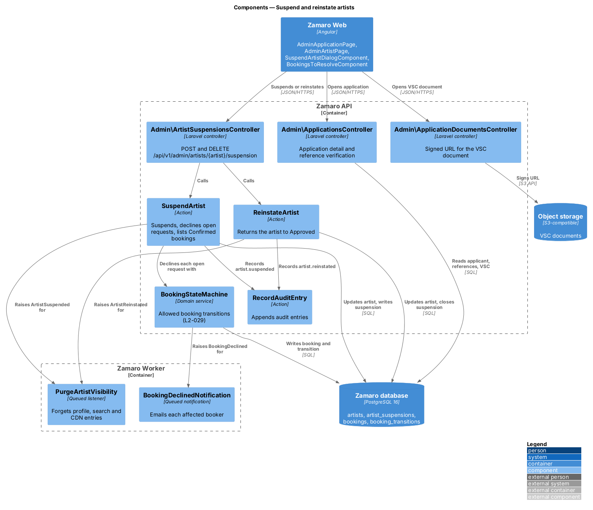
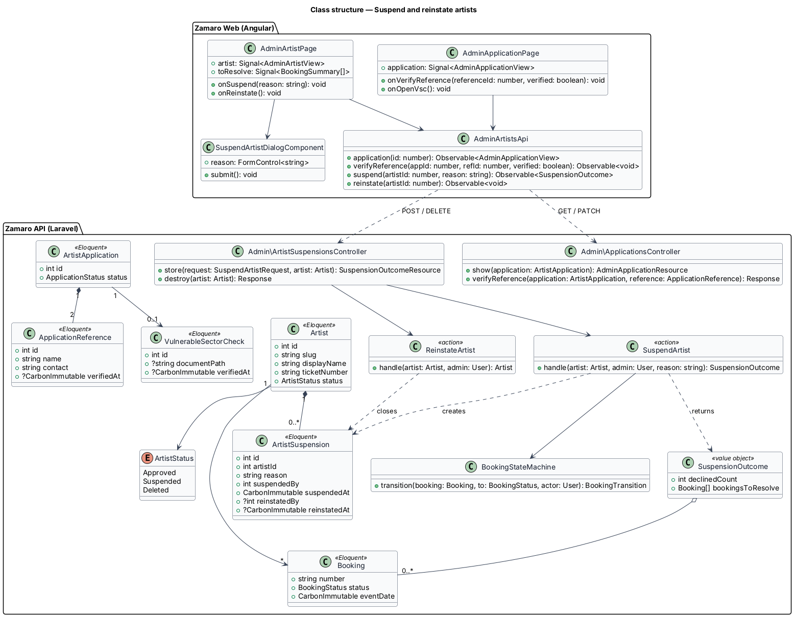
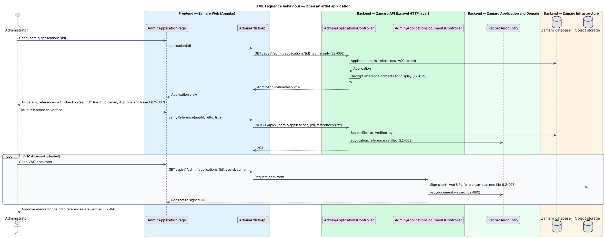
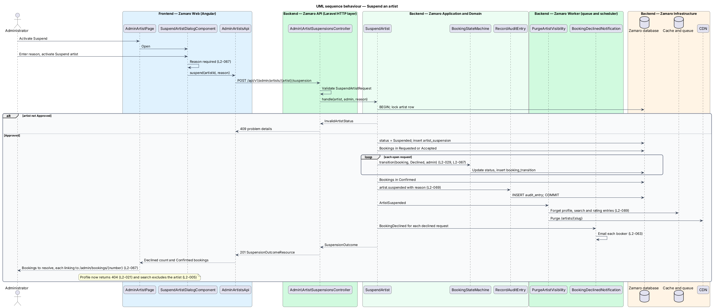
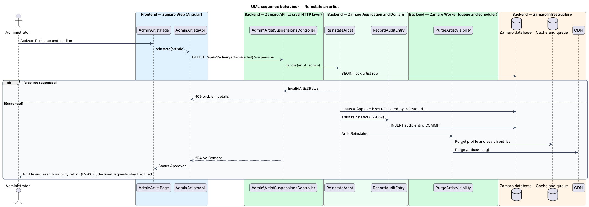

# Suspend and reinstate artists

## Overview

Zamaro is a marketplace where churches in and around Toronto book Christian praise
and worship artists. Churches trust that every artist on the platform has been
vetted and is in good standing. The Zamaro team therefore reviews each artist
application before approval, and can take an approved artist off the platform when
something goes wrong.

This feature gives administrators the artist-management tools in L2-067. It covers
the application detail view used to vet applicants, suspending an artist with a
reason, and reinstating a suspended artist. The approval and rejection rules
themselves (both references verified, fixed rejection reasons, emails) come from
L2-048 and belong to `artist-onboarding/review-artist-application`; this slice
supplies the screen they run from. Access to the admin area is `administration/secure-admin-access`;
resolving the Confirmed bookings a suspension leaves behind uses
`administration/support-bookings-and-payments`; every action here is recorded by
`administration/record-audit-log`.

Terms used in this design:

- **artist application** — submitted request to join Zamaro as an artist, with applicant details, two references and an optional Vulnerable Sector Check
- **reference** — person named by the applicant who vouches for their ministry, with a verification checkbox for the administrator
- **Vulnerable Sector Check (VSC)** — police record check document required to lead youth events
- **suspension** — administrator decision that removes an approved artist from public view and from search, with a recorded reason
- **reinstatement** — administrator decision that returns a suspended artist to the Approved status
- **open request** — booking in the Requested or Accepted status, before any deposit is paid
- **booking to resolve** — Confirmed booking of a suspended artist, listed for an administrator to cancel or keep

A suspension has four effects (L2-067). The profile returns 404 (L2-021), the artist
leaves search (L2-005), every open request becomes Declined, and Confirmed bookings
are listed for the administrator. Reinstatement restores profile and search
visibility only; declined requests stay Declined.

## Description

The slice runs from the admin artist pages in Zamaro Web to the admin artist
endpoints in the Zamaro API, the Zamaro database, object storage for the VSC
document, and the Zamaro Worker for emails and cache purges.

**Frontend (Zamaro Web, `features/admin`)**

- **`AdminApplicationPage`** — routed page for `/admin/applications/:id`. It shows
  every applicant detail, the two references each with a verification checkbox,
  a link to the VSC document if uploaded, and Approve and Reject actions (L2-067).
  Approve stays disabled until both references are verified (L2-048).
- **`AdminArtistsPage`** — routed page for `/admin/artists`, a searchable table of
  artists with status and ticket number (for example `ZAM-0114`).
- **`AdminArtistPage`** — routed page for `/admin/artists/:id` with the artist's
  details, status, suspension history and the Suspend or Reinstate action.
- **`SuspendArtistDialogComponent`** — design-system dialog with a required reason
  textarea, a summary of what the suspension does, and Suspend artist. An empty
  reason shows an inline error and moves focus to the field.
- **`BookingsToResolveComponent`** — list shown after a suspension with each
  Confirmed booking's number, date and church, linking to
  `/admin/bookings/:number`.
- **`AdminArtistsApi`** — typed client for the endpoints below.

**Backend (Zamaro API)**

All routes sit in the `/api/v1/admin` group, which returns 404 to anyone but an
MFA-verified administrator (L2-066).

- **`Admin\ApplicationsController`** — `show` for
  `GET /api/v1/admin/applications/{application}` returns
  `AdminApplicationResource` with applicant details, references (contact details
  decrypted for display, L2-079) and the VSC status. `verifyReference` handles
  `PATCH /api/v1/admin/applications/{application}/references/{reference}`.
- **`Admin\ApplicationDocumentsController`** — streams the VSC document through a
  short-lived signed URL from object storage (lifetime `<TO SUPPLY>`) after a malware-clean check (L2-076). It
  records an audit entry for each view.
- **`Admin\ArtistSuspensionsController`** — `store` handles
  `POST /api/v1/admin/artists/{artist}/suspension`; `destroy` handles
  `DELETE /api/v1/admin/artists/{artist}/suspension` (reinstate).
- **`SuspendArtistRequest`** — requires a non-empty `reason` (maximum length
  `<TO SUPPLY>`).
- **`SuspendArtist`** — action that runs in one `DB::transaction` and locks the
  artist row. It rejects an artist that is not Approved with 409. It sets
  `status = Suspended` and writes an `ArtistSuspension` row. It moves each open
  request to Declined through `BookingStateMachine`, with the administrator as actor
  (L2-029). It collects the Confirmed bookings and calls `RecordAuditEntry` with
  `artist.suspended`. After commit it dispatches `ArtistSuspended` and returns a
  `SuspensionOutcome`.
- **`ReinstateArtist`** — action that requires status Suspended, sets
  `status = Approved`, closes the open `ArtistSuspension` row, records
  `artist.reinstated` and dispatches `ArtistReinstated`.
- **`SuspensionOutcomeResource`** — serialises the declined count and the bookings
  to resolve.

**Backend (Zamaro Worker)**

- **`BookingDeclinedNotification`** — queued email to the booker of each declined
  request (L2-063). Whether it lists similar free artists, as on an artist decline
  (L2-030), is `<TO SUPPLY>`.
- **`PurgeArtistVisibility`** — queued listener for `ArtistSuspended` and
  `ArtistReinstated`. It forgets the cached profile, search entries and rating, and
  purges the profile URL at the CDN (L2-088, L2-089).

Search and the profile already exclude any artist whose status is not Approved
(L2-005, L2-021), so suspension requires no change in those slices. Whether the
suspended artist is emailed is not stated in the specs and is `<TO SUPPLY>`.

**Data**

- `artists` — `status` (`Approved`, `Suspended`, `Deleted`).
- `artist_suspensions` — `id`, `artist_id`, `reason`, `suspended_by`,
  `suspended_at`, `reinstated_by`, `reinstated_at`.
- `artist_applications`, `application_references` (`verified_at`, `verified_by`),
  `vulnerable_sector_checks` — read by the application view; VSC rules live in
  `artist-onboarding/verify-vulnerable-sector-check`.
- `bookings`, `booking_transitions` — written for each declined request.

## Requirements

The feature realises the following level-2 (L2) requirement. It refines the level-1
(L1) requirement shown, and the text is quoted from `docs/specs/L2.md`.

| L2 ID | Refines (L1) | Requirement |
|-------|--------------|-------------|
| `L2-067` | `L1-015` | **Artist management.** Acceptance criteria: 1. Given an administrator, when they open an application, then they see all applicant details, references with verification checkboxes, the VSC document if uploaded, and Approve and Reject actions. 2. Given an administrator suspends an artist with a required reason, when it is saved, then the profile returns 404, the artist disappears from search, their Requested and Accepted bookings become Declined, and their Confirmed bookings are listed for the administrator to resolve. 3. Given a suspended artist, when an administrator reinstates them, then their profile and search visibility return. |

## Diagrams

### System context

Administrators vet applicants and suspend or reinstate artists in Zamaro. Bookers
whose open requests are declined are emailed, and the CDN drops the suspended
profile.

### Containers

The admin area in Zamaro Web calls the admin artist endpoints in the Zamaro API.
The API reads VSC documents from object storage, and the Zamaro Worker sends emails
and purges caches.

### Components

`Admin\ArtistSuspensionsController` calls `SuspendArtist` or `ReinstateArtist`.
`SuspendArtist` uses `BookingStateMachine` to decline open requests and
`RecordAuditEntry` to log the decision.

### Class structure

Each `Artist` has a history of `ArtistSuspension` rows. A suspension produces a
`SuspensionOutcome` that lists the Confirmed bookings to resolve.

### Behaviour — open an application

The administrator sees all applicant details, verifies each reference and opens
the VSC document. Approve and Reject then run the L2-048 rules.

### Behaviour — suspend an artist

A required reason starts one transaction. The artist becomes Suspended, open
requests become Declined, and the Confirmed bookings return to the administrator
for resolution.

### Behaviour — reinstate an artist

Reinstatement returns the artist to Approved and purges caches, so the profile and
search show the artist again.

