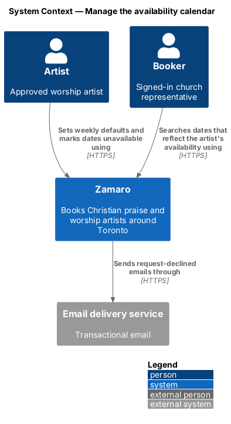
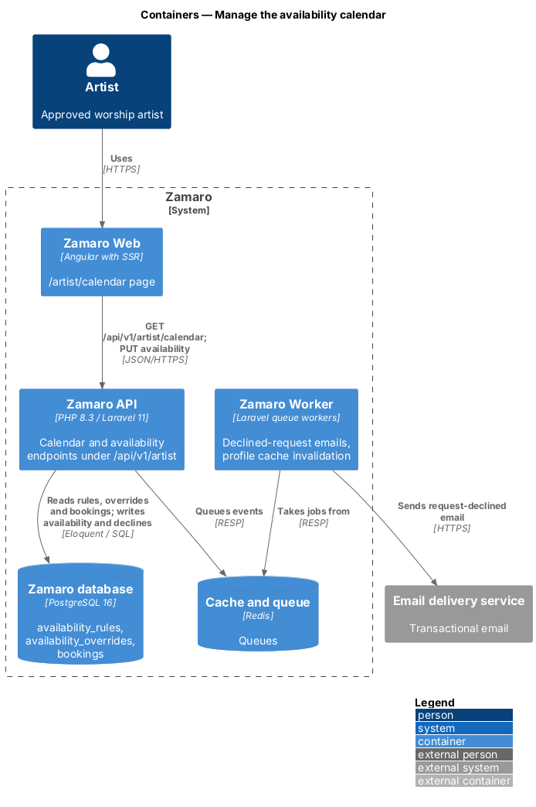
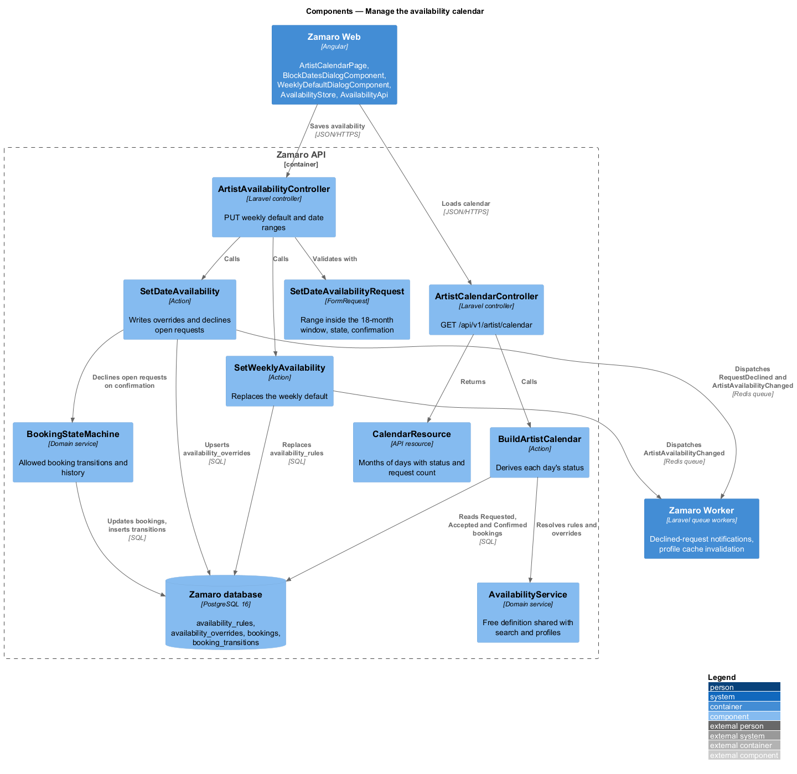
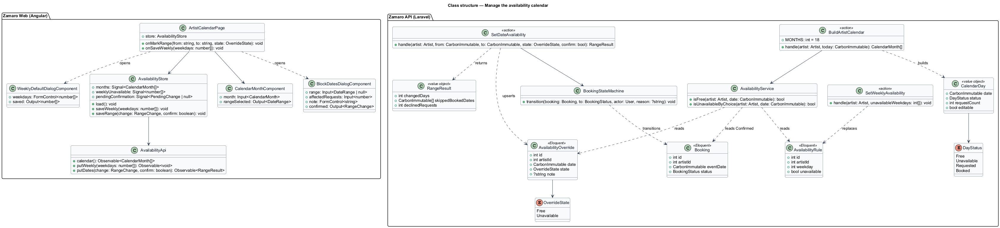
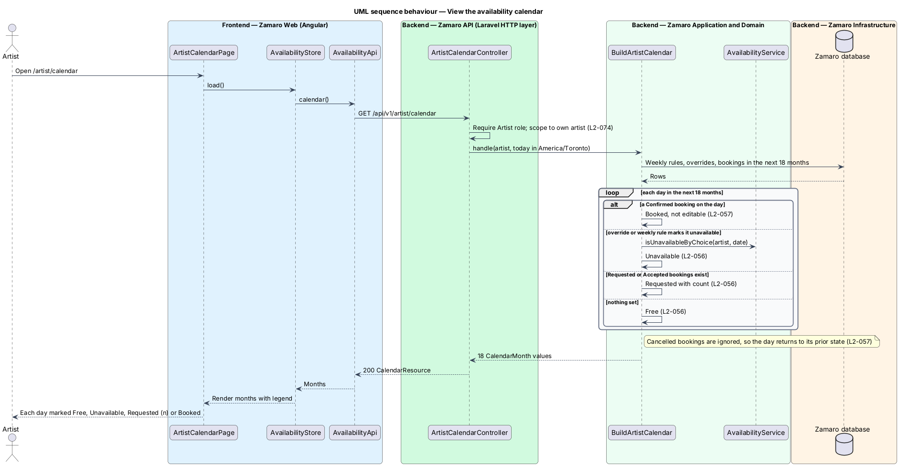
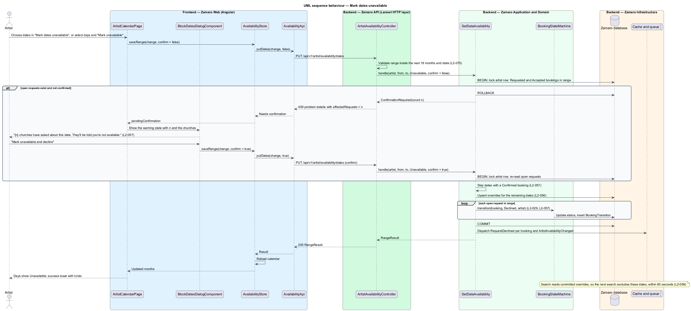
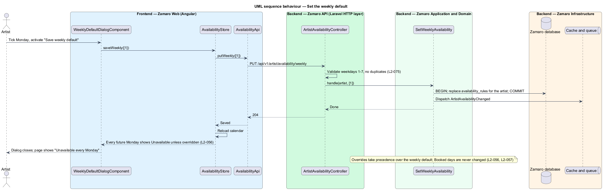

# Manage the availability calendar

## Overview

Search on Zamaro only lists artists who are free on the chosen date (L2-005). An
artist controls part of that answer: the days they choose not to work. This feature
is the artist's calendar at `/artist/calendar`, where they page through the next 18
months one month at a time, set a weekly default such as "unavailable every Monday",
and mark single dates or ranges unavailable or free.

The calendar also shows what bookings have done to each day. A Confirmed booking
locks its date as Booked. Open requests show as Requested with a count. Marking a
requested date unavailable declines those requests after a warning, so the calendar
and the bookings never disagree (L1-012).

The slice sits in the artist-availability subsystem. The secret iCalendar feed of
Confirmed bookings is the sibling `artist-availability/publish-calendar-feed`. Search
(`discovery/search-available-artists`) and the public profile read the same
availability through the shared `AvailabilityService`.

Terms used in this design:

- **weekly default** — set of weekdays on which an artist is unavailable unless a date override says otherwise
- **date override** — artist's explicit choice for one date, either Free or Unavailable, that takes precedence over the weekly default
- **open request** — booking for the artist with status Requested or Accepted
- **day status** — calendar label for one date: Free, Unavailable, Requested (with count) or Booked
- **calendar window** — the next 18 months from today in `America/Toronto`, ending on the last date a church can request (L2-004); the month pager runs from the current month to the month holding that date

Each day's status is derived on read, never stored. The derivation applies, in
order: Booked when a Confirmed booking exists; Unavailable when a date override or
the weekly default says so; Requested with a count when open requests exist; and Free
otherwise (L2-056, L2-057). A new artist with no rules and no overrides therefore sees
every date as Free (L2-056). A Cancelled booking drops out of the derivation, so its
date returns to its prior Free or default state (L2-057).

## Description

The slice runs from the artist workspace in Zamaro Web to the calendar and
availability endpoints in the Zamaro API and the Zamaro database. The Zamaro Worker
sends emails for any requests declined on the way.

**Frontend (Zamaro Web, `features/artist-workspace/calendar`)**

- **`ArtistCalendarPage`** — routed page for `/artist/calendar`. Its header sums up
  the month ("November 2026 · 3 booked · 2 requested · 2 free Saturdays") and offers
  "Mark dates unavailable", which opens `BlockDatesDialogComponent`, and "Subscribe
  in your calendar", which opens the calendar feed dialog
  (`artist-availability/publish-calendar-feed`). Below it are the weekly default
  ("Weekly default: Unavailable every Monday") with "Change weekly default", one month
  grid with a legend and previous and next buttons across the calendar window, and an
  "In {month}" list of booked, requested and unavailable dates. Selecting days shows a
  bulk bar with the count and range, "Mark unavailable" (or "Mark free" when the
  selection holds Unavailable days, which overrides the weekly default) and "Clear";
  the bar saves at once. Booked days are not selectable: activating one shows an info
  toast that it is a Confirmed booking, and activating a Requested day shows a toast
  with "Open request".
- **`CalendarMonthComponent`** — presentational month grid built on the
  design-system calendar styles (`calendar__day` with `data-status` of `free`,
  `blocked`, `requested`, `booked`, `past` or `outside` for padding days). Each day
  has an accessible name with its status, request count and church, for example "Sat
  14 Nov, Requested · 1, Riverside Community Church" or "Sun 15 Nov, Booked, Lakeshore
  Alliance Church. Booked dates can't be changed". Arrow keys move between days and
  Space selects. Under 768 px each day shows a dot instead of its label. It emits a
  date range from a start and end selection.
- **`BlockDatesDialogComponent`** — design-system dialog with start date, end date and
  an optional private note of up to 100 characters. It states how many days the range
  covers and whether any church has asked about them. When the save returns 409 it
  switches to its warning state: "{n} churches have asked about this date. They'll be
  told you're not available." with the churches and dates, "Keep {date} open" and
  "Mark unavailable and decline" (L2-057). The bulk bar's Mark unavailable opens the
  same warning when the selection holds Requested days. It traps focus and returns it
  to the triggering control (L2-101).
- **`WeeklyDefaultDialogComponent`** — design-system dialog with a checkbox per
  weekday under "Unavailable every" and "Save weekly default". Any combination is
  valid, including none. A failed save keeps the ticks and says the old default still
  applies.
- **`AvailabilityStore`** — signal-based store holding the months, the weekly
  default and any pending confirmation. It reloads the calendar after each save and
  raises a toast (L2-109): success with Undo, a warning when a range includes Booked
  days that stay booked, and a danger toast with Try again when a save fails.
- **`AvailabilityApi`** — typed client for the three endpoints below.

**Backend (Zamaro API)**

- **`ArtistCalendarController`** — exposes `GET /api/v1/artist/calendar`. It requires
  the Artist role, scopes to the caller's own artist (L2-074), calls
  `BuildArtistCalendar` and returns `CalendarResource` with
  `Cache-Control: private, no-store`.
- **`BuildArtistCalendar`** — action that loads the weekly rules, the date overrides
  and the bookings with status Requested, Accepted or Confirmed in the calendar
  window in three queries. It derives a `CalendarDay` per date with `status`,
  `requestCount` and `editable` (false for Booked).
- **`ArtistAvailabilityController`** — exposes:
  - `PUT /api/v1/artist/availability/weekly` with `{ "unavailableWeekdays": [1] }`
    (ISO weekdays, 1 is Monday)
  - `PUT /api/v1/artist/availability/dates` with
    `{ "from", "to", "state": "Unavailable"|"Free", "note", "confirm": false|true }`
- **`SetDateAvailabilityRequest`** — FormRequest that requires `from` on or before
  `to`, both inside the calendar window, a valid state and an optional `note` of up
  to 100 characters (L2-075).
- **`SetWeeklyAvailability`** — action that replaces the artist's
  `availability_rules` in one transaction and dispatches `ArtistAvailabilityChanged`.
  Whether a new weekly default that covers dates with open requests also warns and
  declines them, as a range change does, is `<TO SUPPLY>`.
- **`SetDateAvailability`** — action that runs inside `DB::transaction` with the
  artist row locked, so a concurrent request or confirmation sees a consistent state.
  For an Unavailable change it counts open requests in the range. Without `confirm`
  and with a non-zero count it rolls back and returns 409 problem details carrying
  `affectedRequests`. With `confirm` it re-reads the open requests, skips dates that
  hold a Confirmed booking, upserts the overrides, and moves each open request to
  Declined through `BookingStateMachine`. It returns a `RangeResult` with the changed
  days, skipped Booked dates and declined count. Each declined booker is told the
  L2-030 reason "I'm not free that day" with 3 similar artists free on that date; the
  artist's private note is never shared.
- **`BookingStateMachine`** — shared domain service that allows Requested → Declined
  and Accepted → Declined and records a `BookingTransition` with from-status,
  to-status, actor and timestamp (L2-029).
- **`AvailabilityService`** — shared domain service. Search calls
  `isFree(artist, date)`; this slice adds `isUnavailableByChoice(artist, date)` for
  the override-then-weekly-default rule.
- **Events and listeners** — `RequestDeclined` notifies each booker within 2 minutes
  (L2-063) through the booking notifications. `ArtistAvailabilityChanged` triggers
  `InvalidateArtistProfileCache`, which purges cached profile copies within 60 seconds
  (L2-089).

Search reads availability straight from committed rows, with no availability cache,
so a saved range is excluded from the next search, well inside the 60 seconds of
L2-056. Any future availability cache shall expire within 60 seconds.

**Mock screens** — the page is
[`pages/availability`](../../../mocks/pages/availability/default.html) in states
default (Abigail's November 2026), loading, [`empty`](../../../mocks/pages/availability/empty.html)
(Miriam, every date Free), error and
[`selected`](../../../mocks/pages/availability/selected.html) (two days selected with
the bulk bar). The dialogs are
[`dialogs/block-dates`](../../../mocks/dialogs/block-dates/default.html) in states
default, busy, invalid, failed and
[`warning`](../../../mocks/dialogs/block-dates/warning.html) (St. Brendan's has asked
about Sun 22 Nov), and [`dialogs/weekly-default`](../../../mocks/dialogs/weekly-default/default.html)
in states default, busy and failed. The toasts are
[`notifications/availability-toast`](../../../mocks/notifications/availability-toast/success.html)
in states info, success, warning, danger and with-action.

**Data**

- `availability_rules` — `id`, `artist_id`, `weekday` (1–7), `unavailable`; unique on
  `(artist_id, weekday)`.
- `availability_overrides` — `id`, `artist_id`, `date`, `state` (`Free`,
  `Unavailable`), `note` (nullable, at most 100 characters, shown only to the
  artist); unique on `(artist_id, date)`.
- `bookings` — read for statuses Requested, Accepted and Confirmed in the window; the
  partial unique index on `(artist_id, event_date)` where `status = 'Confirmed'`
  (L2-032) keeps Booked days single.
- `booking_transitions` — written for each declined request.

## Requirements

The feature realises the following level-2 (L2) requirements, quoted from
`docs/specs/L2.md` with the level-1 (L1) requirement each one refines.

| L2 ID | Refines (L1) | Requirement |
|-------|--------------|-------------|
| `L2-056` | `L1-012` | **Availability calendar.** Acceptance criteria: 1. Given an artist on `/artist/calendar`, when it renders, then it shows the next 18 months by month with each day marked Free, Unavailable, Requested (with count) or Booked. 2. Given an artist sets a weekly default (for example unavailable every Monday), when they save, then every future date matching it is unavailable unless the artist overrides that date. 3. Given an artist marks a range of dates unavailable, when they save, then searches for those dates exclude them within 60 seconds. 4. Given a new artist, when no availability has been set, then every date is Free. |
| `L2-057` | `L1-012` | **Availability and bookings stay consistent.** Acceptance criteria: 1. Given a booking becomes Confirmed, when the calendar renders, then that date shows Booked and cannot be changed by the artist. 2. Given a date with Requested or Accepted bookings, when the artist marks it unavailable, then they are warned "{n} churches have asked about this date. They'll be told you're not available." and on confirmation those bookings become Declined. 3. Given a booking is Cancelled, when the calendar renders, then that date returns to its prior Free or default state. |

## Diagrams

### System context

An artist manages availability in Zamaro, and bookers see the result in search.
Zamaro emails bookers whose open requests are declined by an availability change.

### Containers

The calendar page in Zamaro Web reads and saves availability through the Zamaro API.
The Zamaro Worker sends declined-request emails and invalidates cached profiles.

### Components

`BuildArtistCalendar` derives day statuses through `AvailabilityService`.
`SetDateAvailability` writes overrides and declines open requests through
`BookingStateMachine`.

### Class structure

`AvailabilityRule` and `AvailabilityOverride` hold the artist's choices. `Booking`
rows supply Requested and Booked days, and `CalendarDay` carries the derived
`DayStatus` to the page.

### Behaviour — view the calendar

The action loads rules, overrides and bookings once and derives each day's status in
order of precedence. Cancelled bookings play no part, so their dates fall back to the
artist's own settings.

### Behaviour — mark dates unavailable

A first save that would affect open requests returns 409 with the count, and the page
shows the warning dialog. The confirmed save writes the overrides, skips Booked dates
and declines the open requests in one transaction.

### Behaviour — set the weekly default

Saving the weekly default replaces the artist's rules in one transaction. Every
matching future date then shows Unavailable unless a date override says Free.

