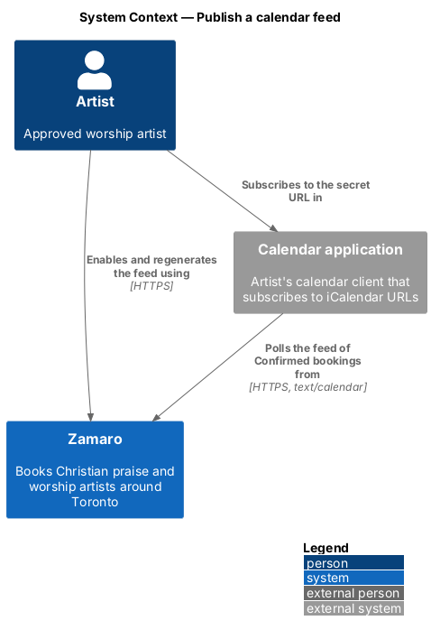
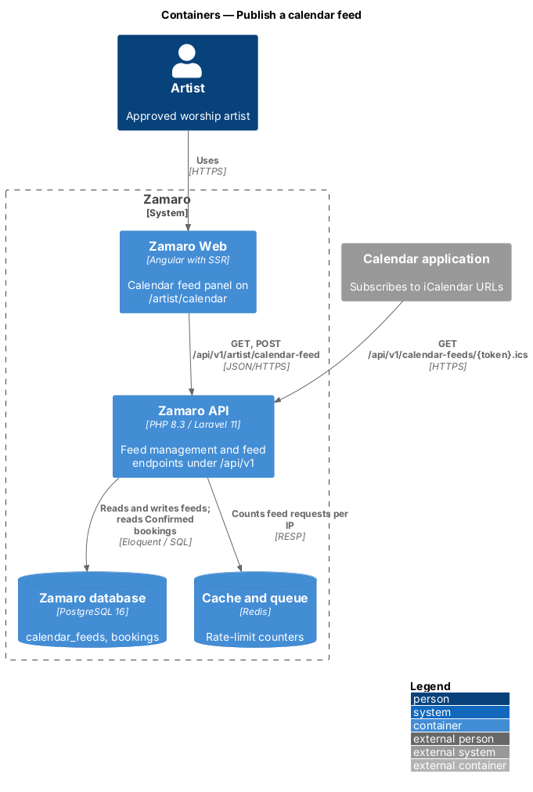
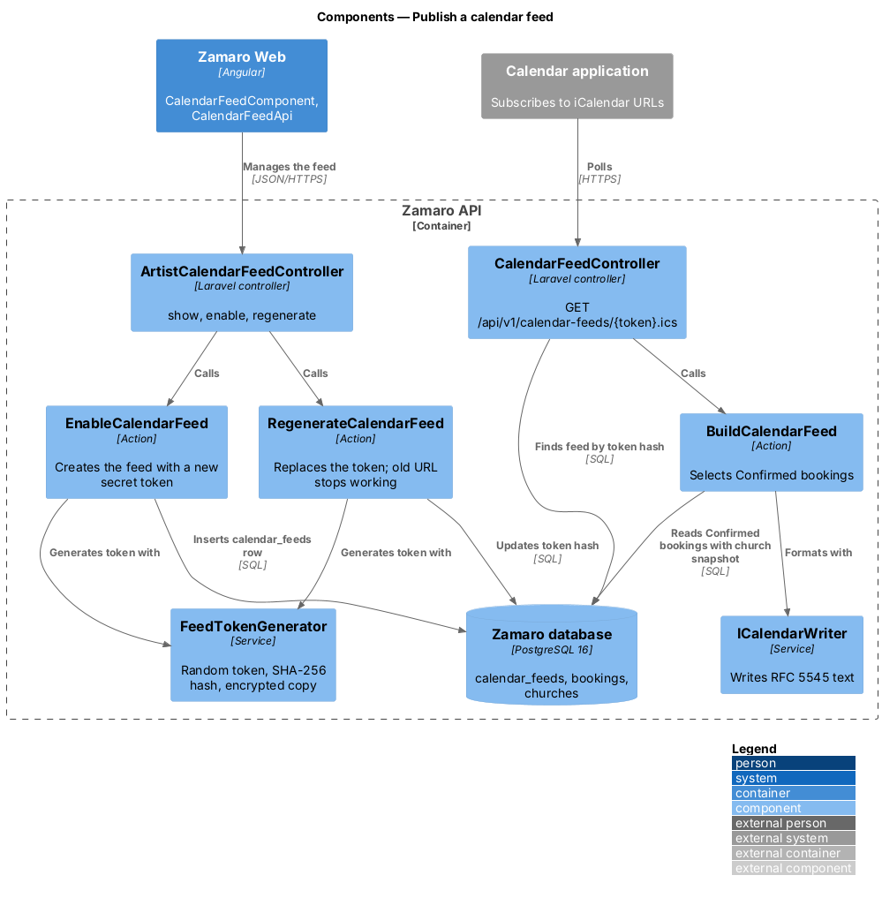
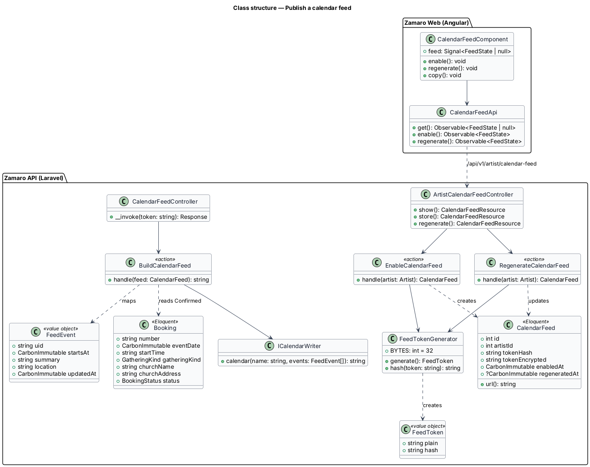
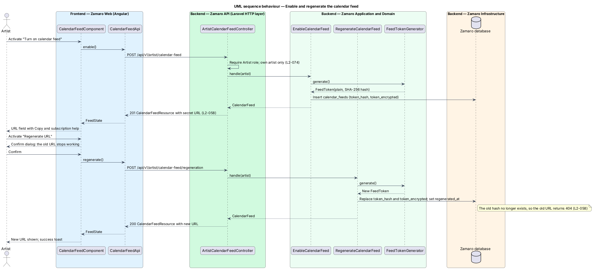
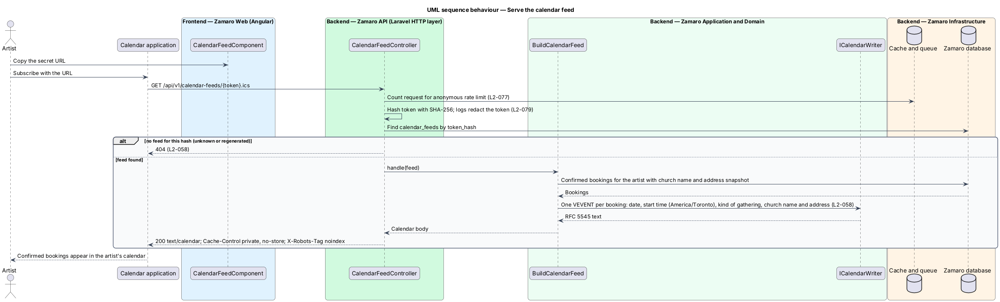

# Publish a calendar feed

## Overview

Artists keep their lives in their own calendar applications, not in Zamaro. This
feature lets an artist subscribe their calendar application to their Confirmed
Zamaro bookings. The artist turns on the feed from the calendar page, receives a
secret iCalendar URL and pastes it into their calendar application, which then polls
it. If the URL leaks, the artist regenerates it and the old URL stops working at once
(L2-058).

The slice sits in the artist-availability subsystem beside
`artist-availability/manage-availability-calendar`, whose page at `/artist/calendar`
hosts the feed panel. The feed lists bookings only; the artist's own unavailable
dates are not part of it.

Terms used in this design:

- **calendar feed** — read-only iCalendar (RFC 5545) document listing one artist's Confirmed bookings
- **feed token** — random secret embedded in the feed URL that identifies the feed without a sign-in
- **secret feed URL** — URL that contains the feed token and works for anyone who holds it
- **calendar application** — artist's calendar client, such as a phone or web calendar, that subscribes to iCalendar URLs
- **regeneration** — replacement of the feed token, which invalidates the previous secret feed URL

Possession of the secret feed URL is the only credential, because calendar
applications cannot sign in. The token is therefore long and random, stored only as
a hash for lookup, and never written to logs. An unknown or replaced token returns
404 (L2-058).

## Description

The slice runs from the feed panel in Zamaro Web to the feed management endpoints in
the Zamaro API, and from the artist's calendar application to the feed endpoint. Both
read the Zamaro database.

**Frontend (Zamaro Web, `features/artist-workspace/calendar`)**

- **`CalendarFeedComponent`** — panel on `ArtistCalendarPage`. Before the feed exists
  it shows "Turn on calendar feed". Afterwards it shows the secret feed URL in a
  read-only field with Copy, short instructions for subscribing, and "Regenerate URL".
  Regenerate opens a confirmation dialog that states the old URL will stop working.
  The panel copy is `<TO SUPPLY>`.
- **`CalendarFeedApi`** — typed client for the management endpoints.

**Backend (Zamaro API)**

- **`ArtistCalendarFeedController`** — exposes, for the signed-in artist only
  (L2-074):
  - `GET /api/v1/artist/calendar-feed` — current state, or 404 when none exists
  - `POST /api/v1/artist/calendar-feed` — enable
  - `POST /api/v1/artist/calendar-feed/regeneration` — regenerate

  Responses carry `Cache-Control: private, no-store` (L2-089). Whether an artist may
  also turn the feed off is `<TO SUPPLY>`.
- **`FeedTokenGenerator`** — service that creates a 32-byte random token encoded as
  base64url, its SHA-256 hash for lookup, and an application-encrypted copy so the
  panel can show the URL again.
- **`EnableCalendarFeed`** — action that creates the artist's `CalendarFeed` with a
  new token. Enabling an existing feed returns the current URL unchanged.
- **`RegenerateCalendarFeed`** — action that replaces the token hash and encrypted
  copy in one update and sets `regenerated_at`. No record of the old hash remains, so
  the old URL returns 404 from the next request (L2-058).
- **`CalendarFeedController`** — exposes `GET /api/v1/calendar-feeds/{token}.ics`
  without a session. It hashes the token, finds the feed by hash, and returns 404 when
  none matches. It runs under the anonymous rate limit of 120 requests per minute per
  IP (L2-077). The log redaction rules treat the path token as a secret (L2-079). The
  response has `Content-Type: text/calendar; charset=utf-8`,
  `Cache-Control: private, no-store` (L2-089) and `X-Robots-Tag: noindex`. This is the
  one non-JSON response under `/api/v1`; serving it from a separate host instead is
  `<TO SUPPLY>`.
- **`BuildCalendarFeed`** — action that selects the artist's bookings with status
  Confirmed and maps each to a `FeedEvent`. Each event carries the event date, start
  time in `America/Toronto`, kind of gathering, church name and church address from
  the booking's snapshot (L2-058). The `UID` is derived from the booking number. Event
  duration is `<TO SUPPLY>`, because a booking stores a start time and no end time.
  Whether Completed bookings stay in the feed is `<TO SUPPLY>`; this design lists
  Confirmed bookings only, so a Cancelled booking disappears on the next poll.
- **`ICalendarWriter`** — service that writes RFC 5545 text with a `VTIMEZONE` for
  `America/Toronto`, line folding and escaping. The library behind it is
  `<TO SUPPLY>`.

**Data**

- `calendar_feeds` — `id`, `artist_id` (unique), `token_hash` (unique),
  `token_encrypted`, `enabled_at`, `regenerated_at`.
- `bookings` — read for status Confirmed with the church name and address snapshot,
  using the index on `(artist_id, status, event_date)`.

## Requirements

The feature realises the following level-2 (L2) requirement, quoted from
`docs/specs/L2.md` with the level-1 (L1) requirement it refines.

| L2 ID | Refines (L1) | Requirement |
|-------|--------------|-------------|
| `L2-058` | `L1-012` | **Calendar feed.** Acceptance criteria: 1. Given an artist, when they enable the calendar feed, then they receive a secret iCalendar URL listing Confirmed bookings with event date, start time, kind of gathering, church name and address. 2. Given the artist regenerates the feed URL, when the old URL is requested, then it responds 404. |

## Diagrams

### System context

The artist turns on the feed in Zamaro and subscribes a calendar application to the
secret URL. The calendar application then polls Zamaro for Confirmed bookings.

### Containers

Zamaro Web manages the feed through the Zamaro API. The calendar application calls
the feed endpoint of the same API directly, with Redis counting requests for the rate
limit.

### Components

`EnableCalendarFeed` and `RegenerateCalendarFeed` share `FeedTokenGenerator`.
`CalendarFeedController` finds the feed by token hash and calls `BuildCalendarFeed`,
which formats events with `ICalendarWriter`.

### Class structure

A `CalendarFeed` belongs to one artist and holds only the hash and an encrypted copy
of its token. `BuildCalendarFeed` maps Confirmed `Booking` rows to `FeedEvent` values.

### Behaviour — enable and regenerate the feed

Enabling creates a token and returns the secret URL. Regeneration replaces the token
in one update, so the old URL returns 404 from then on.

### Behaviour — serve the feed

Each poll is rate-limited and looked up by token hash. An unknown token returns 404,
and a known token returns one event per Confirmed booking as `text/calendar`.

