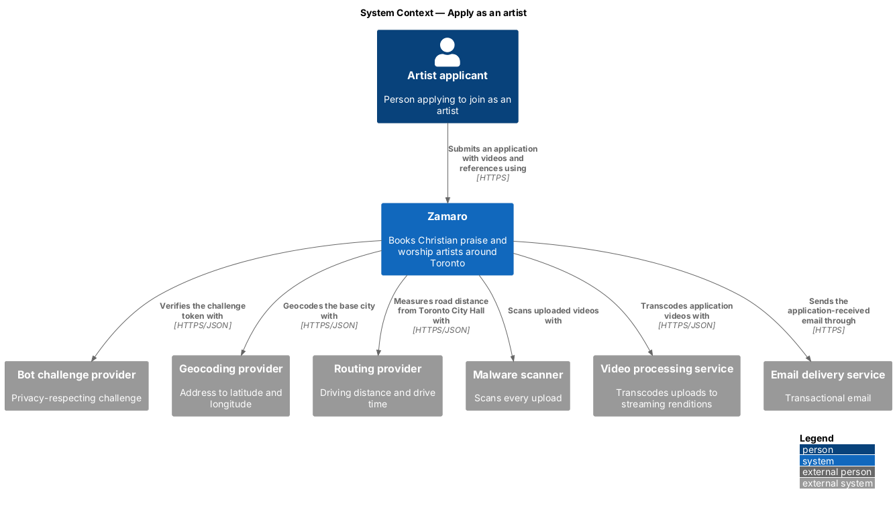
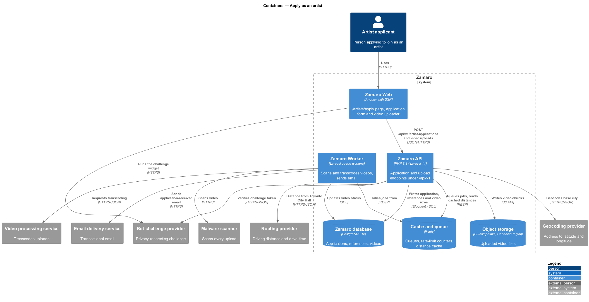
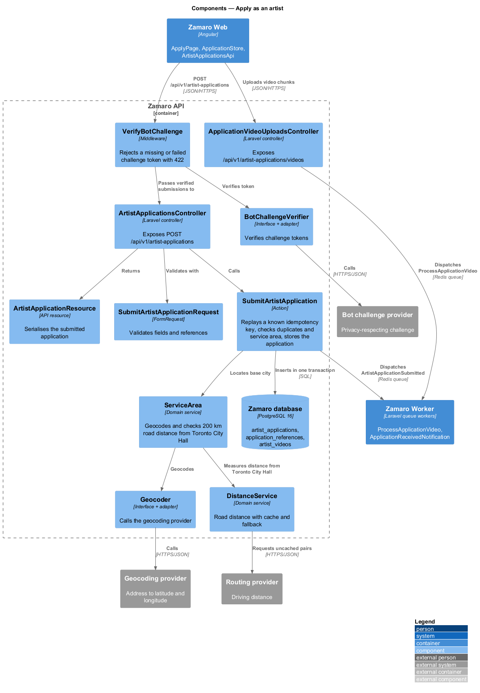
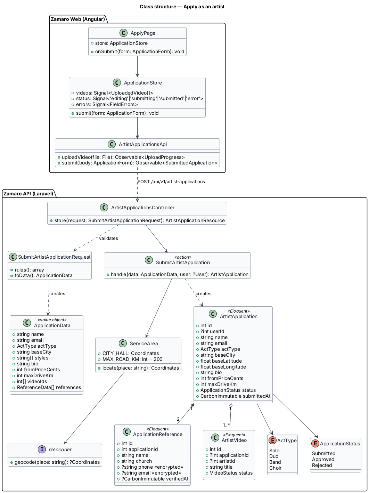
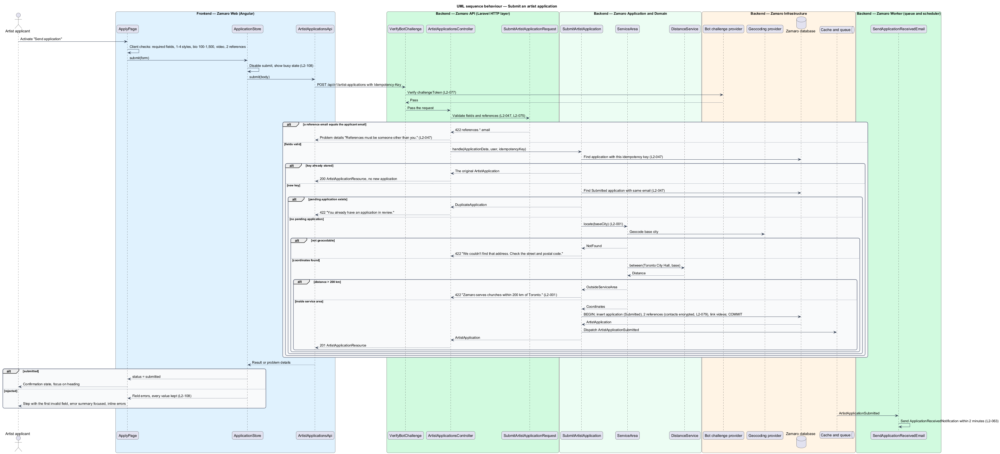
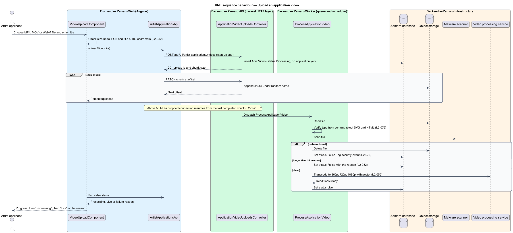

# Apply as an artist

## Overview

Zamaro only lists artists that the Zamaro team has vetted (L1-010). Vetting starts
with an application. A worship artist fills in the "Apply as an artist" form at
`/artists/apply`, attaches at least one performance video and names two church references.
Zamaro checks that the artist is based inside the service area, stores the
application with status Submitted and emails the applicant a confirmation.

This feature is the application itself, from the form in Zamaro Web to the stored
application. It is open to anyone, signed in or not. The administrator's review and
decision are a separate slice (`artist-onboarding/review-artist-application`), as is
the Vulnerable Sector Check upload and verification
(`artist-onboarding/verify-vulnerable-sector-check`).

Terms used in this design:

- **artist applicant** — person applying to join Zamaro as an artist
- **artist application** — record of one applicant's submitted details, videos and references, with status Submitted, Approved or Rejected
- **pending application** — artist application whose status is still Submitted
- **church reference** — person at a church who can vouch for the applicant, given as name, church, and phone or email
- **act type** — shape of the act: Solo, Duo, Band or Choir
- **service area** — every address within 200 km road distance of Toronto City Hall (43.6534, -79.3841)
- **base city** — place the artist travels from, used for distances in search

Three rules decide whether an application is accepted. A reference shall not be the
applicant's own email address (L2-047). An email address may have at most one pending
application (L2-047). The base city shall geocode and lie inside the service area
(L2-001).

## Description

The slice runs from the `/artists/apply` route in Zamaro Web to the application endpoints in
the Zamaro API, the Zamaro database, object storage and the queue workers that
process videos and send email.

**Frontend (Zamaro Web, `features/apply`)**

- **`ApplyPage`** — routed page component for `/artists/apply`, lazy-loaded so its
  code is not part of the Discover bundle (L2-087). The route is declared before
  `/artists/:slug`, and `apply` is a reserved slug. It hosts the form, the bot
  challenge and the confirmation state. On success it replaces the form with a
  confirmation that shows the application number, the status Submitted, the time sent
  and the reply-by date, and moves focus to its heading (L2-101).
- **`ApplicationFormComponent`** — reactive form in four steps shown with the
  design-system steps component: "About you" (name, email, base city, act type),
  "Your music" (1–4 style tags from the L2-008 set: Band, Solo vocalist, Gospel
  choir, Acoustic, Hymns, Spanish; a bio of 100–1,500 characters; videos), "Price and
  travel" ("From" price, maximum driving distance) and "References and review" (two
  church references, then a summary of every answer with an Edit link back to its
  step). Completed steps in the stepper are links back. Answers are kept in browser
  storage on the device between steps until the application is sent. On Send it
  shows an error summary, marks each invalid field with `aria-invalid` and a linked
  message (L2-102) and moves focus to the summary. A server field error opens the
  step that holds the first invalid field, so a base city outside the service area
  returns the applicant to "About you" with every answer kept (L2-001). Price and
  distance bounds follow the profile rules in L2-050 ($100–$20,000 in whole dollars;
  20–200 km in 10 km steps).
- **`ReferenceFieldsetComponent`** — one fieldset per reference with name, church
  and a single required "Phone or email" field. The server stores the contact as an
  email when it parses as one and as a phone number otherwise. The component flags a
  reference email equal to the applicant's email before submission, and the server
  repeats the check.
- **`VideoUploadComponent`** — part of the "Your music" step. It picks an MP4, MOV
  or WebM file up to 1 GB and 15 minutes, requires a title of 5–100 characters with
  each file, and uploads it in chunks. It shows percent uploaded, then
  "Processing", then "Live" or a failure reason, and resumes from the last completed
  chunk for files over 50 MB (L2-052).
- **`BotChallengeComponent`** — runs the bot challenge provider's privacy-friendly
  check when the applicant sends the application and returns a token for the
  submission (L2-077). It shows no puzzle unless the provider asks for one.
- **`ApplicationStore`** — signal-based store holding uploaded videos, a status
  (`editing`, `submitting`, `submitted`, `error`) and per-field errors. It disables
  the submit button while a request is pending and keeps every value after a failure
  (L2-108). Each submission carries an `Idempotency-Key` header generated once per
  application, so a retry after a network failure creates at most one application.
- **`ArtistApplicationsApi`** — typed client for the upload and submit endpoints.

**Backend (Zamaro API)**

- **`ApplicationVideoUploadsController`** — exposes
  `POST /api/v1/artist-applications/videos` to start an upload and
  `PATCH /api/v1/artist-applications/videos/{upload}` to append a chunk. It creates
  an `ArtistVideo` row with status `Processing` and no owner yet, writes chunks to
  object storage under a random name, and dispatches `ProcessApplicationVideo` when
  the last chunk arrives. The chunked-upload protocol is `<TO SUPPLY>`. An upload
  token returned to the browser ties the video to the later submission; videos never
  attached to an application are deleted after `<TO SUPPLY>` hours.
- **`ArtistApplicationsController`** — exposes `POST /api/v1/artist-applications`.
  It validates with `SubmitArtistApplicationRequest`, calls `SubmitArtistApplication`
  and returns `201` with `ArtistApplicationResource`. Errors use RFC 9457 problem
  details, with `422` and per-field `errors` for validation failures (L2-095).
- **`SubmitArtistApplicationRequest`** — FormRequest that validates every field for
  type, length, range and format (L2-075): act type from `ActType`, 1–4 style tags
  from the L2-008 set, bio length, price and distance bounds, at least one video
  upload token, and exactly two references. It rejects a reference whose email equals the applicant's
  email, compared case-insensitively, with "References must be someone other than
  you." It produces an `ApplicationData` value object. The bot challenge token is
  checked before it, by the `VerifyBotChallenge` route middleware of
  `security/limit-request-rates` through `BotChallengeVerifier` (L2-077).
- **`SubmitArtistApplication`** — action that runs inside `DB::transaction`. It
  first looks up the idempotency key: a request that repeats a stored key returns
  the original application with `200` and creates nothing, before any duplicate
  check (L2-047). Otherwise it rejects a second pending application for the same
  email with "You already have an application in review." It calls
  `ServiceArea::locate()` for the base city. It inserts the `ArtistApplication` with
  status `Submitted`, inserts both `ApplicationReference` rows and links the uploaded
  videos. After commit it dispatches the `ArtistApplicationSubmitted` event.
- **`ServiceArea`** — domain service shared with church profiles (L2-024). It
  geocodes a place through `Geocoder`, measures road distance from Toronto City Hall
  through `DistanceService`, and rejects anything beyond 200 km with "Zamaro serves
  churches within 200 km of Toronto." An ungeocodable place is rejected with "We
  couldn't find that address. Check the street and postal code." (L2-001).
- **`Geocoder`**, **`BotChallengeVerifier`** — interfaces in `App\Services\` with one adapter
  each for the geocoding provider and the bot challenge provider (vendors
  `<TO SUPPLY>`).
- **`ProcessApplicationVideo`** — queued job that verifies the file type from its
  content, rejects SVG and HTML, scans it with the malware scanner and deletes it on a
  hit with a logged security event (L2-076). It fails a file longer than 15 minutes
  with its reason (L2-052). A clean file goes to the video processing
  service for 360p, 720p and 1080p renditions with a poster frame (L2-052), and the
  video becomes `Live`. The job is idempotent and retries up to 5 times (L2-092).
- **`SendApplicationReceivedEmail`** — queued listener for
  `ArtistApplicationSubmitted` that sends `ApplicationReceivedNotification` within
  2 minutes, with plain-text and HTML parts (L2-063).
- **`ArtistApplicationResource`** — returns the application ID, its number (for
  example A-0219), status, submission time and reply-by date, and no reference
  contact details. The reply-by date is 3 business days after submission, counted by
  the `BusinessDayCalendar` shared with payouts (L2-047).

**Mock screens** — the form is
[`pages/apply`](../../../mocks/pages/apply/default.html): step 1 in the default
state, then [`step-2`](../../../mocks/pages/apply/step-2.html) (styles, bio and an
uploaded video), [`step-3`](../../../mocks/pages/apply/step-3.html) (price and
distance) and [`step-4`](../../../mocks/pages/apply/step-4.html) (references and the
review summary). [`invalid`](../../../mocks/pages/apply/invalid.html) shows a missing
reference contact and "References must be someone other than you.",
[`error`](../../../mocks/pages/apply/error.html) shows "You already have an
application in review.",
[`outside-area`](../../../mocks/pages/apply/outside-area.html) returns to step 1 with
"Zamaro serves churches within 200 km of Toronto." on the base city,
[`submitting`](../../../mocks/pages/apply/submitting.html) shows the busy Send button,
and [`success`](../../../mocks/pages/apply/success.html) shows application A-0219, sent
Fri 9 Oct at 10:42 a.m., with the reply-by date Thu 15 Oct (Mon 12 Oct is
Thanksgiving). After sending, the stepper marks every step done without links back.

The account model for applicants who are not signed in is `<TO SUPPLY>`. This design
stores `user_id` when the applicant is signed in and leaves it null otherwise; the
review slice resolves the account on approval.

**Data**

- `artist_applications` — `id`, `user_id` (nullable), `name`, `email`, `act_type`,
  `base_city`, `base_latitude`, `base_longitude`, `styles` (1–4 tags), `bio`,
  `from_price_cents`, `max_drive_km`, `status`, `number`, `idempotency_key`
  (unique), `submitted_at`, and the decision columns written by the review slice. A
  partial unique index on `lower(email)` where `status = 'Submitted'` enforces one
  pending application per email, so a concurrent duplicate fails at the database as
  well as in the action.
- `application_references` — `id`, `artist_application_id`, `name`, `church`,
  `phone` and `email` encrypted at the application level with a key held outside the
  database (L2-079), `verified_at`, `verified_by`.
- `artist_videos` — shared with profile management; `artist_application_id` links
  an application video until approval moves it to the artist.

## Requirements

The feature realises the following level-2 (L2) requirements, quoted from
`docs/specs/L2.md` with the level-1 (L1) requirement each one refines.

| L2 ID | Refines (L1) | Requirement |
|-------|--------------|-------------|
| `L2-047` | `L1-010` | **Artist application.** Acceptance criteria: 1. Given anyone on "Apply as an artist", when they submit name, email, act type (Solo, Duo, Band, Choir), base city, 1–4 styles, a bio of 100–1,500 characters, a "From" price, maximum driving distance, at least one video, and two church references (name, church, phone or email), then an application is created with status Submitted and the applicant is emailed a confirmation. 2. Given a reference that is the applicant's own email, when the application is submitted, then it is rejected with "References must be someone other than you." 3. Given an existing pending application with the same email, when another is submitted, then it is rejected with "You already have an application in review." 4. Given an application is created, when the confirmation is shown, then it gives the application number and a reply-by date 3 business days after submission (weekdays that are not Ontario statutory holidays). 5. Given the submission is retried after a network failure, when it carries the same idempotency key, then at most one application is created and the retry returns it. |
| `L2-001` | `L1-001` | **Service area boundary.** The service area is every address within 200 km road distance of Toronto City Hall (43.6534, -79.3841). Church locations and artist base locations must fall inside it. Acceptance criteria: 1. Given a booker entering a church address in Burlington, ON (about 55 km away), when they save it, then the address is accepted and geocoded to latitude and longitude. 2. Given a booker entering an address in Ottawa, ON (about 450 km away), when they save it, then the save is rejected with the message "Zamaro serves churches within 200 km of Toronto." and nothing is stored. 3. Given an artist applicant whose base city is outside the service area, when they submit the application, then the application is rejected with the same service-area message. 4. Given an address that cannot be geocoded, when it is saved, then the save is rejected with "We couldn't find that address. Check the street and postal code." and the form keeps every value entered. |

## Diagrams

### System context

An artist applicant submits an application to Zamaro, which verifies the bot
challenge, geocodes and measures the base city, scans and transcodes videos, and
emails a confirmation.

### Containers

The `/artists/apply` page in Zamaro Web uploads videos and submits the application to the
Zamaro API. The Zamaro Worker scans and transcodes the videos and sends the
confirmation email from the queue.

### Components

Inside the Zamaro API, `VerifyBotChallenge` admits only submissions with a passing
challenge token, and `ArtistApplicationsController` validates with
`SubmitArtistApplicationRequest` and calls `SubmitArtistApplication`, which checks the
service area through `ServiceArea` before storing the application.

### Class structure

The frontend store and client mirror the backend action. `SubmitArtistApplication`
turns an `ApplicationData` into an `ArtistApplication` that owns two
`ApplicationReference` rows and links one or more `ArtistVideo` rows.

### Behaviour — submit an application

The middleware checks the bot challenge and the request checks fields and references
first. The action then replays a known idempotency key, refuses a second pending
application, checks the service area and stores everything in one transaction; the
confirmation email follows from the queue.

### Behaviour — upload an application video

The browser uploads each video in chunks before submission. A queued job verifies the
content type, scans for malware and sends clean files for transcoding, while the page
shows progress and the final status.

