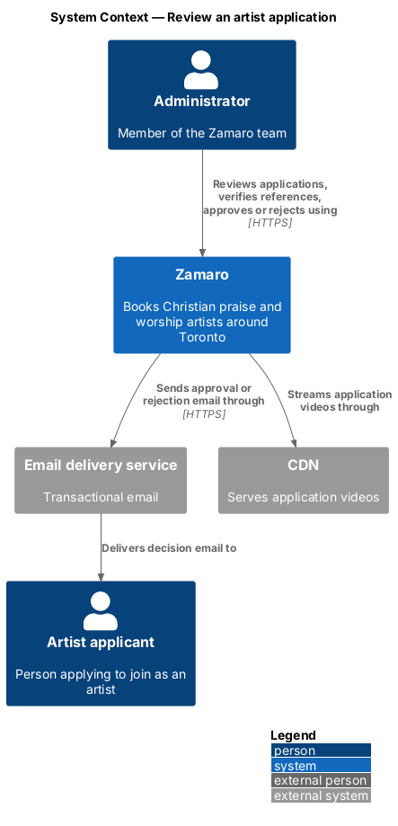
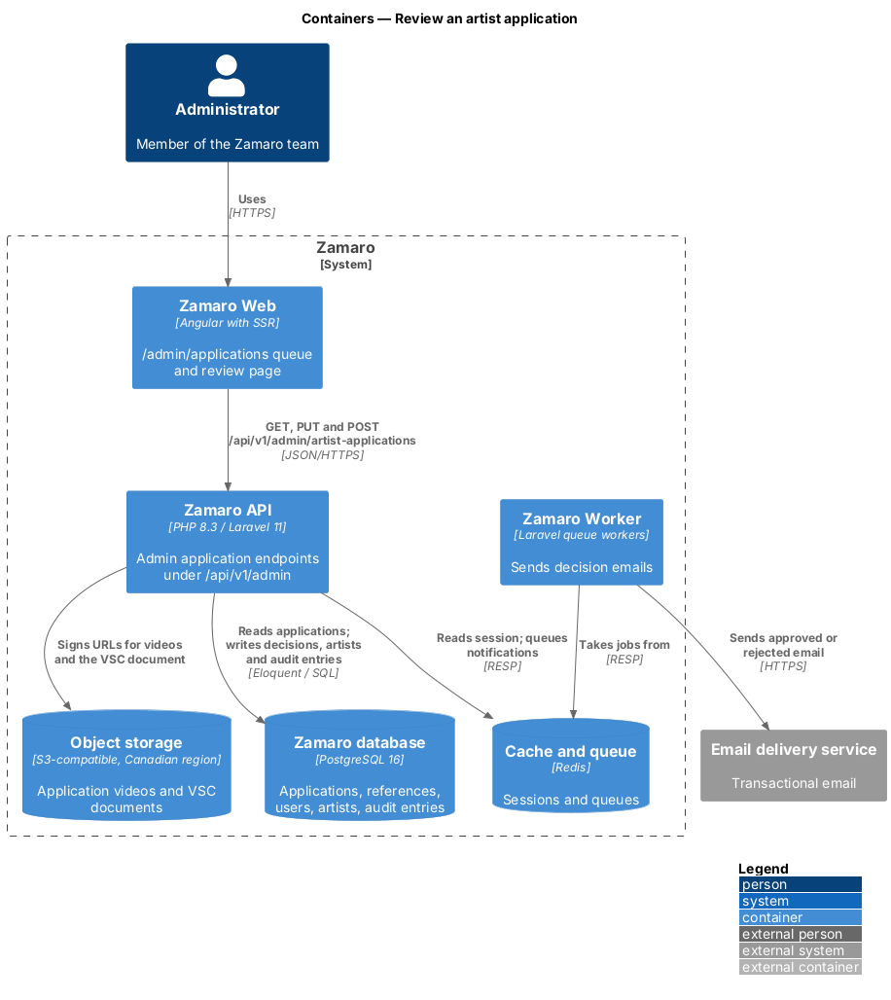
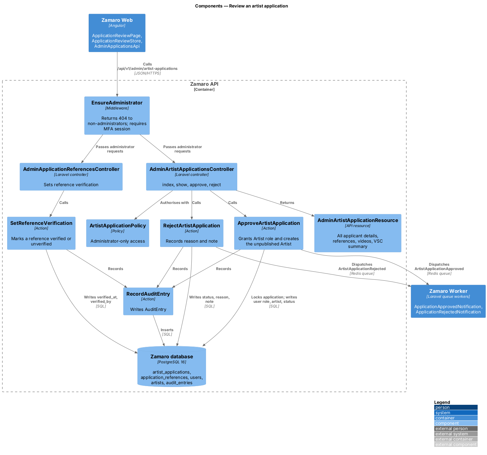
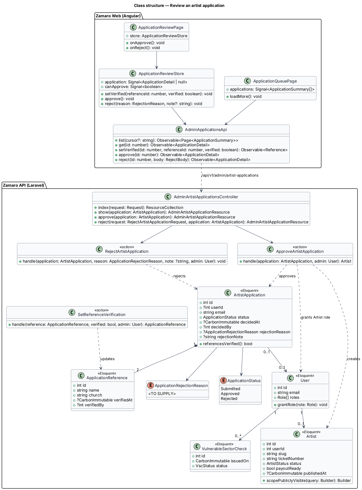
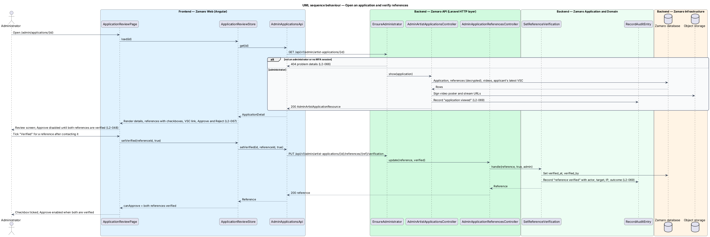
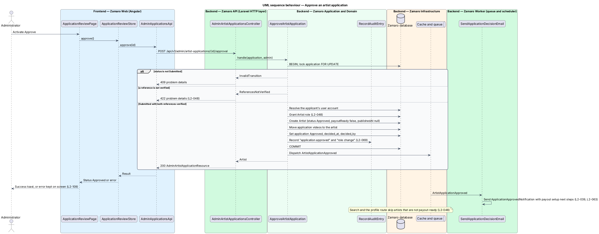
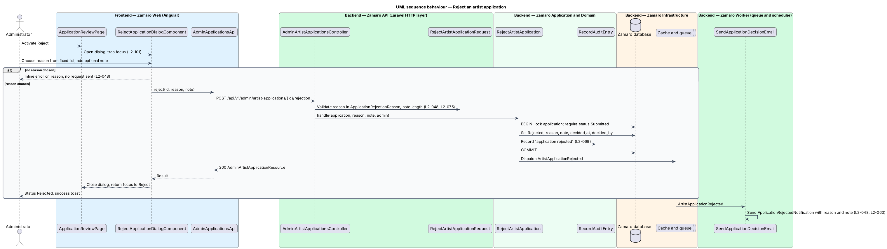

# Review an artist application

## Overview

Zamaro publishes an artist only after the Zamaro team has vetted them (L1-010). An
artist application arrives with status Submitted from the "Apply as an artist" form
(`artist-onboarding/apply-as-artist`). An administrator then opens it, contacts both
church references, and approves or rejects it.

This feature is that review, from the application queue in the admin area of Zamaro
Web to the decision stored in the Zamaro database and the email sent to the
applicant. Approval grants the Artist role and creates an unpublished artist; the
artist becomes visible only after payout setup (L2-039). Verifying a Vulnerable
Sector Check is a separate slice (`artist-onboarding/verify-vulnerable-sector-check`);
the review screen only links to the document. Suspending and reinstating approved
artists (L2-067, criteria 2 and 3) belongs to
`administration/suspend-and-reinstate-artists`.

Terms used in this design:

- **administrator** — member of the Zamaro team with the Administrator role and a multi-factor session
- **application queue** — list of artist applications with status Submitted, oldest first
- **review screen** — admin page that shows one application with its references, videos, VSC document and decision actions
- **verified reference** — church reference that an administrator has marked as confirmed, with the time and the administrator recorded
- **rejection reason** — value from a fixed list that explains a rejection to the applicant
- **payout-ready** — state of an artist who has completed the payment processor's connected-account onboarding
- **publicly visible artist** — artist with status Approved who is payout-ready and published

Two rules govern the decision. Approval shall be refused until both references are
verified (L2-048). Rejection shall carry a reason from the fixed list, with an
optional note, and both reach the applicant by email (L2-048). An approved artist
who is not payout-ready shall stay out of search and off the slug route (L2-048).

## Description

The slice runs from the `/admin/applications` routes in Zamaro Web to the admin
application endpoints in the Zamaro API, the Zamaro database and the Zamaro Worker
that sends decision emails. Every endpoint sits behind the administrator guard
(L2-066), and every administrator action writes an audit entry (L2-069).

**Frontend (Zamaro Web, `features/admin/applications`)**

- **`ApplicationQueuePage`** — routed page for `/admin/applications`. It lists
  Submitted applications with name, act type, base city and submission date, using
  cursor pagination (L2-095). Each row opens the review screen.
- **`ApplicationReviewPage`** — routed page for `/admin/applications/:id`, the review
  screen of L2-067. It shows every applicant detail: name, email, act type, base city,
  styles, bio, "From" price, maximum driving distance and submission time. It embeds
  the application videos and shows the decision actions.
- **`ReferenceVerificationComponent`** — lists both references with name, church,
  phone and email, and a "Verified" checkbox for each. Ticking a box saves at once and
  shows who verified it and when.
- **`VscDocumentComponent`** — shared with
  `artist-onboarding/verify-vulnerable-sector-check`. It shows the applicant's latest
  Vulnerable Sector Check with issue date and status, and opens the document through a
  5-minute signed URL. When none exists it reads "No Vulnerable Sector Check
  uploaded".
- **`ApplicationDecisionComponent`** — Approve and Reject buttons. Approve stays
  disabled, with a visible explanation, until both references are verified. The
  explanation copy is `<TO SUPPLY>`.
- **`RejectApplicationDialogComponent`** — design-system dialog with a required
  reason select and an optional note. It traps focus and returns focus to Reject on
  close (L2-101).
- **`ApplicationReviewStore`** — signal-based store holding the application, a
  computed `canApprove` signal and the decision status.
- **`AdminApplicationsApi`** — typed client for the admin application endpoints.

The admin area is a lazy route so its code is never downloaded on Discover (L2-087).

**Backend (Zamaro API)**

- **`EnsureAdministrator`** — middleware on `/api/v1/admin/*`. It returns 404 to
  anyone without the Administrator role and requires a TOTP-verified session that
  ends after 30 minutes idle (L2-066).
- **`AdminArtistApplicationsController`** — exposes:
  - `GET /api/v1/admin/artist-applications?status=Submitted&cursor=` — the queue
  - `GET /api/v1/admin/artist-applications/{application}` — the review screen data
  - `POST /api/v1/admin/artist-applications/{application}/approval` — approve
  - `POST /api/v1/admin/artist-applications/{application}/rejection` — reject
- **`AdminApplicationReferencesController`** — exposes
  `PUT /api/v1/admin/artist-applications/{application}/references/{reference}/verification`
  with body `{ "verified": true|false }`.
- **`ArtistApplicationPolicy`** — allows these actions to administrators only.
- **`SetReferenceVerification`** — action that sets or clears `verified_at` and
  `verified_by` on an `ApplicationReference` of a Submitted application and records an
  audit entry.
- **`ApproveArtistApplication`** — action that runs inside `DB::transaction` with the
  application row locked. It returns 409 unless the status is Submitted. It returns
  422 unless both references are verified; the message copy is `<TO SUPPLY>`. It then
  resolves the applicant's `User` (the rule for applicants without an account is
  `<TO SUPPLY>`, as in `artist-onboarding/apply-as-artist`) and grants the `Artist`
  role. It creates an `Artist` from the application with status `Approved`,
  `payoutReady` false and `publishedAt` null, assigns a slug and a ticket number such
  as `ZAM-0114`, and moves the application videos to the artist. It sets the
  application to `Approved` with `decided_at` and `decided_by`. It records the
  approval and the role change as audit entries. After commit it dispatches
  `ArtistApplicationApproved`.
- **`RejectArtistApplication`** — action that locks the application, requires status
  Submitted, and stores `Rejected` with the reason, the note, `decided_at` and
  `decided_by`. It records an audit entry and dispatches `ArtistApplicationRejected`.
- **`RejectArtistApplicationRequest`** — FormRequest that requires `reason` from the
  `ApplicationRejectionReason` enum and accepts an optional `note`. The reason list and
  the maximum note length are `<TO SUPPLY>`.
- **`SendApplicationDecisionEmail`** — queued listener that sends
  `ApplicationApprovedNotification` (next steps, including the payout setup link of
  L2-039) or `ApplicationRejectedNotification` (reason and note) within 2 minutes
  (L2-063).
- **`AdminArtistApplicationResource`** — serialises all applicant details, the
  decrypted reference contacts, signed video URLs and a summary of the latest
  `VulnerableSectorCheck`. Responses carry `Cache-Control: private, no-store`
  (L2-089).
- **`Artist::scopePubliclyVisible()`** — query scope for status `Approved`,
  `payoutReady` true and `publishedAt` not null. Search
  (`discovery/search-available-artists`) and the public profile route use it, so an
  approved artist without payout setup is neither listed nor reachable by slug
  (L2-048). The payout onboarding slice sets `payoutReady` and `publishedAt`.

**Data**

The slice writes `artist_applications` (`status`, `decided_at`, `decided_by`,
`rejection_reason`, `rejection_note`), `application_references` (`verified_at`,
`verified_by`), `users` and their roles, `artists`, `artist_videos` (owner moves from
application to artist) and `audit_entries`. It reads `vulnerable_sector_checks` for
the applicant's user.

## Requirements

The feature realises the following level-2 (L2) requirements, quoted from
`docs/specs/L2.md` with the level-1 (L1) requirement each one refines. For L2-067 this
slice covers criterion 1; criteria 2 and 3 are designed in
`administration/suspend-and-reinstate-artists`.

| L2 ID | Refines (L1) | Requirement |
|-------|--------------|-------------|
| `L2-048` | `L1-010` | **Application review.** Acceptance criteria: 1. Given a Submitted application, when an administrator approves it, then both references must be marked verified first, the account gains the Artist role and the artist is emailed next steps (payout setup, L2-039). 2. Given a Submitted application, when an administrator rejects it, then a reason from a fixed list plus an optional note is required and the applicant is emailed it. 3. Given an approved artist without completed payout setup, when anyone searches or opens their slug, then the artist is not shown. |
| `L2-067` | `L1-015` | **Artist management.** Acceptance criteria: 1. Given an administrator, when they open an application, then they see all applicant details, references with verification checkboxes, the VSC document if uploaded, and Approve and Reject actions. 2. Given an administrator suspends an artist with a required reason, when it is saved, then the profile returns 404, the artist disappears from search, their Requested and Accepted bookings become Declined, and their Confirmed bookings are listed for the administrator to resolve. 3. Given a suspended artist, when an administrator reinstates them, then their profile and search visibility return. |

## Diagrams

### System context

An administrator reviews applications in Zamaro. Zamaro emails the decision to the
applicant through the email delivery service and streams application videos through
the CDN.

### Containers

The admin pages in Zamaro Web call the admin endpoints of the Zamaro API, which reads
and writes the database and signs storage URLs. The Zamaro Worker sends the decision
email from the queue.

### Components

`EnsureAdministrator` guards every admin endpoint. The controllers call one action per
decision, and each action records an audit entry through `RecordAuditEntry`.

### Class structure

`ApproveArtistApplication` turns a Submitted `ArtistApplication` with two verified
`ApplicationReference` rows into an unpublished `Artist` and grants the `User` the
Artist role. `RejectArtistApplication` stores an `ApplicationRejectionReason` and note.

### Behaviour — open an application and verify references

The review screen loads every applicant detail, the references and the VSC summary.
Each reference checkbox saves at once and is audited, and Approve becomes available
only when both references are verified.

### Behaviour — approve an application

Approval locks the application, re-checks the status and both verifications, grants
the Artist role and creates an artist who stays hidden until payout setup. The
approval email with next steps follows from the queue.

### Behaviour — reject an application

The dialog requires a reason before sending. The action stores the reason and optional
note, records an audit entry, and the queue emails both to the applicant.

