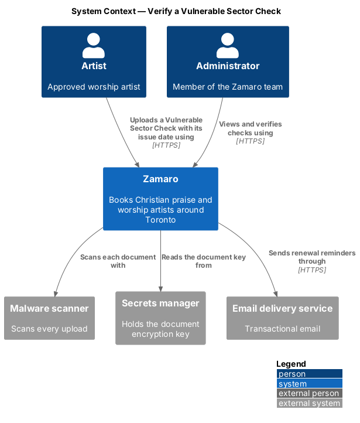
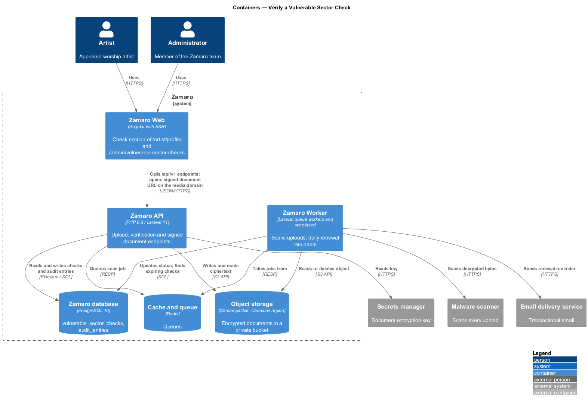
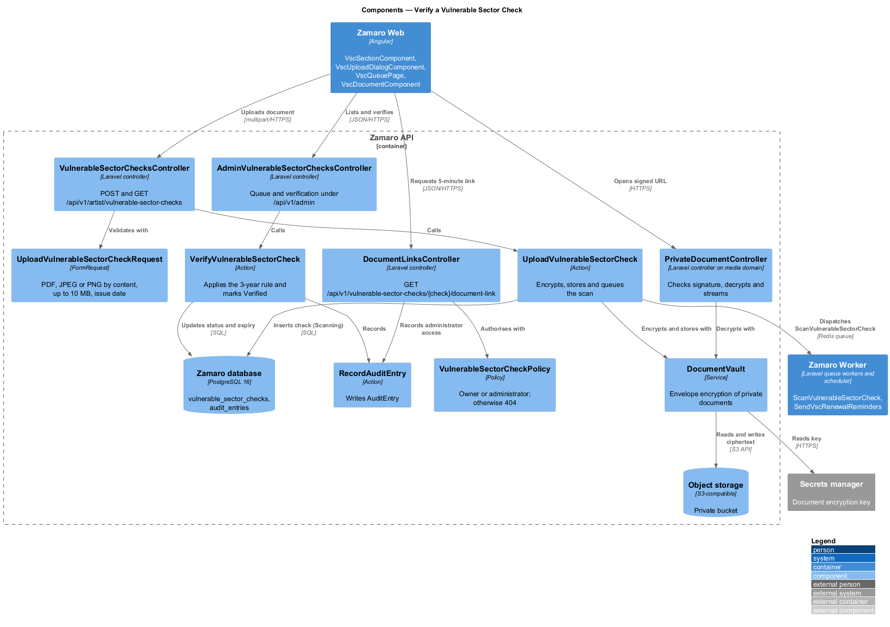
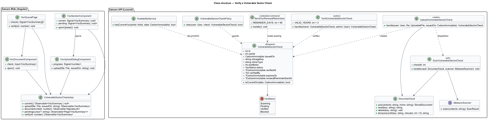
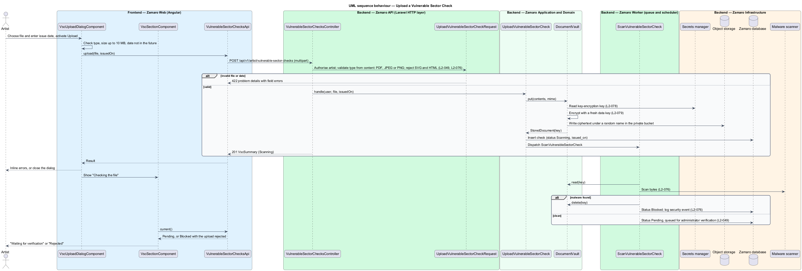
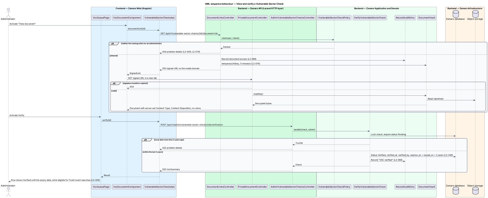
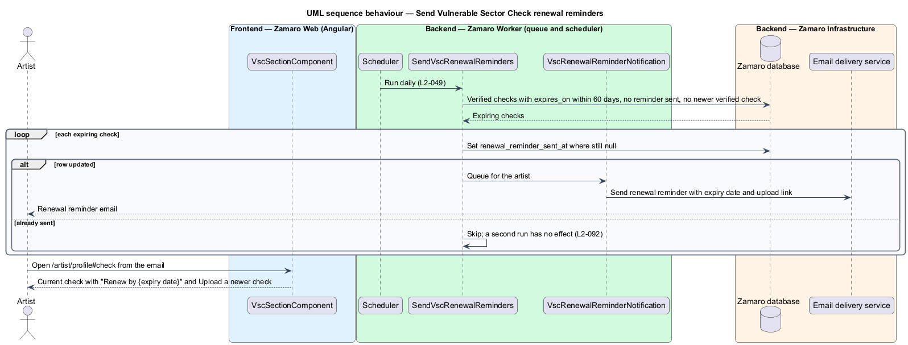

# Verify a Vulnerable Sector Check

## Overview

Churches booking worship leaders for youth events expect those leaders to have passed
a police check. Zamaro shows an artist in Youth event searches only when the artist
holds a verified Vulnerable Sector Check dated within the last 3 years (L2-005). This
feature collects that check and keeps it current.

An artist uploads a scan of the check with its issue date. Zamaro stores the file
encrypted and scans it for malware. An administrator opens the document through a
short-lived link and verifies it. The verified check makes the artist eligible for
Youth event searches until 3 years after the issue date, and a daily job reminds the
artist to renew 60 days before that limit.

The slice sits in the artist-onboarding subsystem beside
`artist-onboarding/apply-as-artist` and `artist-onboarding/review-artist-application`.
The application review screen shows the same document through the shared
`VscDocumentComponent`. The search filter that reads the result lives in
`discovery/search-available-artists`.

Terms used in this design:

- **Vulnerable Sector Check (VSC)** — Canadian police record check for people working with children or vulnerable persons
- **issue date** — date printed on the check by the issuing police service
- **current check** — verified check whose issue date plus 3 years has not yet passed
- **expiry date** — issue date plus 3 years, the last day a check counts as current
- **renewal window** — final 60 days before the expiry date
- **private document** — upload that is never public and is served only through a signed URL that expires after 5 minutes
- **document vault** — service that encrypts private documents with a key held outside the database

Four rules govern the slice. The file shall be a PDF, JPEG or PNG up to 10 MB,
identified by content (L2-049, L2-076). The document shall be stored encrypted at the
application level (L2-079). Anyone other than the owning artist and administrators
shall receive 404 for the document (L2-049). Verification shall apply only to a check
dated within the last 3 years (L2-049).

## Description

The slice runs from the check section of the artist's profile editor and the admin
VSC queue in Zamaro Web to
the Zamaro API, a private bucket in object storage, the Zamaro Worker and the
email delivery service.

**Frontend (Zamaro Web)**

- **`VscSectionComponent`** — the "Vulnerable Sector Check" section (`#check`) of
  `ArtistProfileEditorPage` at `/artist/profile` (`artist-workspace/edit-profile-details`).
  It shows a status badge with one line of copy: "Not uploaded" ("Upload one to appear
  in Youth event searches."), "Checking the file" while the scan runs, "Waiting for
  verification" with the upload and issue dates, "Verified" ("Verified until {expiry}
  · issued {issue date}. You appear in Youth event searches until then."), "Renew by
  {expiry}" inside the renewal window, "Expired" after it, and "Rejected" when the
  malware scan fails. A newer check waiting for verification is listed above the
  current verified one, which still counts. The section says that only the artist and
  Zamaro administrators can open the document and that a reminder comes 60 days
  before it runs out. Its "Upload your check" or "Upload a newer check" button opens
  `VscUploadDialogComponent`.
- **`VscUploadDialogComponent`** — design-system dialog with a required file input
  (PDF, JPEG or PNG up to 10 MB) and a required issue date that cannot be after today.
  It pre-checks size and date, shows upload progress with Cancel upload, shows inline
  errors with a summary, and keeps the file and date after a failed upload with Try
  again. On success it closes and the section shows the new check.
- **`VscQueuePage`** — routed page for `/admin/vulnerable-sector-checks`, reached
  from the Artists section of the admin shell ("Vulnerable Sector Checks · {n}
  waiting"). It lists Pending checks with artist name, issue date, upload time and
  whether the check replaces a verified one, oldest first, with View document and
  Verify per row. After Verify the row shows "Verified until {expiry}" and who
  verified it.
- **`VscDocumentComponent`** — requests a signed link and opens the document in a new
  tab. The application review screen of `artist-onboarding/review-artist-application`
  reuses it.
- **`VulnerableSectorChecksApi`** — typed client for the artist, document-link and
  admin endpoints.

**Backend (Zamaro API)**

- **`VulnerableSectorChecksController`** — exposes
  `POST /api/v1/artist/vulnerable-sector-checks` (multipart) and
  `GET /api/v1/artist/vulnerable-sector-checks/current` for the signed-in user. As an
  upload endpoint it accepts bodies up to 10 MB (L2-075).
- **`UploadVulnerableSectorCheckRequest`** — FormRequest that verifies the file type
  from its content (PDF, JPEG or PNG), rejects SVG and HTML, enforces 10 MB, and
  requires an issue date that is not in the future (L2-049, L2-076).
- **`UploadVulnerableSectorCheck`** — action that stores the file through
  `DocumentVault`, inserts a `VulnerableSectorCheck` with status `Scanning` and
  dispatches `ScanVulnerableSectorCheck`. Uploads come from the profile editor after
  approval; the application form has no check step. The check belongs to the `User`,
  so the review screen can show one uploaded later for a returning applicant.
- **`DocumentVault`** — service for private documents. It encrypts each file with a
  fresh data key, wraps that key with a key-encryption key read from the secrets
  manager (L2-078, L2-079), and writes the ciphertext to a private bucket under a
  random name. It also reads, deletes and issues 5-minute signed URLs (L2-076).
- **`ScanVulnerableSectorCheck`** — queued job that decrypts the file and sends it to
  the malware scanner. On a hit it deletes the object, sets status `Blocked` and logs a
  security event. On a clean result it sets status `Pending`, which places the check in
  the administrator queue (L2-049). It is idempotent and retries up to 5 times
  (L2-092).
- **`DocumentLinksController`** — exposes
  `GET /api/v1/vulnerable-sector-checks/{check}/document-link`. It authorises with
  `VulnerableSectorCheckPolicy` and returns 404 to anyone other than the owner and
  administrators (L2-049, L2-074). It records an audit entry when an administrator
  opens a document (L2-069), and returns a signed URL valid for 5 minutes.
- **`PrivateDocumentController`** — route on the separate media domain (host name
  `<TO SUPPLY>`) that checks the URL signature and expiry, decrypts through
  `DocumentVault`, and streams the file with server-set `Content-Type`,
  `Content-Disposition` and `Cache-Control: private, no-store` (L2-076, L2-089). An
  invalid or expired signature returns 404.
- **`AdminVulnerableSectorChecksController`** — exposes
  `GET /api/v1/admin/vulnerable-sector-checks?status=Pending&cursor=` and
  `POST /api/v1/admin/vulnerable-sector-checks/{check}/verification` behind the
  administrator guard (L2-066).
- **`VerifyVulnerableSectorCheck`** — action that locks the check, requires status
  `Pending`, and refuses a check whose issue date is more than 3 years ago with 422
  (copy `<TO SUPPLY>`). Otherwise it sets `Verified`, `verified_at`, `verified_by` and
  `expires_on` (issue date plus 3 years) and records an audit entry. Rejecting a
  legible but unacceptable check is not covered by L2-049; that path is
  `<TO SUPPLY>`.
- **`VulnerableSectorCheck::isCurrentOn(date)`** — true when the status is `Verified`
  and the date is on or before `expires_on`. `AvailabilityService::hasCurrentVsc()`
  calls it for Youth event searches (L2-005). Whether the event date or the search date
  is compared with the expiry is `<TO SUPPLY>`.
- **`SendVscRenewalReminders`** — scheduled command in `routes/console.php` that runs
  daily (time of day `<TO SUPPLY>`). It selects verified checks whose expiry falls
  within 60 days, with no reminder sent and no newer verified check. It sets
  `renewal_reminder_sent_at` with a conditional update before queueing
  `VscRenewalReminderNotification`, so a second run has no effect and a missed run
  is caught by the next one (L2-092).

**Mock screens** — the section is `#check` on
[`pages/edit-profile`](../../../mocks/pages/edit-profile/default.html) (Verified until
Fri 3 Mar 2028), on [`empty`](../../../mocks/pages/edit-profile/empty.html) (Not
uploaded) and on [`check-pending`](../../../mocks/pages/edit-profile/check-pending.html)
(a newer check waiting for verification). The upload dialog is
[`dialogs/upload-check`](../../../mocks/dialogs/upload-check/default.html) in states
default, busy, invalid (a 14 MB file and a missing issue date) and failed. The
administrator verification queue is
[`pages/admin-checks`](../../../mocks/pages/admin-checks/default.html) in states default
(Elijah Park and Abigail Mensah waiting), [`verified`](../../../mocks/pages/admin-checks/verified.html)
(Elijah verified until Tue 25 Sep 2029), loading,
[`empty`](../../../mocks/pages/admin-checks/empty.html) and error.

**Data**

- `vulnerable_sector_checks` — `id`, `user_id`, `issued_on`, `storage_key`,
  `wrapped_data_key`, `mime_type`, `size_bytes`, `status` (`Scanning`, `Pending`,
  `Verified`, `Blocked`), `verified_at`, `verified_by`, `expires_on`,
  `renewal_reminder_sent_at`, `created_at`. An index on `(status, expires_on)` serves
  the daily job.
- `audit_entries` — verification and administrator document access.

The document is never part of any public response, and no public profile field
exposes its existence beyond Youth event eligibility.

## Requirements

The feature realises the following level-2 (L2) requirement, quoted from
`docs/specs/L2.md` with the level-1 (L1) requirement it refines.

| L2 ID | Refines (L1) | Requirement |
|-------|--------------|-------------|
| `L2-049` | `L1-010` | **Vulnerable Sector Check.** Acceptance criteria: 1. Given an artist, when they upload a Police Vulnerable Sector Check (PDF, JPEG or PNG up to 10 MB) with its issue date, then it is stored encrypted and queued for administrator verification. 2. Given an administrator verifies it, when the check is dated within the last 3 years, then the artist is eligible for Youth event searches (L2-005) until 3 years after the issue date. 3. Given a verified check is within 60 days of the 3-year limit, when the daily job runs, then the artist is emailed a renewal reminder. 4. Given anyone other than the artist and administrators, when they request the document, then the response is 404; the document itself is never shown publicly. |

## Diagrams

### System context

Artists upload checks and administrators verify them in Zamaro. Zamaro scans each
file, reads its document key from the secrets manager and sends renewal reminders by
email.

### Containers

The Zamaro API encrypts each upload into a private bucket and queues a scan. The
Zamaro Worker scans the file and runs the daily reminder job, and administrators read
the document through a signed URL on the media domain.

### Components

`UploadVulnerableSectorCheck` and `PrivateDocumentController` both go through
`DocumentVault` for encryption. `VulnerableSectorCheckPolicy` guards the document link,
and `VerifyVulnerableSectorCheck` applies the 3-year rule.

### Class structure

`VulnerableSectorCheck` carries the status, issue date and expiry that
`AvailabilityService` reads. The upload action, scan job, verification action and
reminder command each change one part of that record.

### Behaviour — upload a check

The request verifies the file type from content before anything is stored. The vault
encrypts the file, and the queued scan either deletes it or places the check in the
administrator queue.

### Behaviour — view and verify a check

The document link is refused with 404 for anyone but the owner and administrators,
and the signed URL expires after 5 minutes. Verification sets the expiry date 3 years
after the issue date and is audited.

### Behaviour — send renewal reminders

The daily job finds checks entering the 60-day renewal window and marks each reminder
as sent before emailing it. The artist follows the email to the check section of the
profile editor (`/artist/profile#check`) to upload a newer check.

