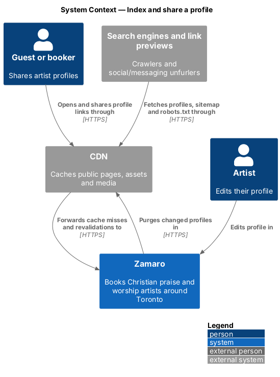
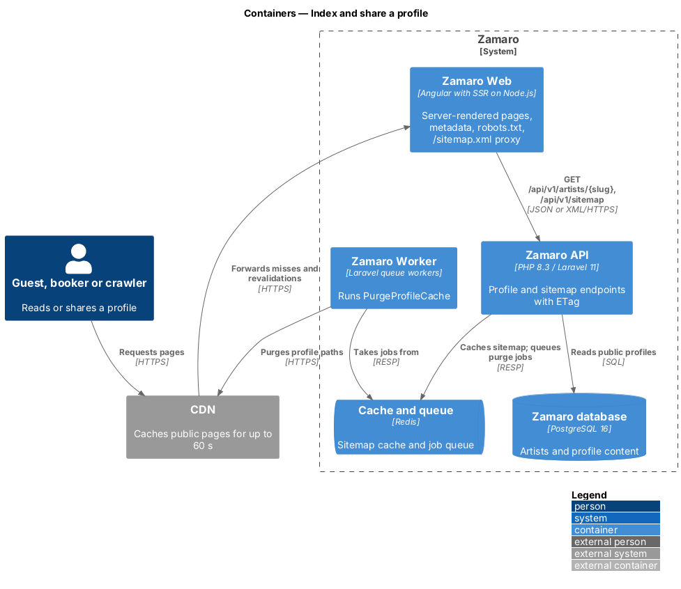
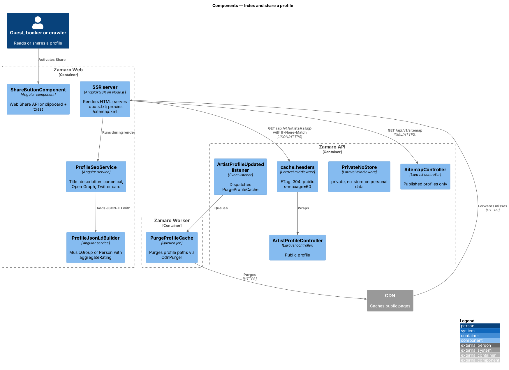
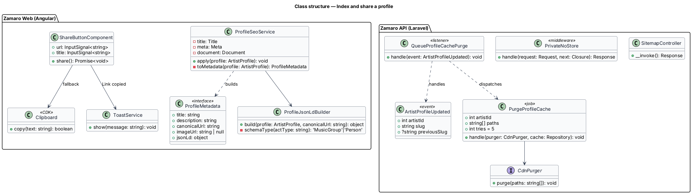
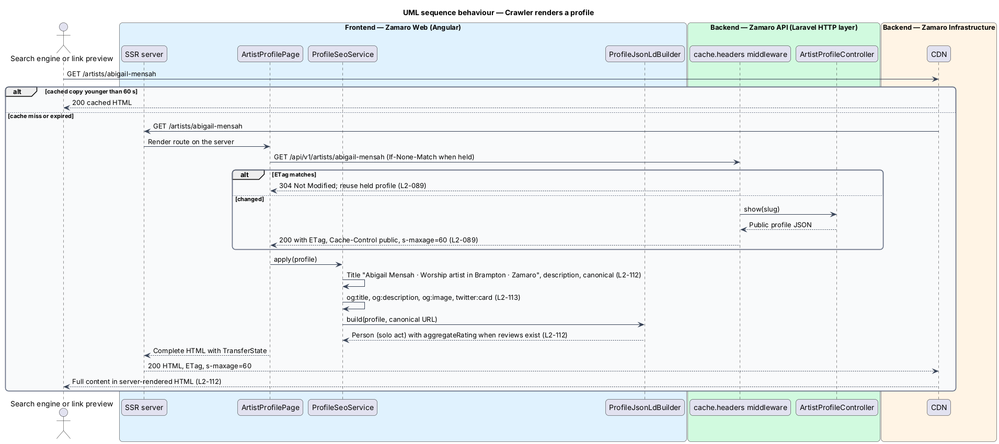
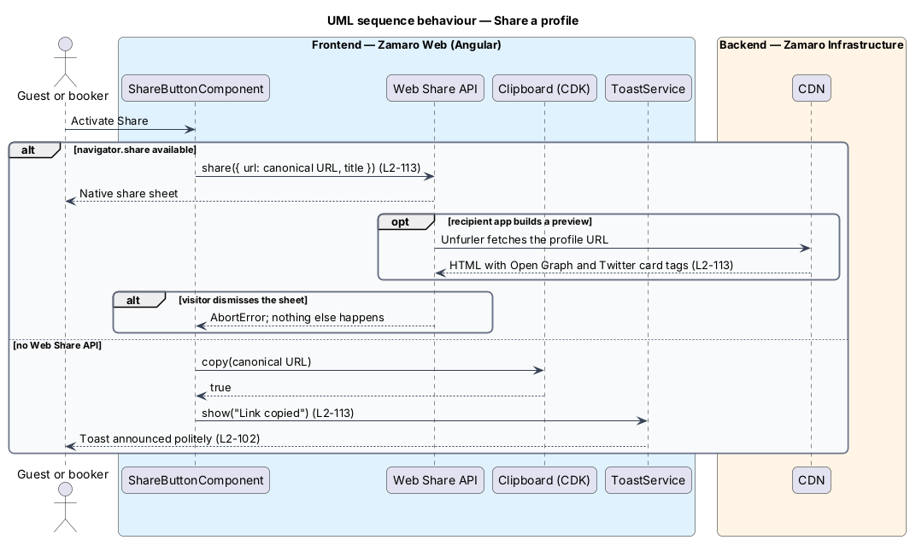
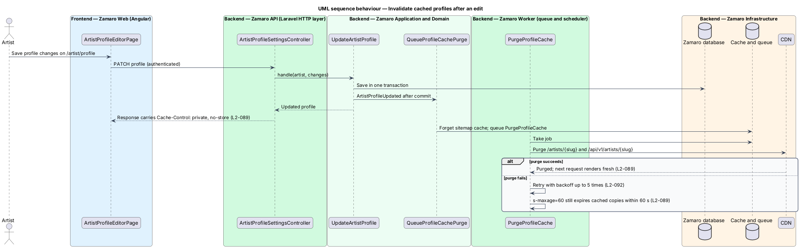

# Index and share a profile

## Overview

Churches often find worship artists through a web search or through a link a friend
sends them. To be found, an artist profile needs content that search engines can read
without running JavaScript, a stable canonical address and structured data. To spread
well, it needs an attractive link preview and a Share action that works on any device.
To stay fast under that traffic, it needs HTTP caching that is still fresh within a
minute of an artist's edit.

This feature covers those three concerns for public pages: server rendering with
metadata, sharing, and caching. It decorates the profile page from
`artist-profiles/view-artist-profile` and leaves its content unchanged. It also covers
Discover (`discovery/search-available-artists`) and How booking works for server
rendering, and it covers the site-wide `/sitemap.xml` and `/robots.txt`.

Terms used in this design:

- **server rendering (SSR)** — generation of a page's full HTML on the Node.js server before it reaches the browser or crawler
- **canonical URL** — single preferred address of a page, `https://zamaro.ca/artists/{slug}` without query string
- **JSON-LD** — structured-data block in the page head, using schema.org vocabulary
- **link preview** — card that social and messaging apps build from a page's Open Graph and Twitter card tags
- **ETag** — opaque version tag of a response, compared through `If-None-Match` to answer 304 Not Modified
- **published profile** — profile of an artist with status `Approved` and a non-null `publishedAt`
- **personal data** — information about an identifiable user, such as a booker's name, email, church or bookings

The public profile response holds only public fields. Any per-viewer state, such as
whether the viewer saved the artist, comes from separate personal endpoints. The
public response is therefore identical for every viewer and is safe for a shared cache
(L2-089).

## Description

**Frontend (Zamaro Web)**

- **SSR server** — the Angular SSR Node.js server renders `/`, `/artists/:slug` and the
  How booking works page to complete HTML (L2-112). Data fetched during the render
  reaches the browser through `TransferState`. The SSR server also serves a static
  `robots.txt` that disallows `/admin`, `/artist`, `/bookings`, `/saved` and `/api`, and
  links to the sitemap.
- **`ProfileSeoService`** (`features/artist-profile`) — runs when the profile loads, on
  the server and in the browser. It sets the following tags:
  - the `Title` "{name} · Worship artist in {city} · Zamaro";
  - the `Meta` description, built from the headline and the opening of the bio, with
    a length of `<TO SUPPLY>`;
  - `<link rel="canonical">`;
  - Open Graph `og:title`, `og:description`, `og:image` (the primary photo's 1200 px
    rendition), `og:url` and `og:type`;
  - Twitter card `twitter:card="summary_large_image"` with title, description and
    image (L2-113).
- **`ProfileJsonLdBuilder`** — builds the JSON-LD object. An act type of duo, band or
  choir maps to `MusicGroup` and a solo act maps to `Person`. Both carry name, url,
  image, description and address locality. The object includes `aggregateRating` only
  when the review count is above 0 (L2-112). The page writes it into a
  `<script type="application/ld+json">` element. `JSON.stringify` output is escaped
  for `<`, so artist text cannot close the script element (L2-075).
- **`ShareButtonComponent`** — the header Share action. When `navigator.share` exists,
  it calls it with the canonical URL and the page title (L2-113). A rejection with
  `AbortError` means the visitor dismissed the share sheet, and nothing follows.
  Otherwise it copies the canonical URL with the CDK `Clipboard` and shows the toast
  "Link copied" through `ToastService`.

**Backend (Zamaro API)**

- **Profile HTTP caching** — the routes `GET /api/v1/artists/{slug}`, `/tour-dates` and
  `/availability` use Laravel's `cache.headers` middleware with `etag`. It adds an
  `ETag` computed from the response body and answers a matching `If-None-Match` with
  304 (L2-089). The profile response carries `Cache-Control: public, max-age=0,
  s-maxage=60`. Browsers therefore revalidate every time, and the CDN keeps a copy for
  at most 60 seconds. The tour-dates and availability responses carry `Cache-Control:
  public, no-cache` and revalidate through the ETag.
- **Server-rendered page caching** — the SSR server sends `Cache-Control: public,
  max-age=0, s-maxage=60` and an `ETag` on profile HTML. The CDN applies the same
  60-second bound.
- **`PurgeProfileCache`** — queued job dispatched by the listener for
  `ArtistProfileUpdated`. Profile edits, photo and video changes, setlist changes,
  slug changes, suspension and deletion each raise that event. The job purges the
  profile page and profile API paths from the CDN, so edits normally appear well inside
  the 60-second bound. If the purge fails, the `s-maxage` expiry still keeps the bound
  (L2-089, L2-092). The CDN purge interface, `CdnPurger`, has one adapter for the CDN
  vendor, which is `<TO SUPPLY>`.
- **`PrivateNoStore`** — middleware in the authenticated API group and on every
  response that holds personal data. It sets `Cache-Control: private, no-store`
  (L2-089). A response test asserts the header on each route tagged as personal in the
  OpenAPI document.
- **`SitemapController`** — serves `GET /api/v1/sitemap`. The SSR server proxies it at
  `/sitemap.xml` as XML. It lists `/`, the How booking works page and every published
  profile's canonical URL, with `lastmod` from the profile's last update. It excludes
  suspended, unpublished and deleted artists (L2-112). The response is cached in Redis
  and cleared by the same `ArtistProfileUpdated` listener.

**Data**

The sitemap reads `artists (slug, status, published_at, updated_at)`. No table is added.

## Requirements

The feature realises the following level-2 (L2) requirements. Each refines the
level-1 (L1) requirement shown, and the text is quoted from `docs/specs/L2.md`.

| L2 ID | Refines (L1) | Requirement |
|-------|--------------|-------------|
| `L2-112` | `L1-025` | **Search engine visibility.** Acceptance criteria: 1. Given a crawler requests an artist profile, Discover or How booking works, when the response arrives, then the full content is in the server-rendered HTML. 2. Given an artist profile, when it renders, then it has a unique title ("{name} · Worship artist in {city} · Zamaro"), a meta description from the headline and bio, a canonical URL, and JSON-LD of type `MusicGroup` or `Person` with `aggregateRating` when reviews exist. 3. Given `/sitemap.xml`, when it is requested, then it lists every published profile and excludes suspended, unpublished and deleted artists. 4. Given `/robots.txt`, when it is requested, then it disallows `/admin`, `/artist`, `/bookings`, `/saved` and `/api`. |
| `L2-113` | `L1-025` | **Sharing a profile.** Acceptance criteria: 1. Given a profile, when it is shared on social or messaging apps, then the preview shows the artist's name, headline and primary photo using Open Graph and Twitter card tags. 2. Given a device that supports the Web Share API, when Share is activated, then the native share sheet opens with the profile URL and title. 3. Given a device without the Web Share API, when Share is activated, then the URL is copied to the clipboard and a toast reads "Link copied". |
| `L2-089` | `L1-018` | **Caching.** Acceptance criteria: 1. Given a public profile response, when it is returned, then it carries an `ETag` and a conditional request with a matching `If-None-Match` returns 304. 2. Given a profile is edited, when the change is saved, then cached copies are invalidated within 60 seconds. 3. Given any response containing personal data, when it is returned, then it carries `Cache-Control: private, no-store`. |

## Diagrams

### System context

Crawlers and link unfurlers read server-rendered profiles from Zamaro, and visitors
share profile links. The CDN caches public pages and is purged when a profile changes.

### Containers

Zamaro Web renders pages and metadata on the server from the Zamaro API. The Zamaro
Worker purges CDN copies after each profile change.

### Components

`ProfileSeoService` and `ProfileJsonLdBuilder` decorate the rendered profile, and
`ShareButtonComponent` handles sharing. On the backend, `cache.headers` adds ETags,
`PrivateNoStore` guards personal data, and `PurgeProfileCache` invalidates copies.

### Class structure

`ProfileMetadata` is the single input for title, description, canonical URL, Open
Graph tags and JSON-LD. The share fallback depends only on the clipboard and the toast
service.

### Behaviour — crawler renders a profile

A crawler receives complete HTML with title, description, canonical URL, link-preview
tags and JSON-LD. Conditional requests between the SSR server and the API return 304
when the profile is unchanged.

### Behaviour — share a profile

Share prefers the native share sheet and falls back to copying the link with a "Link
copied" toast.

### Behaviour — invalidate after an edit

A saved profile edit raises `ArtistProfileUpdated`, and a queued job purges the CDN.
The 60-second shared-cache lifetime bounds staleness even when the purge fails.

