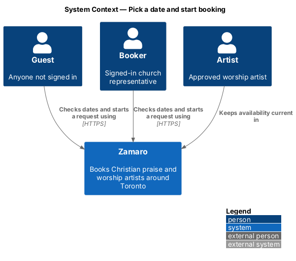
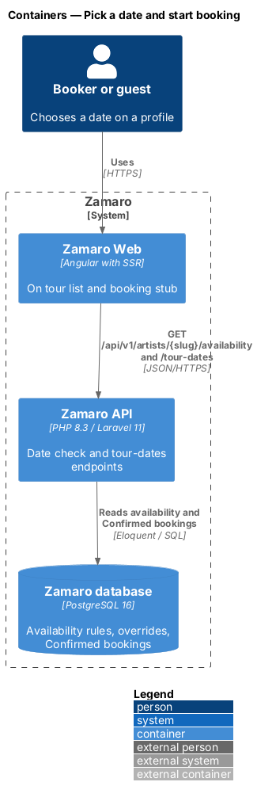
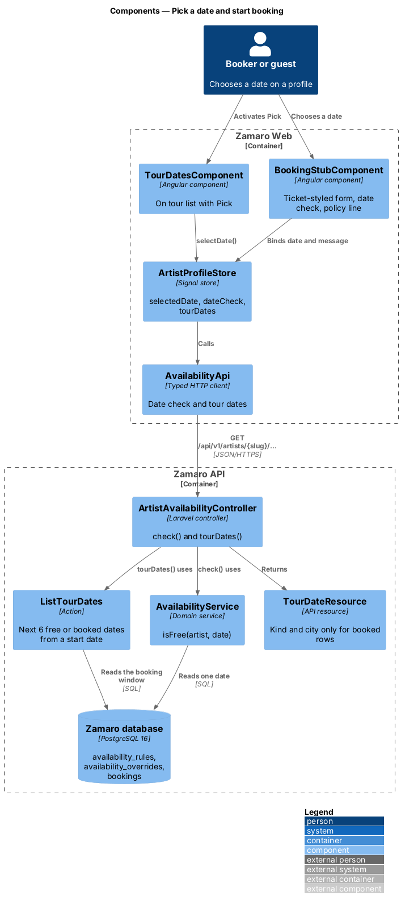
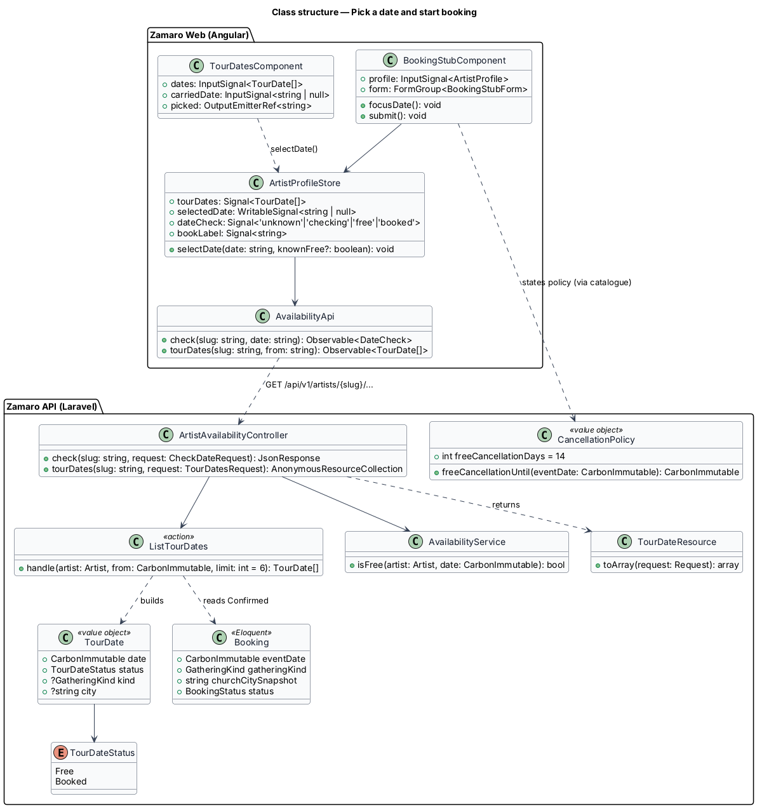
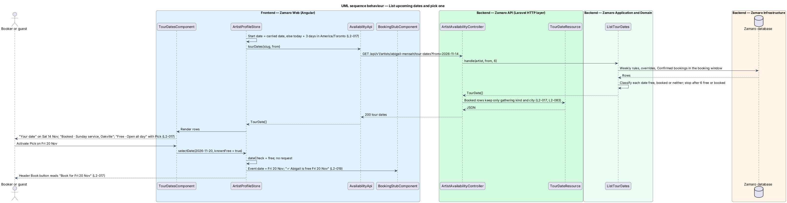
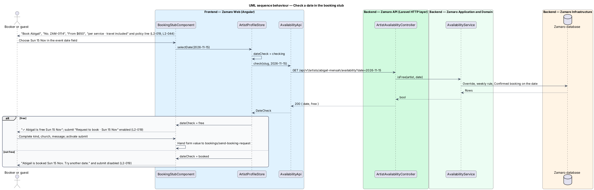

# Pick a date and start booking

## Overview

An artist profile ends in a call to action: book this artist for a date. Two regions
of the profile serve that call. The "On tour" list shows the artist's next free and
booked dates, so a church can see at a glance when the artist is open. The booking
stub is a ticket-styled form that checks the chosen date, states the price and the
cancellation terms, and collects the details of the request.

This feature covers both regions up to the moment the request is submitted.
Submission, sign-in for guests, and the resulting booking belong to
`bookings/send-booking-request`. The page around these regions, including the header
Book button and the carried date, belongs to `artist-profiles/view-artist-profile`.

Terms used in this design:

- **booking stub** — ticket-styled request form on each profile, with price, date check and request fields
- **On tour list** — profile section headed "Upcoming dates" that lists the artist's next 6 free or booked dates
- **free** — state of an artist who is approved, not suspended, has not marked the date unavailable and has no Confirmed booking on that date
- **booked date** — date on which the artist has a Confirmed booking
- **date check** — query that tells whether the artist is free on one date
- **start date** — first date the On tour list considers: the carried search date, or 3 days from today in `America/Toronto` when none is set
- **Pick** — action on a free row of the On tour list that moves its date into the booking stub
- **free-cancellation date** — last date on which a booker can cancel a Confirmed booking without losing the deposit, 14 days before the event

A date that is neither free nor booked, such as a date the artist marked unavailable,
does not appear in the On tour list. A booked row names only the kind of gathering
and the church's city, never the church's name or address (L2-017, L2-083). Pending
Requested or Accepted bookings leave a date free.

## Description

The slice adds two read endpoints to the Zamaro API and two components to the
profile page in Zamaro Web. It also introduces the cancellation-policy value object
that the stub, the payment form, the confirmation email and the booker's booking page
share.

**Frontend (Zamaro Web, `features/artist-profile`)**

- **`TourDatesComponent`** — renders the design-system tour-dates list under "On tour"
  and "Upcoming dates". Each row shows the short date and either "Free · Open all day"
  with a Pick button, or "Booked" with "{gathering kind}, {city}". The row for the
  carried date is labelled "Your date" (L2-017). Pick calls
  `ArtistProfileStore.selectDate()`.
- **`BookingStubComponent`** — the design-system booking form in ticket style. It shows
  "Book {first name}", "No. {ticket number}", "From ${price}" and "per service · travel
  included". Its fields are event date, kind of gathering, church and an optional
  message (L2-019). It binds the event date to the store's `selectedDate` and the
  message to `messageDraft`. Under the date field, an inline message reads "✓ {first
  name} is free {date}" or "{first name} is booked {date}. Try another date.". The
  submit button, "Request to book · {short date}", is disabled while the date is not
  free. Beneath it, the stub reads "Nothing is charged until {first name} accepts.
  Cancel free up to 14 days before." The words "Cancel free up to 14 days before" link
  to the full cancellation policy. The policy URL is `<TO SUPPLY>`.
- **Stub placement** — from LG, the stub sits in the right-hand column with
  `position: sticky`, so it stays pinned while the profile scrolls. Below LG it follows
  the reviews section. The header Book button and "Check dates" both call
  `BookingStubComponent.focusDate()`, which scrolls the stub into view and focuses the
  date field (L2-019, L2-012).
- **`ArtistProfileStore`** (extended) — adds `tourDates`, `selectedDate`, and
  `dateCheck` (`unknown`, `checking`, `free`, `booked`). `selectDate()` sets the date.
  When the date comes from a free On tour row, the store marks it free with no request.
  Otherwise it calls the date check. The header Book label follows `selectedDate`, so
  Pick on Fri 20 Nov makes it read "Book for Fri 20 Nov" (L2-017).
- **`AvailabilityApi`** — typed client for the date check and the On tour list.
- On submit, the stub hands the form value to `bookings/send-booking-request`.

**Backend (Zamaro API)**

- **`ArtistAvailabilityController`** — two actions on public, unauthenticated routes,
  each resolving the slug through `ResolveArtistSlug`:
  - `check()` for `GET /api/v1/artists/{slug}/availability?date=YYYY-MM-DD`, returning
    `{ date, free }` from `AvailabilityService::isFree()`.
  - `tourDates()` for `GET /api/v1/artists/{slug}/tour-dates?from=YYYY-MM-DD`, returning
    up to 6 `TourDate` rows.
- **`ListTourDates`** — action that walks forward from the start date to the end of the
  18-month booking window. It classifies each date as free, booked or neither, and
  stops after 6 free or booked dates. It reads weekly rules, overrides and Confirmed
  bookings for the window in one query per table rather than one query per date.
- **`TourDateResource`** — serialises the date, the status and, for a booked date, the
  `GatheringKind` label and the church city taken from the booking's address snapshot.
  It never includes the church name, address or booker (L2-017, L2-083).
- **`CancellationPolicy`** — value object holding the 14-day free-cancellation window.
  `freeCancellationUntil(eventDate)` returns the event date minus 14 days in
  `America/Toronto`. The booker's booking page at `/bookings/:number` shows that date
  on a Confirmed booking as "Free cancellation until {short date}" (L2-044).
  `bookings/view-booker-bookings` renders it there.
- The catalogue key `cancellation.policy.short` holds "Cancel free up to 14 days before
  your event." The payment form and the confirmation email reuse it with the same policy
  link (L2-044). How this sentence relates to the stub's L2-019 wording is noted under
  Requirements.

**Data**

Both endpoints read `availability_rules`, `availability_overrides` and `bookings`
(status `Confirmed` only, with `gathering_kind` and the address-snapshot city).
Responses contain no personal data.

## Requirements

The feature realises the following level-2 (L2) requirements. Each refines the
level-1 (L1) requirement shown, and the text is quoted from `docs/specs/L2.md`.

| L2 ID | Refines (L1) | Requirement |
|-------|--------------|-------------|
| `L2-017` | `L1-003` | **Upcoming dates.** The "On tour" section lists the artist's next 6 dates that are either free or booked, starting from the search date if one is set, otherwise from 3 days from today. Acceptance criteria: 1. Given a Confirmed booking on Sun 15 Nov for a Sunday service in Oakville, when the list renders, then that row shows "Booked" with "Sunday service, Oakville" and never the church's name or address. 2. Given a free date, when the list renders, then that row shows "Free · Open all day" and a "Pick" action. 3. Given a visitor activates "Pick" on Fri 20 Nov, when it completes, then the booking stub date changes to Fri 20 Nov and the Book button reads "Book for Fri 20 Nov". 4. Given a search date is set, when the list renders, then that date's row is labelled "Your date". |
| `L2-019` | `L1-003` | **Booking stub.** The booking stub is the ticket-styled request form on each profile. Acceptance criteria: 1. Given a profile, when the stub renders, then it shows "Book {first name}", the artist's ticket number (for example "No. ZAM-0114"), "From ${price}", "per service · travel included", and fields for event date, kind of gathering, church and message (optional). 2. Given a date on which the artist is free, when it is chosen, then the stub shows "✓ {first name} is free {date}". 3. Given a date on which the artist is not free, when it is chosen, then the stub shows "{first name} is booked {date}. Try another date." and the submit button is disabled. 4. Given a viewport at LG or wider, when the profile scrolls, then the stub stays pinned in the right-hand column. 5. Given a viewport narrower than LG, when the profile renders, then the stub follows the reviews section and the header Book button scrolls to it and focuses its date field. 6. Given the stub, when it renders, then beneath the submit button it reads "Nothing is charged until {first name} accepts. Cancel free up to 14 days before." |
| `L2-044` | `L1-008` | **Cancellation policy visibility.** Acceptance criteria: 1. Given the booking stub, the payment form and the confirmation email, when they render, then each states "Cancel free up to 14 days before your event." with a link to the full policy. 2. Given the booker's booking page, when the booking is Confirmed, then it shows the last date for a free cancellation (for example "Free cancellation until Sat 31 Oct"). |

L2-019 criterion 6 and L2-044 criterion 1 word the stub's cancellation line
differently. The design renders the L2-019 sentence with the policy link. Whether the
stub should also carry the exact L2-044 sentence is `<TO SUPPLY>`.

## Diagrams

### System context

Guests and bookers check dates and start a request on a profile in Zamaro. No
external system takes part in this slice.

### Containers

Zamaro Web calls the date-check and tour-dates endpoints in the Zamaro API, which
reads availability and Confirmed bookings from the database.

### Components

`TourDatesComponent` and `BookingStubComponent` share `ArtistProfileStore`. On the
backend, `ArtistAvailabilityController` uses `AvailabilityService` for one date and
`ListTourDates` for the list.

### Class structure

`TourDate` carries a status and, only when booked, a gathering kind and city.
`CancellationPolicy` computes the free-cancellation date that the bookings slice
displays.

### Behaviour — list upcoming dates and pick one

The On tour list loads from the start date. Pick on a free row moves that date into
the stub and the header Book button without another request.

### Behaviour — check a date in the stub

A date typed or chosen in the stub triggers a date check. A free date enables
submission, and a booked date disables it and suggests another date.

