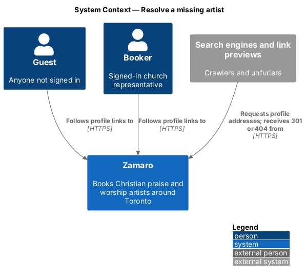
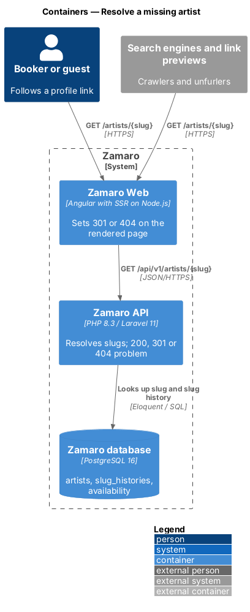
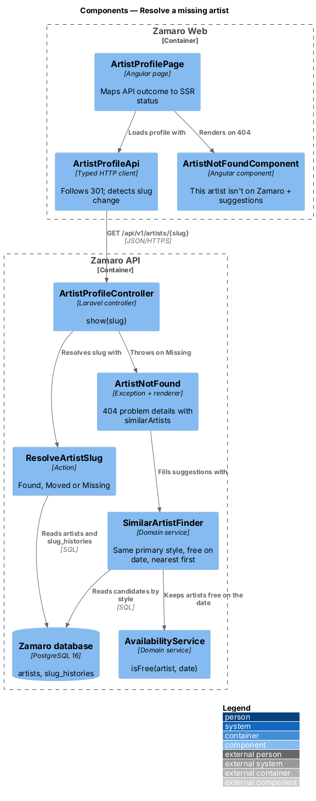
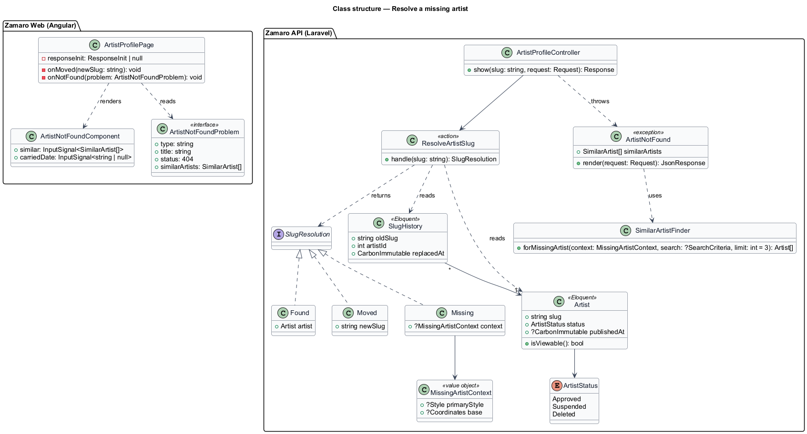
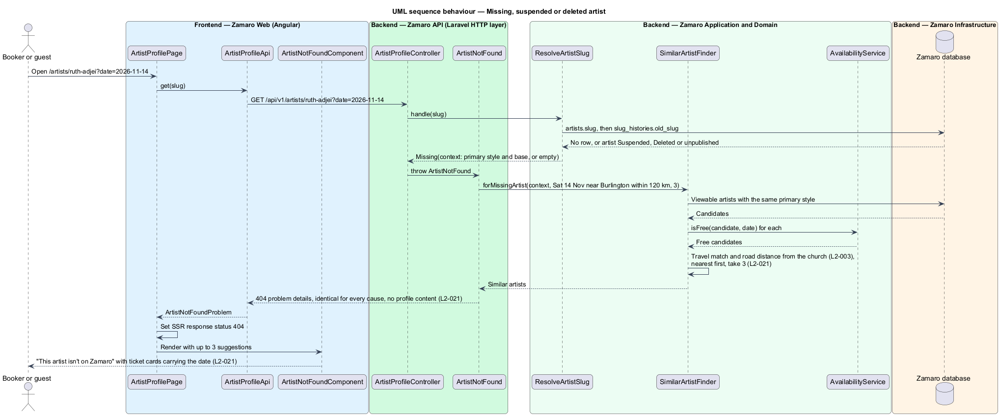
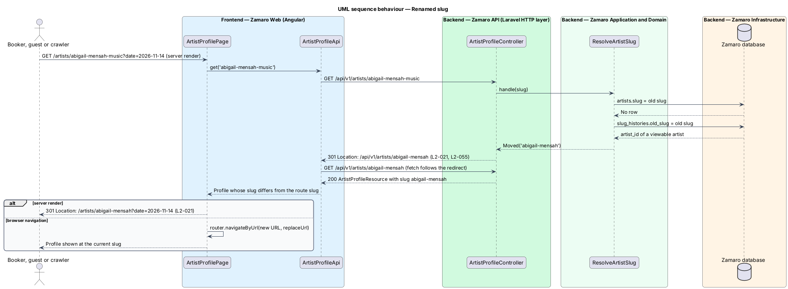

# Resolve a missing artist

## Overview

Profile links outlive the profiles they point to. A church may follow a link to an
artist who has left Zamaro or been suspended, or who has renamed their profile
address. A link may also hold a mistyped slug. In each case the page shall answer
truthfully without leaking anything about a hidden profile, and shall offer the church
a way to continue.

This feature decides what `/artists/{slug}` returns when the slug does not lead to a
viewable profile. It has two outcomes. The first is a 404 page that reads "This artist
isn't on Zamaro" and suggests up to 3 similar artists free on the carried date. The
second is a 301 redirect from a renamed slug to the current one. The normal profile
page belongs to `artist-profiles/view-artist-profile`. The rules for choosing and
changing a slug belong to `artist-workspace/change-profile-address` (L2-055).

Terms used in this design:

- **slug** — lowercase, hyphenated name segment that identifies an artist in the profile URL
- **viewable artist** — artist with status `Approved` and a published profile
- **hidden artist** — artist with status `Suspended` or `Deleted`, or whose profile is not published
- **slug history** — record of every slug an artist used before the current one, never reassigned to another artist
- **carried date** — search date passed to the profile in the `date` query parameter
- **carried search** — the Discover search the visitor came from: date, church location and radius, as kept in the Discover URL (`discovery/sort-and-filter-results`)
- **similar artist** — viewable artist who shares the missing artist's primary style, is free on the carried date and is within travel range of the carried search location

A hidden artist and a slug that never existed produce the same 404 status and the
same page, so a visitor cannot tell them apart (L2-021). A renamed slug redirects only
when the artist it leads to is viewable. Otherwise it also produces the 404.

## Description

Resolution happens once, in the Zamaro API. Zamaro Web then turns the API outcome
into the matching HTTP status for the server-rendered page.

**Backend (Zamaro API)**

- **`ResolveArtistSlug`** — action shared by every `/api/v1/artists/{slug}` route. It
  looks up `artists.slug`. If no row matches, it looks up `slug_histories.old_slug`
  and follows it to the artist. The action returns one of three outcomes:
  - `Found(artist)` for a viewable artist on its current slug.
  - `Moved(newSlug)` for a viewable artist reached through slug history (L2-021,
    L2-055).
  - `Missing(context)` for anything else. The context holds the hidden artist's
    primary style and base coordinates when a row exists, and nothing else.
- **`ArtistProfileController@show`** — maps the outcomes to HTTP:
  - `Found` returns 200 with the profile.
  - `Moved` returns 301 with `Location: /api/v1/artists/{newSlug}` and the query string
    preserved.
  - `Missing` throws `ArtistNotFound`.
  The sub-resources for availability and tour dates apply the same mapping.
- **`ArtistNotFound`** — exception rendered as RFC 9457 problem details with status
  404, `type` `https://zamaro.ca/problems/artist-not-found` and the title "This artist
  isn't on Zamaro". It carries one extension member, `similarArtists`. The body is
  identical in shape for a mistyped, suspended or deleted slug. It never includes the
  hidden artist's name, slug, photos or any other profile content (L2-021).
- **`SimilarArtistFinder`** — shared domain service that is also used by the booking
  decline and cancellation slices. `forMissingArtist(context, search, 3)` takes the carried search (date, location and
  radius as a `SearchCriteria`) and selects
  viewable artists who:
  - share the context's primary style,
  - are free on the carried date according to `AvailabilityService::isFree()`,
  - pass the travel match (L2-003) from the carried search location within the
    carried radius, measured by `DistanceService`,
  - are ordered nearest first by that road distance, as on Discover.
  The style for a slug that never existed, and the reference point and date used
  when no search is carried, are `<TO SUPPLY>`.
- **`SimilarArtistResource`** — serialises each suggestion as a ticket-card summary:
  slug, display name, act type, styles, base city, distance from the search location,
  rating, review count and "From" price. The page heads the list with the carried search, for
  example "Sat 14 Nov · within 120 km of Burlington".

**Frontend (Zamaro Web, `features/artist-profile`)**

- **`ArtistProfileApi`** (extended) — runs on `HttpClient` with the fetch backend,
  which follows the 301 automatically. The returned profile's `slug` is the current
  one. When it differs from the slug in the route, the page treats the response as a
  move.
- **`ArtistProfilePage`** (extended) — on a move during server rendering, it sets
  status 301 and `Location: /artists/{newSlug}` with the original query string on the
  SSR response through the response-init token. In the browser it calls
  `router.navigateByUrl()` with `replaceUrl`. On a 404 problem it sets status 404 on the
  SSR response and renders `ArtistNotFoundComponent` in place of the profile. A crawler
  therefore receives a real 404 rather than a soft 200 (L2-112).
- **`ArtistNotFoundComponent`** — error-page pattern with "This artist isn't on
  Zamaro". It shows up to 3 `TicketCardComponent` suggestions, each linking to
  `/artists/{slug}` with the carried date kept, and a link back to Discover. With no
  suggestions, the list is omitted. The supporting sentence beneath the headline reads
  "They may have left or changed their address. Here are similar artists who are free
  on {short date}, nearest first."

**Mocks**

- [Not found · artist](../../../mocks/pages/not-found/artist.html) — "This artist isn't
  on Zamaro" with two solo vocalists free on Sat 14 Nov, nearest first, and "See the
  full lineup".
- [Not found · default](../../../mocks/pages/not-found/default.html) — the generic 404
  for any other unknown address.

**Data**

- `artists (slug unique, status, published_at, primary style, base_latitude, base_longitude)`
- `slug_histories (old_slug unique, artist_id, replaced_at)` — written by the slug-change
  action in `artist-workspace/change-profile-address` (L2-055). The unique index on `old_slug` stops a historic slug from being
  issued to another artist.

## Requirements

The feature realises the following level-2 (L2) requirement. It refines the level-1
(L1) requirement shown, and the text is quoted from `docs/specs/L2.md`.

| L2 ID | Refines (L1) | Requirement |
|-------|--------------|-------------|
| `L2-021` | `L1-003` | **Missing or removed artist.** Acceptance criteria: 1. Given a slug that does not exist, when it is requested, then the server responds 404 and the page shows "This artist isn't on Zamaro" with up to 3 similar artists (same primary style, nearest first) who are free on the carried-forward search date. 2. Given a suspended artist or an artist who deleted their account, when their slug is requested, then the response is the same 404 page and reveals no profile content. 3. Given a slug that was renamed (L2-055), when the old slug is requested, then the server responds 301 to the new slug. |

## Diagrams

### System context

Guests, bookers and crawlers request profile addresses from Zamaro and receive a
profile, a redirect or a 404 page.

### Containers

Zamaro Web relays the API outcome as the page's HTTP status. The Zamaro API resolves
the slug against the artist and slug-history tables in the database.

### Components

`ResolveArtistSlug` returns Found, Moved or Missing. The controller maps Missing to
`ArtistNotFound`, which `SimilarArtistFinder` fills with up to 3 suggestions.

### Class structure

`SlugResolution` is a closed set of three outcomes. `MissingArtistContext` carries only
the style and coordinates needed for suggestions, never profile content.

### Behaviour — missing, suspended or deleted artist

Every slug that does not reach a viewable artist ends in the same 404 problem, with
similar artists free on the carried date. The server-rendered page carries the 404
status.

### Behaviour — renamed slug

An old slug found in slug history returns 301 to the current slug. The
server-rendered page repeats the 301 so browsers and crawlers update the address.

