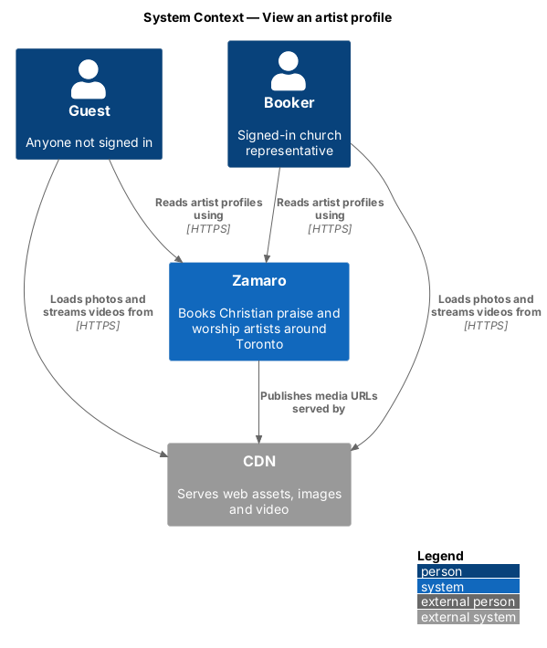
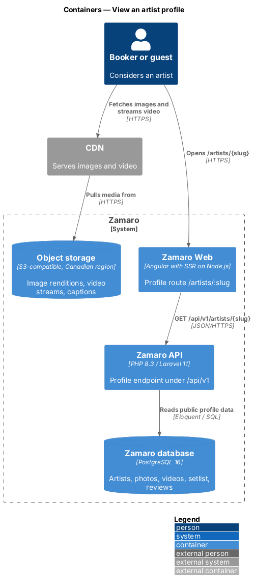
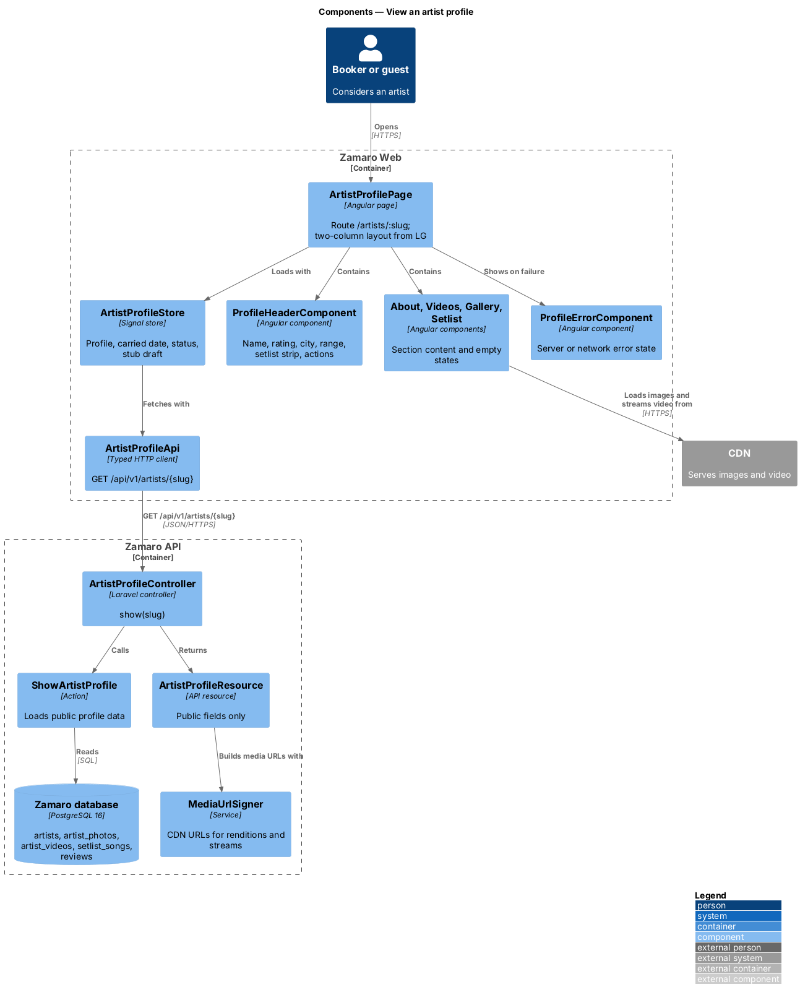
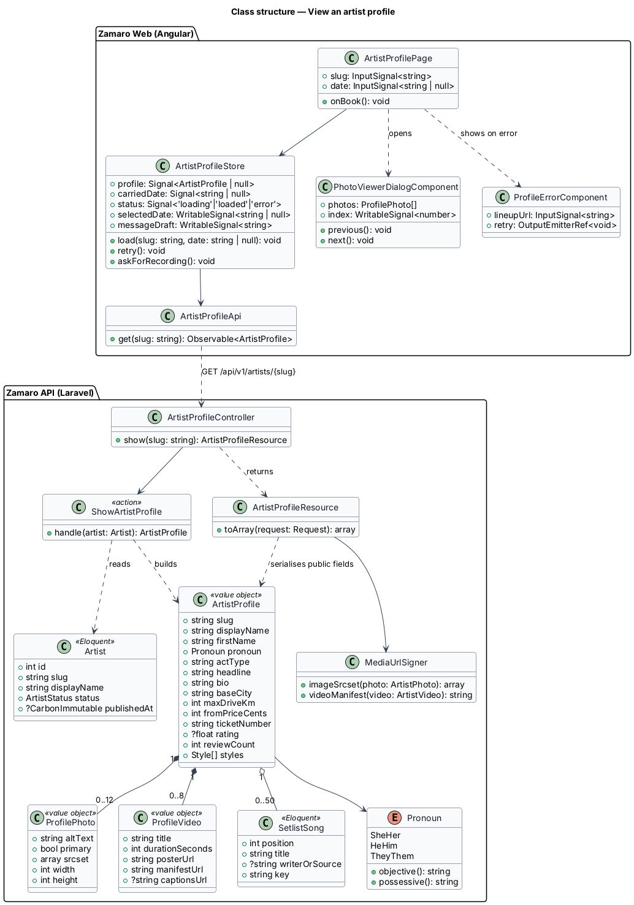
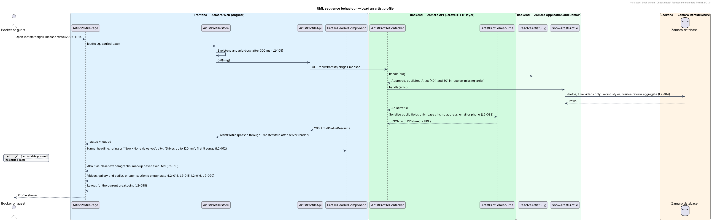
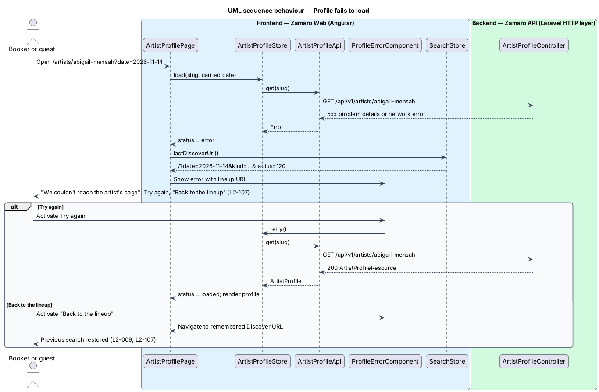
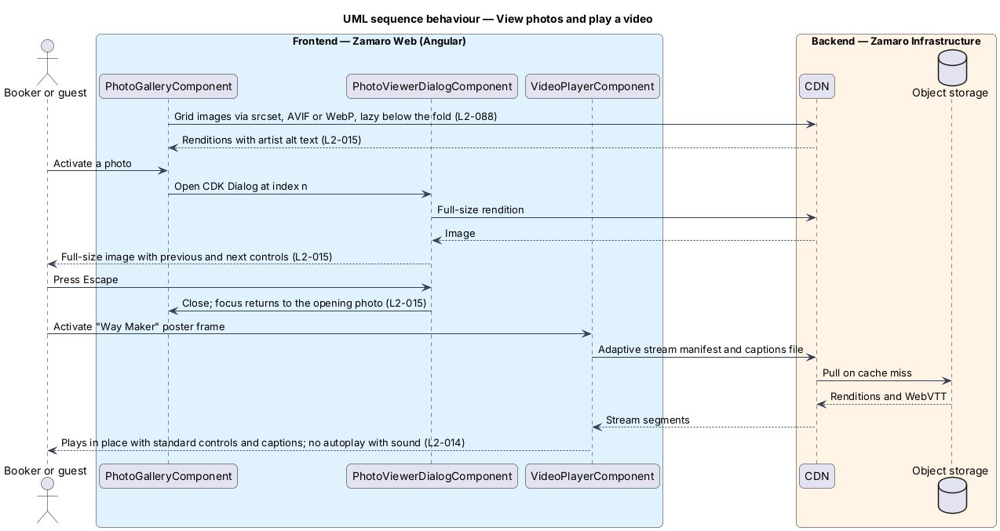

# View an artist profile

## Overview

Each approved artist on Zamaro has a public profile page at `/artists/{slug}`. The
page shows a church who the artist is before it asks for a booking. It carries a
header with name, headline, rating, base city and driving range. It continues with
an About section, the artist's videos and photos, the songs the artist leads, upcoming
dates, church reviews and a booking stub. Guests can view every profile without
signing in.

This feature is the page itself: its route, its data, its content sections, its
layout at each breakpoint, its empty and error states, and the rule that it exposes
only public data. Neighbouring slices fill specific regions of the page:

- `artist-profiles/pick-a-date-and-start-booking` — the "On tour" list and the booking stub
- `reviews/show-reviews-and-rating` — the "What churches say" reviews section
- `artist-profiles/resolve-missing-artist` — the 404 page and the 301 for renamed slugs
- `artist-profiles/index-and-share-profile` — server-rendered metadata, the Share action and HTTP caching
- `bookings/send-booking-request` — submission of the request from the stub

Terms used in this design:

- **slug** — lowercase, hyphenated name segment that identifies an artist in the profile URL, such as `abigail-mensah`
- **carried date** — search date passed from Discover to the profile in the `date` query parameter
- **setlist strip** — row in the profile header that lists the first 5 setlist songs
- **booking stub** — ticket-styled request form on the profile
- **first name** — short name used in profile copy such as "Songs Abigail leads"
- **pronoun** — artist-chosen pronoun set (she/her, he/him or they/them) used in profile copy such as "Watch her lead" (L2-050)
- **act-type illustration** — design-system artwork that stands in for photos when an artist has none
- **public field** — artist attribute approved for display to anyone; every other attribute stays server-side

Every section keeps its place when empty, so a new profile has the same shape as a
full one (L2-020). The page never shows a street address, email or phone; it names
the base city only (L2-083).

## Description

The slice runs from the profile route in Zamaro Web, rendered on the server for the
first request, to the profile endpoint in the Zamaro API and the media served
through the CDN.

**Frontend (Zamaro Web, `features/artist-profile`)**

- **`ArtistProfilePage`** — routed page component for `/artists/:slug`. It reads the
  slug and the optional carried date, asks `ArtistProfileStore` to load, and lays out
  the sections. The layout follows L2-098. At XS and SM, sections stack in one column
  and the stub follows the reviews. At MD, the setlist uses 2 columns and the videos
  show one large plus a 3-column grid. At LG and XL, the content and the pinned stub
  sit in two columns. While loading for more than 300 ms it shows skeletons with
  `aria-busy="true"` (L2-105).
- **`ArtistProfileStore`** — signal-based store holding the `ArtistProfile`, the carried
  date, a status (`loading`, `loaded`, `error`), and the stub's selected date and
  message draft, which the booking-stub slice shares. Its `askForRecording()` method
  pre-fills the message "Could you send a recording of a recent set?" and moves to the
  stub (L2-020).
- **`ArtistProfileApi`** — typed client for `GET /api/v1/artists/{slug}`. On the server
  render, Angular `TransferState` carries the response to the browser so the client
  does not fetch it again.
- **`ProfileHeaderComponent`** — renders name, headline, the `RatingComponent` with
  rating and review count or "New · No reviews yet" plus a "New" badge, the base city,
  "Drives up to {km} km", the setlist strip, and the Book, Save and Share actions
  (L2-012). With a carried date, the back link reads "Discover · {short date}" and
  returns to the last Discover URL that `SearchStore` remembers. The Book button then
  reads "Book for {short date}". Without one, it reads "Check dates" and moves focus to
  the stub's date field. The Save toggle comes from `accounts/save-artist`, and
  the Share action comes from `artist-profiles/index-and-share-profile`.
- **`AboutSectionComponent`** — renders the heading line and the bio. The bio is split
  on blank lines into paragraphs and bound through text interpolation, never
  `innerHTML`, so markup appears as literal text (L2-013, L2-075).
- **`VideosSectionComponent`** and **`VideoPlayerComponent`** — "Watch {pronoun} lead"
  with the first video large and the rest in a grid. Each tile shows its poster frame,
  title and duration. Activating a tile plays an adaptive stream in place with native
  controls, a `<track kind="captions">` when a WebVTT file exists, and no autoplay
  (L2-014). Safari plays the stream natively. The player library for other browsers
  is `<TO SUPPLY>`. With no videos, the section shows "No videos yet" and "Ask {first
  name} for a recording".
- **`PhotoGalleryComponent`** and **`PhotoViewerDialogComponent`** — a grid of 2 columns
  below MD and 4 from MD. Each image uses `srcset` with AVIF and WebP widths of 400,
  800, 1200 and 1600 px, explicit dimensions and the artist's alt text (L2-015,
  L2-088). Activating a photo opens a CDK `Dialog` with the full-size image and
  previous and next controls. Escape closes it, and focus returns to the photo that
  opened it. With no photos, the act-type illustration appears instead.
- **`SetlistSectionComponent`** — "Songs {first name} leads", a numbered list of title,
  writer or source, and key such as "Key of B♭", followed by "Ask for any of these,
  or send your own list." (L2-016).
- **`ProfileErrorComponent`** — the error-page pattern with "We couldn't reach the
  artist's page", the reassurance sentence, Try again and a "Back to the lineup" link to
  the remembered Discover URL (L2-107).

**Backend (Zamaro API)**

- **`ArtistProfileController@show`** — handles `GET /api/v1/artists/{slug}` for guests
  and bookers alike. Slug resolution, including 404 and 301, is delegated to
  `ResolveArtistSlug` from `artist-profiles/resolve-missing-artist`.
- **`ShowArtistProfile`** — action that loads the artist with photos in display order,
  videos with status `Live` only (L2-014), setlist songs in order, styles, and the
  rating aggregate over visible reviews. It does not read bookings, churches or user
  records.
- **`ArtistProfileResource`** — API resource that lists public fields explicitly: slug,
  display name, first name, pronoun, act type, headline, bio, base city, maximum driving
  distance, "From" price, ticket number, rating, review count, styles, photos, videos
  and setlist. It omits base coordinates, the account email, phone, HST number and
  payout data (L2-083). A contract test in CI fails when the serialised profile gains a
  field outside this list.
- **`Pronoun`** — enum with `SheHer`, `HeHim` and `TheyThem`, offering `objective()`
  ("her") and `possessive()` ("her", "his", "their") for profile copy.
- **`MediaUrlSigner`** — builds CDN URLs for image renditions, video manifests,
  poster frames and caption files on the separate media domain (L2-088).

The rule that derives the first name for a solo act is the first word of the display
name. The rule for duos, bands and choirs is `<TO SUPPLY>`.

**Data**

The action reads `artists`, `artist_styles`, `artist_photos`, `artist_videos`,
`setlist_songs` and an aggregate of visible `reviews`. Media files live in object
storage and reach the browser only through the CDN.

## Requirements

The feature realises the following level-2 (L2) requirements. Each refines the
level-1 (L1) requirement shown, and the text is quoted from `docs/specs/L2.md`.

| L2 ID | Refines (L1) | Requirement |
|-------|--------------|-------------|
| `L2-012` | `L1-003` | **Public profile route and header.** Each approved artist has a public profile at `/artists/{slug}`, viewable by guests. Acceptance criteria: 1. Given an approved artist, when a guest opens the profile, then it shows the artist's name, act headline, rating and review count (or "New · No reviews yet"), base city, maximum driving distance ("Drives up to 120 km"), the first 5 setlist songs as a strip, and Book, Save and Share actions. 2. Given the profile was opened from search results for Sat 14 Nov, when it renders, then the back link reads "Discover · Sat 14 Nov" and returns to those results, and the Book button reads "Book for Sat 14 Nov". 3. Given the profile was opened without a search date, when it renders, then the Book button reads "Check dates" and moves focus to the booking stub's date field. |
| `L2-013` | `L1-003` | **About section.** Acceptance criteria: 1. Given an artist with a bio, when the profile renders, then the About section shows the artist's heading line and bio as plain text with paragraph breaks preserved. 2. Given a bio containing HTML or script markup, when it renders, then the markup is shown as literal text and never executed. |
| `L2-014` | `L1-003` | **Videos section.** Acceptance criteria: 1. Given an artist with videos, when the profile renders, then the "Watch {pronoun} lead" section (using the pronoun from L2-050, for example "Watch her lead") shows the first video large and the rest in a grid, each with a poster frame, title and duration. 2. Given a visitor activates a video, when it plays, then it streams in place with standard controls, captions when the artist supplied them, and no autoplay with sound. 3. Given a video is still processing, when the profile renders, then that video is not shown publicly. |
| `L2-015` | `L1-003` | **Photo gallery.** Acceptance criteria: 1. Given an artist with photos, when the profile renders, then photos show in a grid (2 columns below MD, 4 columns from MD) with the artist-supplied alt text. 2. Given a visitor activates a photo, when the viewer opens, then it shows the full-size image in a dialog with previous and next controls, Escape closes it and focus returns to the photo that opened it. |
| `L2-016` | `L1-003` | **Setlist.** Acceptance criteria: 1. Given an artist with songs, when the profile renders, then "Songs {first name} leads" lists each song numbered with title, writer or source, and key (for example "Key of B♭"). 2. Given the setlist, when it renders, then it reads "Ask for any of these, or send your own list." |
| `L2-020` | `L1-003` | **Profile sections with no content.** Every profile section stays in place even when empty, so new profiles have the same shape as full ones. Acceptance criteria: 1. Given an artist with no videos, when the profile renders, then the videos section shows "No videos yet" with "Ask {first name} for a recording", which opens the booking stub with the message pre-filled "Could you send a recording of a recent set?". 2. Given an artist with no reviews, when the profile renders, then the reviews section shows "No church reviews yet" and "Be {pronoun} first booking" (for example "Be her first booking"), and the header shows a "New" badge. 3. Given an artist with no photos, when the profile renders, then the gallery shows the act-type illustration placeholder and no broken images. |
| `L2-083` | `L1-017` | **Minimal public exposure.** Acceptance criteria: 1. Given a public profile, when it renders, then it shows the artist's base city only, never a street address, email or phone. 2. Given a review, when it renders, then it shows only reviewer name, church name, city and month and year. 3. Given a guest, when they call any API, then no booker personal data is returned. |
| `L2-098` | `L1-020` | **Artist profile layout.** Acceptance criteria: 1. Given XS and SM, when the profile renders, then sections stack in one column, photos show 2 per row, reviews show 1 per row, and the booking stub follows the reviews. 2. Given MD, when the profile renders, then the setlist shows 2 columns, photos 4 per row, reviews 2 per row and videos one large plus a 3-column grid. 3. Given LG and XL, when the profile renders, then the content and the pinned booking stub sit in two columns (L2-019). |
| `L2-107` | `L1-023` | **Profile error.** Acceptance criteria: 1. Given a profile request fails with a server or network error, when the page renders, then it shows "We couldn't reach the artist's page" with "It's on our side, not yours. Your search is saved and any request you've sent is safe.", a Try again button and a "Back to the lineup" link that restores the previous search. |

## Diagrams

### System context

Guests and bookers read profiles from Zamaro. Photos, posters and video streams
reach them through the CDN.

### Containers

Zamaro Web renders the profile on the server and in the browser, both from the same
profile endpoint in the Zamaro API. Media comes from object storage through the CDN.

### Components

`ArtistProfilePage` composes one component per section from `ArtistProfileStore`.
On the backend, `ShowArtistProfile` assembles the profile and `ArtistProfileResource`
limits it to public fields.

### Class structure

`ArtistProfile` is the public projection of `Artist`. It holds ordered photos, live
videos and setlist songs, and the page derives every piece of section copy from it.

### Behaviour — load a profile

The first request renders on the server and hands the profile to the browser through
`TransferState`. Header copy depends on the carried date, and each section renders
its empty state when its list is empty.

### Behaviour — profile fails to load

A server or network error replaces the page body with the profile error. Try again
repeats the request, and "Back to the lineup" restores the previous search.

### Behaviour — view photos and play a video

The photo viewer is a dialog that returns focus to its trigger. A video streams from
the CDN in place, with captions when supplied and without autoplay.

