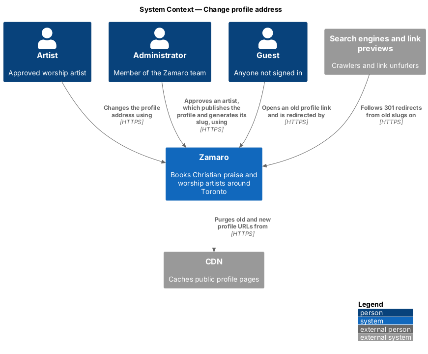
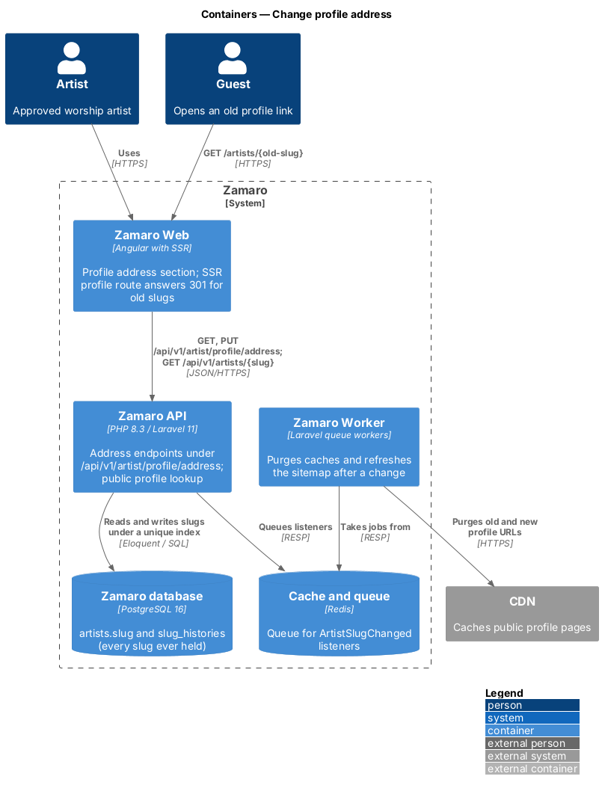
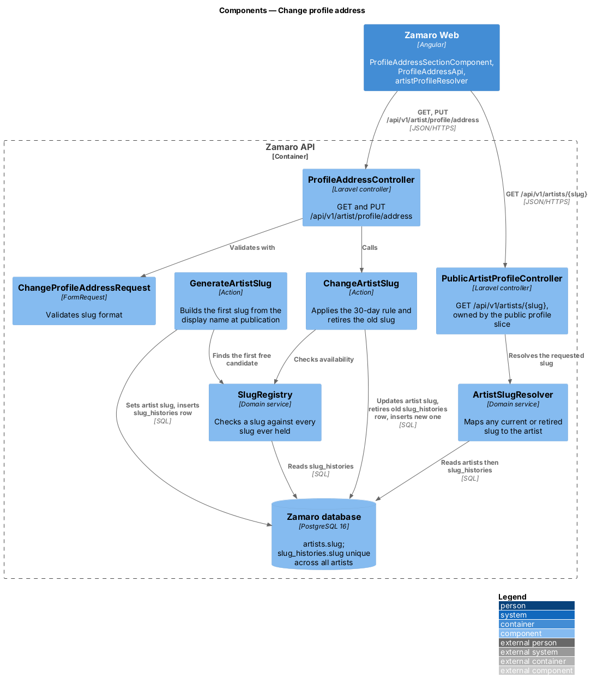
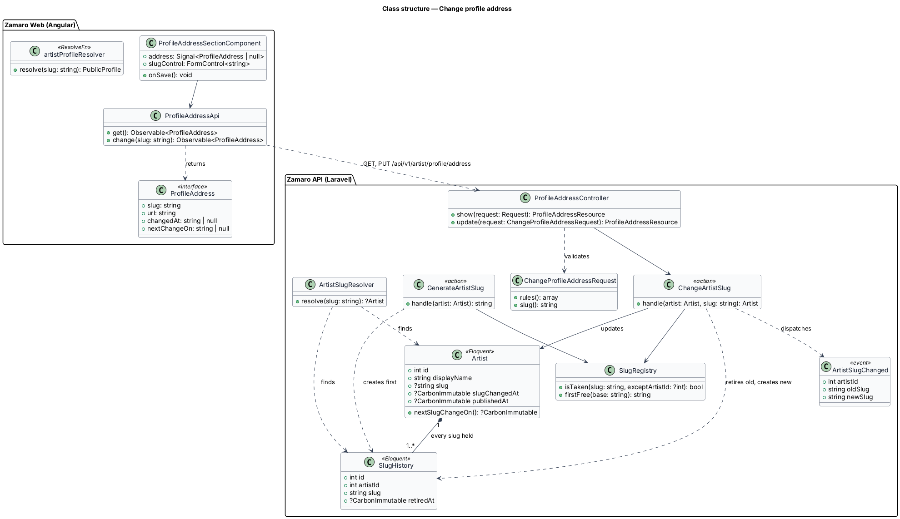
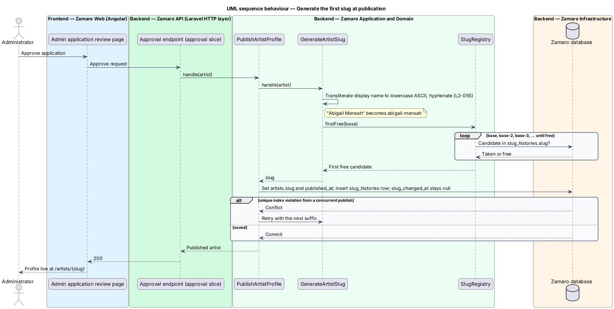
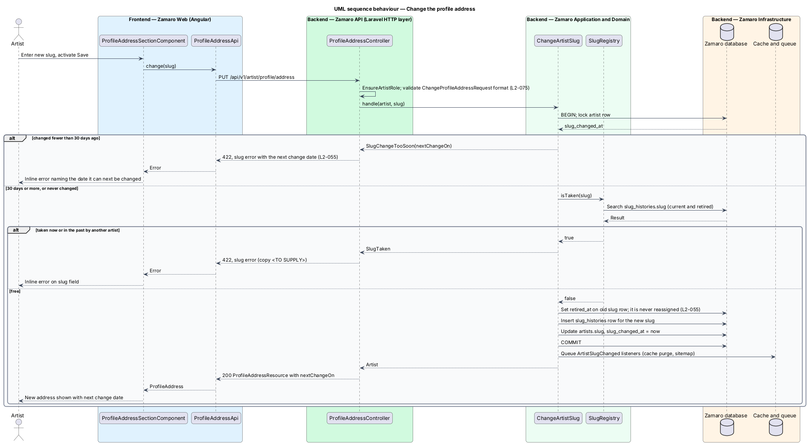
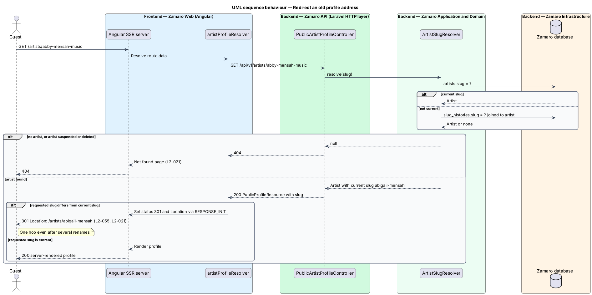

# Change profile address

## Overview

Every approved artist on Zamaro has a public profile at `/artists/{slug}`. That URL
is the profile address. Artists put it on posters, church bulletins and social
posts, and search engines index it, so it outlives any single edit. Zamaro gives
each artist a readable address when the profile is first published, and lets the
artist change it from the artist workspace, the `/artist/*` area of Zamaro Web for
signed-in approved artists.

This feature covers three moments in the life of an address: generating the first
slug when an approved artist's profile is published, changing it from the profile
editor at most once every 30 days, and redirecting every old address to the current
one for good. The profile editor itself belongs to
`artist-workspace/edit-profile-details`. The public profile page and its "not found"
behaviour (L2-021) belong to the artist profile subsystem. Administrator approval,
which triggers publication, belongs to the onboarding subsystem.

Terms used in this design:

- **slug** — lowercase ASCII segment of letters, digits and hyphens that identifies one artist in `/artists/{slug}`
- **profile address** — full public URL `/artists/{slug}` of an artist's profile
- **current slug** — slug an artist's profile is served under today
- **retired slug** — slug an artist used before a change, kept forever and never given to another artist
- **slug history** — record of every slug an artist has held, current and retired
- **cooling-off period** — 30 days after a slug change during which a further change is rejected

Three rules govern the slice (L2-055). A new slug comes from the display name, with
"-2", "-3" and so on appended when the plain form is taken. A change inside the
cooling-off period is rejected with the date of the next allowed change. Every
retired slug answers with a 301 redirect to the current slug and stays reserved to
its artist.

## Description

The slice runs from the address section of the profile editor and the server-rendered
profile route in Zamaro Web to the address endpoints and the public profile lookup in
the Zamaro API, and the Zamaro database.

**Frontend (Zamaro Web)**

- **`ProfileAddressSectionComponent`** (`features/artist-workspace`) — section of
  `ArtistProfileEditorPage` at `/artist/profile` with its own Save action. It shows
  the full profile address, a text field for the slug with the fixed URL prefix
  beside it, and, inside the cooling-off period, a note with the next change date
  formatted by `FormatService` in en-CA (L2-110). It shows server errors inline on
  the slug field. The public URL prefix (domain) is `<TO SUPPLY>`.
- **`ProfileAddressApi`** — typed client for `GET /api/v1/artist/profile/address`
  and `PUT /api/v1/artist/profile/address`. Responses are `ProfileAddress` objects:
  `slug`, `url`, `changedAt` and `nextChangeOn`.
- **`artistProfileResolver`** (`features/artist-profile`) — route resolver for
  `/artists/:slug`, shared with the public profile slice. When the profile returned by
  the API carries a slug different from the requested one, it answers with a 301 and
  a `Location` header through the SSR response initialiser (`RESPONSE_INIT`) on the
  server. In the browser it replaces the URL through the router.

**Backend (Zamaro API)**

- **`ProfileAddressController`** — `show` and `update` for the signed-in artist,
  behind `EnsureArtistRole`, which answers 404 to anyone else (L2-074).
- **`ChangeProfileAddressRequest`** — FormRequest that lower-cases the input and
  checks it against `^[a-z0-9]+(-[a-z0-9]+)*$`. The minimum and maximum length and a
  list of reserved words (for example route names under `/artists`) are `<TO SUPPLY>`.
- **`ChangeArtistSlug`** — action that runs in one `DB::transaction` with the artist
  row locked. It rejects the change when `slug_changed_at` is fewer than 30 days ago,
  evaluated in `America/Toronto`, and returns the next allowed date (L2-055). It asks
  `SlugRegistry` whether the slug is free. It sets `retired_at` on the old slug's
  `slug_histories` row, inserts a row for the new slug, then updates `artists.slug`
  and `slug_changed_at`. After commit it dispatches `ArtistSlugChanged`.
- **`GenerateArtistSlug`** — action called by `PublishArtistProfile` when an approved
  artist's profile is first published. It transliterates the display name to ASCII
  (`Str::slug`), lower-cases it, joins words with hyphens and asks `SlugRegistry` for
  the first free candidate in the order base, base-2, base-3. It records the slug in
  both `artists.slug` and `slug_histories`. It leaves `slug_changed_at` empty, so the first change is not held by the cooling-off period.
  The fallback for a display name with no ASCII letters or digits is `<TO SUPPLY>`.
- **`SlugRegistry`** — domain service that treats a slug as taken when it appears in
  `slug_histories.slug`, which holds every current and retired slug. Whether an artist may take back one of
  their own retired slugs is `<TO SUPPLY>`; the rule against reassignment covers
  other artists (L2-055).
- **`ArtistSlugResolver`** — domain service used by `PublicArtistProfileController`
  (`GET /api/v1/artists/{slug}`, public profile slice). It looks the slug up in
  `artists.slug`, then in `slug_histories.slug`, and returns the owning artist. Every
  retired slug points to the artist rather than to the next slug, so a chain of
  renames still redirects in one hop. Suspended and deleted artists resolve to
  nothing, which yields the L2-021 not-found page.
- **`ArtistSlugChanged`** — domain event. Queued listeners purge the old and new
  profile URLs from the CDN within 60 seconds (L2-089) and refresh the sitemap and
  canonical URL (L2-112).
- **`ProfileAddressResource`** — API resource that serialises `ProfileAddress`.

**Data**

- `artists.slug` — `varchar`, unique, nullable until publication; a denormalised copy
  of the artist's current slug for fast lookup.
- `artists.slug_changed_at` — `timestamptz`, null until the first change.
- `slug_histories` — `id`, `artist_id`, `slug` (unique), `retired_at` (null for the
  current slug). Rows are never deleted while the slug rule applies, which keeps a
  retired slug out of reach of other artists. Retention after an artist deletes their account is `<TO SUPPLY>`.

The single unique index on `slug_histories.slug` enforces the never-reassigned rule
across all artists, so two artists racing for one slug cannot both succeed. The
losing write receives a unique violation, which `ChangeArtistSlug` reports as
"taken" and `GenerateArtistSlug` retries with the next suffix. Error copy for a taken or malformed slug is `<TO SUPPLY>`.

## Requirements

The feature realises the following level-2 (L2) requirement. It refines the level-1
(L1) requirement shown, and the text is quoted from `docs/specs/L2.md`.

| L2 ID | Refines (L1) | Requirement |
|-------|--------------|-------------|
| `L2-055` | `L1-011` | **Profile address (slug).** Acceptance criteria: 1. Given a newly approved artist, when their profile is published, then a slug is generated from the display name in lowercase ASCII with hyphens, with "-2", "-3" appended if taken. 2. Given an artist changes their slug, when it was last changed fewer than 30 days ago, then the change is rejected with the date it can next be changed. 3. Given a slug change, when it is saved, then the old slug redirects with 301 to the new one (L2-021) and is never reassigned to another artist. |

## Diagrams

### System context

An administrator's approval publishes the profile and generates its slug. The artist
changes the address later, and guests, crawlers and link previews that follow an old
link receive a permanent redirect.

### Containers

The profile editor and the server-rendered profile route in Zamaro Web call the
Zamaro API. The API keeps current and retired slugs in the database, and the Zamaro
Worker purges cached profile URLs after a change.

### Components

`ChangeArtistSlug` and `GenerateArtistSlug` share `SlugRegistry`, which checks every
slug ever held. `ArtistSlugResolver` serves the public profile lookup and
maps any slug an artist has held to that artist.

### Class structure

An `Artist` owns one `SlugHistory` row per slug it has held. The actions depend on `SlugRegistry`, and
the change action raises `ArtistSlugChanged` for cache purge and sitemap refresh.

### Behaviour — generate the first slug

Publication turns the display name into a base slug and takes the first free
candidate among base, base-2 and base-3 onward. A concurrent publish that wins the
same slug causes a retry with the next suffix.

### Behaviour — change the slug

The action locks the artist, applies the 30-day cooling-off period and checks the
slug history. A successful change retires the old slug in the same transaction.

### Behaviour — redirect an old address

The SSR profile route asks the API for the requested slug. When the profile comes back
under a different current slug, the server answers 301 to the current address.

