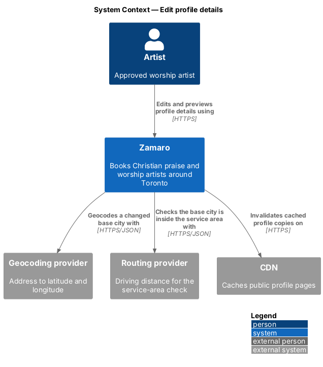
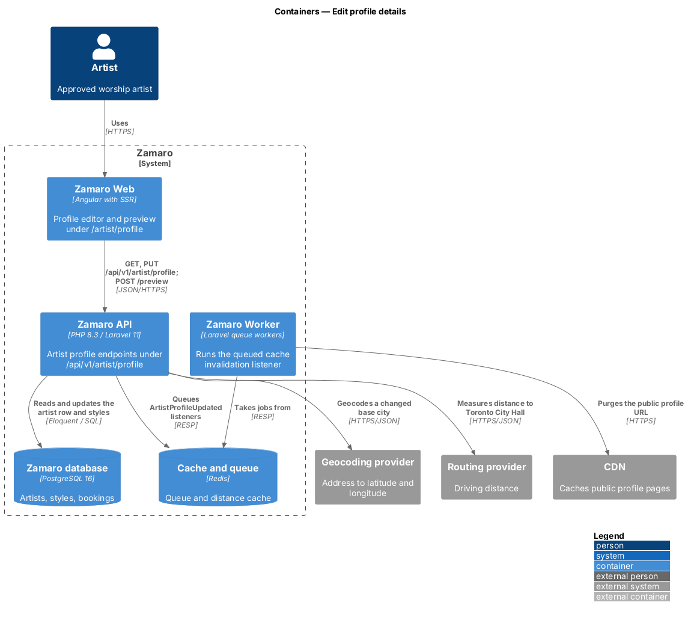
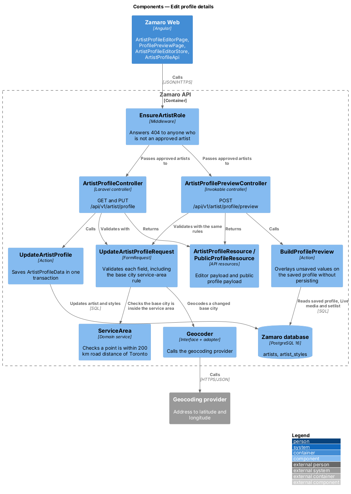
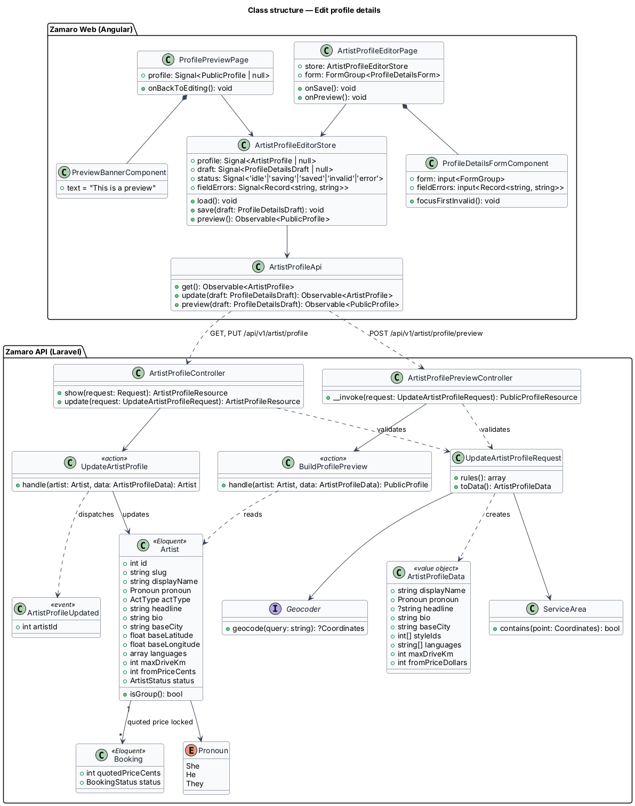
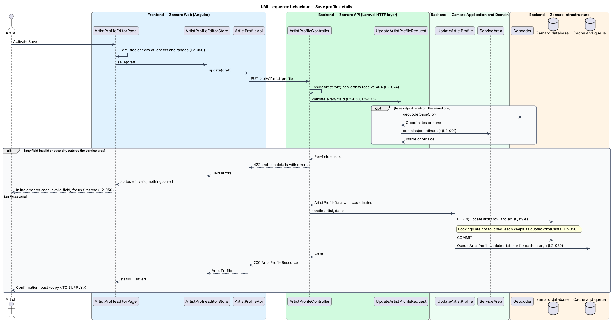
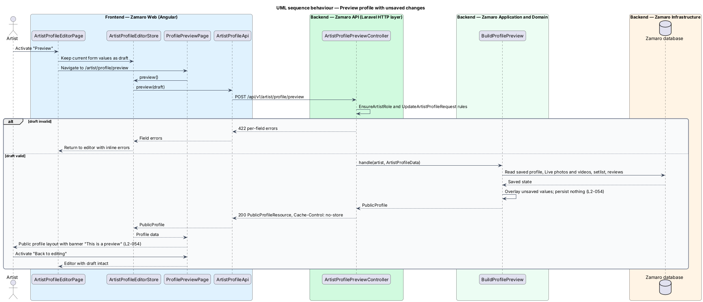

# Edit profile details

## Overview

Zamaro is a marketplace where churches in and around Toronto book Christian praise
and worship artists. Each approved artist has a public profile at `/artists/{slug}`,
and bookers decide whom to book from what that profile says. The artist workspace is
the `/artist/*` area of Zamaro Web where a signed-in approved artist maintains that
profile.

This feature is the profile editor at `/artist/profile`. An artist changes the
written details of their profile and the facts that drive search: name, pronoun,
headline, About heading, bio, base city, styles, languages, maximum driving distance
and "From" price. The same page offers "Preview", which shows the profile as the
public would see it before the artist saves.

The editor is one page with a section for each part of the profile: Photo & name,
Bio, Rate & travel, Languages, Songs, Videos, Photos, Profile address and Background
check. Sibling slices own the sections after Languages:
`artist-workspace/manage-setlist` (Songs), `artist-workspace/upload-videos`,
`artist-workspace/upload-photos`, `artist-workspace/change-profile-address` (the slug
in the profile URL) and `artist-onboarding/verify-vulnerable-sector-check`
(Background check). The public profile page that renders these details belongs to
the artist profile subsystem.

Terms used in this design:

- **artist** — approved worship artist, a solo performer, duo, band or choir acting as one account
- **artist workspace** — signed-in area of Zamaro Web under `/artist/*` reserved for approved artists
- **profile details** — written and numeric facts on a profile, excluding media, setlist and slug
- **group act** — artist whose act type is duo, band or choir, always described with they/them
- **"From" price** — lowest price an artist quotes, in whole Canadian dollars, shown on cards and the profile
- **locked quoted price** — price copied onto a booking when it is requested and never recalculated
- **service area** — every address within 200 km road distance of Toronto City Hall (L2-001)
- **draft** — form values in the editor that have not been saved
- **preview** — rendering of the public profile with the draft applied, persisted nowhere

Two rules shape the slice. A save is all or nothing: any invalid field rejects the
whole save and nothing changes (L2-050). A price change never reaches existing
Requested, Accepted or Confirmed bookings, because each booking carries its own
locked quoted price (L2-050).

## Description

The slice runs from the profile editor in Zamaro Web to the artist profile endpoints
in the Zamaro API, the Zamaro database and the geocoding and routing providers.

**Frontend (Zamaro Web, `features/artist-workspace`)**

- **`ArtistProfileEditorPage`** — routed page component for `/artist/profile`. It
  loads the profile and hosts a section nav, the details form, the sibling sections,
  a completeness meter with "Preview", and a sticky save bar with "Save changes" and
  a status ("Saved 2 min ago · live"). "Save changes" sends the details and, when they
  changed, the setlist keys and order, photo alt text and order, and the profile
  address to their slices' endpoints. After a successful save it shows a success
  banner, "Your changes are on your public profile now. Churches see them in their
  next search.", with "View your profile". Adding a song, video or photo and
  uploading a Vulnerable Sector Check open dialogs and save at once; removing one
  saves at once and offers Undo in a toast.
- **`ProfileCompletenessMeterComponent`** — design-system progress meter labelled
  "Profile {n}% complete" with a caption of what is left. It reads `completeness`
  from the editor payload: five checks worth 20% each — written details complete, a
  primary photo, at least one Live video, at least 5 songs (a full header strip) and
  a current verified Vulnerable Sector Check. The domain service `ProfileCompleteness`
  scores the checks, and the dashboard (`artist-workspace/view-artist-dashboard`)
  shows the same figure.
- **`ProfileDetailsFormComponent`** — reactive form built from design-system text
  field, textarea, select, chip and radio-group components. It mirrors the server
  rules for immediate feedback: display name 2–80 characters, a required headline
  up to 80 (shown above the name on the profile), an optional About heading up to 80
  (the title of the About section, L2-013), bio 100–1,500 with a live character
  count, 1–4 styles, maximum driving distance 20–200 km in 10 km steps, and a
  whole-dollar price from $100 to $20,000. For a group act the pronoun control is
  fixed to they/them. After a rejected save it marks each invalid field and moves
  focus to the first one.
- **`ArtistProfileEditorStore`** — signal-based store holding the saved
  `ArtistProfile`, the current draft, a status (`idle`, `saving`, `saved`, `invalid`,
  `error`) and per-field errors from the API. It lives at the workspace route level,
  so the draft survives navigation between the editor and the preview.
- **`ArtistProfileApi`** — typed client for `GET /api/v1/artist/profile`,
  `PUT /api/v1/artist/profile` and `POST /api/v1/artist/profile/preview`.
- **`ProfilePreviewPage`** — routed page component for `/artist/profile/preview`. It
  renders `ArtistProfileViewComponent`, the presentational root shared with the public
  `ArtistProfilePage`, so the preview uses the same layout as the public page
  (L2-054). It adds `PreviewBannerComponent` with a "Back to editing" link. Book,
  Save, Share and the booking stub are shown so the layout matches, but disabled, and
  the page has no search date or church context: Save reads "Save", reviews show
  their replies without Report, Upcoming dates start 3 days from today (L2-017) and
  the stub shows no date message. A failed preview reads "This preview didn't load", says the
  unsaved changes are still in the editor and nothing has been published, and offers
  Try again and Back to editing.
- **`PreviewBannerComponent`** — design-system info banner that reads "This is a
  preview. Churches see your profile like this. Unsaved changes are included." and
  stays visible above the profile, including while it loads and when it fails.

**Backend (Zamaro API)**

- **`EnsureArtistRole`** — route middleware on every `/api/v1/artist/*` endpoint. It
  answers 404 to any caller who is not a signed-in approved artist (L2-074).
- **`ArtistWorkspace\ProfileDetailsController`** — `show` returns the editor payload
  and `update` saves the details. The name `ArtistProfileController` belongs to the
  public profile (ADR-0008). Both act on the signed-in artist only; no artist identifier
  appears in the URL.
- **`UpdateArtistProfileRequest`** — FormRequest holding the L2-050 rules. Display
  name is 2–80 characters, headline is required and at most 80, About heading is
  optional and at most 80, and bio 100–1,500, all stored as plain text. Pronoun is
  an `App\Enums\Pronoun` value (`She`, `He`, `They`) and shall be `They` for a group
  act. Styles are 1–4 existing `Style` IDs. Languages are optional codes from the allowed list
  the editor offers (English, French, Spanish, Twi, Amharic and Korean); any maximum
  count is `<TO SUPPLY>`. Maximum driving distance is an integer from 20 to 200
  divisible by 10. Price is an integer
  number of dollars from 100 to 20,000. When the base city differs from the saved
  value, the rule geocodes it through `Geocoder` and checks it with `ServiceArea`
  (L2-001). A failure produces 422 with per-field errors (L2-075). The request
  produces an `ArtistProfileData` value object carrying the resolved coordinates.
- **`UpdateArtistProfile`** — action that writes the artist row and replaces the
  `artist_styles` rows inside one `DB::transaction`. It stores the price as
  `fromPriceCents` and never reads or writes `bookings`, which keeps every locked
  `quotedPriceCents` unchanged (L2-050). After commit it dispatches
  `ArtistProfileUpdated`.
- **`ArtistProfileUpdated`** — domain event. Its queued listener
  `InvalidateProfileCache` purges the public profile URL from the CDN and the
  application cache within 60 seconds (L2-089).
- **`ArtistProfilePreviewController`** — invokable controller for
  `POST /api/v1/artist/profile/preview`. It validates the draft with the
  `UpdateArtistProfileRequest` rules and calls `BuildProfilePreview`.
- **`BuildProfilePreview`** — action that loads the saved profile with its Live
  photos and videos, setlist, rating and upcoming dates, overlays the draft values
  in memory and returns a `PublicProfile`. It persists nothing and dispatches no
  event. Media that is not public, such as a video still processing (L2-014), stays
  out of the preview as it stays out of the public page.
- **`ServiceArea`** — domain service that checks a point lies within 200 km road
  distance of Toronto City Hall through `DistanceService`.
- **`Geocoder`** — interface with one adapter for the geocoding provider (vendor
  `<TO SUPPLY>`).
- **`ProfileDetailsResource`** and **`ArtistProfileResource`** — API resources. The
  first serialises the editor payload, including `completeness` (percent and the
  missing checks). The second is the public profile's allowlist from
  `artist-profiles/view-artist-profile` (ADR-0008), shared with the public profile
  endpoint and carries `preview: true` on preview responses, which are sent with
  `Cache-Control: no-store`.

**Mock screens** — the editor is
[`pages/edit-profile`](../../../mocks/pages/edit-profile/default.html) in states
default, loading, [`empty`](../../../mocks/pages/edit-profile/empty.html) (Miriam
Haile, 40% complete), [`invalid`](../../../mocks/pages/edit-profile/invalid.html) (a
97-character bio and a $60 price), submitting,
[`success`](../../../mocks/pages/edit-profile/success.html) (the "Live" banner),
error, [`address-locked`](../../../mocks/pages/edit-profile/address-locked.html),
[`check-pending`](../../../mocks/pages/edit-profile/check-pending.html) and
[`video-processing`](../../../mocks/pages/edit-profile/video-processing.html); the last
three belong to the sibling slices that own those sections. "Preview" opens
[`pages/profile-preview`](../../../mocks/pages/profile-preview/default.html) in states
default, loading, empty and error.

**Data**

The slice writes `artists` (`display_name`, `pronoun`, `headline`, `about_heading`
(nullable), `bio`, `base_city`, `base_latitude`, `base_longitude`, `languages` as
`jsonb`, `max_drive_km`, `from_price_cents`) and `artist_styles`. Database check constraints
repeat the range rules for `max_drive_km` and `from_price_cents`. Each `bookings` row
keeps its own `quoted_price_cents`, written when the booking is requested. Handling
of two concurrent saves from different devices (last write wins or an `If-Match`
version check) is `<TO SUPPLY>`.

## Requirements

The feature realises the following level-2 (L2) requirements. Each refines the
level-1 (L1) requirement shown, and the text is quoted from `docs/specs/L2.md`.

| L2 ID | Refines (L1) | Requirement |
|-------|--------------|-------------|
| `L2-050` | `L1-011` | **Edit profile details.** Acceptance criteria: 1. Given an artist on `/artist/profile`, when they save, then they can change display name (2–80 characters), pronoun used in profile copy (she/her, he/him or they/them; groups always use they/them), headline (up to 80), an optional About heading shown over the bio (up to 80), bio (100–1,500), base city (inside the service area), styles (1–4), languages, maximum driving distance (20–200 km in 10 km steps) and "From" price (whole dollars, $100–$20,000). 2. Given an artist changes their price, when they save, then existing Requested, Accepted and Confirmed bookings keep their locked quoted price. 3. Given an invalid value, when they save, then each invalid field shows an inline error and nothing is saved. |
| `L2-054` | `L1-011` | **Profile preview.** Acceptance criteria: 1. Given an artist editing their profile, when they activate "Preview", then they see their profile exactly as the public would, with a banner "This is a preview" and unpublished changes included. |

## Diagrams

### System context

An artist edits and previews profile details in Zamaro, which geocodes a changed
base city, checks it against the service area by road distance and purges cached
copies of the public profile.

### Containers

The profile editor in Zamaro Web calls the artist profile endpoints in the Zamaro
API, which writes the database and queues the cache purge that the Zamaro Worker runs
against the CDN.

### Components

Inside the Zamaro API, both controllers share `UpdateArtistProfileRequest`. Saving
goes through `UpdateArtistProfile`, and previewing goes through
`BuildProfilePreview`, which reads but never writes.

### Class structure

The editor store and client mirror the backend controllers. `ArtistProfileData`
carries validated values into the action, and `Booking` keeps its own quoted price
apart from the artist's "From" price.

### Behaviour — save profile details

The request validates every field, geocodes a changed base city and checks the
service area before anything is written. An invalid field rejects the whole save,
and a valid save updates the artist in one transaction without touching bookings.

### Behaviour — preview with unsaved changes

"Preview" sends the draft to the preview endpoint, which overlays it on the saved
profile in memory. The preview page renders the public layout under the "This is a
preview" banner and returns to the editor with the draft intact.

