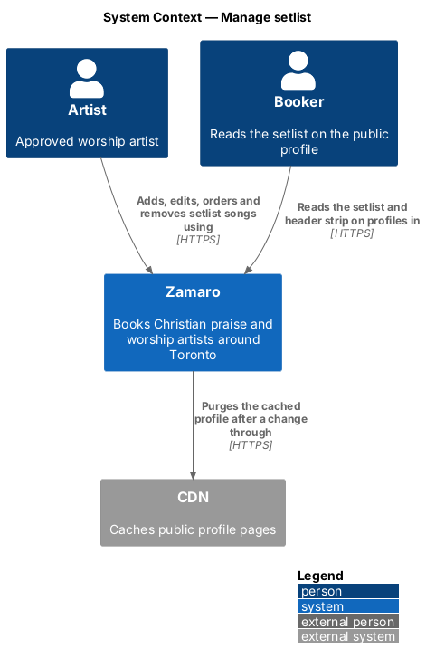
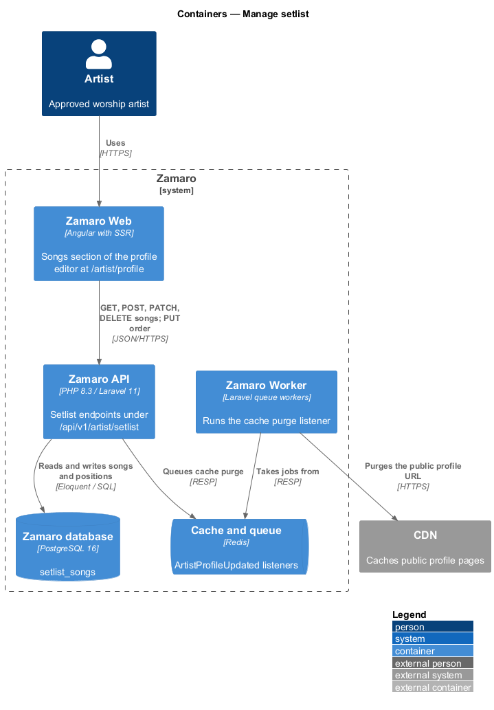
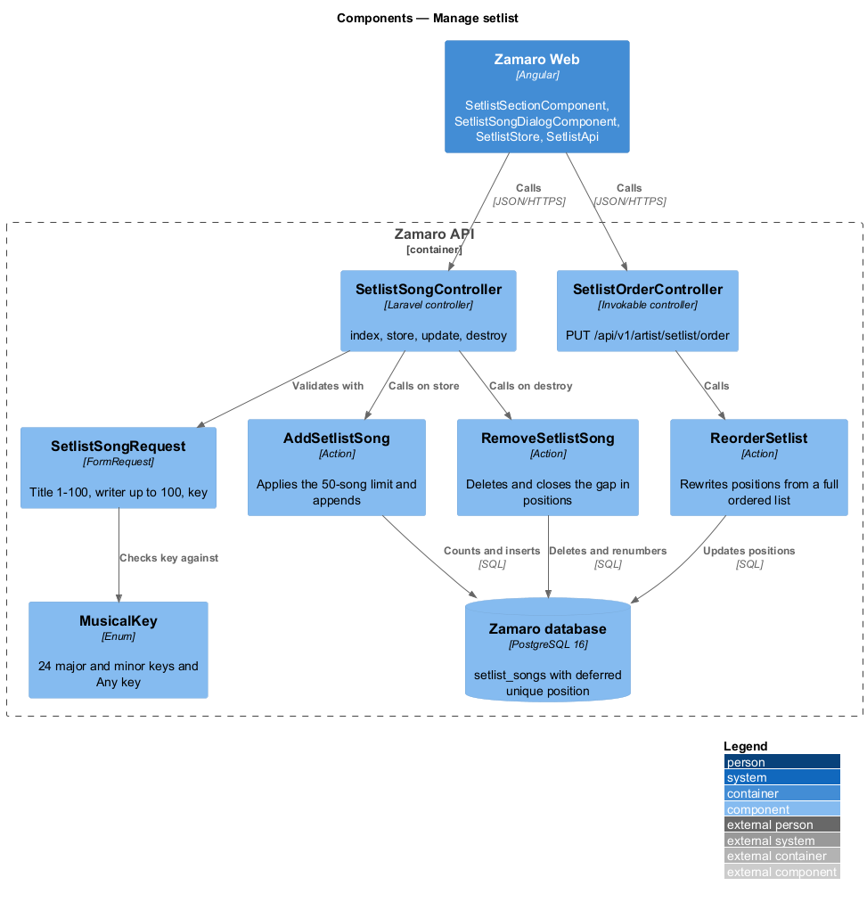
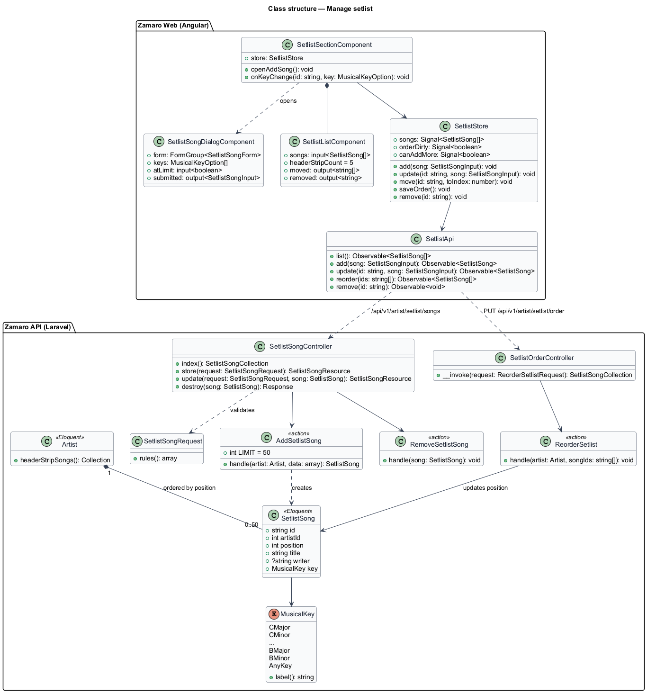
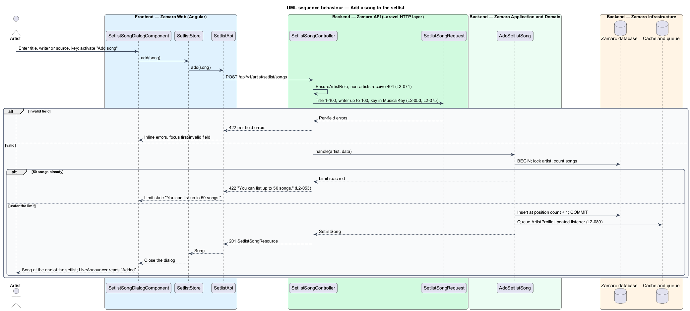
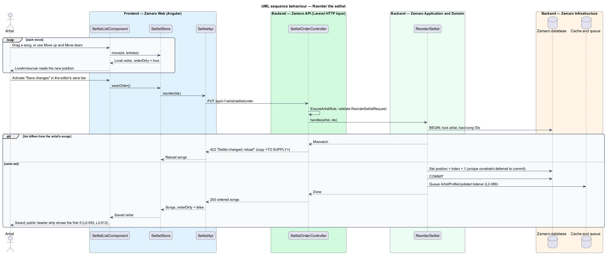

# Manage setlist

## Overview

Churches book worship artists partly on what they sing. Each approved artist's public
profile on Zamaro carries a setlist: the header shows the first 5 songs as a strip
(L2-012), and the "Songs {first name} leads" section lists every song with its writer
or source and key (L2-016). A worship leader planning a service reads it to check
that the artist knows the congregation's songs and can lead them in a usable key.

This feature lets the artist maintain that setlist from the Songs section of the
profile editor at `/artist/profile`, in the artist workspace (the `/artist/*` area of
Zamaro Web for signed-in approved artists). The artist adds, removes and reorders
songs and sets each song's key, and the order decides which 5 songs appear in the
profile header. Other profile content is edited in the sibling slices
`artist-workspace/edit-profile-details`, `artist-workspace/upload-photos` and
`artist-workspace/upload-videos`. Rendering the setlist on the public profile belongs
to the artist profile subsystem.

Terms used in this design:

- **setlist** — ordered list of songs an artist offers to lead, at most 50
- **setlist song** — one setlist entry made of title, optional writer or source, and key
- **writer or source** — free-text credit for a song, such as a songwriter, publisher or hymnal
- **key** — one of the 24 major and minor musical keys, or "Any key" for a song the artist leads in whatever key a church asks
- **position** — 1-based place of a song in the setlist
- **header strip** — first 5 songs by position, shown in the public profile header

An artist may list up to 50 songs (L2-053). A reorder takes effect only when the
artist saves it, and the saved order decides the header strip (L2-053).

## Description

The slice runs from the Songs section of the profile editor in Zamaro Web to the
setlist endpoints in the Zamaro API and the Zamaro database.

**Frontend (Zamaro Web, `features/artist-workspace`)**

- **`SetlistSectionComponent`** — the "Songs {first name} leads" section (`#songs`)
  of `ArtistProfileEditorPage` (`artist-workspace/edit-profile-details`). Its lead
  says the first 5 show in the strip under the artist's name. It shows the ordered
  list, the count against the limit ("8 of 50 songs.") and "Add a song", which opens
  `SetlistSongDialogComponent`. At 50 songs the dialog opens in its limit state.
- **`SetlistSongDialogComponent`** — design-system dialog with title (1–100
  characters, required), writer or source (up to 100, optional) and a select of the
  24 keys plus "Any key", which is the default. On a rejected save it shows an error
  summary, marks each invalid field and moves focus to the summary. It keeps every
  value after a failed request and offers Try again. At the limit it shows only "You
  can list up to 50 songs." and "Back to my songs". A new song is saved when the
  artist activates "Add song" and goes to the end of the list.
- **`SetlistListComponent`** — ordered list built on the design-system setlist
  component (`setlist--edit`). Each row shows the title and credit, a key select
  labelled "Key for {title}", and "Move up", "Move down" and "Remove" icon buttons.
  Rows also move by CDK drag and drop. `LiveAnnouncer` reads each new position.
  Removing a song saves at once and offers Undo in a toast. A song's title or credit
  is corrected by removing it and adding it again.
- **`SetlistStore`** — signal-based store holding the songs, a local order, an
  `orderDirty` flag, changed keys and `canAddMore`. Moves and key changes stay local
  until the editor's "Save changes" runs, which sends the order and each changed key.
  Leaving the editor with unsaved changes prompts the artist to confirm; the prompt
  copy is `<TO SUPPLY>`.
- **`SetlistApi`** — typed client for the setlist endpoints.

**Backend (Zamaro API)**

Every endpoint sits behind `EnsureArtistRole`. Route-bound songs pass
`SetlistSongPolicy`, which answers 404 when the song belongs to another artist
(L2-074).

| Method and path | Controller | Purpose |
|-----------------|------------|---------|
| `GET /api/v1/artist/setlist/songs` | `SetlistSongController@index` | List songs by position |
| `POST /api/v1/artist/setlist/songs` | `SetlistSongController@store` | Add a song at the end |
| `PATCH /api/v1/artist/setlist/songs/{song}` | `SetlistSongController@update` | Change the key (title and credit are accepted too) |
| `DELETE /api/v1/artist/setlist/songs/{song}` | `SetlistSongController@destroy` | Remove a song |
| `PUT /api/v1/artist/setlist/order` | `SetlistOrderController` | Save a full new order |

- **`SetlistSongRequest`** — FormRequest for adding and editing. Title is 1–100
  characters, writer or source at most 100, and key a `MusicalKey` value (L2-053).
  Text is trimmed and stored as plain text (L2-075).
- **`MusicalKey`** — backed enum with 24 cases for the 12 tonics in major and minor,
  plus `AnyKey`. `label()` returns the display text in the order the select lists
  them: "Any key"; the majors "Key of C", "Key of D♭", "Key of D", "Key of E♭", "Key
  of E", "Key of F", "Key of F♯", "Key of G", "Key of A♭", "Key of A", "Key of B♭",
  "Key of B"; and the minors "Key of C minor", "Key of C♯ minor", "Key of D minor",
  "Key of E♭ minor", "Key of E minor", "Key of F minor", "Key of F♯ minor", "Key of G
  minor", "Key of G♯ minor", "Key of A minor", "Key of B♭ minor", "Key of B minor".
- **`AddSetlistSong`** — action that locks the artist row in one `DB::transaction`,
  counts the songs and rejects a 51st with "You can list up to 50 songs." (L2-053).
  Otherwise it inserts the song at the next position.
- **`ReorderSetlistRequest`** and **`ReorderSetlist`** — the request accepts the full
  ordered list of song IDs. The action locks the artist row and rejects with 422 any
  list that differs from the stored set, which covers a song added or removed in
  another tab. Otherwise it writes `position = index + 1` for each song.
- **`RemoveSetlistSong`** — action that deletes the song and closes the gap in
  positions in one transaction.
- **`SetlistSongResource`** — API resource with ID, position, title, writer and key
  with its label.

Each change dispatches `ArtistProfileUpdated`, whose queued listener purges the
cached public profile within 60 seconds (L2-089). The public profile reads songs by
position; `Artist::headerStripSongs()` returns the first 5 for the header strip
(L2-012).

**Mock screens** — the Songs section (`#songs`) of
[`pages/edit-profile`](../../../mocks/pages/edit-profile/default.html) shows Abigail's
8 songs with key selects and move and remove buttons; the
[`empty`](../../../mocks/pages/edit-profile/empty.html) state shows Miriam's 4. "Add a
song" opens [`dialogs/add-song`](../../../mocks/dialogs/add-song/default.html) in
states default, busy, invalid (no title and a 112-character credit), failed and
limit ("You can list up to 50 songs.").

**Data**

`setlist_songs` — `id` (UUID), `artist_id`, `position`, `title`, `writer`, `key`,
timestamps. A unique constraint on `(artist_id, position)` is declared `DEFERRABLE
INITIALLY DEFERRED`, so a reorder can swap positions inside one transaction and the
database still rejects duplicates at commit. A check constraint keeps `position`
between 1 and 50.

## Requirements

The feature realises the following level-2 (L2) requirement. It refines the level-1
(L1) requirement shown, and the text is quoted from `docs/specs/L2.md`.

| L2 ID | Refines (L1) | Requirement |
|-------|--------------|-------------|
| `L2-053` | `L1-011` | **Setlist management.** Acceptance criteria: 1. Given an artist, when they add a song, then title (1–100 characters), writer or source (up to 100) and key (from the 24 major and minor keys, or "Any key") are saved. 2. Given an artist has 50 songs, when they add another, then it is rejected with "You can list up to 50 songs." 3. Given an artist reorders songs, when they save, then the first 5 songs are shown in the profile header strip (L2-012). |

## Diagrams

### System context

An artist maintains the setlist in Zamaro, bookers read it on public profiles, and
Zamaro purges the cached profile through the CDN after each change.

### Containers

The Songs section of the profile editor in Zamaro Web calls the setlist endpoints in the Zamaro API, which
writes the database and queues the cache purge that the Zamaro Worker runs.

### Components

`SetlistSongController` validates with `SetlistSongRequest` and delegates adding and
removing to single-purpose actions. `SetlistOrderController` hands the full order to
`ReorderSetlist`.

### Class structure

The store keeps a local order until it is saved. On the backend an `Artist` owns up
to 50 `SetlistSong` rows ordered by position, each with a `MusicalKey`.

### Behaviour — add a song

The request validates the fields, then the action enforces the 50-song limit under a
row lock and appends the song at the end.

### Behaviour — reorder the setlist

Moves change the local order and are announced. The editor's "Save changes" sends
the full list, and the action rewrites positions in one transaction.

