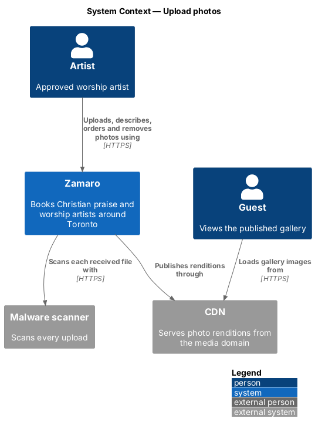
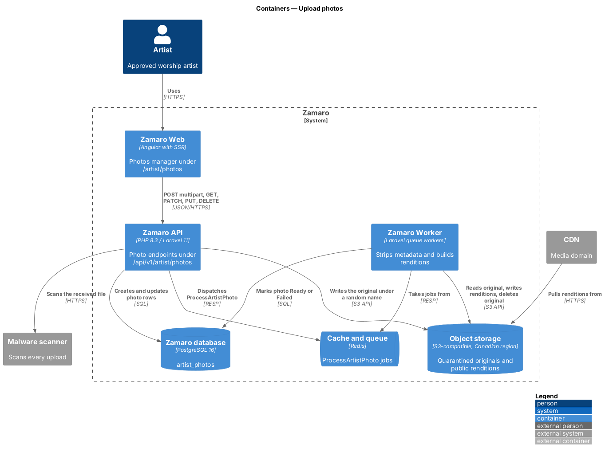
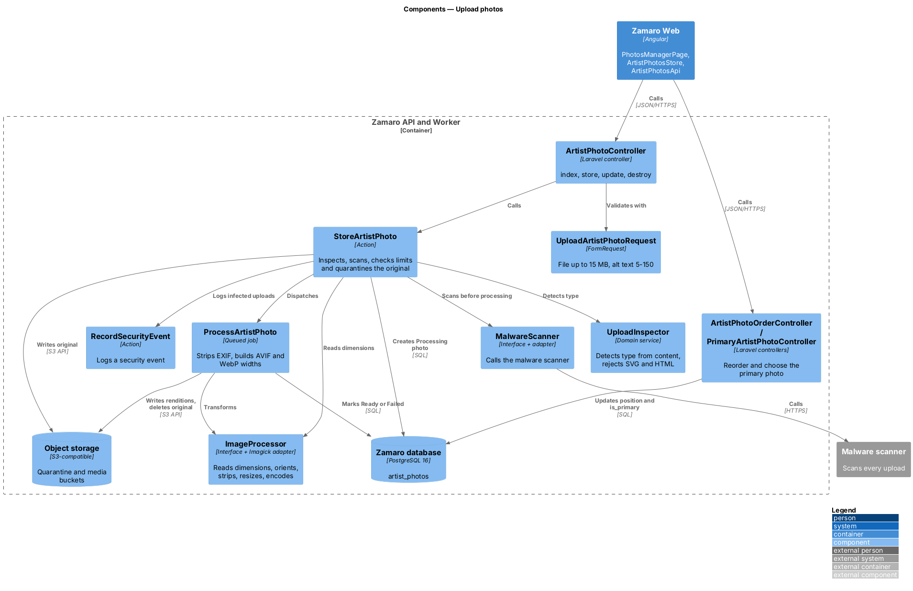
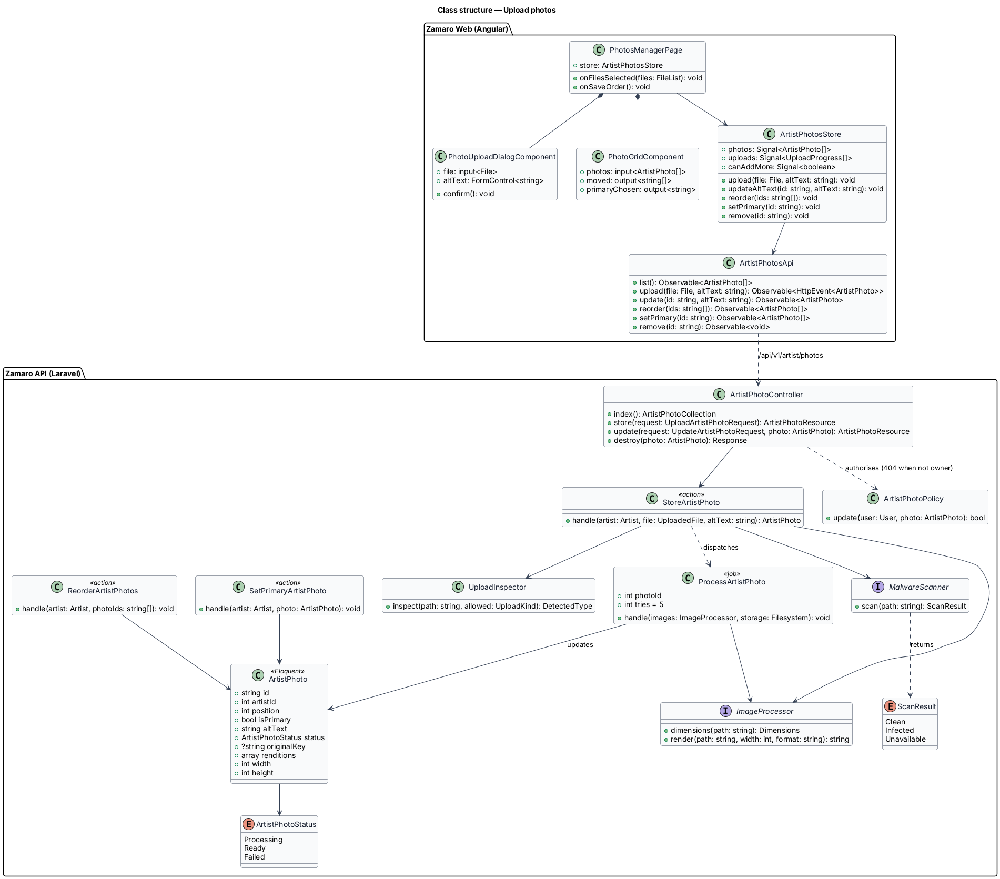
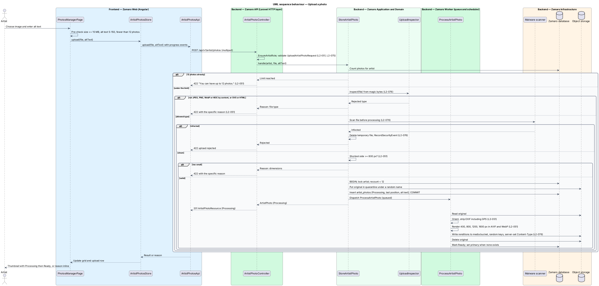
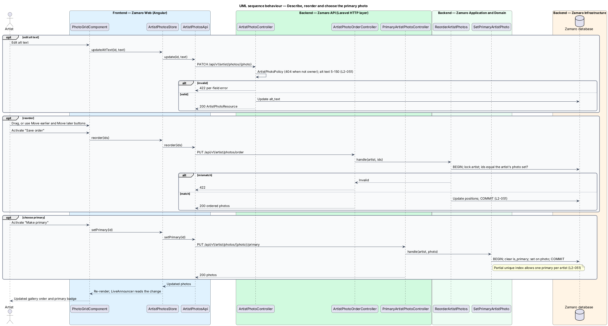

# Upload photos

## Overview

A church deciding whom to book looks first at photos. Each approved artist's public
profile on Zamaro shows a photo gallery (L2-015), and the primary photo also appears
on the headliner card in search results and in link previews (L2-006, L2-113). This
feature lets the artist supply and curate those photos from the artist workspace, the
`/artist/*` area of Zamaro Web for signed-in approved artists.

The slice covers uploading an image, rejecting files that fail validation or the
malware scan, turning an accepted image into responsive renditions without location
metadata, and managing the gallery afterwards: alt text, order and primary photo.
Video uploads follow a separate path in `artist-workspace/upload-videos`, which reuses
the upload security components described here. Written profile details live in
`artist-workspace/edit-profile-details`.

Terms used in this design:

- **original** — file as the artist uploaded it, kept only until renditions exist
- **rendition** — resized, re-encoded copy of a photo at one width and one format
- **primary photo** — single photo per artist used on the headliner card and in link previews
- **alt text** — artist-written description of a photo, read by screen readers
- **content sniffing** — detection of a file's real type from its leading bytes, ignoring its name and declared type
- **quarantine** — private storage area that holds an original until processing finishes
- **media domain** — separate domain, fronted by the CDN, that serves stored uploads
- **security event** — structured log record of a security-relevant occurrence, such as a malware detection

An artist may hold up to 12 photos (L2-051). An upload is accepted only when its type
by content is JPEG, PNG, WebP or HEIC, it is at most 15 MB, its shortest side is at
least 800 px and the malware scanner reports it clean (L2-051, L2-076).

## Description

The slice runs from the photos manager in Zamaro Web to the photo endpoints in the
Zamaro API, a queued job in the Zamaro Worker, object storage, the malware scanner
and the CDN.

**Frontend (Zamaro Web, `features/artist-workspace`)**

- **`PhotosManagerPage`** — routed page component for `/artist/photos`. It shows the
  count against the limit ("5 of 12"), the upload control and the gallery. It
  disables the upload control at 12 photos. The page polls
  `GET /api/v1/artist/photos` while any photo is `Processing`; the interval is
  `<TO SUPPLY>`.
- **`PhotoUploadDialogComponent`** — design-system dialog opened after a file is
  chosen. It previews the image, requires alt text of 5–150 characters and pre-checks
  size and file extension for early feedback. The server remains the authority.
- **`PhotoGridComponent`** — ordered grid of thumbnails with status badges. Each
  item offers "Edit alt text", "Make primary", "Delete", and "Move earlier" and "Move
  later" buttons. Order changes also work by CDK drag and drop, and "Save order"
  sends the new order. `LiveAnnouncer` reads each move and save.
- **`ArtistPhotosStore`** — signal-based store holding the photos, the in-flight
  uploads with percent progress, and `canAddMore`. It shows a per-file reason when
  the API rejects an upload.
- **`ArtistPhotosApi`** — typed client for the photo endpoints. `upload` sends
  `multipart/form-data` with `reportProgress` so the design-system progress bar shows
  upload progress.

**Backend (Zamaro API and Worker)**

Every endpoint sits behind `EnsureArtistRole`. Route-bound photos pass
`ArtistPhotoPolicy`, which answers 404 when the photo belongs to another artist
(L2-074).

| Method and path | Controller | Purpose |
|-----------------|------------|---------|
| `GET /api/v1/artist/photos` | `ArtistPhotoController@index` | List photos in order with status |
| `POST /api/v1/artist/photos` | `ArtistPhotoController@store` | Upload one photo with alt text |
| `PATCH /api/v1/artist/photos/{photo}` | `ArtistPhotoController@update` | Change alt text |
| `DELETE /api/v1/artist/photos/{photo}` | `ArtistPhotoController@destroy` | Remove a photo and its renditions |
| `PUT /api/v1/artist/photos/order` | `ArtistPhotoOrderController` | Save a full new order |
| `PUT /api/v1/artist/photos/{photo}/primary` | `PrimaryArtistPhotoController` | Make one photo primary |

- **`UploadArtistPhotoRequest`** — FormRequest requiring one file of at most 15 MB
  and alt text of 5–150 characters. The upload route alone accepts a request body
  above the 1 MB limit of L2-075; its body limit is 16 MB.
- **`StoreArtistPhoto`** — action that runs the acceptance checks in order and stops
  at the first failure with a specific reason (L2-051). It counts the artist's photos
  and rejects a 13th with "You can have up to 12 photos." It asks `UploadInspector`
  for the type by content. It asks `MalwareScanner` for a verdict before any image
  decoding (L2-076). It reads the dimensions through `ImageProcessor` and rejects a
  shortest side under 800 px. Inside one `DB::transaction` it locks the artist row,
  re-counts, writes the original to quarantine under a random name, inserts an
  `ArtistPhoto` in `Processing` at the last position and dispatches
  `ProcessArtistPhoto`. Rejection copy other than the photo-limit message is
  `<TO SUPPLY>`.
- **`UploadInspector`** — domain service shared with video and caption uploads. It
  reads the leading bytes (`finfo` magic) and returns a `DetectedType`. It rejects
  SVG and HTML in all cases and any type outside the allowed set for the upload kind
  (L2-076).
- **`MalwareScanner`** — interface with one adapter for the malware scanner (vendor
  `<TO SUPPLY>`). It returns `Clean`, `Infected` or `Unavailable`. On `Infected` the
  action deletes the temporary file, rejects the upload and calls
  `RecordSecurityEvent` (L2-076). On `Unavailable` the upload fails with 503 and
  nothing is stored; the scan timeout is `<TO SUPPLY>`.
- **`RecordSecurityEvent`** — action that writes a structured record to the
  `security` log channel with the artist, the upload kind, the detected type and the
  scanner verdict. Whether the record also creates an `AuditEntry` is `<TO SUPPLY>`.
- **`ImageProcessor`** — interface with an Imagick adapter (with libheif for HEIC)
  for dimension reads, orientation, metadata stripping, resizing and encoding.
- **`ProcessArtistPhoto`** — queued, idempotent job with 5 retries and exponential
  backoff (L2-092). It applies the EXIF orientation, strips all metadata including
  GPS, and writes renditions at 400, 800, 1200 and 1600 px wide in AVIF and WebP
  (L2-051). Widths above the source width are skipped rather than upscaled. It writes
  each rendition to the media bucket under a random key with server-set
  `Content-Type` and `Content-Disposition: inline` (L2-076). It then deletes the
  original, stores width and height, marks the photo `Ready`, and makes it primary
  when the artist has none. After the final failed attempt it marks the photo
  `Failed` and deletes the original.
- **`ReorderArtistPhotos`** — action that accepts the full ordered list of the
  artist's photo IDs, rejects any list that differs from the stored set with 422, and
  rewrites `position` in one transaction.
- **`SetPrimaryArtistPhoto`** — action that clears the current primary and sets the
  chosen photo in one transaction. Deleting the primary photo promotes the first
  remaining `Ready` photo by position.
- **`ArtistPhotoResource`** — API resource with ID, alt text, status, position,
  primary flag, width, height and a `srcset` of CDN URLs for each format.

Each change dispatches `ArtistProfileUpdated`, which purges the cached public profile
(L2-089). The public profile shows only `Ready` photos.

**Data and storage**

- `artist_photos` — `id` (UUID), `artist_id`, `position`, `is_primary`, `alt_text`,
  `status`, `original_key`, `renditions` (`jsonb` list of width, format and key),
  `width`, `height`, timestamps. A partial unique index on `artist_id` where
  `is_primary` enforces one primary photo per artist.
- Object storage holds two areas: a private quarantine bucket for originals and a
  media bucket served through the CDN on the media domain. The media domain name is
  `<TO SUPPLY>`. A lifecycle rule removes quarantine objects older than 24 hours as a
  backstop.

## Requirements

The feature realises the following level-2 (L2) requirements. Each refines the
level-1 (L1) requirement shown, and the text is quoted from `docs/specs/L2.md`.

| L2 ID | Refines (L1) | Requirement |
|-------|--------------|-------------|
| `L2-051` | `L1-011` | **Photo uploads.** Acceptance criteria: 1. Given an artist uploads a JPEG, PNG, WebP or HEIC image up to 15 MB with a shortest side of at least 800 px, when it is processed, then it is stored with EXIF metadata (including GPS) removed and resized to responsive widths of 400, 800, 1200 and 1600 px in AVIF and WebP. 2. Given an image that fails validation (wrong type by content, too large, too small), when it is uploaded, then it is rejected with the specific reason. 3. Given an artist has 12 photos, when they upload another, then it is rejected with "You can have up to 12 photos." 4. Given a photo, when it is saved, then alt text of 5–150 characters is required, and the artist can reorder photos and pick one as the primary photo. |
| `L2-076` | `L1-016` | **Upload security.** Acceptance criteria: 1. Given an uploaded file, when it is received, then its type is verified from its content (not its name or declared type), SVG and HTML are rejected, and it is scanned for malware before it is processed. 2. Given a file that fails the malware scan, when it is scanned, then it is deleted, the upload is rejected and a security event is logged. 3. Given stored uploads, when they are served, then they come from a separate domain under random names, with `Content-Disposition` and `Content-Type` set by the server, and private documents (L2-049) only through signed URLs that expire after 5 minutes. |

## Diagrams

### System context

An artist uploads and curates photos in Zamaro. Zamaro scans every file with the
malware scanner and publishes renditions through the CDN, where guests load them.

### Containers

The Zamaro API accepts the upload, scans it, quarantines the original and queues
processing. The Zamaro Worker builds renditions in object storage, which the CDN
serves from the media domain.

### Components

`StoreArtistPhoto` runs `UploadInspector`, `MalwareScanner` and the dimension check
before anything is stored. `ProcessArtistPhoto` uses `ImageProcessor` to strip
metadata and render each width and format.

### Class structure

The photos store and client mirror the photo endpoints. `ArtistPhoto` carries its
status, position, primary flag and rendition list, and the actions and job act on it.

### Behaviour — upload a photo

The action checks the limit, the content type, the malware scan and the dimensions in
that order, and each failure returns its own reason. An accepted photo is
quarantined, then processed by the worker into metadata-free renditions.

### Behaviour — describe, reorder and choose the primary photo

Alt text, order and primary photo each have their own endpoint. Reordering replaces
the whole order at once, and the partial unique index allows at most one primary.

