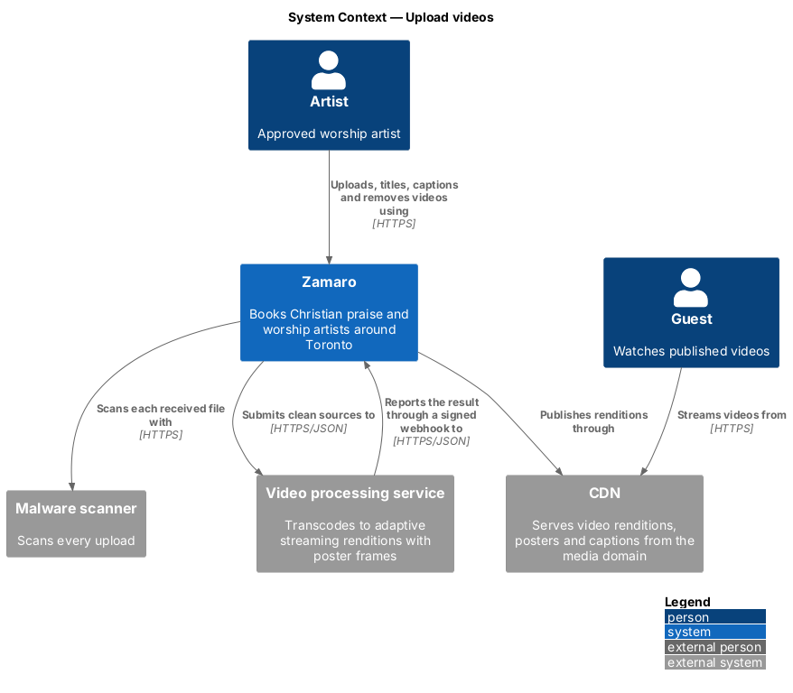
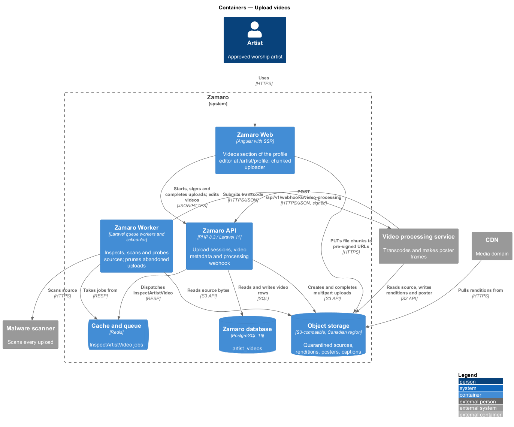
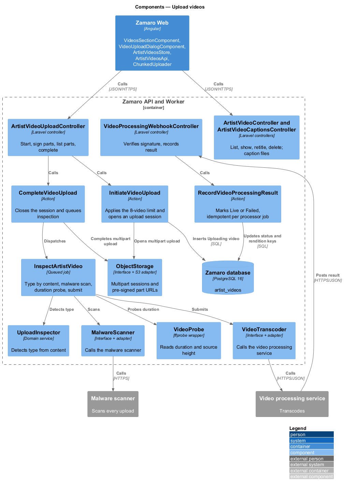
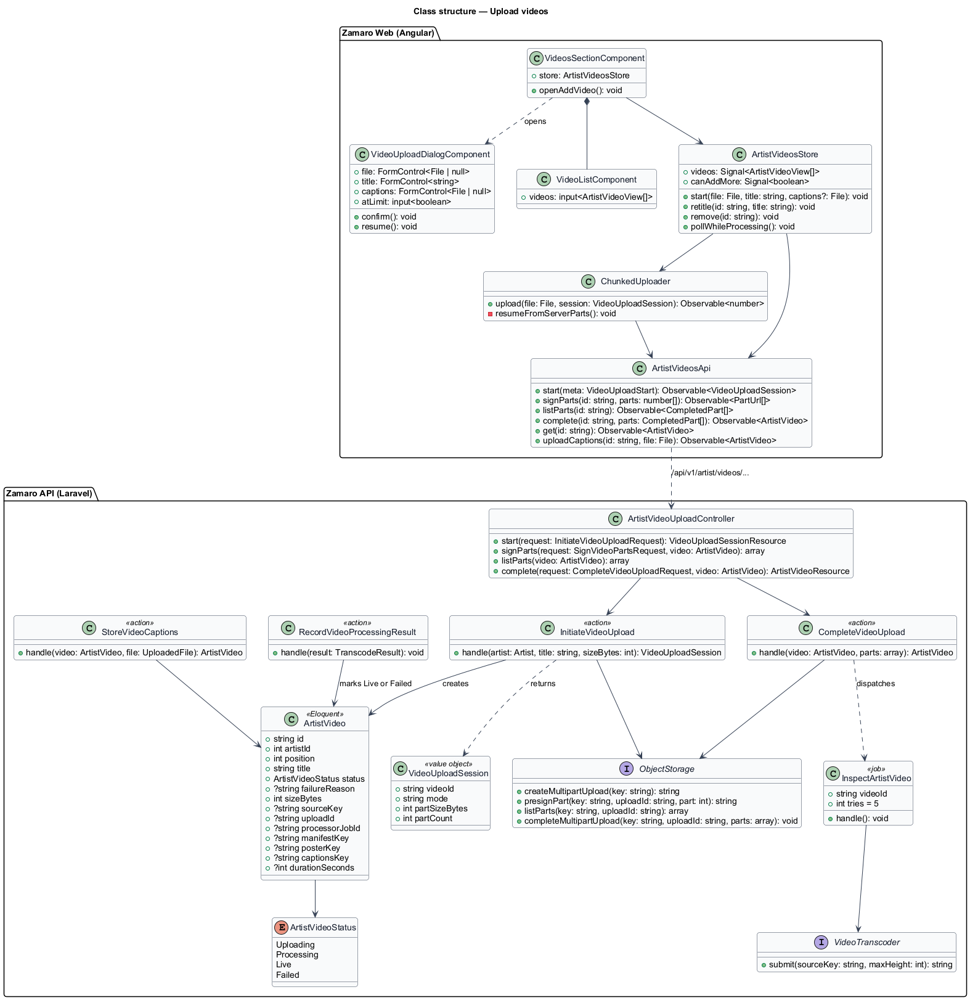
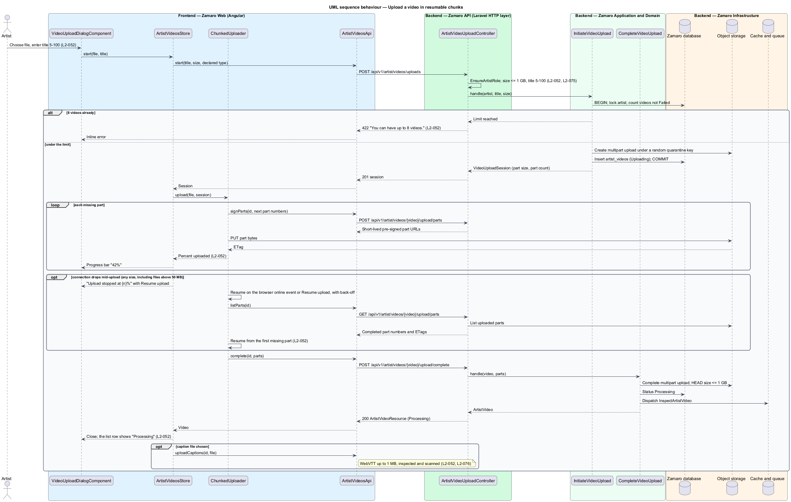
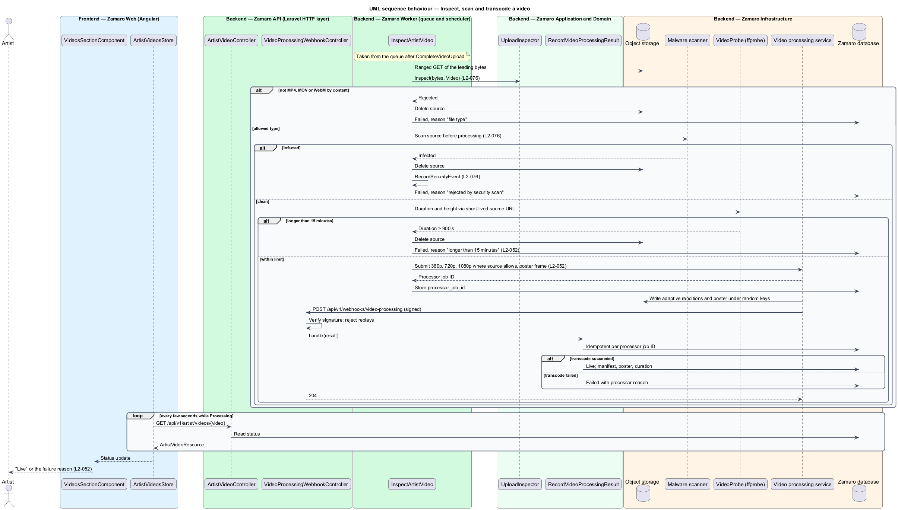

# Upload videos

## Overview

Video is the closest a church gets to hearing an artist lead before booking. Each
approved artist's public profile on Zamaro has a "Watch {pronoun} lead" section
(L2-014) that streams the artist's own videos. Artists upload video files rather than
linking to third-party video sites (`docs/specs/L1.md`, assumptions). This feature
lets an artist upload, title, caption and remove those videos from the Videos section
of the profile editor at `/artist/profile`, in the artist workspace (the `/artist/*`
area of Zamaro Web for signed-in approved artists).

The slice covers the full path of one video: an upload of up to 1 GB that survives a
dropped connection, content-type checking and a malware scan before any processing,
a duration check, transcoding by the video processing service, and the status shown
to the artist throughout. Photo uploads live in `artist-workspace/upload-photos`, which
introduces the upload security components this slice reuses. Playback on the public
profile belongs to the artist profile subsystem.

Terms used in this design:

- **source** — video file as the artist uploaded it, held in quarantine until processing ends
- **upload session** — server-issued record of one source being uploaded, with its part size and part count
- **part** — fixed-size byte range of the source sent in one request
- **resumable upload** — upload that continues from the last completed part after an interruption
- **pre-signed URL** — short-lived storage URL that permits one write without other credentials
- **rendition** — transcoded copy of a video at one resolution, part of an adaptive streaming set
- **poster frame** — still image shown before playback starts
- **caption file** — WebVTT text file of timed captions supplied by the artist
- **processing webhook** — signed HTTPS callback from the video processing service carrying a transcode result

A video moves through four states: `Uploading`, `Processing`, `Live` and `Failed`.
The artist sees percent uploaded, then "Processing", then "Live" or a failure reason
(L2-052). Only `Live` videos appear on the public profile (L2-014). An artist may hold
up to 8 videos (L2-052).

## Description

The slice runs from the Videos section of the profile editor in Zamaro Web to the
video endpoints in the
Zamaro API, queued jobs in the Zamaro Worker, object storage, the malware scanner, the
video processing service and the CDN.

**Frontend (Zamaro Web, `features/artist-workspace`)**

- **`VideosSectionComponent`** — the Videos section (`#videos`) of
  `ArtistProfileEditorPage` (`artist-workspace/edit-profile-details`). It shows the
  list, the count against the limit with the file rules ("4 of 8 videos · MP4, MOV or
  WebM, up to 1 GB and 15 minutes each") and "Add a video", which opens
  `VideoUploadDialogComponent`; at 8 videos the dialog opens in its limit state with
  "You can have up to 8 videos." With no videos the section shows an empty state with
  the same button.
- **`VideoUploadDialogComponent`** — design-system dialog that collects the video file,
  the title (5–100 characters) and an optional WebVTT caption file. It pre-checks the
  file type, the file size (1 GB) and the caption size (1 MB) for early feedback, and
  shows an error summary with inline errors. While uploading it locks the fields and
  shows a progress bar with percent and megabytes sent, with "Cancel upload". After a
  dropped connection it shows "Upload stopped at {n}%" and "Resume upload", keeping
  the title and captions. At the limit it shows only the limit message and "Back to my
  videos". It closes when the upload completes.
- **`VideoListComponent`** — list of videos with poster, title, duration and status:
  "Processing", "Live" or the failure reason. Each row offers "Remove", which saves at
  once and offers Undo in a toast. Titles and captions are set in the upload dialog;
  the title endpoint below has no screen yet.
- **`ArtistVideosStore`** — signal-based store holding the videos and the active
  uploads. While any video is `Processing` it polls
  `GET /api/v1/artist/videos/{video}`; the interval is `<TO SUPPLY>`.
- **`ChunkedUploader`** — service that sends the source in parts straight to object
  storage through pre-signed URLs and reports percent uploaded. It retries a failed
  part with backoff. After a dropped connection it resumes on the browser `online`
  event or when the artist activates "Resume upload": it asks the API which parts
  storage already holds and continues from the first missing part (L2-052). Every
  source uses parts, so resume applies to all sizes, including the files above 50 MB
  that L2-052 names. The part size (at least 5 MB, the
  storage minimum) and the number of parallel parts are `<TO SUPPLY>`. Resuming after
  a page reload, which requires the artist to choose the file again, is `<TO SUPPLY>`.
- **`ArtistVideosApi`** — typed client for the endpoints below.

**Backend (Zamaro API and Worker)**

Every artist endpoint sits behind `EnsureArtistRole`. Route-bound videos pass
`ArtistVideoPolicy`, which answers 404 when the video belongs to another artist
(L2-074). No video bytes pass through the API, so every API request stays within the
1 MB body limit of L2-075 except the caption upload, whose route allows 1 MB of file
plus form overhead.

| Method and path | Controller | Purpose |
|-----------------|------------|---------|
| `GET /api/v1/artist/videos` | `ArtistVideoController@index` | List videos with status |
| `GET /api/v1/artist/videos/{video}` | `ArtistVideoController@show` | Current status, used for polling |
| `PATCH /api/v1/artist/videos/{video}` | `ArtistVideoController@update` | Change the title |
| `DELETE /api/v1/artist/videos/{video}` | `ArtistVideoController@destroy` | Remove a video and its stored objects |
| `POST /api/v1/artist/videos/uploads` | `ArtistVideoUploadController@start` | Open an upload session |
| `POST /api/v1/artist/videos/{video}/upload/parts` | `ArtistVideoUploadController@signParts` | Pre-signed URLs for part numbers |
| `GET /api/v1/artist/videos/{video}/upload/parts` | `ArtistVideoUploadController@listParts` | Parts storage already holds |
| `POST /api/v1/artist/videos/{video}/upload/complete` | `ArtistVideoUploadController@complete` | Close the session and queue inspection |
| `PUT /api/v1/artist/videos/{video}/captions` | `ArtistVideoCaptionsController` | Upload or replace the caption file |
| `POST /api/v1/webhooks/video-processing` | `VideoProcessingWebhookController` | Receive transcode results |

- **`InitiateVideoUploadRequest`** — FormRequest for the title (5–100 characters),
  the declared size (at most 1 GB) and the file name. The declared type is used only
  for early feedback; the content check comes later (L2-076).
- **`InitiateVideoUpload`** — action that locks the artist row in one
  `DB::transaction` and counts the artist's videos that are not `Failed`. It rejects
  a 9th with "You can have up to 8 videos." (L2-052). Otherwise it opens a multipart
  upload through `ObjectStorage` under a random quarantine key, inserts an
  `ArtistVideo` in `Uploading`, and returns a `VideoUploadSession`.
- **`ObjectStorage`** — interface with an S3 adapter for multipart sessions,
  pre-signed part URLs, part listing and completion. Pre-signed URLs expire after a
  period that is `<TO SUPPLY>`. The quarantine bucket accepts cross-origin `PUT` from
  the Zamaro Web origin only.
- **`CompleteVideoUpload`** — action that completes the multipart upload, confirms
  the stored size is at most 1 GB, sets `Processing` and dispatches
  `InspectArtistVideo`.
- **`InspectArtistVideo`** — queued, idempotent job with 5 retries and exponential
  backoff (L2-092). It reads the leading bytes of the source and asks
  `UploadInspector` for the type by content. It accepts MP4, MOV and WebM and rejects
  SVG, HTML and every other type (L2-076). It asks `MalwareScanner` for a verdict
  before any processing (L2-076). On `Infected` it deletes the source, calls
  `RecordSecurityEvent` and marks the video `Failed`. It then reads duration and
  height through `VideoProbe`, an `ffprobe` wrapper reading a short-lived source URL,
  and fails any source longer than 15 minutes (L2-052). Last, it submits the source
  to `VideoTranscoder` and stores the processor job ID. Scanning a source of up to
  1 GB depends on the scanner's object-scan support, which is `<TO SUPPLY>`.
- **`VideoTranscoder`** — interface with one adapter for the video processing service
  (vendor `<TO SUPPLY>`). Each submission asks for 360p, 720p and 1080p renditions,
  capped at the source height, plus a poster frame (L2-052). The streaming format
  (HLS or DASH) is `<TO SUPPLY>`.
- **`VideoProcessingWebhookController`** — verifies the webhook signature, rejects
  replays and calls `RecordVideoProcessingResult`.
- **`RecordVideoProcessingResult`** — action that is idempotent per processor job ID.
  On success it stores the manifest key, poster key and duration and marks the video
  `Live`. On failure it marks the video `Failed` with the processor's reason. Whether
  the quarantined source is kept after a successful transcode is `<TO SUPPLY>`.
- **`StoreVideoCaptions`** — action behind the captions endpoint. It accepts a file of
  at most 1 MB, requires UTF-8 text beginning with the `WEBVTT` header through
  `UploadInspector`, scans it with `MalwareScanner`, and writes it to the media bucket
  under a random key with `Content-Type: text/vtt` (L2-052, L2-076). The caption
  language label is `<TO SUPPLY>`.
- **`PruneAbandonedVideoUploads`** — scheduled command in `routes/console.php` that
  aborts multipart uploads and deletes `Uploading` rows older than a cut-off that is
  `<TO SUPPLY>`, freeing the slot in the 8-video limit.
- **`ReconcileProcessingVideos`** — scheduled command that queries the video
  processing service for videos left in `Processing` beyond a threshold that is
  `<TO SUPPLY>`, covering a lost webhook.
- **`ArtistVideoResource`** — API resource with ID, title, status, failure reason,
  duration, poster URL, manifest URL and caption URL. Media URLs point at the media
  domain behind the CDN, under random names, with server-set `Content-Type` and
  `Content-Disposition` (L2-076).

Each change that alters what the public sees dispatches `ArtistProfileUpdated`, which
purges the cached public profile (L2-089). A source over 15 minutes fails with
"Longer than 15 minutes. Trim it and upload it again."; copy for the other failure
reasons is `<TO SUPPLY>`.

**Mock screens** — the Videos section (`#videos`) of
[`pages/edit-profile`](../../../mocks/pages/edit-profile/default.html) lists Abigail's 4
Live videos; the [`empty`](../../../mocks/pages/edit-profile/empty.html) state shows
the no-videos empty state; the
[`video-processing`](../../../mocks/pages/edit-profile/video-processing.html) state
adds Jireh as "Processing" and a 16:20 video as "Failed" with its reason, at 5 of 8.
"Add a video" opens
[`dialogs/add-video`](../../../mocks/dialogs/add-video/default.html) in states default,
busy (46% uploaded, on the design-system progress bar), invalid (an AVI file and a
4-character title), failed (stopped at 61% with Resume upload) and limit.

**Data and storage**

- `artist_videos` — `id` (UUID), `artist_id`, `position`, `title`, `status`,
  `failure_reason`, `size_bytes`, `source_key`, `upload_id`, `processor_job_id`
  (unique), `manifest_key`, `poster_key`, `captions_key`, `duration_seconds`,
  `max_height`, timestamps.
- Object storage holds a private quarantine bucket for sources and the media bucket
  for renditions, posters and caption files, served through the CDN.

## Requirements

The feature realises the following level-2 (L2) requirements. Each refines the
level-1 (L1) requirement shown, and the text is quoted from `docs/specs/L2.md`.

| L2 ID | Refines (L1) | Requirement |
|-------|--------------|-------------|
| `L2-052` | `L1-011` | **Video uploads.** Acceptance criteria: 1. Given an artist uploads an MP4, MOV or WebM file up to 1 GB and 15 minutes long, when it is processed, then it is transcoded to adaptive streaming renditions (360p, 720p, 1080p where the source allows) with a poster frame. 2. Given an upload in progress, when the artist watches it, then a progress indicator shows percent uploaded, then "Processing", then "Live" or a failure reason. 3. Given an artist has 8 videos, when they upload another, then it is rejected with "You can have up to 8 videos." 4. Given a video, when it is saved, then a title of 5–100 characters is required, and an optional WebVTT caption file up to 1 MB is accepted. 5. Given an upload larger than 50 MB, when the connection drops, then the upload resumes from the last completed chunk. |
| `L2-076` | `L1-016` | **Upload security.** Acceptance criteria: 1. Given an uploaded file, when it is received, then its type is verified from its content (not its name or declared type), SVG and HTML are rejected, and it is scanned for malware before it is processed. 2. Given a file that fails the malware scan, when it is scanned, then it is deleted, the upload is rejected and a security event is logged. 3. Given stored uploads, when they are served, then they come from a separate domain under random names, with `Content-Disposition` and `Content-Type` set by the server, and private documents (L2-049) only through signed URLs that expire after 5 minutes. |

## Diagrams

### System context

An artist uploads videos to Zamaro. Zamaro scans each source with the malware
scanner, sends clean sources to the video processing service, and publishes the
resulting renditions through the CDN.

### Containers

Zamaro Web sends file parts straight to object storage under pre-signed URLs, while
the Zamaro API manages the session. The Zamaro Worker inspects and submits the
source, and the video processing service reports back through a signed webhook to
the API.

### Components

`InitiateVideoUpload` and `CompleteVideoUpload` bracket the upload through
`ObjectStorage`. `InspectArtistVideo` runs the content, malware and duration checks
before `VideoTranscoder`, and `RecordVideoProcessingResult` closes the loop.

### Class structure

`ChunkedUploader` and `ArtistVideosStore` drive the upload endpoints. `ArtistVideo`
carries the status, the storage keys and the processor job ID that ties the webhook
to the right row.

### Behaviour — upload in resumable chunks

The API enforces the 8-video limit, then opens a multipart session. The browser sends
parts to storage and reports percent uploaded. After a dropped connection it lists the
stored parts and resumes from the first missing one.

### Behaviour — inspect, scan and transcode

The worker rejects a wrong type, an infected file or a source over 15 minutes before
any transcode. The signed webhook marks the video `Live` or `Failed`, and the
artist's page picks up the status by polling.

