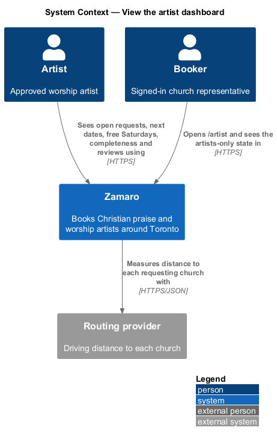
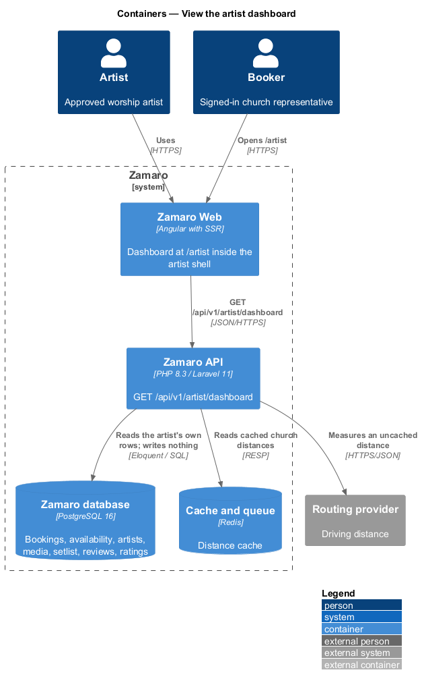
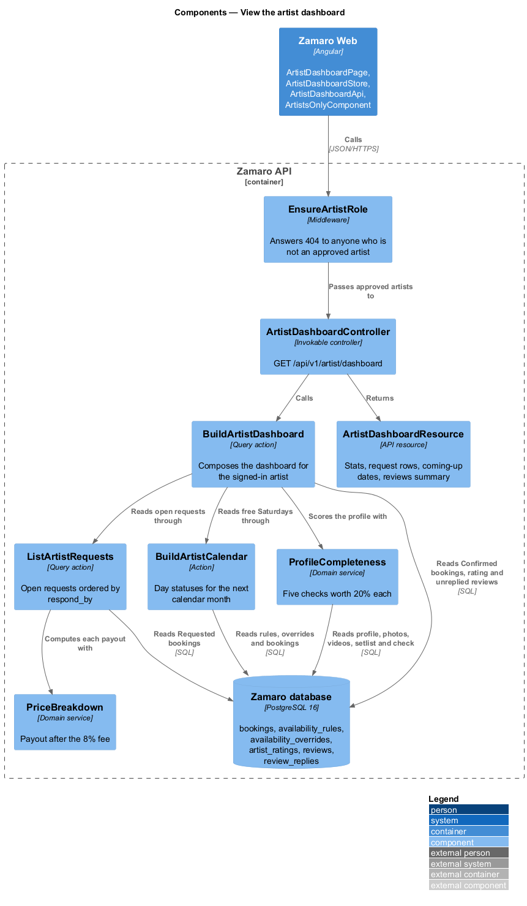
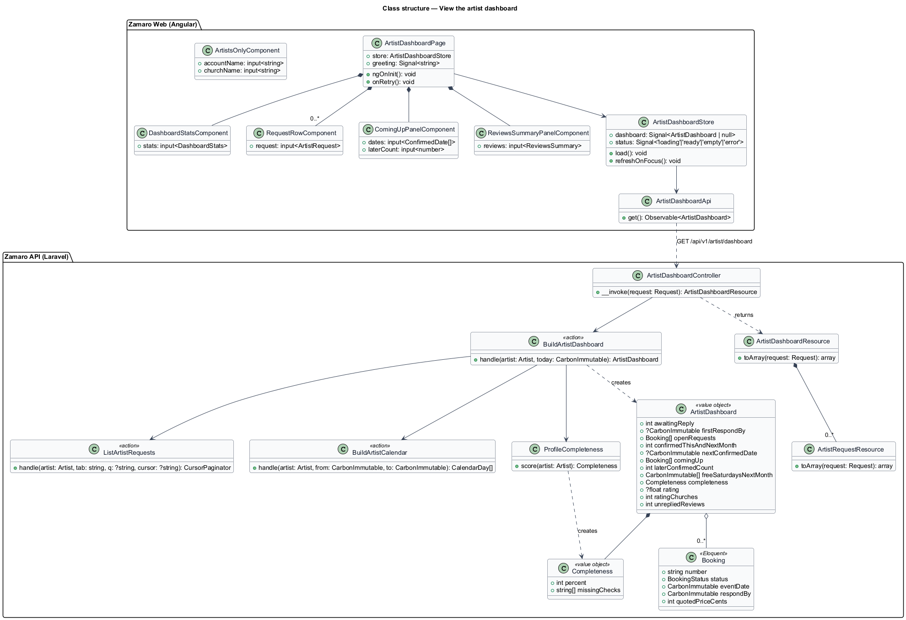
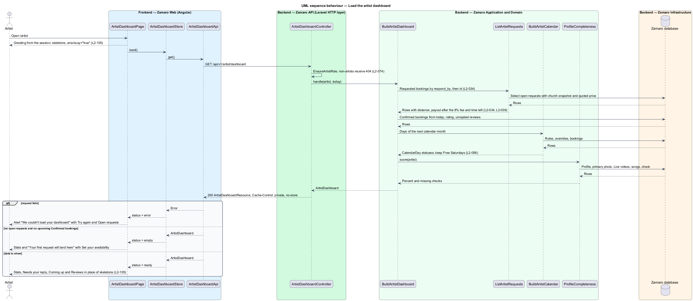
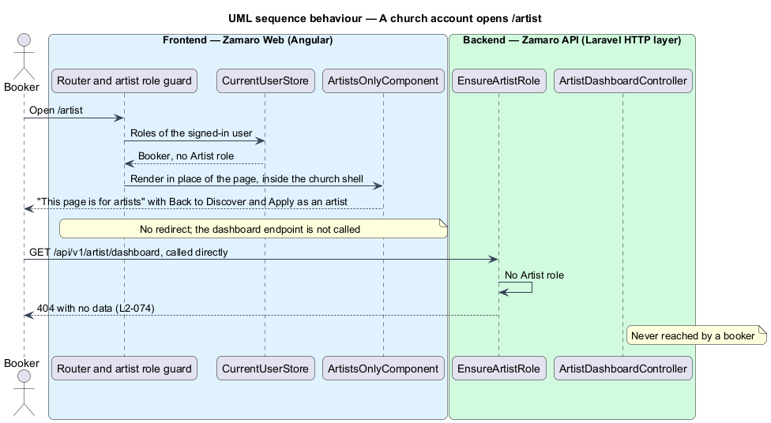

# View the artist dashboard

## Overview

Zamaro is a marketplace where churches in and around Toronto book Christian praise
and worship artists. The artist workspace is the `/artist/*` area of Zamaro Web where
a signed-in approved artist answers booking requests, keeps a calendar, follows
payouts and maintains a public profile.

This feature is the dashboard at `/artist`, the first page of the artist workspace
and the target of the Zamaro brand link in the artist top bar. It answers one
question for the artist: what needs attention now. It shows four numbers, the
Requested bookings waiting for a reply, the next Confirmed dates and a summary of
reviews, and links each part to the page that owns it. The dashboard changes nothing
itself; every action happens on the linked page.

The dashboard reads data that sibling slices own. The requests inbox and its rows
belong to `bookings/respond-to-booking-request`, the calendar statuses to
`artist-availability/manage-availability-calendar`, payout amounts to
`payments/pay-out-artists`, profile completeness to
`artist-workspace/edit-profile-details`, and the rating and replies to
`reviews/show-reviews-and-rating` and `reviews/reply-to-review`.

Terms used in this design:

- **artist** — approved worship artist, a solo performer, duo, band or choir acting as one account
- **artist workspace** — signed-in area of Zamaro Web under `/artist/*` reserved for approved artists
- **artist shell** — top bar with the Dashboard, Requests, Availability, Earnings and Profile links (`topbar--workspace`)
- **open request** — in this design, a booking in status Requested, waiting for the artist's Accept or Decline; the calendar also marks days with Accepted bookings as Requested
- **reply-by time** — `respond_by` of an open request, after which the request expires (L2-029)
- **payout** — booking total minus the 8% platform fee, the amount the artist receives (L2-039)
- **free Saturday** — Saturday whose status on the availability calendar is Free, not Unavailable, Requested or Booked (L2-056)
- **profile completeness** — five checks worth 20% each, defined by `artist-workspace/edit-profile-details`
- **church account** — signed-in booker account; it holds no Artist role

Two rules shape the slice. The dashboard shows no money totals: the request rows show
each quoted price and payout, and totals stay on Earnings (L2-039). The dashboard
endpoint answers 404 to anyone who is not an approved artist, and a church account
that opens `/artist` sees an "artists only" state instead of a redirect (L2-074).

## Description

The slice runs from the dashboard page in Zamaro Web to one read endpoint in the
Zamaro API and the Zamaro database.

**Frontend (Zamaro Web, `features/artist-workspace`)**

- **`ArtistDashboardPage`** — routed page component for `/artist`, inside the artist
  shell. Its header greets the artist by first name for the time of day in
  `America/Toronto` ("Good afternoon, Abigail") and sums up the day ("Fri 9 Oct · 3
  requests to answer · next date Sun 18 Oct"). With open requests it offers "Answer
  requests", which navigates to `/artist/requests`. Below the header sit
  `DashboardStatsComponent`, then the "Needs your reply" list beside an aside holding
  `ComingUpPanelComponent` and `ReviewsSummaryPanelComponent`. The page has four
  further states:
  - **Loading** — the greeting comes from the session at once; the stat tiles,
    request rows and dates show as skeletons at their final sizes inside a region
    with `aria-busy="true"` (L2-105).
  - **Empty** — with no open requests and no upcoming Confirmed bookings, the two
    lists give way to an empty state: "Your first request will land here", a line
    that churches see the artist only on Free dates, and one "Set your availability"
    action to `/artist/calendar`. The stat tiles stay, so a new artist still sees
    the profile completeness and its first missing check.
  - **Error** — the header stays and a design-system alert reads "We couldn't load
    your dashboard", says that requests and dates are safe and that reply deadlines
    do not move, and offers Try again and Open requests.
  - **Artists only** — see `ArtistsOnlyComponent`.
- **`DashboardStatsComponent`** — design-system stat grid of four tiles:
  - "Awaiting reply" — the number of open requests, accented when above zero, with
    the first reply-by time ("First one due Sat 10 Oct, 3:15 p.m.");
  - "Confirmed dates" — Confirmed bookings in the current and next calendar month,
    with the months and the next date ("Oct and Nov · next Sun 18 Oct");
  - "Free Saturdays in {next month}" — the count of free Saturdays in the next
    calendar month, with their dates ("Sat 7 and Sat 28 Nov");
  - "Profile complete" — the completeness percent with a design-system meter and,
    below 100%, a link to `/artist/profile` naming what is left ("3 things left,
    starting with a video").
- **`RequestRowComponent`** — the inbox row of `bookings/respond-to-booking-request`,
  reused unchanged. Each row shows short date, church, kind of gathering, start time,
  city and distance, quoted price and payout ("$650 quoted · you get $598"), the
  message preview, a Requested stamp and the time left with the reply-by time
  (L2-034). It links to `/artist/bookings/{number}`. The list heading "Needs your
  reply" carries an "All requests" link.
- **`ComingUpPanelComponent`** — panel "Coming up" listing the next Confirmed
  bookings with date, church, kind of gathering and city, a "Calendar" link to
  `/artist/calendar`, and a caption that counts later Confirmed dates and points to
  Earnings for fees and payouts ("Two more confirmed dates in December.").
- **`ReviewsSummaryPanelComponent`** — panel "Reviews" with the stars, rating and
  number of churches from `artist_ratings`, a caption naming the newest review
  without a reply and the count of others, and an "All reviews" link to
  `/artist/reviews` (`reviews/reply-to-review`).
- **`ArtistsOnlyComponent`** — rendered in place of any `/artist/*` page when the
  signed-in user has no Artist role, inside the church shell. It reads "This page is
  for artists", names the signed-in account and church, and offers "Back to
  Discover" and "Lead worship yourself? Apply as an artist". A guest is sent to sign-in
  by `authGuard` first.
- **`ArtistDashboardStore`** — signal-based store holding the dashboard payload and a
  status (`loading`, `ready`, `empty`, `error`). It refreshes the payload when the
  page regains focus, so counts and times left stay current after the artist answers
  a request elsewhere. Time left on each row refreshes each minute from `respondBy`.
- **`ArtistDashboardApi`** — typed client for `GET /api/v1/artist/dashboard`.

Dates, times, money and distance use `FormatService` (L2-110). The layout follows the
design-system detail layout: the aside stacks under the list below LG, and the stat
grid reflows to two columns and then one, with no horizontal scrolling at 320 px
(L2-096).

**Backend (Zamaro API)**

- **`EnsureArtistRole`** — route middleware on every `/api/v1/artist/*` endpoint. It
  answers 404 to any caller who is not a signed-in approved artist (L2-074).
- **`ArtistDashboardController`** — invokable controller for
  `GET /api/v1/artist/dashboard`. It acts on the signed-in artist only; no artist
  identifier appears in the URL. It calls `BuildArtistDashboard` and returns
  `ArtistDashboardResource` with `Cache-Control: private, no-store`.
- **`BuildArtistDashboard`** — query action that assembles an `ArtistDashboard` value
  object:
  - open requests through `ListArtistRequests` (New tab), ordered by `respond_by`
    then `id` (L2-034). The payload carries the total count and the first
    `respondBy`; the number of rows returned is `<TO SUPPLY>`;
  - Confirmed bookings from today onward, ordered by event date, giving the
    current-and-next-month count, the next date, the "Coming up" rows and the count
    of later dates. The number of "Coming up" rows is `<TO SUPPLY>`;
  - the next calendar month's days through `BuildArtistCalendar`, keeping the
    Saturdays whose status is Free (L2-056);
  - completeness through `ProfileCompleteness`;
  - the rating and church count from `artist_ratings`, and the visible reviews
    without a row in `review_replies`.
- **`ProfileCompleteness`** — domain service that scores the five checks of
  `artist-workspace/edit-profile-details` (written details complete, a primary photo,
  at least one Live video, at least 5 songs, a current verified Vulnerable Sector
  Check) and lists the missing ones in a fixed order. The editor payload and the
  dashboard read the same result.
- **`ArtistDashboardResource`** — API resource for the payload. Each request row is an
  `ArtistRequestResource` from `bookings/respond-to-booking-request`, so the payout is
  `PriceBreakdown::forBooking(booking)->artistPayoutCents` (L2-039) and the message
  preview is the recipient view with contact details replaced (L2-046).

An approved artist whose payout setup is incomplete is not published (L2-039); the
"Set up payouts" action lives on Earnings (`payments/pay-out-artists`). Whether the
dashboard also prompts for it is `<TO SUPPLY>`.

**Mock screens** — the dashboard is
[`pages/dashboard`](../../../mocks/pages/dashboard/default.html) in states
[default](../../../mocks/pages/dashboard/default.html) (Abigail: 3 awaiting reply, 4
Confirmed dates, 2 free Saturdays in November, 100% complete),
[loading](../../../mocks/pages/dashboard/loading.html),
[empty](../../../mocks/pages/dashboard/empty.html) (Miriam Haile, approved Mon 5 Oct,
40% complete), [error](../../../mocks/pages/dashboard/error.html) and
[forbidden](../../../mocks/pages/dashboard/forbidden.html) (Naomi Fraser's church
account, the artists-only state). The rows open
[`pages/request-detail`](../../../mocks/pages/request-detail/default.html).

**Data**

The slice reads and never writes. It reads `bookings` (through the
`bookings_artist_requested_idx` partial index for open requests and by `artist_id`,
`status` and event date for Confirmed ones), `availability_rules`,
`availability_overrides`, `artist_ratings`, `reviews` and `review_replies`, plus the
profile tables that `ProfileCompleteness` scores.

## Requirements

The feature realises the following level-2 (L2) requirements. Each refines the
level-1 (L1) requirement shown, and the text is quoted from `docs/specs/L2.md`.

| L2 ID | Refines (L1) | Requirement |
|-------|--------------|-------------|
| `L2-034` | `L1-006` | **Artist requests inbox.** Acceptance criteria: 1. Given an artist, when they open `/artist/requests`, then they see Requested bookings ordered by response deadline, each showing church name, city, distance, date, kind of gathering, start time, message, quoted price, their payout after the fee and the time left to respond. 2. Given a Requested booking, when it is viewed, then Accept and Decline actions are available and Accept states "You'll be paid ${payout} after the event." |
| `L2-039` | `L1-007` | **Artist payouts.** Acceptance criteria: 1. Given an artist, when they are approved, then they must complete the processor's connected-account onboarding before their profile is published. 2. Given a booking's balance is collected, when payouts run, then the artist is paid the total collected minus the 8% platform fee (for $650: $598.00 paid, $52.00 fee) within 2 business days. 3. Given the deposit is collected, when the event has not happened yet, then the deposit is held by Zamaro and not paid out until the balance is collected or the booking is cancelled. 4. Given an artist, when they open `/artist/earnings`, then they see each booking's total, fee, payout amount, payout status and payout date. |
| `L2-056` | `L1-012` | **Availability calendar.** Acceptance criteria: 1. Given an artist on `/artist/calendar`, when it renders, then it shows the next 18 months by month with each day marked Free, Unavailable, Requested (with count) or Booked. 2. Given an artist sets a weekly default (for example unavailable every Monday), when they save, then every future date matching it is unavailable unless the artist overrides that date. 3. Given an artist marks a range of dates unavailable, when they save, then searches for those dates exclude them within 60 seconds. 4. Given a new artist, when no availability has been set, then every date is Free. |
| `L2-074` | `L1-016` | **Authorisation.** Every endpoint checks role and ownership on the server. Acceptance criteria: 1. Given a booker, when they call any artist-only or admin-only endpoint, then the response is 404. 2. Given a user requests a booking, message, receipt, saved list, document or payout record they do not own or take part in, when the request arrives, then the response is 404 and no data is returned. 3. Given the automated acceptance suite, when it runs, then every authenticated endpoint has a test proving another user's resource identifier is refused. |
| `L2-096` | `L1-020` | **Layout at every breakpoint.** Acceptance criteria: 1. Given any page at 320 px wide, when it renders, then there is no horizontal scrolling and no text is clipped. 2. Given XS, SM, MD, LG and XL viewports, when every page renders, then automated visual tests capture each and fail on unreviewed changes. 3. Given any interactive control, when it is measured, then its target is at least 44 × 44 CSS px on touch devices. 4. Given text is zoomed to 200%, when any page renders, then all content and functions remain available. |
| `L2-105` | `L1-023` | **Loading states.** Acceptance criteria: 1. Given a search or profile load takes longer than 300 ms, when it is waiting, then skeleton placeholders matching the final layout are shown and the region has `aria-busy="true"`. 2. Given loading finishes, when content replaces the skeletons, then Cumulative Layout Shift from the swap is 0.05 or less. |

## Diagrams

### System context

An artist opens the dashboard in Zamaro, which reads the artist's own requests,
bookings, calendar, profile and reviews. A church account receives the artists-only
state and no artist data.

### Containers

The dashboard page in Zamaro Web calls one read endpoint in the Zamaro API, which
reads the Zamaro database and writes nothing.

### Components

Inside the Zamaro API, `EnsureArtistRole` admits only approved artists.
`BuildArtistDashboard` composes the query actions and domain services that the
requests, calendar and profile slices already own.

### Class structure

The page composes the stats, request rows and two panels from one store and client.
`ArtistDashboard` carries the composed values into `ArtistDashboardResource`, which
embeds the shared `ArtistRequestResource` rows.

### Behaviour — load the dashboard

The page shows skeletons while the payload loads, then renders the stats, the open
requests by reply-by time, the next Confirmed dates and the reviews summary, or the
empty or error state.

### Behaviour — a church account opens /artist

A signed-in church account has no Artist role. Zamaro Web renders the artists-only
state without calling the dashboard endpoint, and a direct call to the endpoint
answers 404 with no data.

