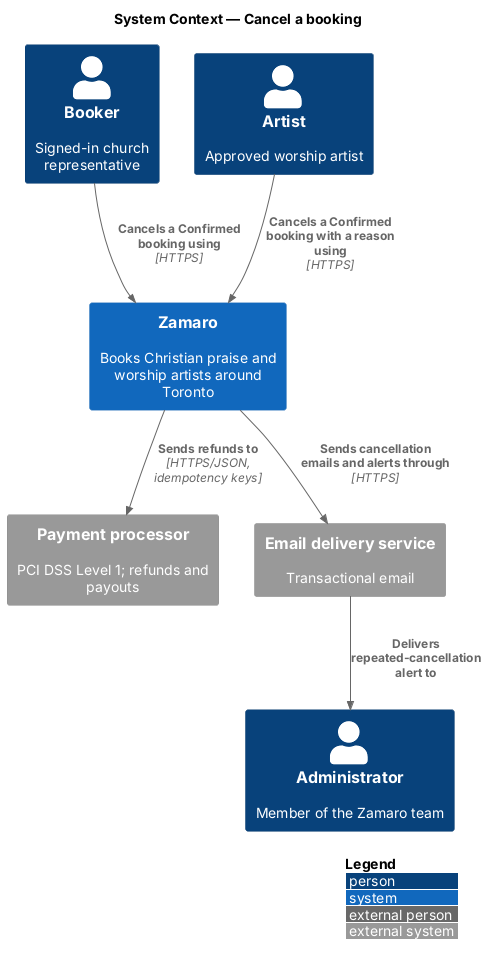
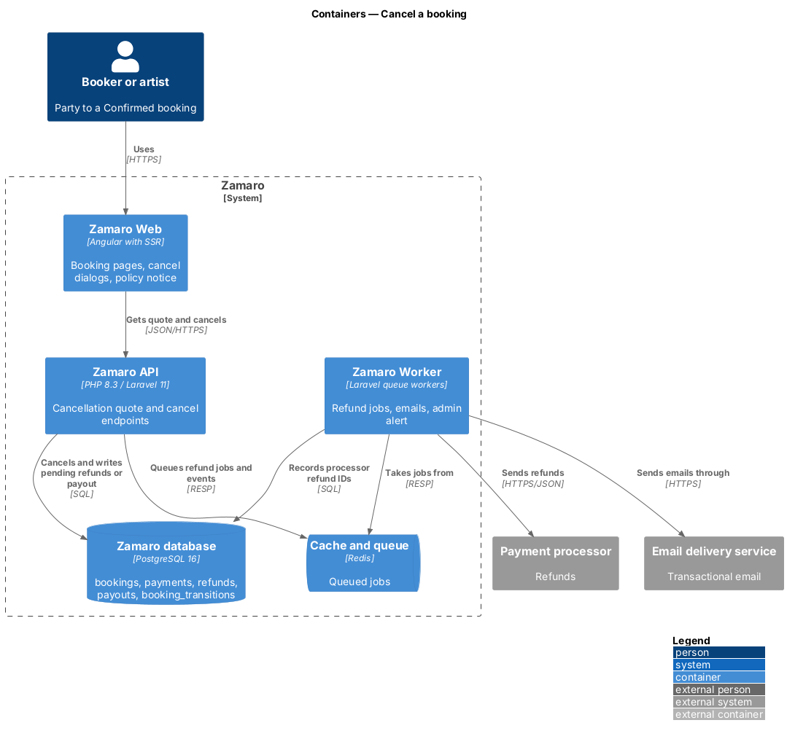
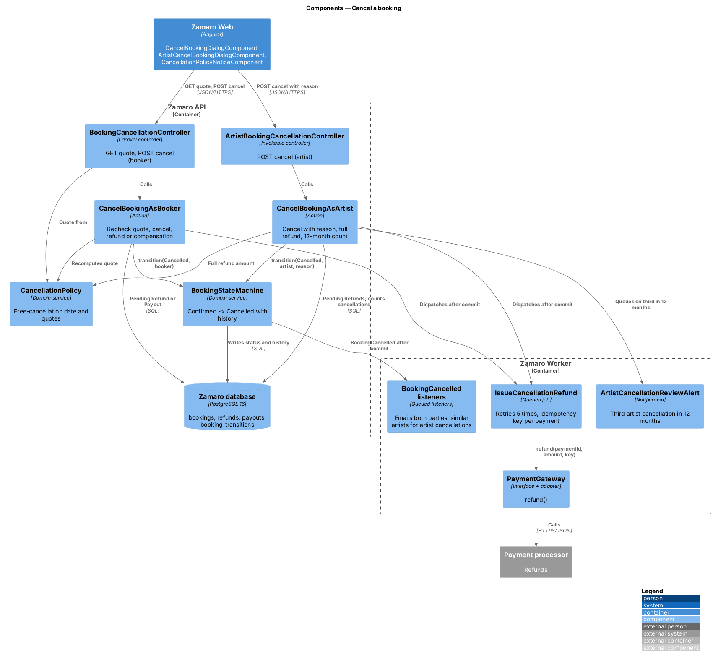
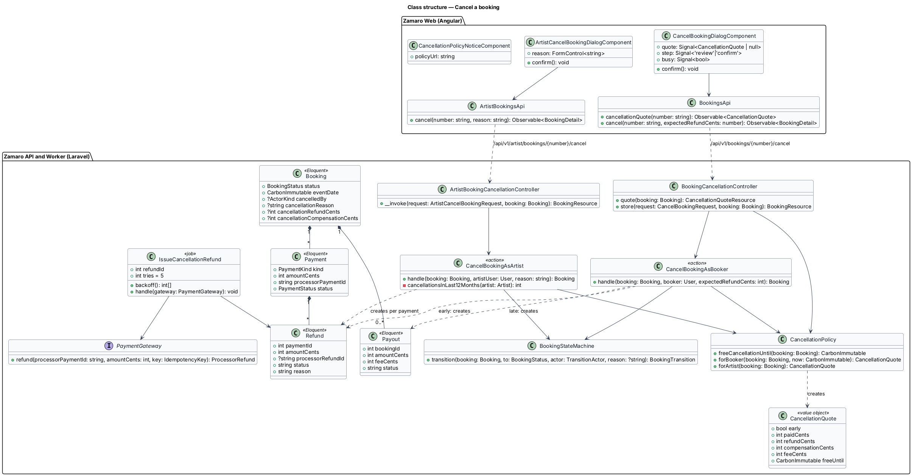
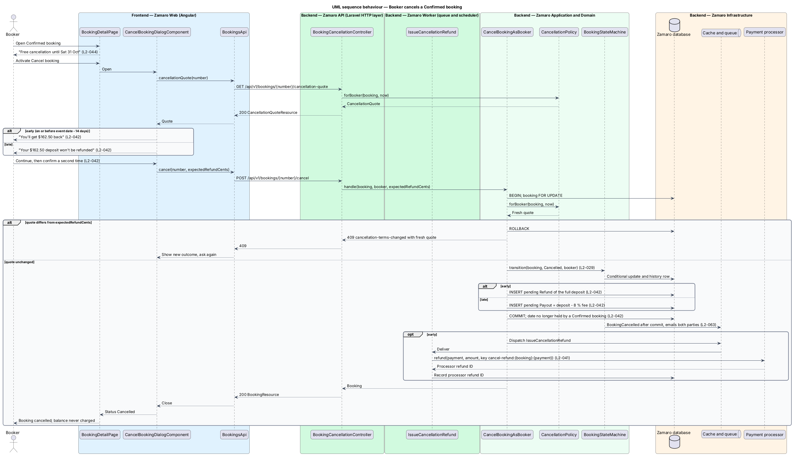
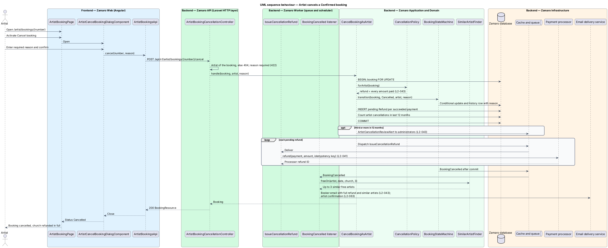

# Cancel a booking

## Overview

Zamaro lets churches in and around Toronto book Christian praise and worship
artists. Once the booker pays the deposit, a booking is Confirmed: the artist's date
is reserved and money has changed hands. Either party may still call it off.
Cancellation ends a Confirmed booking under a published, predictable refund policy,
so that neither side is surprised by what happens to the money.

The policy differs by who cancels:

- **Booker, early** — 14 or more full days before the event, the deposit comes back
  in full (L2-042).
- **Booker, late** — fewer than 14 days before, the deposit stays with the artist
  less the platform fee, and the balance is never charged (L2-042).
- **Artist, any time** — the booker gets back every amount paid, and is shown up to
  three similar artists free that date. A third artist cancellation within 12 months
  alerts an administrator (L2-043).

The policy is stated wherever a booker commits money: on the booking stub, on the
payment form and in the confirmation email, and as a dated line on the Confirmed
booking page (L2-044).

A booking that is not yet Confirmed is withdrawn rather than cancelled
(`bookings/withdraw-booking-request`). Status rules come from
`bookings/run-booking-lifecycle`. The deposit itself is `payments/pay-deposit`;
receipts for refunds are `payments/issue-receipts`; refund webhooks are
`payments/reconcile-payment-events`.

Terms used in this design:

- **cancellation** — transition of a Confirmed booking to Cancelled by the booker or the artist
- **free-cancellation date** — last calendar date on which a booker cancellation earns a full deposit refund: the event date minus 14 days, in `America/Toronto`
- **early cancellation** — booker cancellation on or before the free-cancellation date
- **late cancellation** — booker cancellation after the free-cancellation date
- **cancellation quote** — computed outcome of a cancellation for one party at one moment: refund amount, amount kept, artist compensation and fee
- **artist compensation** — amount paid to the artist after a late booker cancellation: the deposit minus the 8 % platform fee
- **cancellation reason** — required free text that an artist gives when cancelling
- **policy notice** — the sentence "Cancel free up to 14 days before your event." with a link to the full policy

## Description

The slice runs from the booking pages in Zamaro Web through the cancellation
endpoints of the Zamaro API to the Zamaro database. Refunds go to the payment
processor from a queued job in the Zamaro Worker.

**Frontend (Zamaro Web)**

- **`BookingDetailPage`** (`features/bookings`) — for a Confirmed booking, shows
  "Free cancellation until {short date}" from `freeCancellationUntil` (for example
  "Free cancellation until Sat 31 Oct") and a Cancel booking button (L2-044).
- **`CancelBookingDialogComponent`** — two-step design-system dialog. Step one loads
  the cancellation quote and states either "You'll get ${refund} back" or "Your
  ${deposit} deposit won't be refunded". Step two asks for a second confirmation
  before anything is sent (L2-042). The confirm button shows a busy state and blocks
  a second submission (L2-108). Step-two copy is `<TO SUPPLY>`.
- **`ArtistBookingPage`** (`features/artist-workspace`, `/artist/bookings/:number`)
  — for a Confirmed booking, shows a Cancel booking button.
- **`ArtistCancelBookingDialogComponent`** — dialog with a required reason textarea.
  It states that the church will be refunded in full. The reason length limit is
  `<TO SUPPLY>`.
- **`CancellationPolicyNoticeComponent`** (`shared/booking`) — renders the policy
  notice with a link to the full policy page. `BookingStubComponent` and the payment
  form of `payments/pay-deposit` embed it (L2-044). The policy page route is
  `<TO SUPPLY>`.
- **`BookingsApi`** — `cancellationQuote(number)` and `cancel(number,
  expectedRefundCents)`. **`ArtistBookingsApi`** — `cancel(number, reason)`.

**Backend (Zamaro API)**

- **Routes** — behind `auth:sanctum`; route binding scopes `{booking:number}` to the
  party, so anyone else receives 404 (L2-074):
  - `GET /api/v1/bookings/{number}/cancellation-quote` — booker;
  - `POST /api/v1/bookings/{number}/cancel` — booker;
  - `POST /api/v1/artist/bookings/{number}/cancel` — artist.
- **`BookingCancellationController`** — `quote` returns `CancellationQuoteResource`;
  `store` validates `CancelBookingRequest` (`expectedRefundCents`, integer) and calls
  `CancelBookingAsBooker`.
- **`ArtistBookingCancellationController`** — invokable; validates
  `ArtistCancelBookingRequest` (`reason`, required plain text) and calls
  `CancelBookingAsArtist`.
- **`CancellationPolicy`** — domain service:
  - `freeCancellationUntil(Booking)` returns the event date minus 14 days.
  - `forBooker(Booking, now)` returns a full deposit refund when today in
    `America/Toronto` is on or before that date. Otherwise it returns no refund, an
    artist compensation of the deposit minus 8 %, and the 8 % fee. For a $162.50
    deposit that is $149.50 to the artist and $13.00 kept (L2-042).
  - `forArtist(Booking)` returns a refund of everything the booker has paid: the sum
    of succeeded payments minus succeeded refunds (L2-043).

  Amounts are integer cents rounded half-up through `PriceBreakdown` (L2-036).
  Whether "14 full days" counts the free-cancellation date itself as qualifying is
  `<TO SUPPLY>`; this design treats the whole of that date as free.
- **`CancelBookingAsBooker`** — action run inside `DB::transaction`:
  1. locks the booking row and recomputes the quote;
  2. fails with 409 `cancellation-terms-changed` and the fresh quote when
     `expectedRefundCents` differs, for example when midnight passed while the dialog
     was open;
  3. applies Confirmed → Cancelled through `BookingStateMachine` with the booker as
     actor (L2-029);
  4. stores `cancelled_by = Booker` and the quote on the booking;
  5. writes a pending `Refund` for an early cancellation, or a pending `Payout` of
     the artist compensation for a late one, which the payout run of L2-039 pays.

  The balance is never charged after any cancellation, because
  `payments/collect-balance` charges only Completed bookings (L2-042).
- **`CancelBookingAsArtist`** — action with the same structure. It applies the
  transition with the artist as actor and the reason, writes a pending `Refund` for
  each succeeded payment, and counts the artist's cancellations in the last 12
  months from `booking_transitions` (to-status Cancelled, actor kind Artist). On the
  third or later it queues `ArtistCancellationReviewAlert` to administrators
  (L2-043).
- **`IssueCancellationRefund`** — queued job dispatched after commit for each pending
  `Refund`. It calls `PaymentGateway::refund()` with the idempotency key
  `cancel-refund:{bookingId}:{paymentId}` (L2-041) and records the processor refund
  ID. It retries with exponential backoff up to 5 times, then alerts (L2-092). The
  refund webhook finalises the status, and the receipt follows (L2-040).
- **Emails** — `BookingCancelled` emails both parties after commit (L2-063). For an
  artist cancellation, the booker email lists up to three similar artists free on
  the date from `SimilarArtistFinder::freeOn()` (L2-043). The confirmation email of
  `payments/pay-deposit` includes the shared Blade partial
  `emails.partials.cancellation-policy` with the policy notice (L2-044).
- **Date freed** — Free is derived from Confirmed bookings, so the Cancelled booking
  stops blocking the date at commit. The partial unique index
  `bookings_one_confirmed_per_artist_date` no longer covers the row, and the
  calendar returns the date to its prior state (L2-042, L2-057). Event reminders
  check status before sending, so none goes out (L2-064).
- **`BookingResource.freeCancellationUntil`** — set for Confirmed bookings, read by
  `BookingDetailPage`.

**Data (Zamaro database)**

- `bookings` — adds `cancelled_by` (`Booker` or `Artist`), `cancellation_reason`,
  `cancellation_refund_cents`, `cancellation_compensation_cents`.
- `refunds` and `payouts` — rows created pending by the actions above.
- `booking_transitions` — the Confirmed → Cancelled row with actor and reason; the
  source of the 12-month artist count.

## Requirements

The feature realises the following level-2 (L2) requirements. Each refines the
level-1 (L1) requirement shown, and the text is quoted from `docs/specs/L2.md`.

| L2 ID | Refines (L1) | Requirement |
|-------|--------------|-------------|
| `L2-042` | `L1-008` | **Booker cancels a Confirmed booking.** Acceptance criteria: 1. Given a Confirmed booking 14 or more full days before the event date, when the booker cancels, then the deposit is refunded in full and the booking becomes Cancelled. 2. Given a Confirmed booking fewer than 14 days before the event date, when the booker cancels, then the deposit is not refunded, the artist is paid the deposit minus the 8% fee, and the balance is never charged. 3. Given the cancel dialog, when it opens, then it states the exact refund amount (for example "You'll get $162.50 back") or "Your $162.50 deposit won't be refunded", and requires a second confirmation. 4. Given the cancellation, when it completes, then the artist's date becomes free again. |
| `L2-043` | `L1-008` | **Artist cancels a Confirmed booking.** Acceptance criteria: 1. Given a Confirmed booking, when the artist cancels with a required reason, then every amount the booker paid is refunded in full and the booking becomes Cancelled. 2. Given the artist cancels, when the booker is notified, then the notification lists up to 3 similar artists free on the same date. 3. Given an artist cancels a third Confirmed booking within 12 months, when it happens, then an administrator is alerted for review. |
| `L2-044` | `L1-008` | **Cancellation policy visibility.** Acceptance criteria: 1. Given the booking stub, the payment form and the confirmation email, when they render, then each states "Cancel free up to 14 days before your event." with a link to the full policy. 2. Given the booker's booking page, when the booking is Confirmed, then it shows the last date for a free cancellation (for example "Free cancellation until Sat 31 Oct"). |

## Diagrams

### System context

Bookers and artists cancel in Zamaro. Zamaro refunds through the payment processor,
emails both parties and alerts administrators about repeated artist cancellations.

### Containers

Zamaro Web calls the cancellation endpoints of the Zamaro API, which writes the
outcome. The Zamaro Worker sends the refunds to the processor and the emails to the
parties.

### Components

Both cancellation actions ask `CancellationPolicy` for the outcome and change status
through `BookingStateMachine`. `IssueCancellationRefund` carries each refund to
`PaymentGateway` after commit.

### Class structure

`CancellationPolicy` produces a `CancellationQuote` for one party. The actions turn
the quote into a Cancelled `Booking` with pending `Refund` or `Payout` rows.

### Behaviour — booker cancels

The dialog shows the exact outcome and asks twice. The API recomputes the quote,
cancels, and either refunds the deposit or records the artist compensation.

### Behaviour — artist cancels

The artist gives a reason. Every amount the booker paid is refunded, the booker is
shown similar free artists, and a third cancellation in 12 months alerts an
administrator.

