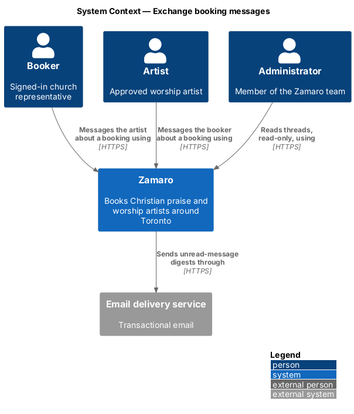
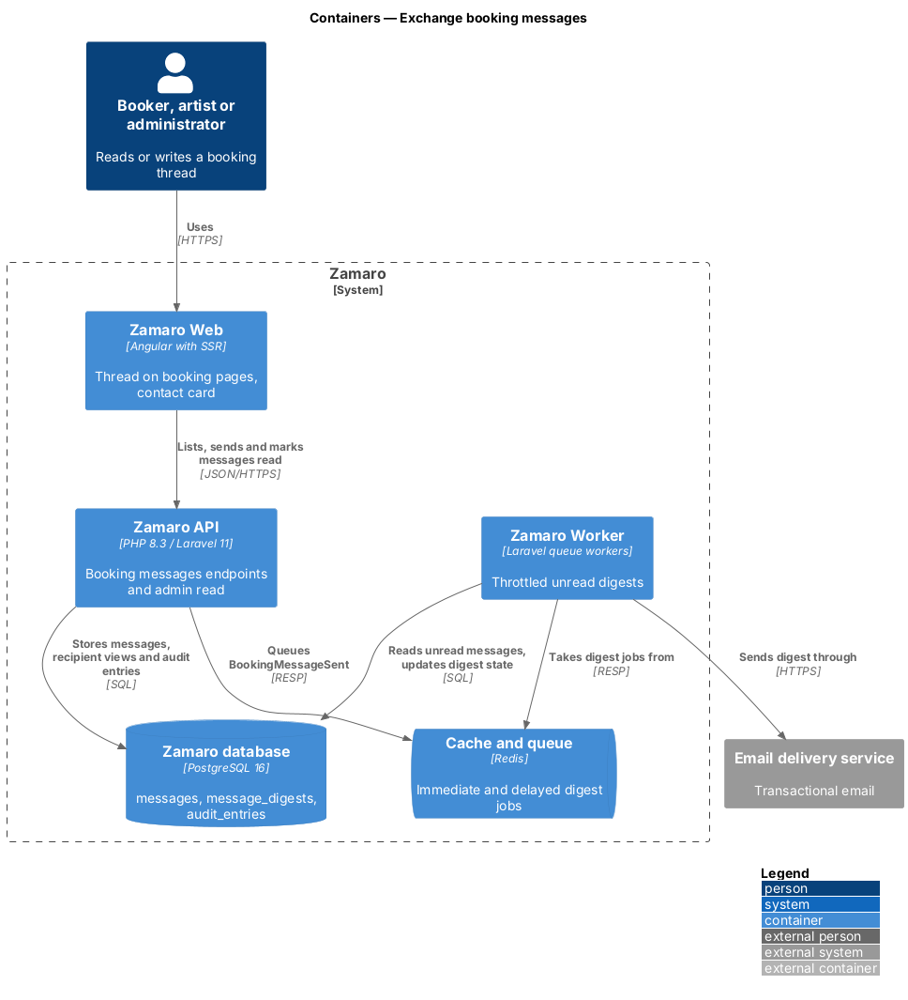
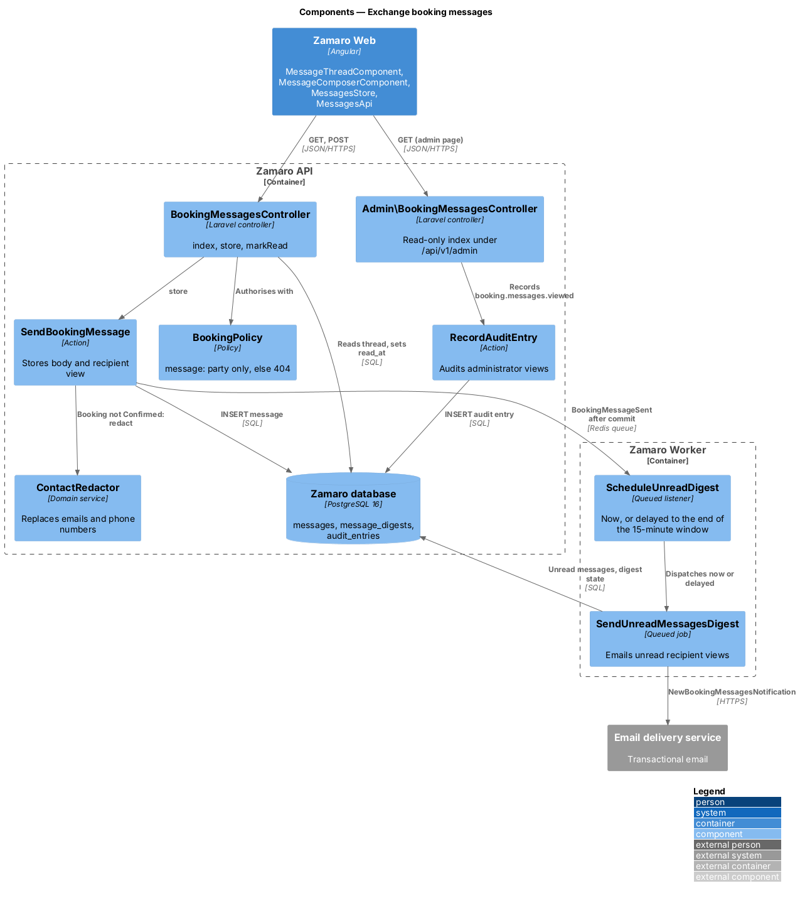
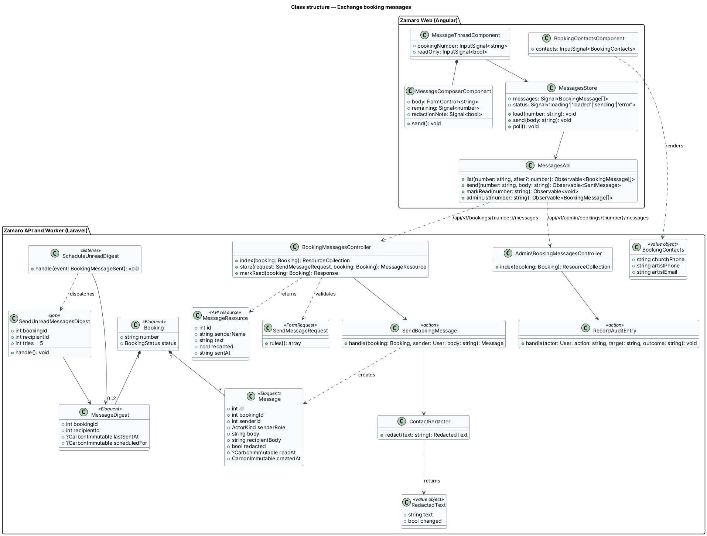
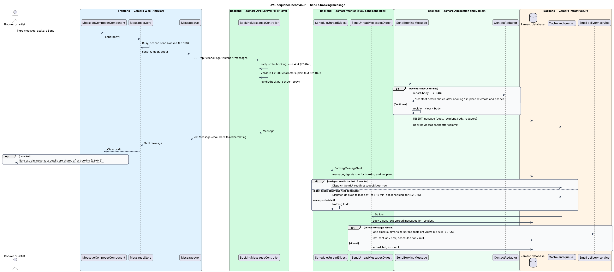
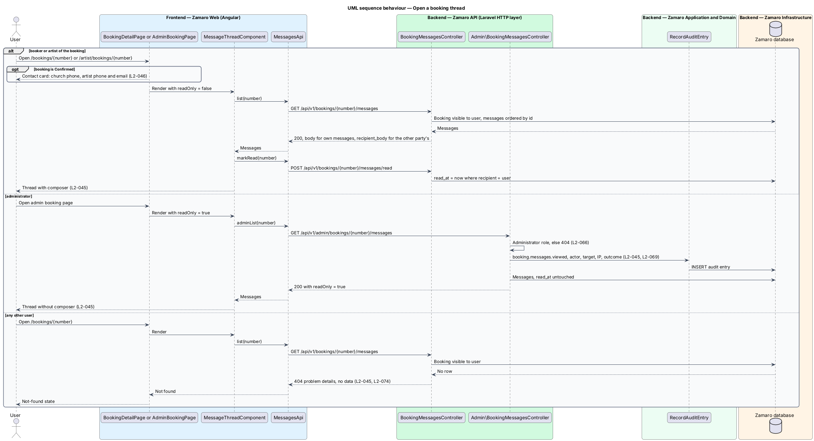

# Exchange booking messages

## Overview

Zamaro lets churches in and around Toronto book Christian praise and worship
artists. Between a request and the event, a booker and an artist usually have
things to settle: the order of service, the songs, sound and parking. Each booking
therefore carries its own message thread, so the conversation stays attached to
the booking it concerns.

The thread also protects both parties. Until a booking is Confirmed, nobody has
paid and nobody is committed, so the platform keeps private contact details out of
the conversation: an email address or phone number in a message is replaced before
the recipient sees it. Once the booking is Confirmed, the booking page shows each
side's contact details directly.

This feature covers the thread on the booker's booking page (`/bookings/:number`,
from `bookings/view-booker-bookings`) and on the artist's booking page
(`/artist/bookings/:number`), the email digest that tells the other party about
unread messages, the contact-detail rule, and an administrator's read-only view.
The administrator booking page itself belongs to
`administration/support-bookings-and-payments`; the audit log belongs to
`administration/record-audit-log`. The optional message sent with a request
(`bookings/send-booking-request`) is the first entry of the thread.

Terms used in this design:

- **booking thread** — ordered list of messages between the booker and the artist of one booking
- **party** — the booker or the artist of a booking
- **message** — plain-text entry of 1 to 2,000 characters written by one party
- **contact details** — email addresses and phone numbers found in message text
- **redaction** — replacement of contact details with "[contact details shared after booking]" in the copy of a message that the recipient sees
- **recipient view** — text of a message as the other party sees it, after any redaction
- **unread digest** — email to one party that summarises the messages they have not read on one booking, sent at most once per 15 minutes per booking
- **contact card** — block on a Confirmed booking page showing the church phone, and the artist's contact phone and email

## Description

The slice runs from the thread component in Zamaro Web through the booking messages
endpoints of the Zamaro API to the Zamaro database. Digest emails are queued and
sent by the Zamaro Worker.

**Frontend (Zamaro Web, shared in `shared/booking`)**

- **`MessageThreadComponent`** — renders the booking thread oldest first, with sender
  name, en-CA timestamp (L2-110) and text as plain text with preserved line breaks.
  Text goes through Angular interpolation only, never `innerHTML` (L2-075). A
  `readOnly` input hides the composer; the administrator page sets it.
- **`MessageComposerComponent`** — textarea with a live count against 2,000
  characters and a Send button. Send shows a busy state and blocks a second
  submission (L2-108). When the API reports that a message was redacted, the
  composer shows a note to the sender explaining that contact details are shared
  after the booking is confirmed; the note copy is `<TO SUPPLY>`.
- **`BookingContactsComponent`** — the contact card, rendered when the booking
  resource includes `contacts` (L2-046).
- **`MessagesStore`** — signal-based store per booking holding the messages, the
  newest ID, a status and the draft. It polls for new messages while the thread is
  visible and marks them read. The polling interval is `<TO SUPPLY>`.
- **`MessagesApi`** — typed client for `list(number, after?)`, `send(number, body)`
  and `markRead(number)`, plus `adminList(number)` for the administrator page.

**Backend (Zamaro API)**

- **Routes** — behind `auth:sanctum`:
  - `GET /api/v1/bookings/{number}/messages?after=` — parties only;
  - `POST /api/v1/bookings/{number}/messages` — parties only;
  - `POST /api/v1/bookings/{number}/messages/read` — parties only;
  - `GET /api/v1/admin/bookings/{number}/messages` — Administrator role (L2-066).

  Route binding resolves `{booking:number}` through `Booking::visibleTo($user)`, so
  any user who is not the booker or the artist receives 404 (L2-045, L2-074). No
  admin route writes a message.
- **`BookingMessagesController`** — `index`, `store` and `markRead`, each authorised
  by `BookingPolicy::message`. Messages may be read and sent in every booking status
  (L2-045).
- **`SendMessageRequest`** — FormRequest validating `body` as a string of 1 to 2,000
  characters after trimming (L2-045, L2-075).
- **`SendBookingMessage`** — action that stores one `Message`:
  1. keeps the original text as `body`;
  2. when the booking is not Confirmed, asks `ContactRedactor` for the recipient view
     and stores it as `recipient_body` with `redacted = true` if anything changed
     (L2-046);
  3. dispatches `BookingMessageSent` after commit.

  The response carries the sender's own text and the `redacted` flag.
- **`ContactRedactor`** — domain service. `redact(string): RedactedText` replaces
  email addresses (pattern match) and phone numbers (libphonenumber
  `PhoneNumberMatcher`, region CA) with "[contact details shared after booking]".
  Handling of obfuscated forms such as "name at example dot com" is `<TO SUPPLY>`.
- **Recipient view** — `MessageResource` returns `body` to the sender and
  `recipient_body` to the recipient. Redaction is fixed at send time. Whether
  messages redacted before confirmation are revealed after confirmation is
  `<TO SUPPLY>`.
- **`ScheduleUnreadDigest`** — queued listener for `BookingMessageSent`. It reads the
  `message_digests` row for the booking and recipient:
  - no digest in the last 15 minutes → dispatches `SendUnreadMessagesDigest` now;
  - otherwise, if none is scheduled → dispatches it delayed until 15 minutes after
    the last one and records `scheduled_for`.
- **`SendUnreadMessagesDigest`** — queued job that locks the `message_digests` row,
  loads the recipient's unread messages on the booking and, when any remain, sends
  `NewBookingMessagesNotification` with the count and the recipient views (L2-045,
  L2-063). It sets `last_sent_at` and clears `scheduled_for`. A message read before
  the job runs is not emailed. Retries follow L2-092.
- **Read tracking** — `markRead` sets `read_at` on messages where the signed-in user
  is the recipient. An administrator view never marks messages read.
- **Administrator view** — `Admin\BookingMessagesController@index` returns the thread
  with `readOnly: true` and calls `RecordAuditEntry` with action
  `booking.messages.viewed`, the booking number as target, the actor, IP address and
  outcome (L2-045, L2-069). Whether the administrator sees original text, recipient
  views or both is `<TO SUPPLY>`.
- **Contact card** — `BookingResource` includes `contacts` only while the booking is
  Confirmed (L2-046): the church phone, decrypted from `churches.phone`, and the
  artist's contact phone and account email. The source field for the artist's
  contact phone is `<TO SUPPLY>`; no L2 requirement names one. Whether the card stays
  visible after Completed is `<TO SUPPLY>`.

**Data (Zamaro database)**

- `messages` — `id`, `booking_id`, `sender_id`, `sender_role` (Booker or Artist),
  `body`, `recipient_body`, `redacted`, `read_at`, `created_at`. Index on
  (`booking_id`, `id`). Message text is personal data covered by L2-079 and
  L2-081.
- `message_digests` — `booking_id`, `recipient_id`, `last_sent_at`,
  `scheduled_for`; primary key (`booking_id`, `recipient_id`).
- `audit_entries` — one row per administrator view.

## Requirements

The feature realises the following level-2 (L2) requirements. Each refines the
level-1 (L1) requirement shown, and the text is quoted from `docs/specs/L2.md`.

| L2 ID | Refines (L1) | Requirement |
|-------|--------------|-------------|
| `L2-045` | `L1-009` | **Booking messages.** Acceptance criteria: 1. Given a booking in any status, when the booker or the artist opens it, then they see a message thread and can send plain-text messages of 1–2,000 characters. 2. Given a new message, when it is sent, then the other party is emailed at most once per 15 minutes per booking summarising unread messages. 3. Given a user who is not the booker, the artist or an administrator, when they request the thread, then the response is 404. 4. Given an administrator, when they view a thread, then it is read-only and the view is recorded in the audit log. |
| `L2-046` | `L1-009` | **Contact details before confirmation.** Acceptance criteria: 1. Given a booking that is not yet Confirmed, when a message contains an email address or a phone number, then that part is replaced with "[contact details shared after booking]" for the recipient and the sender sees a note explaining why. 2. Given a Confirmed booking, when either party opens it, then the booker's church phone and the artist's contact phone and email are shown. |

## Diagrams

### System context

The booker and the artist message each other in Zamaro, which emails each one a
digest of unread messages. Administrators read threads without writing to them.

### Containers

The thread in Zamaro Web calls the messages endpoints of the Zamaro API, which store
messages and audit entries. The Zamaro Worker sends the throttled digests.

### Components

`SendBookingMessage` stores each message with a recipient view from
`ContactRedactor`. `ScheduleUnreadDigest` and `SendUnreadMessagesDigest` enforce the
15-minute email limit, and the admin controller records each view.

### Class structure

A `Booking` owns its `Message` rows and one `MessageDigest` per recipient. The
frontend store mirrors the three party endpoints and the admin read.

### Behaviour — send a message

The sender's message is stored with a redacted recipient view while the booking is
not Confirmed. The other party is emailed at once, or when the 15-minute window
closes if a digest was sent recently.

### Behaviour — open a thread

A party sees the thread, and the contact card once the booking is Confirmed. An
administrator sees a read-only thread and the view is audited. Anyone else receives
404.

