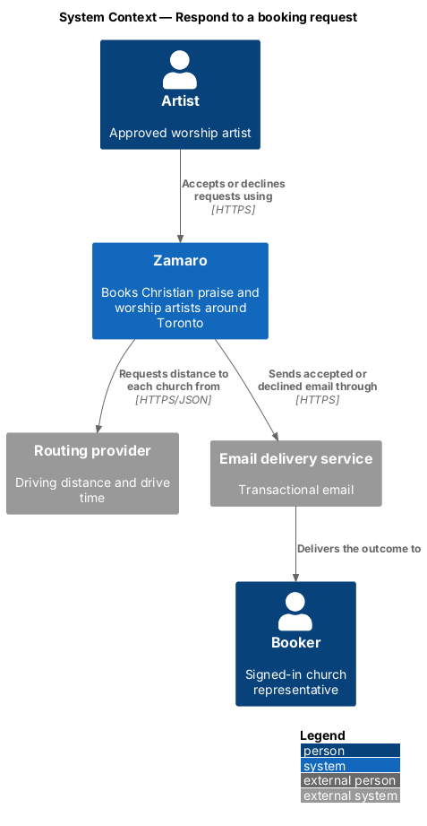
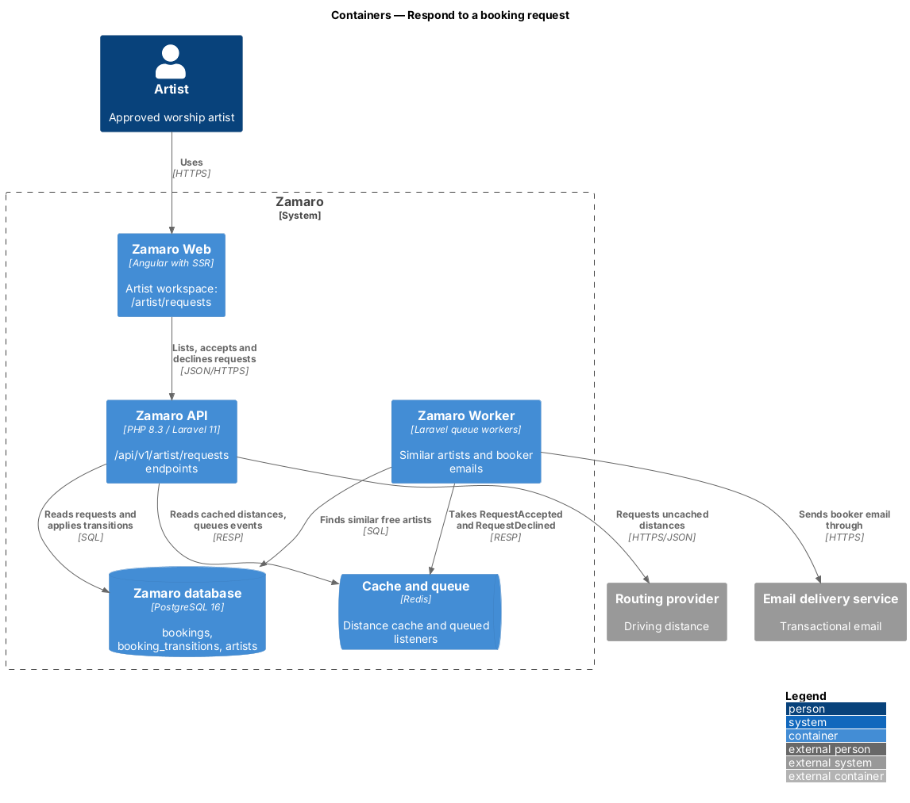
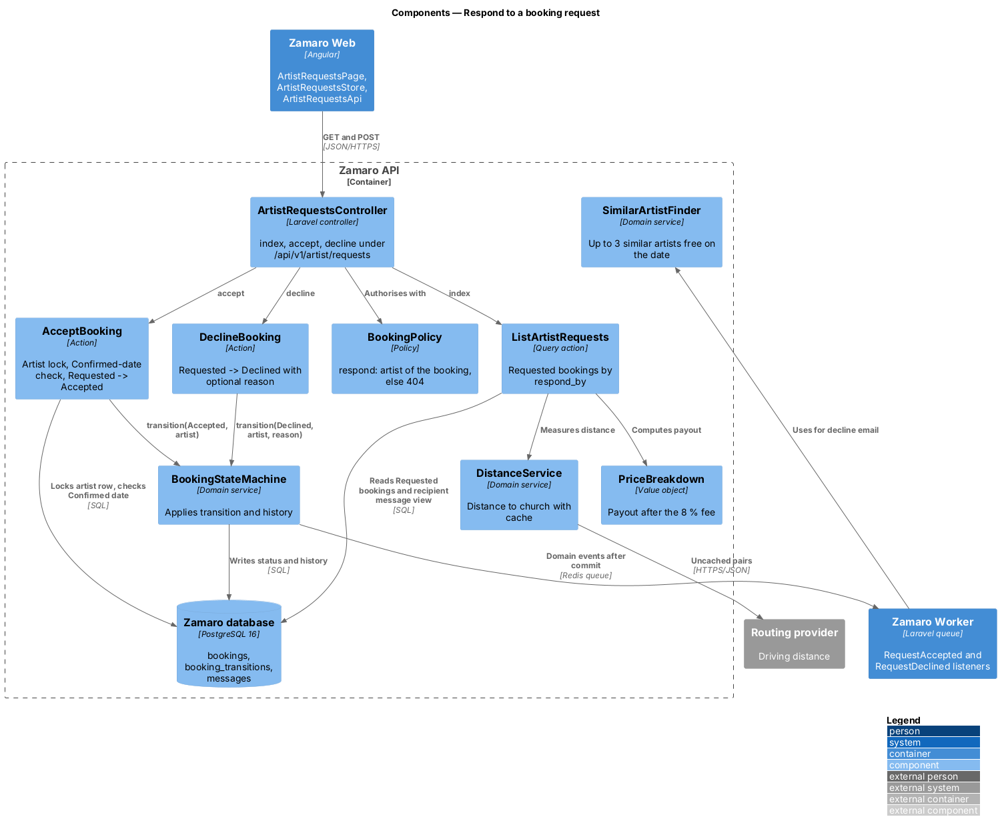
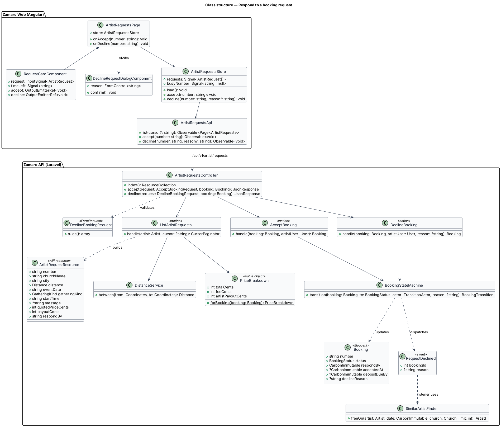
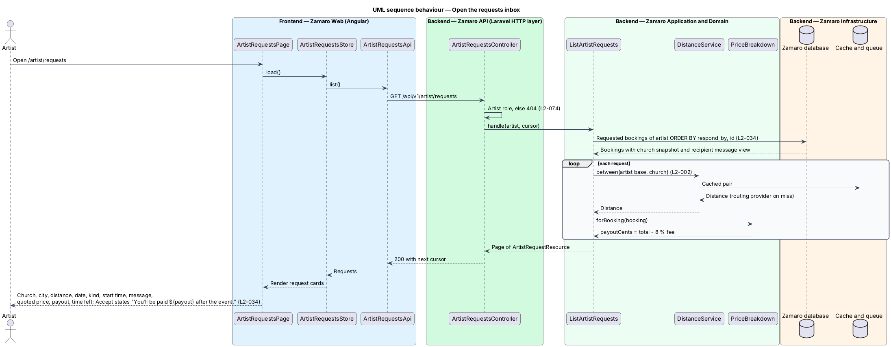
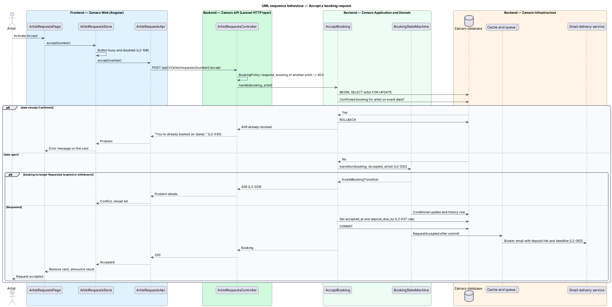
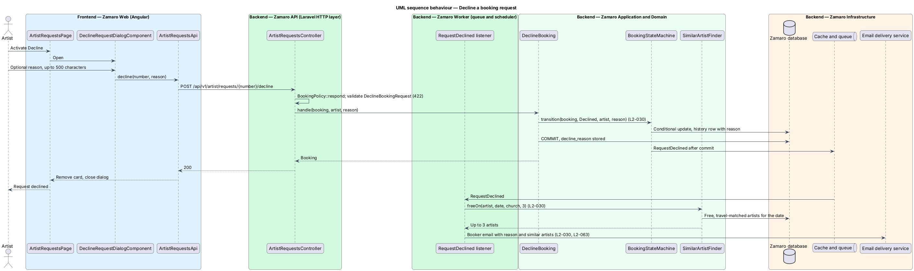

# Respond to a booking request

## Overview

Zamaro lets churches in and around Toronto book Christian praise and worship
artists. A booker starts a booking by sending a request (`bookings/send-booking-request`).
The artist then decides: accept, which asks the booker to pay a deposit, or
decline, which ends the booking and points the booker to other artists.

This feature is the artist's side of that decision. It covers the requests inbox
at `/artist/requests`, the Accept action and the Decline action with its optional
reason. A request the artist never answers expires on schedule; that transition is
owned by `bookings/run-booking-lifecycle`. The deposit that follows acceptance is
`payments/pay-deposit`.

Terms used in this design:

- **requests inbox** — artist workspace page listing the artist's bookings in status Requested, soonest deadline first
- **response deadline** — instant by which the artist answers: 72 hours after the request, or 24 hours when the event is fewer than 7 days away (L2-030)
- **time left** — interval between now and the response deadline, shown on each request
- **platform fee** — 8 % of the total that Zamaro keeps from each booking (L2-039)
- **payout** — amount the artist receives after the event: total collected minus the platform fee
- **similar artist** — another artist free on the same date who travels to the church, chosen by `SimilarArtistFinder`, the service shared with the missing-artist page (L2-021) and artist cancellations (L2-043); its similarity rule is `<TO SUPPLY>`
- **decline reason** — optional free text of up to 500 characters that the artist gives with a decline

## Description

The slice runs from the artist workspace in Zamaro Web through the artist requests
endpoints of the Zamaro API to the Zamaro database. Emails to the booker are queued
and sent by the Zamaro Worker.

**Frontend (Zamaro Web, `features/artist-workspace`)**

- **`ArtistRequestsPage`** — routed page component for `/artist/requests`, behind
  the Artist role guard. It renders one `RequestCardComponent` per request, in the
  order the API returns. The empty-state copy is `<TO SUPPLY>`.
- **`RequestCardComponent`** — presentational ticket card showing church name, city,
  distance, short date, kind of gathering, start time, the request message as the
  artist sees it, quoted price, payout after the fee and time left (L2-034). Time
  left refreshes each minute from `respondBy`. The Accept button carries the line
  "You'll be paid ${payout} after the event." Money, dates, times and distance use
  `FormatService` (L2-110).
- **`DeclineRequestDialogComponent`** — design-system dialog with an optional reason
  textarea limited to 500 characters and a Decline button.
- **`ArtistRequestsStore`** — signal-based store holding the list, the cursor, a
  status, and the number of the request being acted on. After a successful accept
  or decline it removes the card and announces the result through `LiveAnnouncer`.
  A 409 reloads the list.
- **`ArtistRequestsApi`** — typed client for the three endpoints below. Accept and
  Decline buttons show a busy state and block a second submission while pending
  (L2-108).

**Backend (Zamaro API)**

- **Routes** — all under the Artist role. A booker calling them receives 404
  (L2-074). A request that belongs to another artist also returns 404, because
  route binding scopes `{booking:number}` to the signed-in artist.
  - `GET /api/v1/artist/requests` returns the inbox with cursor pagination
    (L2-095).
  - `POST /api/v1/artist/requests/{number}/accept` accepts.
  - `POST /api/v1/artist/requests/{number}/decline` declines.
- **`ArtistRequestsController`** — thin controller with `index`, `accept` and
  `decline`, each authorised by `BookingPolicy::respond`.
- **`ListArtistRequests`** — query action. It selects the artist's Requested bookings
  ordered by `respond_by`, then `id`, and for each builds an `ArtistRequestResource`:
  - distance from `DistanceService::between(artist base, church snapshot)`
    (L2-002);
  - payout from `PriceBreakdown::forBooking(booking)->artistPayoutCents`, the total
    minus the 8 % fee (for a $650 quote, $598.00);
  - the request message in the recipient view stored by
    `bookings/exchange-booking-messages`, with contact details replaced (L2-046);
  - `respondBy`, from which Zamaro Web computes time left.
- **`AcceptBookingRequest`** — FormRequest with no body fields; it exists for the
  authorisation hook.
- **`AcceptBooking`** — action run inside `DB::transaction`:
  1. locks the artist row with `SELECT ... FOR UPDATE`, the same lock
     `payments/pay-deposit` takes when it confirms;
  2. checks that the artist has no Confirmed booking on the date, and otherwise
     fails with 409 `already-booked` and the copy "You're already booked on {date}."
     (L2-030);
  3. applies Requested → Accepted through `BookingStateMachine` with the artist as
     actor; a request that already expired or was withdrawn fails with 409
     (L2-029);
  4. stores `accepted_at` and `deposit_due_by`, using the deposit deadline rule of
     `payments/pay-deposit` (L2-037).

  After commit, `RequestAccepted` emails the booker with the deposit link and
  deadline (L2-063). The booker's next action on `/bookings` becomes Pay deposit.
- **`DeclineBookingRequest`** — FormRequest validating `reason` as optional plain
  text of at most 500 characters.
- **`DeclineBooking`** — action that applies Requested → Declined with the artist as
  actor and the reason stored on the transition and as `bookings.decline_reason`.
  After commit, `RequestDeclined` queues the booker email (L2-030, L2-063).
- **`SimilarArtistFinder`** — domain service shared with discovery and
  cancellation. `freeOn(artist, date, church, limit: 3)` returns up to three other
  artists who are free on the date and travel to the church. The decline email
  lists them with links to their profiles carrying the date. The listener runs in
  the Zamaro Worker, so the search does not delay the artist's response.
- **Expiry** — `bookings/run-booking-lifecycle` expires Requested bookings when
  `respond_by` passes and emails both parties (L2-030). An Accept that arrives after
  expiry fails with 409 and the card disappears on reload.

**Data (Zamaro database)**

- `bookings` — reads `respond_by`, church snapshot, `quoted_price_cents`,
  `hst_cents`; writes `status`, `accepted_at`, `deposit_due_by`, `decline_reason`.
- `bookings_artist_requested_idx` — partial index on (`artist_id`, `respond_by`)
  `WHERE status = 'Requested'` for the inbox query.
- `booking_transitions` — one row per accept or decline, with the reason for a
  decline.

## Requirements

The feature realises the following level-2 (L2) requirements. Each refines the
level-1 (L1) requirement shown, and the text is quoted from `docs/specs/L2.md`.

| L2 ID | Refines (L1) | Requirement |
|-------|--------------|-------------|
| `L2-030` | `L1-006` | **Artist accepts or declines.** Acceptance criteria: 1. Given a Requested booking, when the artist accepts, then it becomes Accepted and the booker is asked to pay the deposit (L2-037). 2. Given a Requested booking, when the artist declines with an optional reason of up to 500 characters, then it becomes Declined and the booker is notified with the reason and 3 similar artists free on that date. 3. Given a Requested booking with no response for 72 hours, or 24 hours when the event is fewer than 7 days away, when the deadline passes, then it becomes Expired and both parties are notified. 4. Given an artist tries to accept a request for a date that already has a Confirmed booking, when they accept, then it is rejected with "You're already booked on {date}." |
| `L2-034` | `L1-006` | **Artist requests inbox.** Acceptance criteria: 1. Given an artist, when they open `/artist/requests`, then they see Requested bookings ordered by response deadline, each showing church name, city, distance, date, kind of gathering, start time, message, quoted price, their payout after the fee and the time left to respond. 2. Given a Requested booking, when it is viewed, then Accept and Decline actions are available and Accept states "You'll be paid ${payout} after the event." |

## Diagrams

### System context

The artist answers requests in Zamaro. Zamaro asks the routing provider for the
distance to each church and emails the booker the outcome.

### Containers

The artist workspace in Zamaro Web calls the artist requests endpoints of the Zamaro
API. The API writes the decision; the Zamaro Worker finds similar artists and sends
the booker email.

### Components

`ArtistRequestsController` delegates to `ListArtistRequests`, `AcceptBooking` and
`DeclineBooking`. Both decisions pass through `BookingStateMachine`, and the decline
email uses `SimilarArtistFinder`.

### Class structure

The inbox store holds `ArtistRequest` entries built by `ListArtistRequests`. The
accept and decline actions change a `Booking` through the state machine.

### Behaviour — open the requests inbox

The inbox lists Requested bookings by response deadline, each with distance, payout
after the fee and time left.

### Behaviour — accept a request

Acceptance locks the artist row, refuses a date that is already Confirmed and moves
the booking to Accepted. The booker is emailed the deposit link and deadline.

### Behaviour — decline a request

The artist may give a reason. The booking becomes Declined, and the booker email
carries the reason and up to three similar artists free that date.

