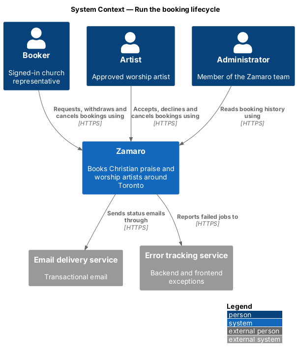
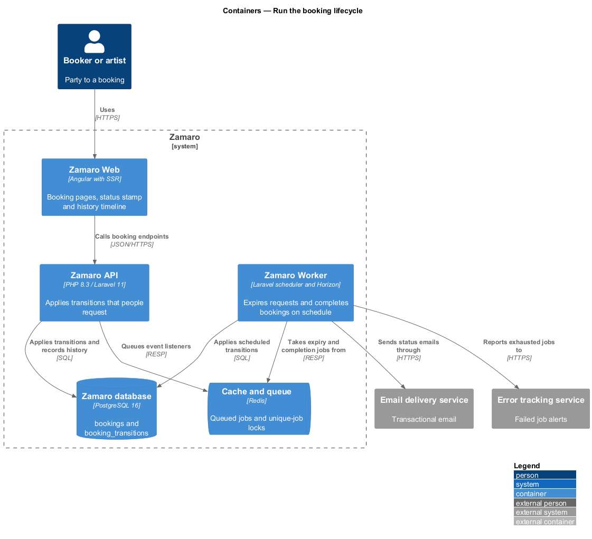
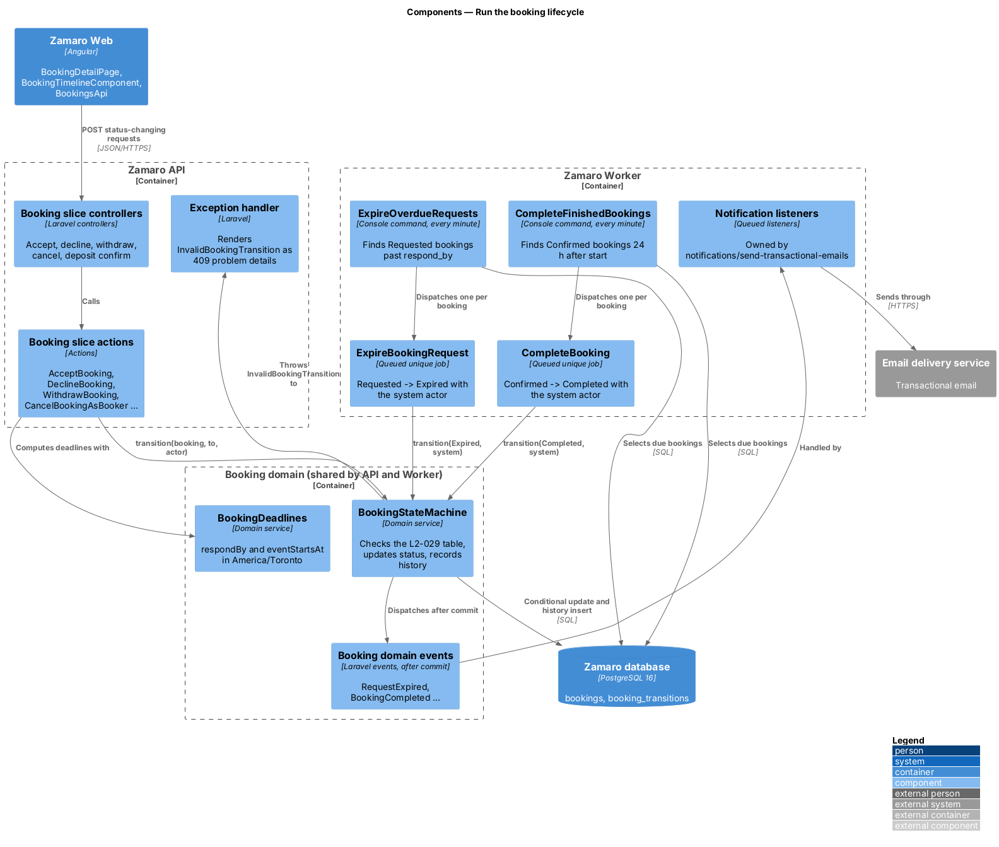
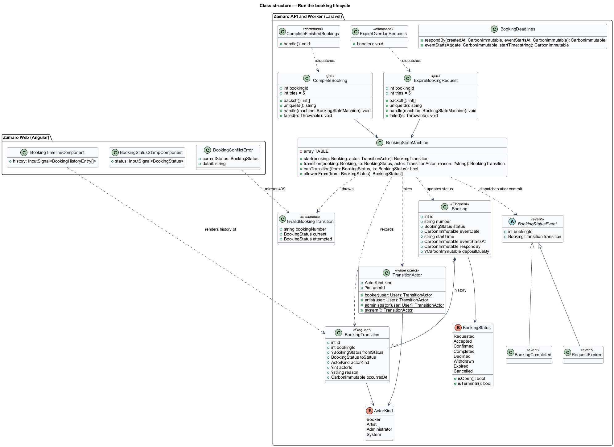
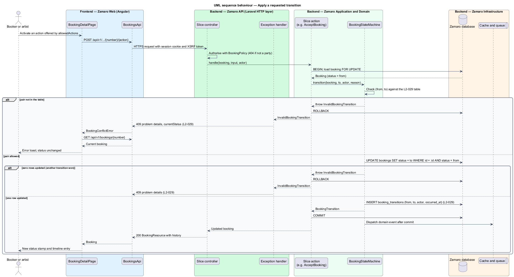
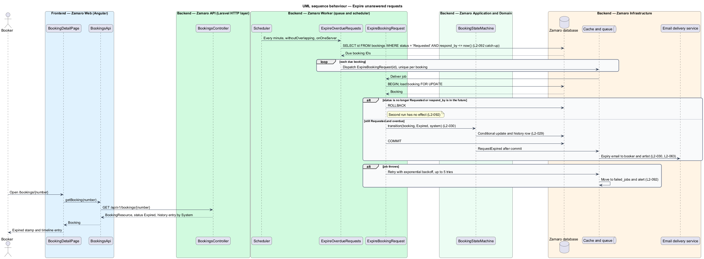
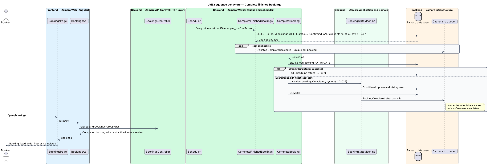

# Run the booking lifecycle

## Overview

Zamaro lets churches in and around Toronto book Christian praise and worship
artists. A booking is one church's request to have one artist lead one gathering on
one date. From the moment a booker sends it until the event is over, or until the
booking ends early, a booking holds exactly one status.

This feature is the engine that owns those statuses. It defines the table of
allowed transitions, records the history of every transition, and runs the
scheduled jobs that move a booking forward when a deadline passes rather than when
a person acts. It has no page of its own; its results show on every booking page.

Every other booking slice changes status only through this engine:

- `bookings/send-booking-request` creates a booking in Requested.
- `bookings/respond-to-booking-request` moves Requested to Accepted or Declined.
- `bookings/withdraw-booking-request` moves Requested or Accepted to Withdrawn.
- `bookings/cancel-booking` moves Confirmed to Cancelled.
- `payments/pay-deposit` moves Accepted to Confirmed, expires unpaid deposits and
  declines competing requests (L2-032).

The engine itself owns two time-driven transitions: expiry of a request the artist
never answered, and completion of a booking after its event.

Terms used in this design:

- **booking status** — one of eight values a booking holds at a time: Requested, Accepted, Confirmed, Completed, Declined, Withdrawn, Expired, Cancelled
- **transition** — change of one booking from one status to another, made by one actor
- **actor** — party that causes a transition: the booker, the artist, an administrator or the system scheduler
- **open status** — Requested or Accepted, a status in which the artist has not yet been secured
- **terminal status** — status with no outgoing transition: Completed, Declined, Withdrawn, Expired, Cancelled
- **response deadline** — instant by which the artist answers a Requested booking: 72 hours after creation, or 24 hours when the event is fewer than 7 days away
- **event start** — event date and service start time read as `America/Toronto` wall-clock time
- **booking history** — append-only list of the transitions of one booking

The allowed transitions are fixed by L2-029. Any other attempt fails with HTTP 409
and leaves the status unchanged.

| From | Allowed to |
|------|------------|
| Requested | Accepted, Declined, Withdrawn, Expired |
| Accepted | Confirmed, Declined, Withdrawn, Expired |
| Confirmed | Completed, Cancelled |
| Completed, Declined, Withdrawn, Expired, Cancelled | none |

## Description

The slice lives mostly in the Zamaro API and the Zamaro Worker, which share one
Laravel code base. The frontend shows the result as a status stamp and a history
timeline.

**Backend — domain (shared by Zamaro API and Zamaro Worker)**

- **`BookingStatus`** — backed enum (`App\Enums\BookingStatus`) with the eight
  cases. `isOpen()` returns true for Requested and Accepted; `isTerminal()` returns
  true for the five end states.
- **`BookingStateMachine`** — the only class that writes `bookings.status`. Its
  `transition(Booking, BookingStatus $to, TransitionActor $actor, ?string $reason)`
  method:
  1. checks the pair against the transition table and throws
     `InvalidBookingTransition` when it is absent;
  2. runs a conditional update, `UPDATE bookings SET status = :to WHERE id = :id AND
     status = :from`, inside the caller's transaction;
  3. treats zero affected rows as a lost race, reloads the booking and throws
     `InvalidBookingTransition` with the current status;
  4. inserts one `BookingTransition` row (L2-029);
  5. dispatches the domain event that names the target status after the
     transaction commits.

  `start(Booking, TransitionActor)` records the creation entry for a new booking
  with an empty from-status. `allowedFrom(BookingStatus)` lists the reachable
  statuses, which the API uses to tell the frontend which actions to offer.
- **`TransitionActor`** — value object holding an `ActorKind` (`Booker`, `Artist`,
  `Administrator`, `System`) and an optional user ID. Factories `booker()`,
  `artist()`, `administrator()` and `system()` build it.
- **`InvalidBookingTransition`** — domain exception carrying the booking number, the
  current status and the attempted status. The exception handler renders it as an
  RFC 9457 problem with status 409 and a `currentStatus` extension member (L2-095).
  The problem `type` URI is `<TO SUPPLY>`.
- **`BookingTransition`** — Eloquent model for one history row.
- **Domain events** — `BookingRequested`, `RequestAccepted`, `RequestDeclined`,
  `RequestWithdrawn`, `RequestExpired`, `BookingConfirmed`, `BookingCompleted` and
  `BookingCancelled`. Each implements `ShouldDispatchAfterCommit`, so no listener
  runs for a transition that rolled back. Listeners in other slices send the emails
  (`notifications/send-transactional-emails`, L2-063), start the balance countdown
  (`payments/collect-balance`) and open the review prompt (`reviews/leave-review`).
- **`BookingDeadlines`** — computes `respondBy` and `eventStartsAt` with
  `CarbonImmutable` in `America/Toronto`, so deadlines across a daylight-saving
  change keep wall-clock time (L2-110). Both values are stored as UTC `timestamptz`.
  The deposit deadline belongs to `payments/pay-deposit`.

**Backend — scheduled work (Zamaro Worker)**

- **`ExpireOverdueRequests`** — console command `bookings:expire-requests`,
  scheduled every minute in `routes/console.php` with `withoutOverlapping()` and
  `onOneServer()`. It selects the IDs of Requested bookings whose `respond_by` is at
  or before now, in chunks, and dispatches one `ExpireBookingRequest` job per ID.
- **`ExpireBookingRequest`** — queued job. It reloads the booking with
  `lockForUpdate()`, returns without effect when the status is no longer Requested
  or the deadline has not passed, and otherwise applies Requested → Expired with the
  system actor. `RequestExpired` then emails both parties (L2-030, L2-063).
- **`CompleteFinishedBookings`** — console command `bookings:complete`, scheduled
  every minute with the same guards. It selects Confirmed bookings whose
  `event_starts_at` is at least 24 hours in the past and dispatches one
  `CompleteBooking` job per ID.
- **`CompleteBooking`** — queued job that applies Confirmed → Completed with the
  same reload-and-guard pattern (L2-029).

Both jobs implement `ShouldBeUnique` keyed on the booking ID, so the queue holds at
most one copy per booking. Both share the retry policy of L2-092: `$tries = 5`,
exponential `backoff()` (base delay `<TO SUPPLY>`), and a `failed()` hook that
reports to the error tracking service and alerts. Horizon keeps exhausted jobs in
`failed_jobs`.

Three properties make the scheduled work safe to repeat (L2-092):

- **No double effect** — the status guard, the conditional update and the unique
  job lock each stop a second run from changing anything. Emails follow only a
  committed transition, so a second run sends nothing.
- **Catch-up after downtime** — each command selects everything due up to now, not
  a window since the previous run. A run missed during downtime is absorbed by the
  next one.
- **Deposit expiry** — `payments/pay-deposit` runs `bookings:expire-unpaid-deposits`
  on the same pattern and through the same `BookingStateMachine`.

**Backend — HTTP (Zamaro API)**

- The booking detail endpoint `GET /api/v1/bookings/{number}`, defined in
  `bookings/view-booker-bookings`, returns the history inside `BookingResource` as
  `history[]`. Each entry holds `from`, `to`, `actorKind`, actor display name,
  optional `reason` and `occurredAt`.
- No slice controller handles `InvalidBookingTransition` itself. The exception
  handler renders the 409 problem for every endpoint.

**Frontend (Zamaro Web)**

- **`BookingStatusStampComponent`** — renders one booking status as the
  design-system stamp (`.stamp`, with the modifier `stamp--requested`,
  `stamp--accepted`, `stamp--confirmed`, `stamp--completed`, `stamp--declined`,
  `stamp--withdrawn`, `stamp--expired` or `stamp--cancelled`), labelled with the
  status name. The booking pages use the large size (`stamp--lg`).
- **`BookingTimelineComponent`** — presentational component on `BookingDetailPage`
  (`/bookings/:number`) and `ArtistBookingPage` (`/artist/bookings/:number`), drawn
  as the design-system timeline (`.timeline`). It lists the history oldest first,
  formatted by `FormatService` in en-CA (L2-110), then the steps still to come, for
  example "Waiting for Abigail. She replies by Mon 12 Oct, 10:15 a.m." A step that
  ended the booking (Declined, Withdrawn, Expired, Cancelled) is marked in the
  danger state and the later steps stay unreached; only the event step keeps its
  date.
- **`BookingsApi`** — maps a 409 problem to a typed `BookingConflictError`. The page
  then reloads the booking and shows an error toast that stays until dismissed
  (L2-109). The toast copy is `<TO SUPPLY>`.

**Data (Zamaro database)**

- `bookings.status` — text column with a `CHECK` constraint listing the eight
  values. Two partial indexes serve the scheduler:
  `bookings_requested_respond_by_idx` on `respond_by` `WHERE status = 'Requested'`,
  and `bookings_confirmed_event_start_idx` on `event_starts_at`
  `WHERE status = 'Confirmed'`.
- `booking_transitions` — `id`, `booking_id`, `from_status` (null for creation),
  `to_status`, `actor_kind`, `actor_id` (null for the system), `reason`,
  `occurred_at`. The application has no update or delete path for this table.
  Retention is `<TO SUPPLY>`.

**Mock screens** — the slice has no page of its own. Its stamps and timeline show on
[`pages/bookings`](../../../mocks/pages/bookings/default.html) (default and
[past](../../../mocks/pages/bookings/past.html)), on every status state of
[`pages/booking-detail`](../../../mocks/pages/booking-detail/default.html)
([accepted](../../../mocks/pages/booking-detail/accepted.html),
[confirmed](../../../mocks/pages/booking-detail/confirmed.html),
[completed](../../../mocks/pages/booking-detail/completed.html),
[declined](../../../mocks/pages/booking-detail/declined.html),
[withdrawn](../../../mocks/pages/booking-detail/withdrawn.html),
[expired](../../../mocks/pages/booking-detail/expired.html),
[deposit-expired](../../../mocks/pages/booking-detail/deposit-expired.html),
[cancelled](../../../mocks/pages/booking-detail/cancelled.html) and
[artist-cancelled](../../../mocks/pages/booking-detail/artist-cancelled.html)), and on
[`pages/requests`](../../../mocks/pages/requests/default.html) and
[`pages/request-detail`](../../../mocks/pages/request-detail/default.html) for the
artist ([accepted](../../../mocks/pages/request-detail/accepted.html),
[confirmed](../../../mocks/pages/request-detail/confirmed.html),
[completed](../../../mocks/pages/request-detail/completed.html),
[declined](../../../mocks/pages/request-detail/declined.html),
[expired](../../../mocks/pages/request-detail/expired.html) and
[cancelled](../../../mocks/pages/request-detail/cancelled.html)).

## Requirements

The feature realises the following level-2 (L2) requirements. Each refines the
level-1 (L1) requirement shown, and the text is quoted from `docs/specs/L2.md`.

| L2 ID | Refines (L1) | Requirement |
|-------|--------------|-------------|
| `L2-029` | `L1-006` | **Booking status lifecycle.** A booking moves through these statuses only: Requested → Accepted → Confirmed → Completed, with exits to Declined, Withdrawn, Expired and Cancelled. Acceptance criteria: 1. Given a booking in any status, when a transition not in this table is attempted, then it is rejected with HTTP 409 and the status is unchanged: Requested → Accepted, Declined, Withdrawn, Expired; Accepted → Confirmed, Declined, Withdrawn, Expired; Confirmed → Completed, Cancelled. 2. Given a Confirmed booking, when the event's start time passes by 24 hours, then the booking becomes Completed. 3. Given any transition, when it happens, then the booking history records the from-status, to-status, actor and timestamp. |
| `L2-092` | `L1-019` | **Background jobs.** Acceptance criteria: 1. Given a failing job, when it runs, then it retries with exponential backoff up to 5 times and then moves to a failed-jobs store and alerts. 2. Given scheduled jobs (request expiry, deposit expiry, completion, balance charges, payouts, reminders), when one runs twice for the same booking, then the second run has no effect. 3. Given the scheduler, when a run is missed during downtime, then the next run processes everything that became due. |

## Diagrams

### System context

Bookers, artists and administrators change booking status through Zamaro. Zamaro
emails the parties after each transition and reports failed jobs to the error
tracking service.

### Containers

The Zamaro API applies transitions that people request. The Zamaro Worker runs the
scheduler and the queued expiry and completion jobs. Both write status and history
to the Zamaro database through the same state machine.

### Components

`BookingStateMachine` sits at the centre: the slice actions in the API and the
scheduled jobs in the Worker call it, and it writes `bookings` and
`booking_transitions` and dispatches the domain events.

### Class structure

A `Booking` holds one `BookingStatus` and many `BookingTransition` rows. The state
machine takes a `TransitionActor`, raises `InvalidBookingTransition` on a refused
pair and dispatches one domain event per committed transition.

### Behaviour — apply a requested transition

A person's action reaches the state machine through a slice action. An allowed
transition commits with its history row; a refused or lost one returns 409 and the
page reloads the booking.

### Behaviour — expire unanswered requests

Every minute the scheduler finds Requested bookings past their response deadline
and queues one guarded job each. A repeated or late run changes nothing that has
already moved.

### Behaviour — complete finished bookings

Every minute the scheduler finds Confirmed bookings whose event started at least 24
hours ago and completes each one. Completion starts the balance and review
countdowns in other slices.

