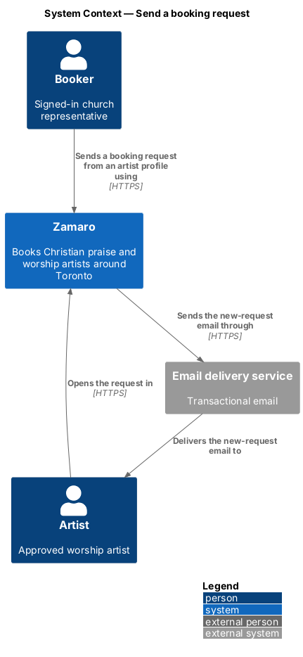
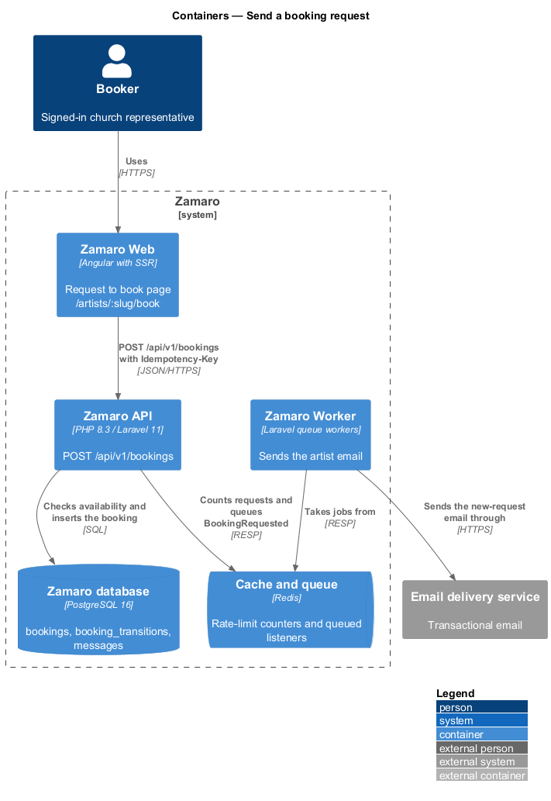
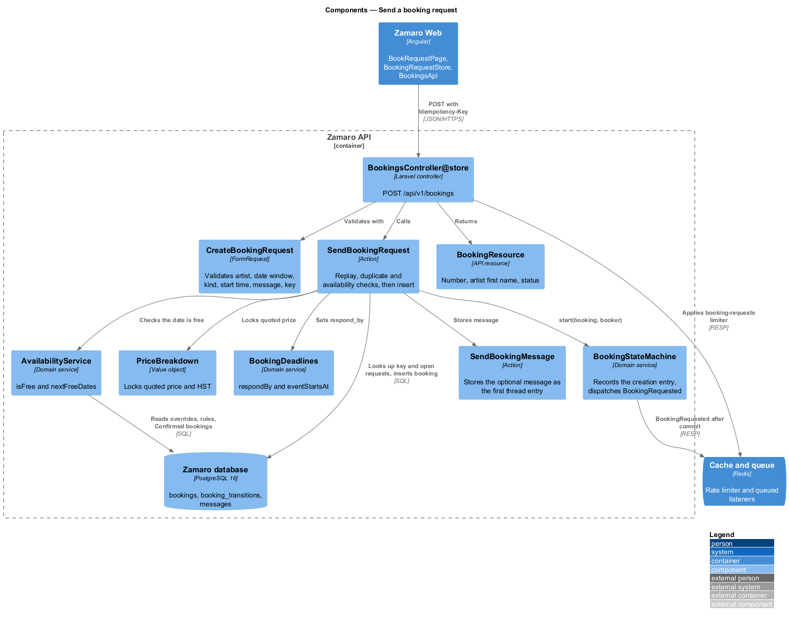
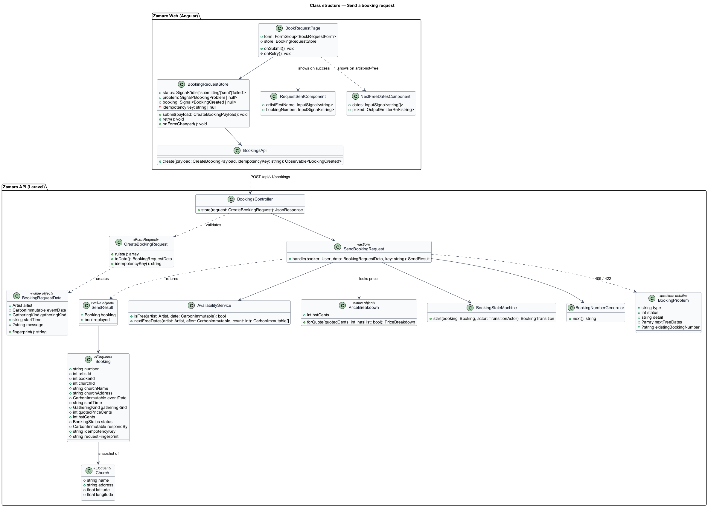
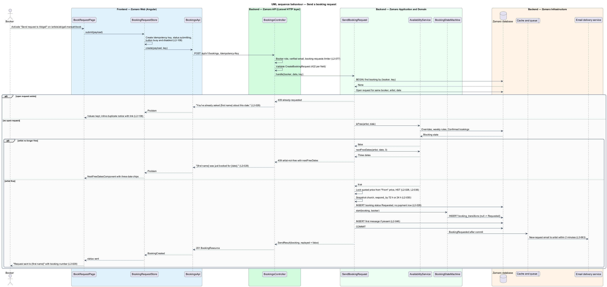
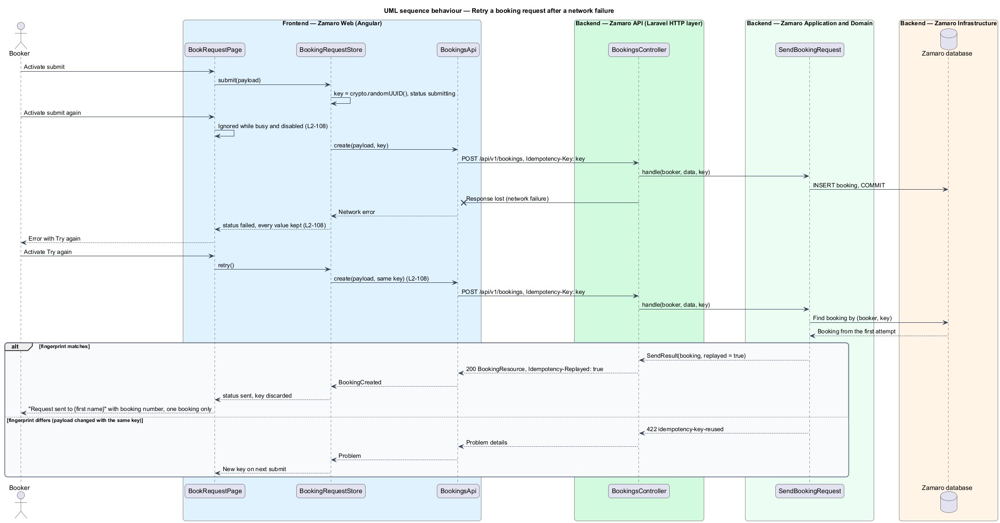

# Send a booking request

## Overview

Zamaro lets churches in and around Toronto book Christian praise and worship
artists. Each artist profile (`/artists/:slug`) carries a booking stub, the
ticket-styled form defined by L2-019. A booker who finds a free artist picks a date
and a kind of gathering in the stub, and the stub opens the same form full size on
the Request to book page (`/artists/:slug/book`). There the booker adds the service
start time, checks the church details and the price, and sends a booking request.
The request is the first step of every booking: nothing is charged, and the artist
decides whether to take it.

This feature is that submission, from the Request to book page's submit button to a
new booking in status Requested and an email to the artist. It also covers the safety rules that
apply to every form submission (L2-108): a busy state that blocks double
submission, an idempotency key that turns a network retry into at most one
booking, and kept values after a failure.

Neighbouring slices:

- `artist-profiles/pick-a-date-and-start-booking` owns the stub on the profile, which
  carries the date, kind of gathering and message draft to the Request to book page.
- `accounts/manage-church-profile` asks a booker without a church for one and then
  resumes the request (L2-024).
- `bookings/run-booking-lifecycle` owns the status table and the history entry
  written when the booking is created.
- `bookings/respond-to-booking-request` shows the request in the artist's inbox.
- `bookings/view-booker-bookings` lists it on `/bookings`.
- `bookings/exchange-booking-messages` holds the optional message as the first entry
  of the booking thread.
- `payments/pay-deposit` takes the first payment, only after the artist accepts.

Terms used in this design:

- **Request to book page** — routed page at `/artists/:slug/book` that holds the booking stub at full size, a request form beside a price summary
- **booking request** — booking in status Requested, created by a booker for one artist, date and gathering
- **quoted price** — artist's "From" price at the moment of the request, locked on the booking and unaffected by later price changes (L2-050)
- **open request** — booking in status Requested or Accepted
- **booking number** — public, human-readable identifier of a booking, used in URLs and emails; format `ZAM-` followed by a sequence number zero-padded to at least 4 digits, for example `ZAM-0114`
- **idempotency key** — random identifier that Zamaro Web attaches to one submission and repeats on each retry of it
- **request fingerprint** — hash of the canonical request body, stored with the idempotency key to detect a reused key with different content
- **verified booker** — booker whose email address is verified (L2-022)

## Description

The slice runs from the Request to book page in Zamaro Web through `POST /api/v1/bookings`
in the Zamaro API to the Zamaro database. The artist email is queued and sent by
the Zamaro Worker.

**Frontend (Zamaro Web, `features/artist-profile`)**

- **`BookRequestPage`** — routed page component for `/artists/:slug/book`, behind
  the Booker role guard. The profile stub navigates here with the date, kind of
  gathering and message draft in its state. The page header reads "Request to book
  {first name}" with the price, "travel included" and "replies in 72 hours". Its
  reactive form has two sections:
  - **Your event** — event date with the date check under it ("✓ {first name} is
    free {date}"), kind of gathering, service start time and an optional message of
    up to 2,000 characters, whose help text says phone numbers and emails are
    hidden until the booking is confirmed (L2-046);
  - **Your church** — church name, address, contact phone and the booker, read from
    the church profile and not editable here, with a link to edit them in the
    account (L2-024).

  Beside the form, a price summary panel shows the artist, the quoted price "locked
  when you send", the deposit after acceptance (25 %), the balance after the event
  and "Due today $0", with the cancellation policy line and link (L2-036, L2-044).
  The form actions read "Nothing is charged today" with "Back to profile" and the
  submit button "Send request to {first name}". While a request is pending, the
  button shows a busy state ("Sending request…"), the fields are read-only, and a
  second submit event is ignored (L2-108).
- **`BookingRequestStore`** — signal-based store holding the form value, a status
  (`idle`, `submitting`, `sent`, `failed`), the last problem, and the idempotency
  key. The store generates the key with `crypto.randomUUID()` on the first submit
  and reuses it for every retry of the same values. It discards the key after a
  success or when any field changes. A failure keeps every value entered (L2-108).
- **`BookingsApi.create(payload, idempotencyKey)`** — typed client for
  `POST /api/v1/bookings`. It sends the key in the `Idempotency-Key` header. After a
  network failure the page offers Try again, which resends the same payload with
  the same key.
- **`RequestSentComponent`** — replaces the form after success with a Requested
  stamp, "Request sent to {first name}", the booking number, "Nothing has been
  charged" with the reply-by deadline, a short what-happens-next timeline (artist
  replies, deposit within 48 hours of the yes), a summary of the request and a link
  to `/bookings/{number}`. The
  CDK `LiveAnnouncer` reads the confirmation aloud (L2-102).
- **`NextFreeDatesComponent`** — shown with an error summary "Your request wasn't
  sent" and the problem "{first name} was just booked for {date}." under the date
  field. It renders the three next free dates as chips; choosing one sets the date
  field and re-runs the date check (L2-028).
- **Duplicate notice** — an alert above the form reads "You've already asked {first
  name} about this date.", gives the existing booking number and its reply-by time,
  says nothing new was sent, and links to the existing booking. The form keeps its
  values.
- **Unverified notice** — when the API answers 403 `email-not-verified`, an alert
  above the form reads "Verify your email to send this request", names the address
  the link went to, says nothing was sent, and offers Resend email
  (`accounts/register-booker`). The form keeps its values, and the persistent
  "Verify your email" banner of that slice stays at the top of the page (L2-022).
- **Loading and error** — while the artist's calendar and the church profile load,
  the page shows skeletons in place. When they fail to load, an alert says nothing
  was sent and offers Try again and Back to the profile (L2-105).

**Backend (Zamaro API)**

- **Route** — `POST /api/v1/bookings` with middleware `auth:sanctum`, `verified`
  (`EnsureEmailIsVerified` of `accounts/register-booker`, which answers an unverified
  booker with a 403 problem of type `email-not-verified` and creates nothing,
  L2-022), the Booker role, and the `booking-requests` rate limiter of L2-077 (10 requests
  per booker per 24 hours).
- **`CreateBookingRequest`** — FormRequest. It validates `artist` (slug of a
  published artist), `eventDate` (from 3 days to 18 months ahead, in
  `America/Toronto`), `gatheringKind` (a `GatheringKind` case), `startTime`
  (`HH:MM`), `message` (optional plain text, at most 2,000 characters) and the
  `Idempotency-Key` header (UUID). It returns 422 with per-field errors (L2-075).
  It produces a `BookingRequestData` value object.
- **Church check** — a booker without a church receives a 409 problem of type
  `church-required`. Zamaro Web then opens the church form of
  `accounts/manage-church-profile` and resubmits afterwards with the same key.
- **`BookingsController@store`** — authorises, validates and calls
  `SendBookingRequest`. It returns 201 with `BookingResource` for a new booking, or
  200 with the same body and an `Idempotency-Replayed: true` header for a replay.
- **`SendBookingRequest`** — action run inside `DB::transaction`:
  1. **Replay check** — looks up a booking by booker and idempotency key. A match
     with the same fingerprint returns that booking unchanged. A match with a
     different fingerprint fails with 422 `idempotency-key-reused` (L2-108).
  2. **Duplicate check** — looks for an open request by the same booker for the same
     artist and date. A hit fails with 409 `already-requested` and the copy
     "You've already asked {first name} about this date." (L2-028).
  3. **Availability check** — asks `AvailabilityService::isFree(artist, date)`. A
     date that is no longer free fails with 409 `artist-not-free`, the copy
     "{first name} was just booked for {date}." and a `nextFreeDates` member holding
     three dates from `AvailabilityService::nextFreeDates(artist, date, 3)`
     (L2-028).
  4. **Price lock** — copies `artists.from_price_cents` to `quoted_price_cents`, and
     asks `PriceBreakdown` for `hst_cents` when the artist has an HST number
     (L2-036).
  5. **Snapshot** — copies the church name, address, latitude and longitude onto the
     booking, so later church edits do not change it.
  6. **Deadlines** — sets `respond_by` from `BookingDeadlines` (72 hours, or 24 hours
     when the event is fewer than 7 days away, L2-030) and `event_starts_at`.
  7. **Insert** — writes the booking with a number from `BookingNumberGenerator` and
     calls `BookingStateMachine::start()`, which records the creation entry and
     dispatches `BookingRequested` after commit.
  8. **Message** — when a message is present, stores it as the first `Message` of the
     thread through `SendBookingMessage`, so the contact-detail rule of L2-046
     applies to it.
- **No payment** — the action creates no `Payment` row and makes no call to the
  payment processor (L2-028).
- **Artist email** — the `BookingRequested` listener in
  `notifications/send-transactional-emails` emails the artist within 2 minutes
  (L2-063).
- **Concurrent identical submissions** — when two requests with the same key arrive
  together, the unique index rejects the second insert. The action catches the
  violation, reads the first booking and returns it as a replay.
- **Travel check** — the request does not enforce the travel match rule (L2-003);
  that rule filters search results only. A church beyond the artist's driving
  distance can still ask from the profile, and the artist can decline with "It's too
  far to travel" (L2-030), as Trinity Lutheran's 130 km request to Abigail does in the
  [requests mock](../../../mocks/pages/requests/default.html).

**Data (Zamaro database)**

- `bookings` — `number`, `artist_id`, `booker_id`, `church_id`, church snapshot
  columns, `event_date`, `start_time`, `event_starts_at`, `gathering_kind`,
  `quoted_price_cents`, `hst_cents`, `status`, `respond_by`, `deposit_due_by`,
  `idempotency_key`, `request_fingerprint`, timestamps.
- `bookings_number_unique` — unique index on `number`.
- `bookings_booker_idempotency_unique` — unique index on (`booker_id`,
  `idempotency_key`).
- `bookings_one_open_request` — partial unique index on (`booker_id`, `artist_id`,
  `event_date`) `WHERE status IN ('Requested', 'Accepted')`. It backs the duplicate
  check under concurrency.

**Mock screens** — [`pages/book`](../../../mocks/pages/book/default.html) in its
states [default](../../../mocks/pages/book/default.html),
[loading](../../../mocks/pages/book/loading.html),
[error](../../../mocks/pages/book/error.html),
[invalid](../../../mocks/pages/book/invalid.html) (artist just booked, next free
dates), [duplicate](../../../mocks/pages/book/duplicate.html),
[limit](../../../mocks/pages/book/limit.html) (the daily request limit of L2-077,
designed in `security/limit-request-rates`),
[unverified](../../../mocks/pages/book/unverified.html) (email not verified yet,
L2-022),
[submitting](../../../mocks/pages/book/submitting.html) and
[success](../../../mocks/pages/book/success.html); the
[success toast](../../../mocks/notifications/booking-toast/success.html).

## Requirements

The feature realises the following level-2 (L2) requirements. Each refines the
level-1 (L1) requirement shown, and the text is quoted from `docs/specs/L2.md`.

| L2 ID | Refines (L1) | Requirement |
|-------|--------------|-------------|
| `L2-022` | `L1-004` | **Booker registration.** Acceptance criteria: 1. Given a guest provides full name, email, a password meeting L2-072, and accepts the terms and privacy policy, when they register, then an account with the Booker role is created and a verification email is sent. 2. Given an email already registered, when someone registers with it, then the response is identical to a new registration ("Check your email to finish signing up") and the existing owner receives a "Someone tried to sign up with your email" message. 3. Given the verification link, when it is opened within 24 hours, then the email is marked verified; after 24 hours or after one use it shows "This link has expired" with a resend option. 4. Given an unverified booker, when they try to send a booking request, then they are asked to verify their email first and the request is not created. |
| `L2-028` | `L1-006` | **Send a booking request.** Acceptance criteria: 1. Given a verified booker with a church, when they submit the request form (the booking stub, opened full size at `/artists/{slug}/book`) with event date, kind of gathering, service start time and an optional message of up to 2,000 characters, then a booking is created in status Requested with the artist's current "From" price locked as the quoted price. 2. Given the request is created, when the response returns, then the booker sees "Request sent to {first name}" with the booking number and the artist is notified (L2-063). 3. Given the booker already has a Requested or Accepted booking with the same artist on the same date, when they submit again, then it is rejected with "You've already asked {first name} about this date." 4. Given the artist stopped being free between page load and submission, when the request is submitted, then it is rejected with "{first name} was just booked for {date}." and suggests the artist's next 3 free dates. 5. Given the request is created, when payment state is checked, then no charge or authorisation has been made. |
| `L2-108` | `L1-023` | **Form submission safety.** Acceptance criteria: 1. Given any form is submitted, when the request is pending, then the submit button shows a busy state, is disabled, and a second submission is not sent. 2. Given a booking request or payment submission, when it is retried after a network failure, then the same idempotency key is sent and at most one booking or charge results. 3. Given a submission fails, when the error renders, then every value entered is kept, except card details held by the processor's fields. |

## Diagrams

### System context

A booker sends the request to Zamaro from an artist profile. Zamaro emails the
artist that a request is waiting; no payment processor is involved at this step.

### Containers

The Request to book page in Zamaro Web posts to the Zamaro API, which writes the
booking to the Zamaro database. The Zamaro Worker sends the artist email from the queue.

### Components

`BookingsController` validates with `CreateBookingRequest` and calls
`SendBookingRequest`. The action combines `AvailabilityService`, `PriceBreakdown`,
`BookingDeadlines` and `BookingStateMachine` to create the booking.

### Class structure

The Request to book page delegates to a store that owns the idempotency key and the
form state. On the backend, `SendBookingRequest` turns a `BookingRequestData` into a `Booking` with a locked
quoted price and a creation history entry.

### Behaviour — send a request

A valid submission creates a Requested booking and emails the artist. A duplicate
open request or a date that is no longer free returns 409 with the copy and, for the
latter, the next three free dates.

### Behaviour — retry after a network failure

The busy state blocks a second click. When the response is lost, Try again resends
the same key, and the API returns the booking it already created instead of a
second one.

