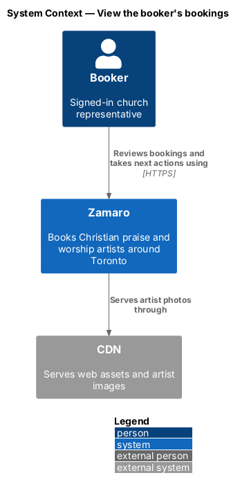
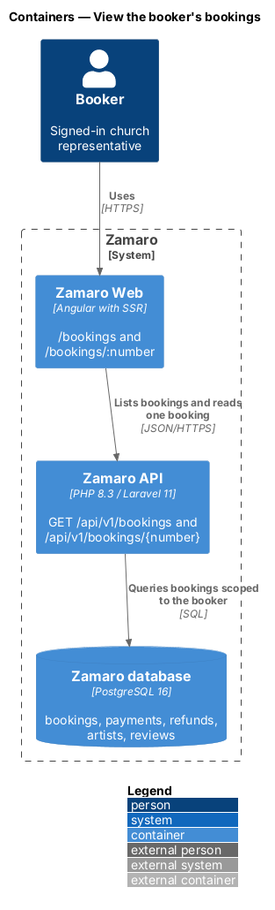
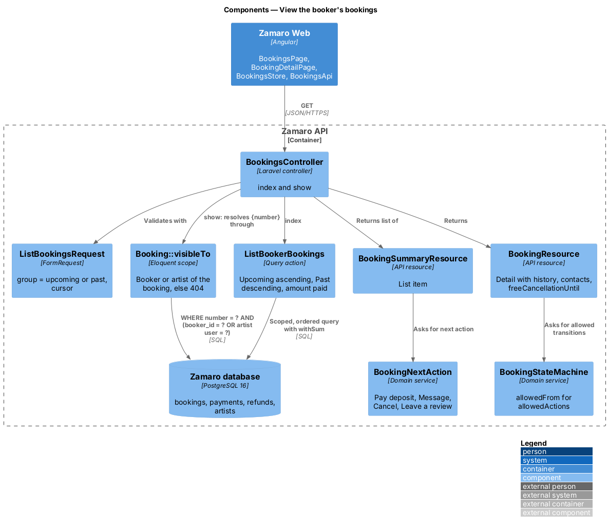
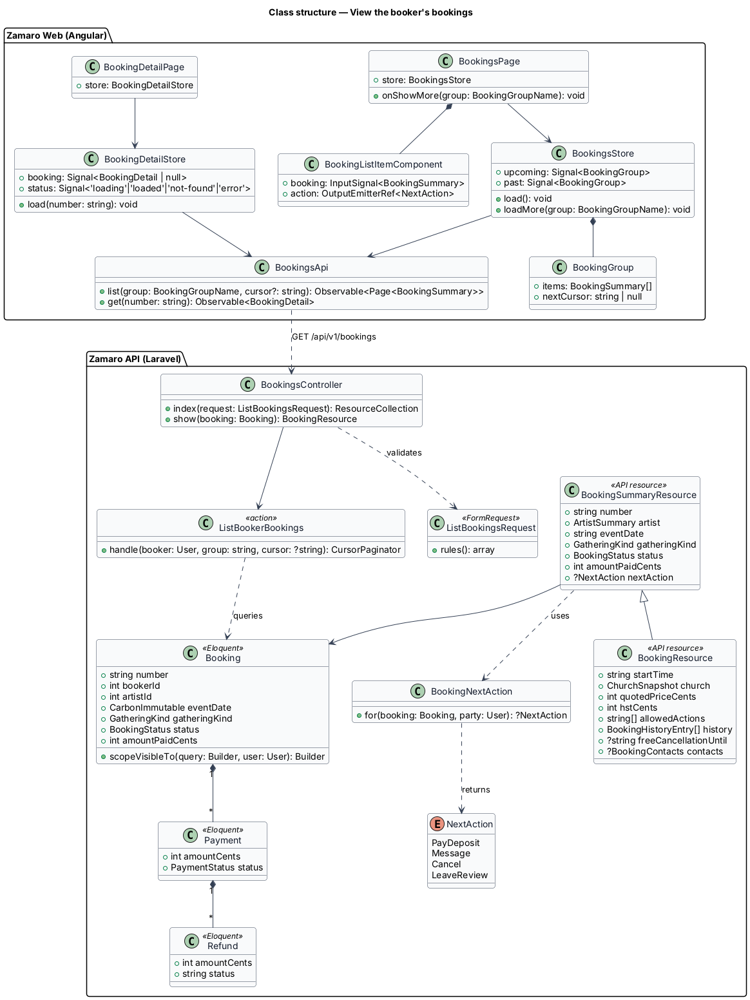
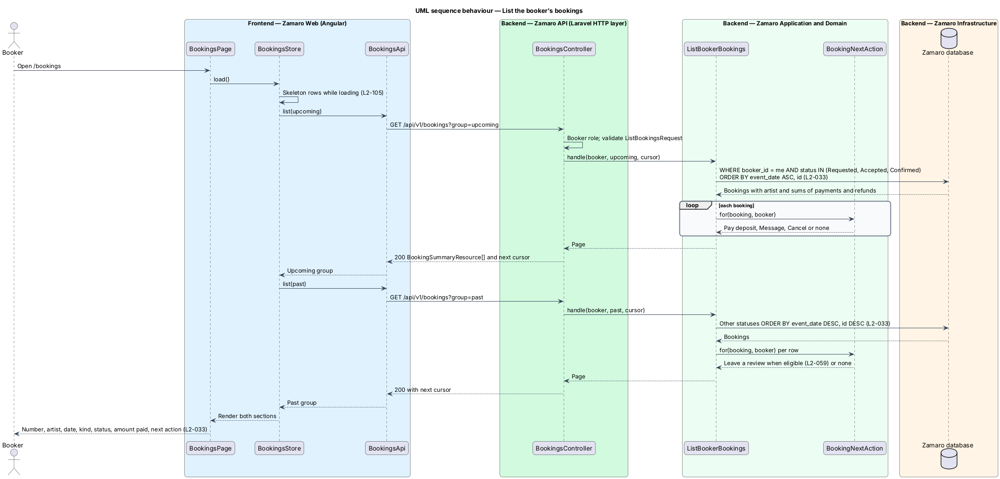
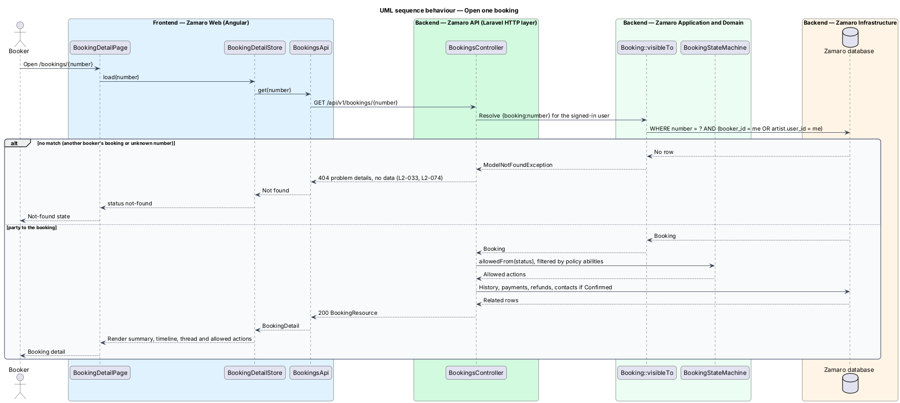

# View the booker's bookings

## Overview

Zamaro lets churches in and around Toronto book Christian praise and worship
artists. A booker may hold several bookings at once, each at a different point in
its life: one waiting for an artist's answer, one waiting for a deposit, one
confirmed for next month, and older ones that are finished. The bookings page gives
the booker one place to see all of them and to take the next step on each.

This feature covers two routes. `/bookings` lists the booker's bookings in two
groups, Upcoming and Past. `/bookings/:number` shows one booking in full and is the
host page for actions owned by sibling slices:

- Pay deposit — `payments/pay-deposit`
- Withdraw — `bookings/withdraw-booking-request`
- Cancel and the free-cancellation line — `bookings/cancel-booking`
- Message thread and contact details — `bookings/exchange-booking-messages`
- History timeline — `bookings/run-booking-lifecycle`
- Leave a review — `reviews/leave-review`

The artist's own view of a booking (`/artist/bookings/:number`) reads the same
detail endpoint and is described where its actions live.

Terms used in this design:

- **upcoming booking** — booking in status Requested, Accepted or Confirmed
- **past booking** — booking in status Completed, Declined, Withdrawn, Expired or Cancelled
- **amount paid** — sum of the booking's succeeded payments minus its succeeded refunds, in integer cents
- **next action** — single most useful step the booker can take on a booking from the list: Pay deposit, Message, Cancel or Leave a review
- **booking detail** — full representation of one booking returned to one of its parties

## Description

The slice runs from the bookings pages in Zamaro Web through the booker bookings
endpoints of the Zamaro API to the Zamaro database. It reads only; it writes
nothing.

**Frontend (Zamaro Web, `features/bookings`)**

- **`BookingsPage`** — routed page component for `/bookings`, behind the Booker role
  guard. It renders two sections, Upcoming and Past, each with its own list and its
  own "Show more" control. Empty-state copy for each section is `<TO SUPPLY>`.
- **`BookingListItemComponent`** — presentational row showing booking number, artist
  name linked to the profile, short date, kind of gathering, a
  `BookingStatusBadgeComponent`, amount paid and one next-action button (L2-033).
  Pay deposit links to `/bookings/:number/pay`; Message opens `/bookings/:number`
  at the thread; Cancel opens the cancel dialog of `bookings/cancel-booking`; Leave
  a review opens the form of `reviews/leave-review`.
- **`BookingsStore`** — signal-based store holding both groups with their cursors and
  a status per group. It loads Upcoming first, then Past.
- **`BookingDetailPage`** — routed page component for `/bookings/:number`. It renders
  the booking summary (artist, date, start time, kind of gathering, church,
  quoted price, amount paid, status), then the components of sibling slices
  according to `allowedActions`. A 404 renders the design-system not-found state.
- **`BookingDetailStore`** — signal-based store for one booking, reloaded after any
  action or conflict.
- **`BookingsApi`** — typed client with `list(group, cursor?)` and `get(number)`.

Layout follows L2-096: one column at XS with the next-action button on its own line,
and a table-like row from MD. The exact column set per breakpoint is `<TO SUPPLY>`.

**Backend (Zamaro API)**

- **Routes** — behind `auth:sanctum`:
  - `GET /api/v1/bookings?group=upcoming|past&cursor=` — Booker role; cursor
    pagination (L2-095). Page size is `<TO SUPPLY>`.
  - `GET /api/v1/bookings/{number}` — the booker or the artist of the booking.
- **`BookingsController`** — `index` validates `ListBookingsRequest` (group from the
  two values, cursor) and calls `ListBookerBookings`; `show` returns
  `BookingResource`.
- **`ListBookerBookings`** — query action scoped to `booker_id = auth()->id()`:
  - Upcoming: status in Requested, Accepted, Confirmed, ordered by `event_date`
    ascending then `id` (L2-033).
  - Past: every other status, ordered by `event_date` descending then `id`
    descending (L2-033).

  It eager-loads the artist's display name, slug and primary photo, and computes
  amount paid with `withSum` subqueries over `payments` and `refunds`, so the list
  runs in a fixed number of queries.
- **`BookingNextAction`** — domain service that picks the next action for one
  booking and party:
  - Accepted with no succeeded deposit → Pay deposit;
  - Requested → Message;
  - Confirmed → Cancel or Message; the choice between them is `<TO SUPPLY>`;
  - Completed and eligible under `reviews/leave-review` (L2-059) → Leave a review;
  - any other case → none.
- **Ownership** — route binding resolves `{booking:number}` through
  `Booking::visibleTo($user)`, which matches the booker or the artist of the
  booking. Any other user receives 404 with no data, never 403 (L2-033, L2-074).
- **`BookingSummaryResource`** — list item: `number`, `artist` (name, slug, photo),
  `eventDate`, `gatheringKind`, `status`, `amountPaidCents`, `nextAction`.
- **`BookingResource`** — detail: the summary fields plus `startTime`, church
  snapshot, `message`, `quotedPriceCents`, `hstCents`, `respondBy`, `depositDueBy`,
  `allowedActions`, and the members supplied by sibling slices: `history`
  (`bookings/run-booking-lifecycle`), `freeCancellationUntil`
  (`bookings/cancel-booking`) and `contacts` (`bookings/exchange-booking-messages`).
  `allowedActions` combines `BookingStateMachine::allowedFrom()` with the party's
  policy abilities.

**Data (Zamaro database)**

- `bookings_booker_event_date_idx` — index on (`booker_id`, `event_date`, `id`) for
  both list orders.
- Reads `bookings`, `artists`, `artist_photos`, `payments`, `refunds` and, for the
  review check, `reviews`.

## Requirements

The feature realises the following level-2 (L2) requirement. It refines the level-1
(L1) requirement shown, and the text is quoted from `docs/specs/L2.md`.

| L2 ID | Refines (L1) | Requirement |
|-------|--------------|-------------|
| `L2-033` | `L1-006` | **Booker bookings page.** Acceptance criteria: 1. Given a booker, when they open `/bookings`, then they see Upcoming (Requested, Accepted, Confirmed) ordered by event date ascending, and Past (all other statuses) ordered by event date descending. 2. Given a booking, when it is listed, then it shows booking number, artist, date, kind of gathering, status, amount paid and the next action (Pay deposit, Message, Cancel, Leave a review). 3. Given a booker opens another booker's booking URL, when it is requested, then the response is 404. |

## Diagrams

### System context

The booker reads bookings in Zamaro. Artist photos on the list come through the CDN;
no other external system takes part.

### Containers

The bookings pages in Zamaro Web call two read endpoints of the Zamaro API, which
query the Zamaro database.

### Components

`BookingsController` calls `ListBookerBookings` for the list and resolves one booking
through the ownership scope for the detail. `BookingNextAction` and the two
resources shape the response.

### Class structure

The store holds two `BookingGroup` lists of `BookingSummary` entries. On the backend
`ListBookerBookings` returns `Booking` rows that the resources serialise with the
action chosen by `BookingNextAction`.

### Behaviour — list bookings

The page loads Upcoming in ascending date order and Past in descending date order,
each row carrying amount paid and one next action.

### Behaviour — open one booking

A party to the booking receives the full detail. Any other user, including another
booker, receives 404 and the page shows the not-found state.

