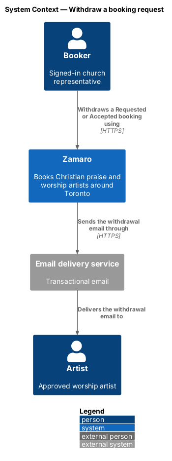
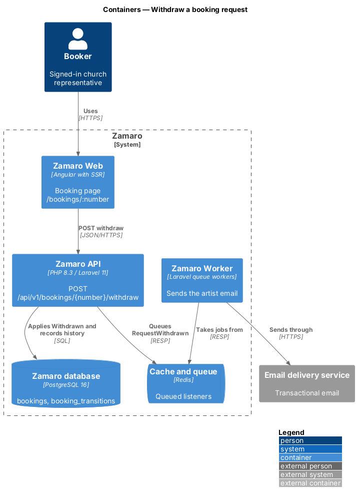
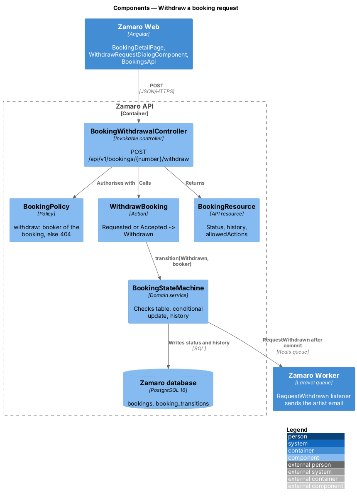
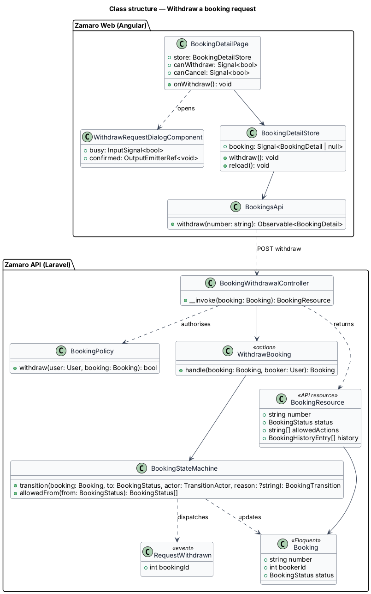
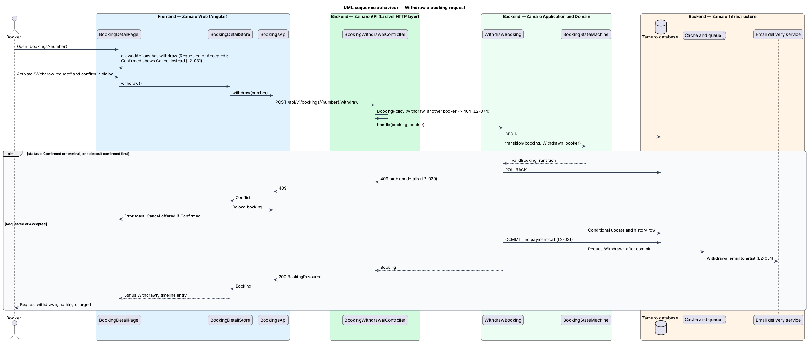

# Withdraw a booking request

## Overview

Zamaro lets churches in and around Toronto book Christian praise and worship
artists. A booking starts as a request, and until the deposit is paid the church
has made no commitment. Plans change: a service moves, a budget falls through, or
the church books someone else. Withdrawal lets the booker take back a request at
any point before the booking is Confirmed, with no charge.

This feature is the Withdraw action on the booker's booking page
(`/bookings/:number`, from `bookings/view-booker-bookings`). Once a booking is
Confirmed, the deposit has been paid and Withdraw gives way to Cancel, which applies
the refund policy of `bookings/cancel-booking`. The status rules come from
`bookings/run-booking-lifecycle`.

Terms used in this design:

- **withdrawal** — booker's decision to end a booking that is Requested or Accepted
- **open status** — Requested or Accepted, the two statuses from which withdrawal is allowed
- **allowed actions** — list of actions the API reports as available on a booking for the signed-in party, derived from its status

## Description

The slice runs from `BookingDetailPage` in Zamaro Web through one endpoint of the
Zamaro API to the Zamaro database. The artist email is queued and sent by the Zamaro
Worker.

**Frontend (Zamaro Web, `features/bookings`)**

- **`BookingDetailPage`** — shows a "Withdraw request" button only when the
  booking's `allowedActions` contains `withdraw`. For a Confirmed booking the list
  holds `cancel` instead, so the page shows Cancel and never Withdraw (L2-031).
- **`WithdrawRequestDialogComponent`** — design-system confirmation dialog opened by
  "Withdraw request" in the payment panel. Its kicker names the booking number,
  status and date. The title reads "Withdraw your request to {first name}?" and the
  description "Nothing has been charged and nothing will be." The body says the
  artist is told straight away and that the booker can ask again later if the
  artist is still free, above a small receipt with the booking and "Charged $0".
  It has no inputs. Focus starts on "Keep request"; the confirm button reads
  "Withdraw request", shows a busy state ("Withdrawing…") and blocks a second
  submission while pending, and Close and Escape are disabled until the server
  answers (L2-108). A failed request shows an alert at the top, "Your request
  wasn't withdrawn", says the request is unchanged and nothing was charged, and
  turns the confirm button into Try again.
- **`BookingDetailStore`** — signal-based store for the open booking. On success it
  replaces the booking with the response, so the status stamp reads Withdrawn and
  the timeline gains an entry. On 409 it reloads the booking and shows an error
  toast (L2-109).
- **`BookingsApi.withdraw(number)`** — typed client for the endpoint below.

**Backend (Zamaro API)**

- **Route** — `POST /api/v1/bookings/{number}/withdraw`, behind `auth:sanctum` and
  the Booker role. Route binding scopes `{booking:number}` to the signed-in booker,
  so another booker's booking returns 404 (L2-074).
- **`BookingWithdrawalController`** — invokable controller. It authorises with
  `BookingPolicy::withdraw`, calls `WithdrawBooking` and returns `BookingResource`.
- **`WithdrawBooking`** — action run inside `DB::transaction`. It applies
  Requested or Accepted → Withdrawn through `BookingStateMachine` with the booker as
  actor. A Confirmed or terminal booking fails with 409 and keeps its status
  (L2-029).
- **No charge** — a Requested booking has no payment, because
  `bookings/send-booking-request` never charges (L2-028). An Accepted booking has no
  succeeded payment, because a succeeded deposit is what moves it to Confirmed. The
  action therefore calls no payment code (L2-031).
- **Race with a deposit in flight** — the state machine's conditional update decides
  between Accepted → Withdrawn and Accepted → Confirmed: the first to commit wins
  and the other receives 409. When the processor charges a deposit after the
  booking has already left Accepted, `payments/pay-deposit` refunds it in full.
- **Artist notice** — after commit, `RequestWithdrawn` emails the artist through
  `notifications/send-transactional-emails` (L2-031). The withdrawn request moves
  from the New tab of the artist's inbox at `/artist/requests` to Past, and the
  artist booking page shows it as withdrawn
  ([`pages/request-detail/withdrawn`](../../../mocks/pages/request-detail/withdrawn.html)).
- **Calendar** — a withdrawal frees nothing, because only Confirmed bookings block a
  date. The artist calendar's Requested count for the date drops by one (L2-056).

**Data (Zamaro database)**

- `bookings.status` becomes `Withdrawn`.
- `booking_transitions` gains one row with the booker as actor.

**Mock screens** — [`dialogs/withdraw-request`](../../../mocks/dialogs/withdraw-request/default.html)
in its states [default](../../../mocks/dialogs/withdraw-request/default.html),
[busy](../../../mocks/dialogs/withdraw-request/busy.html) and
[failed](../../../mocks/dialogs/withdraw-request/failed.html), opened from
[`pages/booking-detail` default](../../../mocks/pages/booking-detail/default.html)
(Requested) and [accepted](../../../mocks/pages/booking-detail/accepted.html); the
result is the [withdrawn](../../../mocks/pages/booking-detail/withdrawn.html) state,
and the [confirmed](../../../mocks/pages/booking-detail/confirmed.html) state shows
Cancel booking in place of Withdraw.

## Requirements

The feature realises the following level-2 (L2) requirement. It refines the level-1
(L1) requirement shown, and the text is quoted from `docs/specs/L2.md`.

| L2 ID | Refines (L1) | Requirement |
|-------|--------------|-------------|
| `L2-031` | `L1-006` | **Booker withdraws a request.** Acceptance criteria: 1. Given a Requested or Accepted booking, when the booker withdraws it, then it becomes Withdrawn, nothing is charged and the artist is notified. 2. Given a Confirmed booking, when the booker looks for Withdraw, then it is not offered; Cancel (L2-042) is offered instead. |

## Diagrams

### System context

The booker withdraws a request in Zamaro, and Zamaro emails the artist. The payment
processor plays no part.

### Containers

The booking page in Zamaro Web calls the withdraw endpoint of the Zamaro API, which
writes the new status. The Zamaro Worker sends the artist email.

### Components

`BookingWithdrawalController` calls `WithdrawBooking`, which applies the transition
through `BookingStateMachine`. The `RequestWithdrawn` event drives the email.

### Class structure

The page decides from `allowedActions` whether to offer Withdraw or Cancel. On the
backend, `WithdrawBooking` depends only on `BookingStateMachine`.

### Behaviour — withdraw a request

A booker confirms the withdrawal and the booking becomes Withdrawn. A booking that
became Confirmed in the meantime returns 409, and the page then offers Cancel.

