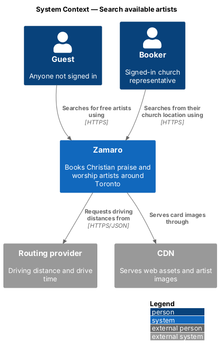
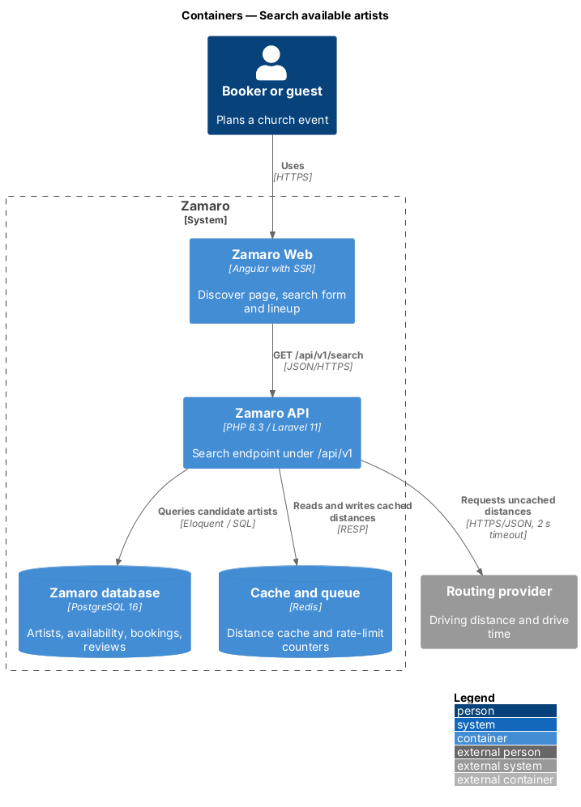
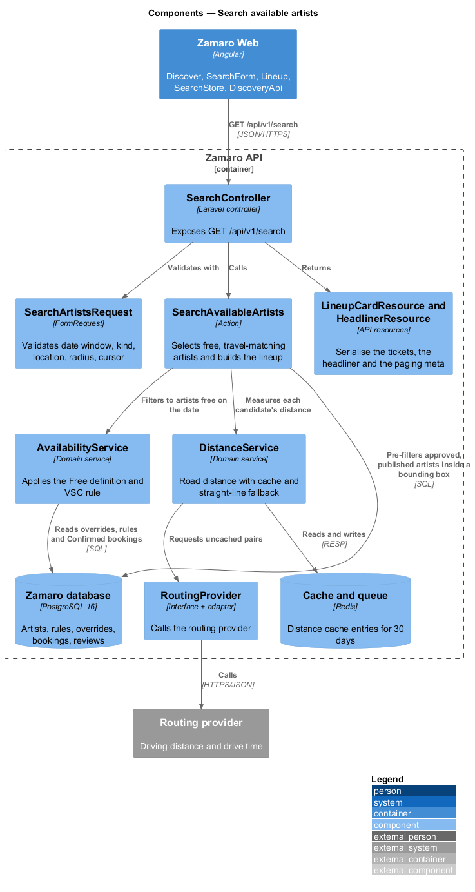
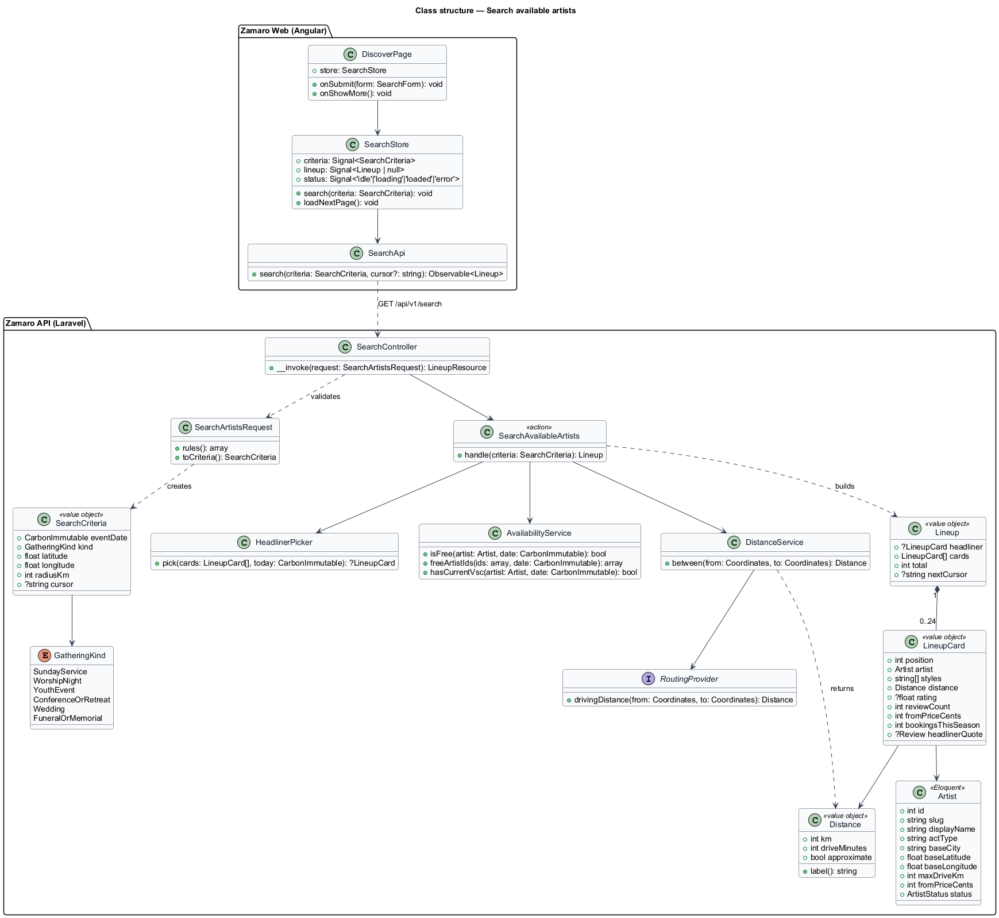
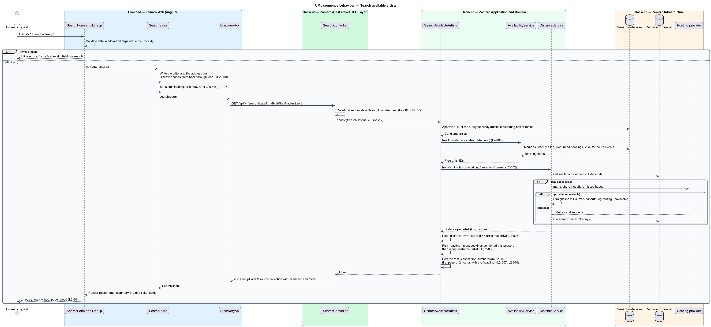
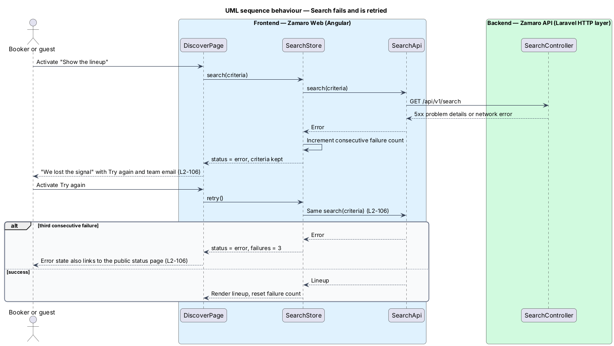

# Search available artists

## Overview

Zamaro is a marketplace where churches in and around Toronto book Christian praise
and worship artists. The Discover page (route `/`) is its front door. A church
planning an event states a date, the kind of gathering and where the church is, and
Zamaro answers with the *lineup*: every artist who is free that day and willing to
drive that far.

This feature is the search itself, from the form on Discover to the ordered lineup
of ticket cards. It is open to guests and to signed-in bookers. Sorting, filtering
and URL state are a separate slice (`discovery/sort-and-filter-results`), as is the
"Sold out" state shown when nobody matches (`discovery/suggest-alternatives-when-sold-out`).

Terms used in this design:

- **booker** — signed-in church representative who requests bookings
- **guest** — visitor who is not signed in
- **free** — state of an artist who is approved, not suspended, has not marked the date unavailable and has no Confirmed booking on that date
- **travel match** — condition that the road distance is within both the search radius and the artist's own maximum driving distance
- **lineup** — ordered list of artists who are free and travel-matched for one search
- **ticket card** — design-system card that presents one lineup entry with a perforated price stub
- **headliner** — featured result: the most-booked artist who is free on the date, within travel range and matching the active filters, counted by bookings confirmed since the start of the current season
- **headliner card** — larger ticket card, numbered "No. 01", that presents the headliner above the tickets
- **Vulnerable Sector Check (VSC)** — police record check required for artists who lead youth events

Two rules decide who appears. The availability rule (L2-005) removes anyone not free
on the date, and for youth events anyone without a current verified VSC. The travel
rule (L2-003) removes anyone too far away for either party. Distance is road distance
from a routing provider, cached for 30 days and estimated from a straight line when
the provider is down (L2-002).

## Description

The slice runs from the Discover page in Zamaro Web to the search endpoint in the
Zamaro API, the Zamaro database and the routing provider.

**Frontend (Zamaro Web, `app/pages/discover`; locations per ADR-0007)**

The page, form and lineup map to `Discover`, `pages/discover/search-form/SearchForm` and
`pages/discover/lineup/Lineup`. `SearchStore` lives in `pages/discover/search.store.ts`, and
`SearchApi` is the `api` library's `DiscoveryApi` (token `DISCOVERY_API`). The presentational
pieces are `zm-poster`, `zm-booking-form`, `zm-form-field`, `zm-chip`, `zm-ticket`,
`zm-rating`, `zm-artwork` and `zm-marquee`.

**Church location.** The location field resolves through `GET /api/v1/places?q=`
(`PlaceController` and the `Geocoder` port). The endpoint fills a gap in the original design.
- A quick-pick chip looks up its city and fills the field with the label ("Burlington, ON").
- A typed town is looked up on submit. A town that cannot be found shows the field's own error,
  "Enter your church’s address or town, or pick a city below.", so no new copy is needed.
- The city centres are:
  - Toronto (City Hall): 43.6534, -79.3841
  - Burlington: 43.325, -79.799
  - Mississauga: 43.589, -79.6441
  - Brampton: 43.7315, -79.7624
  - Hamilton: 43.2557, -79.8711
  - Markham: 43.8561, -79.337
  - Ajax: 43.8509, -79.0204
  - Oshawa: 43.8971, -78.8658
  - Barrie: 44.3894, -79.6903
  - Kitchener: 43.4516, -80.4925
  - Niagara (Niagara Falls): 43.0896, -79.0849
- The summary links read "Pick your event date." and "Enter your church’s location.", as in the
  invalid mock.

Until the headliner lands (S6), the tickets start at "No. 01".

- **`DiscoverPage`** — routed page component for `/`. It hosts the poster headline,
  the search form and the lineup region. The radius starts at 120 km for everyone. It
  pre-fills the church location for a booker with a saved church, and leaves location
  and date empty for a guest (L2-004).
- **`SearchFormComponent`** — reactive form with event date, kind of gathering,
  church location (address search, or for a guest one of 11 quick-pick city chips) and radius
  (40, 80, 120 or 200 km). It enforces the 3-day minimum and 18-month maximum,
  marks each empty required field and moves focus to the first invalid one.
- **`SearchStore`** — signal-based store holding the criteria, the current
  `Lineup`, a status (`idle`, `loading`, `loaded`, `error`) and a consecutive-failure
  count. It sets `aria-busy` and shows skeletons when a search takes longer than
  300 ms.
- **`SearchApi`** — typed client for `GET /api/v1/search`. It passes the cursor for
  the next page of 24.
- **`LineupComponent`**, **`HeadlinerCardComponent`**, **`TicketCardComponent`** —
  presentational components from the design system. They render position, name,
  act type and styles ("Band · Acoustic, Hymns"), base city, distance ("44 km", "about
  44 km" when the `Distance` is approximate, "Under 1 km" below 1 km; L2-002), rating or
  "New", "From" price, and for the headliner the kicker "Most booked this {season}",
  the primary photo, the latest 5-star quote and "Free {date}" (L2-006). The headliner is "No. 01"; the tickets
  follow from "No. 02" in the active sort order.
  Each card links to `/artists/{slug}` with the search date carried forward.
- **`SearchErrorComponent`** — the "We lost the signal" state with Try again, the
  team email link and, after the third consecutive failure, the status-page link
  (L2-106). The status link is "Check status.zamaro.ca" (`https://status.zamaro.ca`). It is
  rendered in `pages/discover/lineup` with `zm-alert`, as is the rate-limited state. In the
  error states the poster keeps its introduction: the mock's "Seven … are usually free" needs
  data the API does not have.

Layout follows L2-097: one column at XS with stubs beneath card bodies, two-column
form at SM and MD with stubs to the right, and poster beside form with two cards per
row from LG.

**Backend (Zamaro API)**

- **`SearchController`** — invokable controller for `GET /api/v1/search`, behind the
  search rate limiter (L2-077).
- **`SearchArtistsRequest`** — FormRequest that validates the date window, the
  `GatheringKind`, coordinates inside the service area, the radius from the allowed
  set, and the cursor. It produces a `SearchCriteria` value object. Query:
  `date=YYYY-MM-DD&kind={slug}&lat&lng&radius={40|80|120|200}`. A failure is a 422
  problem whose `errors` use the form's field names. `lat` and `lng` errors and the
  service-area check report under `location`. The copy matches the form:
  - "Pick your event date."
  - "Pick a date at least 3 days away."
  - "We take bookings up to 18 months ahead."
  - "Enter your church’s address or town, or pick a city below."
  - "Zamaro serves churches within 200 km of Toronto." This is checked by road from
    City Hall through `ServiceArea` and `DistanceService`.
- **`SearchAvailableArtists`** — action that runs the search. It pre-filters approved,
  published, payout-ready artists whose base lies within a bounding box of the radius,
  asks `AvailabilityService` which are free, measures each with `DistanceService`,
  applies the travel match, asks `HeadlinerPicker` for the headliner, orders the
  other results by distance then rating then artist ID, and returns the first 24 cards
  (the headliner first) as a `Lineup` with a cursor.
- **`HeadlinerPicker`** — domain service that picks the headliner among the matched
  results (L2-006): the artist with the most bookings confirmed since the start of the
  current season (spring March–May, summer June–August, autumn September–November,
  winter December–February, in `America/Toronto`), not counting bookings later
  cancelled, with ties going to the higher average rating, then the shorter distance,
  then the lower artist ID. It runs on the first page only, so later pages hold
  tickets alone.
  - A booking counts when its `booking_transitions` row to Confirmed has `occurred_at` on or
    after midnight on the season's first day in Toronto, and the booking is not now Cancelled.
  - With no bookings this season among the results, the tie-breaks alone pick the headliner.
  - `quoteFor()` takes the newest review where `stars = 5` and `hidden_at` is null. Its text is
    cut to 160 characters at the last space and ends with "…". It is attributed to the
    booker's name and the booking's `church_city`, or null when there is no such review.
  - The response puts it in a top-level `headliner` object, next to `data` (the tickets): the
    card fields plus `season` and `quote: {text, reviewerName, city} | null`.
  - The primary photo arrives with media in S12. Until then the headliner shows the yellow
    halftone artwork tagged "Headliner".
- **`AvailabilityService`** — domain service shared with profiles and bookings. It
  applies weekly rules, date overrides and Confirmed bookings, and for
  `GatheringKind::YouthEvent` requires a verified VSC whose expiry (issue + 3 years) is
  on or after the event date. A Free date override beats the weekly rule.
- **`DistanceService`** — returns a `Distance` (whole km, drive time rounded to
  5 minutes, `approximate` flag). It reads the Redis cache keyed on the coordinate
  pair rounded to 4 decimal places, calls `RoutingProvider` with a 2-second timeout on
  a miss, and stores the result for 30 days. The cache key is `distance:{a}|{b}`, with
  the two `lat,lng` keys sorted so the pair matches whichever way round it is asked.
  Every miss in a search goes into one `RoutingProvider::matrix()` call. On provider
  failure it returns straight-line distance × 1.3, flagged approximate, with an
  estimated drive time at 80 km/h, logs a `routing.unavailable` warning, and caches
  nothing. Distances below 1 km render as "Under 1 km".
- **`RoutingProvider`** — interface with one adapter for the routing provider
  (vendor `<TO SUPPLY>`). Until then `FakeRoutingProvider` reproduces the mocks' road
  distances from `CastRoutes` (ADR-0002).
- **`LineupResource`** — API resource that serialises the cards, the total and the
  next cursor: `{"data":[card…],"meta":{"total":7}}`. Each card is
  `{slug, name, actType, styles[], city, distance:{km, driveMinutes, approximate},
  rating|null, reviewCount, fromPrice:{cents, currency:"CAD"}}`. The headliner fields
  (S6) and the cursor (S9) are added by their slices.

**Mocks**

- [Discover · default](../../../mocks/pages/discover/default.html) — Naomi's search for
  Sat 14 Nov near Burlington: Abigail Mensah (44 km) as the headliner, "Most booked
  this autumn", then six tickets Closest first from Marcus Bell Trio (14 km) to
  Daniel & Ruth Okonkwo (97 km), with Save toggles.
- [Discover · loading](../../../mocks/pages/discover/loading.html) — the inputs kept,
  "Checking calendars…" and skeleton cards in their final places.
- [Discover · error](../../../mocks/pages/discover/error.html) — "We lost the signal"
  with Try again and the team email link.
- [Discover · invalid](../../../mocks/pages/discover/invalid.html) — a guest who
  submitted without a date or location, with inline errors and the quick-pick city
  chips.
- [Discover · limited](../../../mocks/pages/discover/limited.html) — more than 30
  searches in a minute (L2-077): "Too many searches in a minute", the criteria kept, and
  Try again counting down from the `Retry-After` wait
  (`security/limit-request-rates`).

**Data**

The query reads `artists`, `artist_styles`, `availability_rules`,
`availability_overrides`, `bookings` (status `Confirmed` only),
`vulnerable_sector_checks` and `artist_ratings` (the aggregate of visible `reviews`). A
B-tree index on `artists (status, base_latitude, base_longitude)` supports the
bounding-box pre-filter; PostGIS is not needed at this scale. `bookings` carries
`church_name` and `church_city` snapshots, which tour dates show (S14).

## Requirements

The feature realises the following level-2 (L2) requirements. Each refines the
level-1 (L1) requirement shown, and the text is quoted from `docs/specs/L2.md`.

| L2 ID | Refines (L1) | Requirement |
|-------|--------------|-------------|
| `L2-002` | `L1-001` | **Distance calculation.** Distance between an artist's base location and an event location is the road (driving) distance from the configured routing provider, rounded to the nearest whole kilometre, with an estimated drive time rounded to the nearest 5 minutes. Results are cached per pair of rounded coordinates (4 decimal places) for 30 days. Acceptance criteria: 1. Given an artist in Brampton and a church in Burlington, when the distance is calculated, then the value shown equals the routing provider's driving distance rounded to the nearest km (for example "44 km"). 2. Given the same artist and church pair was calculated within the last 30 days, when a search runs, then the cached value is used and the routing provider is not called. 3. Given the routing provider is unavailable or times out after 2 seconds, when a search runs, then the system uses straight-line distance multiplied by 1.3, labels each distance "about", and records a warning metric. 4. Given a distance of 0.4 km, when it is displayed, then it is shown as "Under 1 km". |
| `L2-003` | `L1-001` | **Travel match rule.** An artist matches an event location only when the distance (L2-002) is less than or equal to both the booker's chosen radius and the artist's own maximum driving distance. Acceptance criteria: 1. Given a search radius of 120 km and an artist 97 km away who drives up to 120 km, when results are returned, then the artist is included. 2. Given a search radius of 120 km and an artist 97 km away who drives up to 60 km, when results are returned, then the artist is excluded. 3. Given a search radius of 40 km and an artist 44 km away who drives up to 120 km, when results are returned, then the artist is excluded. 4. Given an artist exactly 120 km away with a 120 km search radius and a 120 km driving limit, when results are returned, then the artist is included. |
| `L2-004` | `L1-002` | **Search inputs.** The Discover page (route `/`) has a search form with: event date, kind of gathering (Sunday service, Worship night, Youth event, Conference or retreat, Wedding, Funeral or memorial), church location, and driving radius (40 km · 30 min, 80 km · 1 hr, 120 km · 1.5 hr, 200 km · 2.5 hr). The form is available to guests and bookers. Acceptance criteria: 1. Given a signed-in booker with a saved church, when they open Discover, then the church location is pre-filled with their church address and the radius defaults to 120 km. 2. Given a guest, when they open Discover, then the church location is empty, the radius defaults to 120 km and the date is empty. 3. Given an event date earlier than 3 days from today, when the booker submits, then the form shows "Pick a date at least 3 days away." against the date field and no search runs. 4. Given an event date more than 18 months from today, when the booker submits, then the form shows "We take bookings up to 18 months ahead." and no search runs. 5. Given any required field is empty, when the booker submits, then each empty field shows an inline error, focus moves to the first invalid field and no search runs. 6. Given a guest clicks a quick-pick city chip (Toronto, Burlington, Mississauga, Brampton, Hamilton, Markham, Ajax, Oshawa, Barrie, Kitchener, Niagara), when the chip is activated, then the church location is set to that city's centre point. 7. Given valid inputs, when "Show the lineup" is activated, then results load without a full page reload and the poster headline shows the chosen date (for example "Sat 14 Nov"). |
| `L2-005` | `L1-002` | **Availability match.** Search results contain only artists who are free on the chosen date and match the travel rule (L2-003). For Youth events, results contain only artists with a verified Vulnerable Sector Check (L2-049). Acceptance criteria: 1. Given an artist with a Confirmed booking on Sun 15 Nov, when a booker searches Sun 15 Nov, then that artist is excluded. 2. Given an artist with only pending (Requested or Accepted) requests on Sat 14 Nov, when a booker searches Sat 14 Nov, then that artist is included. 3. Given an artist who marked Fri 20 Nov unavailable, when a booker searches Fri 20 Nov, then that artist is excluded. 4. Given a suspended artist or an artist whose application is not approved, when any search runs, then that artist is excluded. 5. Given the kind of gathering is Youth event and an artist has no verified Vulnerable Sector Check dated within the last 3 years, when results are returned, then that artist is excluded. |
| `L2-006` | `L1-002` | **Result card content.** Each result is shown as a ticket card. One result is featured as the larger headliner card with one review quote: the most-booked artist among the results, that is, among the artists who are free on the date and within travel range (L2-003, L2-005) and pass the active filters (L2-008). "Most booked" counts the artist's bookings confirmed since the start of the current season (spring March–May, summer June–August, autumn September–November, winter December–February); bookings later cancelled do not count. Ties go to the higher average rating, then the shorter distance, then the lower artist ID. The headliner is numbered "No. 01" with the kicker "Most booked this {season}". The other results follow as ticket cards numbered from "No. 02" in the active sort order (L2-007); the headliner is not repeated among them. Acceptance criteria: 1. Given a result, when it is rendered, then the card shows position number, artist name, act type and styles (the L2-047 act type, written as its L2-008 style name when the artist has that style, then the other styles: for example "Band · Acoustic, Hymns", "Solo vocalist · Hymns" or "Duo · Acoustic, Hymns"), base city, distance from the church, average rating with review count (or "New" with no reviews), and "From" price. 2. Given the headliner card, when it is rendered, then it also shows the primary photo, the most recent 5-star review quote (truncated to 160 characters at a word boundary) with reviewer name and city, and "Free {date}". 3. Given a card, when the booker activates it, then they navigate to `/artists/{slug}` with the search date carried forward so the profile's booking stub is pre-filled. 4. Given a signed-in booker, when a card is rendered, then it shows a Save toggle reflecting whether the artist is saved. 5. Given a search for Sat 14 Nov near Burlington in which Abigail Mensah (44 km) has the most bookings confirmed this autumn and Marcus Bell Trio (14 km) is the closest artist, when the lineup renders in Closest first, then Abigail is the headliner "No. 01 · Most booked this autumn" and Marcus Bell Trio is the first ticket, "No. 02". 6. Given two results with the same number of bookings confirmed this season, when the headliner is chosen, then the one with the higher average rating is featured, then the closer one, then the one with the lower artist ID. 7. Given exactly one result, when the lineup renders, then that artist is shown as the headliner and no ticket cards follow. |
| `L2-010` | `L1-002` | **Result paging.** Results load 24 at a time. Acceptance criteria: 1. Given 30 matching artists, when the first page loads, then 24 cards are shown with a "Show more artists" button. 2. Given the booker activates "Show more artists", when the next page loads, then 6 more cards are appended, focus moves to the first new card and the button is removed. 3. Given 24 or fewer matches, when results load, then no "Show more artists" button is shown. |
| `L2-097` | `L1-020` | **Discover layout.** Acceptance criteria: 1. Given XS, when Discover renders, then the poster, the search form and the lineup stack in one column and ticket stubs sit beneath each card's body. 2. Given SM and MD, when Discover renders, then the search form uses two columns and ticket stubs sit to the right of each card's body. 3. Given LG and XL, when Discover renders, then the poster headline and search form sit side by side, and the lineup shows two ticket cards per row. 4. Given XS, when filters are shown, then the style chips wrap onto as many rows as they need, every chip stays visible and nothing causes page-level horizontal scroll. |
| `L2-106` | `L1-023` | **Search error.** Acceptance criteria: 1. Given the search request fails, when the lineup renders, then it shows "We lost the signal" with "We couldn't load who's free on {long date}. Your date, location and filters are kept.", a Try again button and an email link to the Zamaro team, and every input remains as entered. 2. Given Try again is activated, when it runs, then the same search is repeated. 3. Given the third consecutive failure, when the error renders, then it also links to the public status page. |

## Diagrams

### System context

Guests and bookers search Zamaro, which asks the routing provider for driving
distances and serves card images through the CDN.

### Containers

The Discover page in Zamaro Web calls the search endpoint in the Zamaro API, which
queries the database, reads cached distances from Redis and calls the routing
provider only for uncached pairs.

### Components

Inside the Zamaro API, `SearchController` validates with `SearchArtistsRequest` and
calls `SearchAvailableArtists`, which combines `AvailabilityService` and
`DistanceService` to build the lineup and `HeadlinerPicker` to feature one artist.

### Class structure

The frontend store and client mirror the backend action. `SearchAvailableArtists`
turns a `SearchCriteria` into a `Lineup` of up to 24 `LineupCard` entries, each
holding an `Artist` and a `Distance`, with the first page's headliner picked by
`HeadlinerPicker`.

### Behaviour — run a search

The form validates the date window before any request. The action narrows candidates
by bounding box and availability, measures distances through the cache, applies the
travel rule, picks the headliner and returns the first page with the other results
ordered Closest first.

### Behaviour — search fails and is retried

A failed request leaves every input in place and shows the "We lost the signal"
state. Try again repeats the same search, and the third consecutive failure adds the
status-page link.

