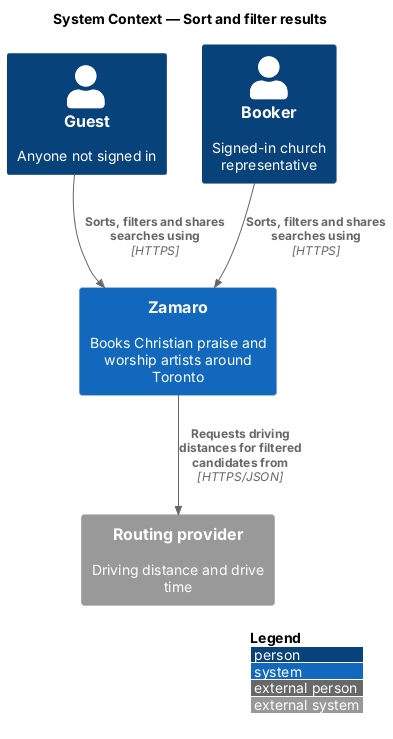
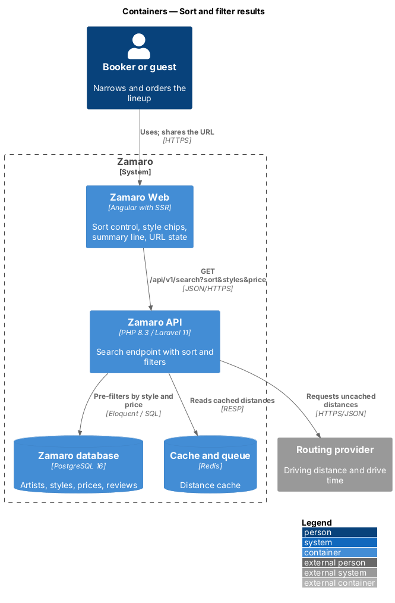
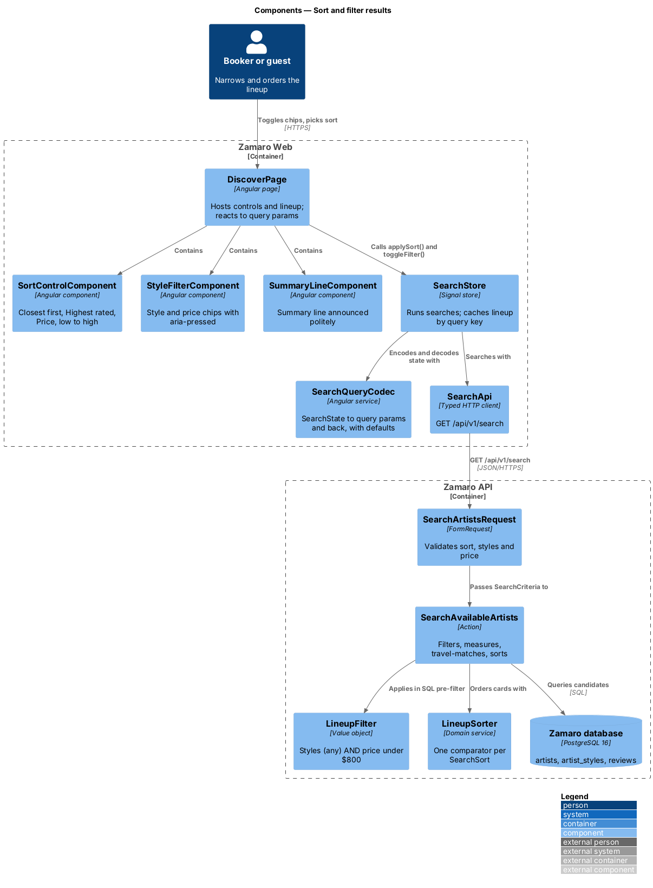
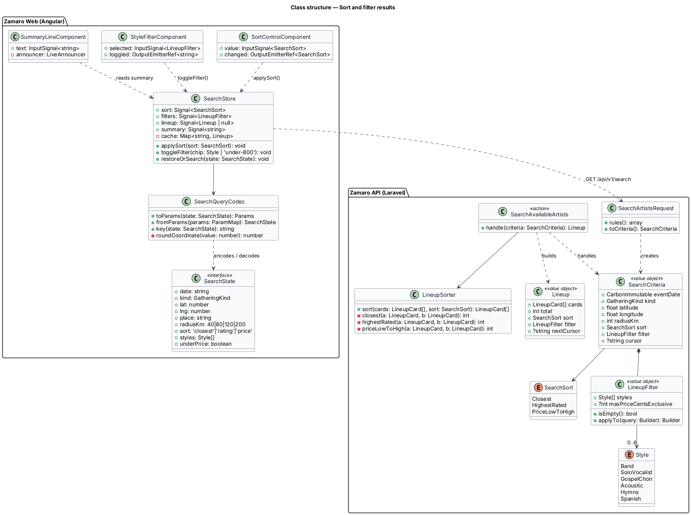
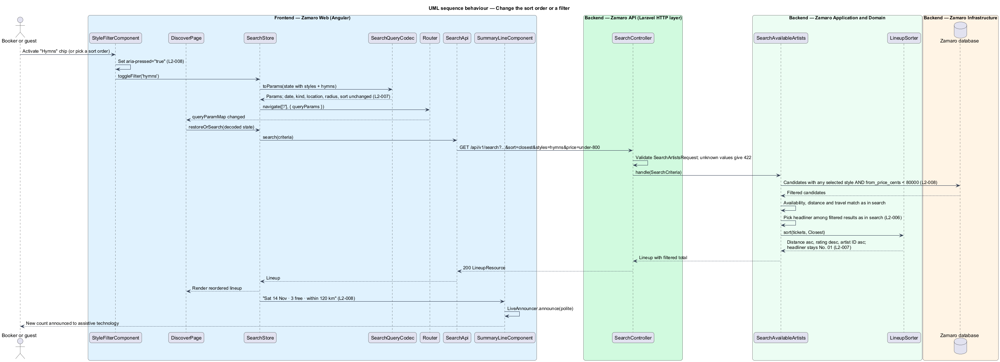
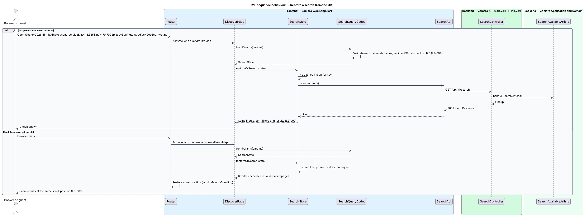

# Sort and filter results

## Overview

The Discover page (route `/`) answers a search with the *lineup*: every artist who
is free on the chosen date and willing to drive to the church. A lineup of seven or
seventy artists still leaves the church to choose, so this feature lets the visitor
reorder it, narrow it by style or price, and keep the whole search in the address
bar so that it survives a refresh, a Back press or a link pasted into another
browser.

The feature extends the search slice (`discovery/search-available-artists`), which
owns the search form, the lineup cards and paging. When sorting or filtering leaves
nobody, the "Sold out" state belongs to `discovery/suggest-alternatives-when-sold-out`.
Both features read and write the URL state this feature defines.

Terms used in this design:

- **lineup** — ordered list of artists who are free and travel-matched for one search
- **sort order** — rule that orders the lineup: Closest first, Highest rated, or Price, low to high
- **style chip** — toggle button that keeps only artists tagged with a given style
- **price chip** — toggle button labelled "Under $800" that keeps only artists whose "From" price is below $800
- **filter set** — selected style chips together with the price chip
- **summary line** — one-line caption above the lineup, "{short date} · {n} free · within {radius} km"
- **search state** — date, gathering kind, location, radius, sort order and filter set of one search
- **location label** — city name shown for a location, such as "Burlington"

Style chips combine with OR: selecting Band and Gospel choir keeps artists tagged
with either (L2-008). The price chip combines with the styles using AND. The summary
line counts only artists that pass the filter set. Changing the sort order or a
chip re-runs the search with every other input unchanged (L2-007). The search state
lives in the URL query string, and a church location appears there only as rounded
coordinates plus a location label, never as a street address (L2-009).

## Description

The slice adds sort and filter controls to Discover, a codec between the search
state and the query string, and sort and filter handling in the search endpoint.

**Frontend (Zamaro Web, `features/discover`)**

- **`SortControlComponent`** — select labelled "Sort" in the lineup heading, with the
  options Closest first, Highest rated and Price, low to high. It emits a `SearchSort`
  value and never touches the other inputs.
- **`StyleFilterComponent`** — row of `ChipComponent` toggles from the design system
  for Band, Solo vocalist, Gospel choir, Acoustic, Hymns, Spanish and Under $800. Each
  chip exposes its pressed state through `aria-pressed`. The row wraps onto as many
  lines as it needs, so at XS every chip stays visible without page-level horizontal
  scroll (L2-097).
- **`SummaryLineComponent`** — renders the summary line from the store, using
  `FormatService` for the short date. After each search it sends the line to the CDK
  `LiveAnnouncer` in polite mode, so the changed count is announced (L2-008, L2-102).
- **`SearchQueryCodec`** — pure service that converts between `SearchState` and the
  query parameters `date`, `kind`, `lat`, `lng`, `place`, `radius`, `sort`, `styles`
  and `price`. `toParams()` rounds coordinates to 3 decimal places and writes the
  location label to `place`. It never writes a street address. `fromParams()`
  validates each parameter on its own and replaces an invalid one with its default,
  so `radius=999` becomes 120 while the other parameters still apply. Parameter value
  spellings, such as `sort=rating` and `styles=band,gospel-choir`, are listed in the
  class diagram.
  - Defaults are left out of the URL.
  - The code is in `pages/discover/search-query-codec.ts` (`fromParams`, `toParams`, `toQuery`).
  - When the URL names the place the form has already resolved, the location field keeps its
    label as entered ("Burlington, ON").
  - A link opened from scratch shows the town label ("Burlington").
- **`SearchStore`** (extended) — gains `sort` and `filters` signals. Its
  `applySort()` and `toggleFilter()` methods navigate to the same route with the new
  query parameters. The store reacts to every query-parameter change by decoding the
  state and running the search. It also keeps the last `Lineup`, with every page
  loaded so far, keyed by the canonical query string.
  - In M1 its `navigate()` replaces the history entry for sort and chip changes, as the
    design system's navigation pattern says, so Back does not step through every chip. "Show
    the lineup" adds an entry.
  - Re-submitting an unchanged search runs it again.
  - The server fills the form from the URL. Only the browser runs the search, so a shared
    link counts once against the rate limit.
  - After each search, the summary line is announced through the CDK `LiveAnnouncer` (polite).
  - The sort select and the chips sit in the lineup section. The chips are disabled while a
    search loads.
- **`DiscoverPage`** (extended) — subscribes to `ActivatedRoute.queryParamMap`. When
  the decoded state matches the cached key, as it does after Back from a profile, it
  renders the cached lineup at once. The router, configured with
  `withInMemoryScrolling({ scrollPositionRestoration: 'enabled' })`, then restores the
  scroll position (L2-009).

**Backend (Zamaro API)**

- **`SearchArtistsRequest`** (extended) — accepts `sort` as a `SearchSort` value
  (`closest|rating|price`), `styles` as a comma-separated list of `Style` slugs (a repeated
  `styles` key would keep only the last value in PHP), and the price filter as
  `price=under-800`. Unknown values return 422 problem details. The API stays strict, and
  only the frontend codec substitutes defaults. `meta` echoes `sort`, `styles` and `price`
  beside the filtered `total`.
- **`SearchSort`** — enum with `Closest`, `HighestRated` and `PriceLowToHigh`.
- **`LineupFilter`** — value object holding the selected `Style` values and an optional
  `maxPriceCentsExclusive` of 80,000. `SearchAvailableArtists` applies it in the SQL
  pre-filter, through an `EXISTS` on `artist_styles` for any selected style and
  `artists.from_price_cents < 80000` for the price chip. Filtering before distance
  measurement keeps routing calls to the artists that can appear.
- **`LineupSorter`** — orders the measured, travel-matched tickets (L2-007). The
  headliner (L2-006) is picked first from the filtered results and is not sorted: it
  stays "No. 01" whatever the sort, and the tickets are numbered from "No. 02".
  `Closest` orders by distance ascending, rating descending, then artist ID ascending.
  `HighestRated` orders by average rating descending, review count descending, then
  distance ascending, with unreviewed artists last. `PriceLowToHigh` orders by "From"
  price ascending, then distance ascending. Artist ID ascending closes every order as
  the final tie-breaker, so paging is stable.
- **`SearchAvailableArtists`** (extended) — applies the `LineupFilter`, measures and
  travel-matches as before, sorts with `LineupSorter` and counts the filtered total for
  the summary line. The paging cursor encodes the sort order and the sort key of the
  last card returned, so the next page continues the same order.
- **`LineupResource`** (extended) — echoes the applied sort order and filter set beside
  the filtered `total`.

**Mocks**

- [Discover · default](../../../mocks/pages/discover/default.html) — the summary line
  "Sat 14 Nov · 7 free · within 120 km", the Sort select on Closest first, and the six
  style chips and the Under $800 price chip, none pressed.
- [Discover · empty](../../../mocks/pages/discover/empty.html) — Gospel choir pressed,
  with a summary line counting 0 free.
- [Discover · loading](../../../mocks/pages/discover/loading.html) — chips disabled
  while the lineup loads.

**Data**

The filter reads `artist_styles (artist_id, style)` and `artists.from_price_cents`. An
index on `artist_styles (style, artist_id)` supports the style pre-filter. Ratings for
sorting come from the same visible-review aggregate the lineup cards already read.

## Requirements

The feature realises the following level-2 (L2) requirements. Each refines the
level-1 (L1) requirement shown, and the text is quoted from `docs/specs/L2.md`.

| L2 ID | Refines (L1) | Requirement |
|-------|--------------|-------------|
| `L2-007` | `L1-002` | **Sorting results.** Results are sortable by Closest first (default), Highest rated and Price, low to high. The sort orders the ticket cards below the headliner; the headliner (L2-006) stays first whatever the sort. Acceptance criteria: 1. Given Closest first, when results are returned, then the tickets are ordered by distance ascending, then rating descending, then artist ID ascending. 2. Given Highest rated, when results are returned, then the tickets are ordered by average rating descending, then review count descending, then distance ascending; artists with no reviews come last. 3. Given Price, low to high, when results are returned, then the tickets are ordered by "From" price ascending, then distance ascending. 4. Given the sort changes, when the new order is shown, then the search does not reset date, location, radius or filters. 5. Given the sort changes from Closest first to Price, low to high, when the new order is shown, then the headliner is unchanged and the tickets are re-ordered and re-numbered from "No. 02". |
| `L2-008` | `L1-002` | **Filtering results.** Style chips filter results: Band, Solo vocalist, Gospel choir, Acoustic, Hymns, Spanish, and the price chip Under $800. Acceptance criteria: 1. Given the Band and Gospel choir chips are selected, when results are returned, then they contain artists tagged Band or Gospel choir (any selected style matches). 2. Given Under $800 and Hymns are selected, when results are returned, then they contain only artists tagged Hymns whose "From" price is below $800. 3. Given filters are applied, when results are returned, then the summary line reads "{short date} · {n} free · within {radius} km" with n counting only filtered results. 4. Given a chip is toggled, when it is activated, then its pressed state is exposed with `aria-pressed` and the result count change is announced to assistive technology. |
| `L2-009` | `L1-002` | **Search state in the URL.** The search date, gathering kind, location, radius, sort and filters are kept in the URL query string. Acceptance criteria: 1. Given a completed search, when the booker copies the URL into a new browser, then the same inputs, sort, filters and results are restored. 2. Given a booker opens an artist profile from results, when they use the browser Back button, then Discover restores the same results and scroll position. 3. Given a URL with an invalid parameter (for example `radius=999`), when it loads, then that parameter falls back to its default and the remaining parameters still apply. 4. Given a guest's URL, when it is shared, then it never contains a street address; a church location is encoded as rounded coordinates (3 decimal places) plus a city label. |

## Diagrams

### System context

Guests and bookers reorder and narrow the lineup inside Zamaro and share searches
as links. The routing provider is still called for distances, but only for
artists that pass the filter set.

### Containers

Zamaro Web keeps the search state in the URL and calls the search endpoint with
the sort order and filter set. The Zamaro API filters in the database and sorts in
memory after measuring distances.

### Components

On the frontend, `SearchQueryCodec` sits between the router and `SearchStore`. On
the backend, `SearchAvailableArtists` uses `LineupFilter` before measurement and
`LineupSorter` after it.

### Class structure

`SearchState` is the single shape that the codec, the store and the request share.
`SearchSort` and `LineupFilter` travel with it to the backend, where `LineupSorter`
holds one comparator per sort order.

### Behaviour — change the sort order or a filter

Toggling a chip or picking a sort order only rewrites the query string. The store
reacts to the new URL, re-runs the search with every other input intact, and the
summary line announces the new count.

### Behaviour — restore a search from the URL

A pasted link is decoded parameter by parameter, with defaults for invalid values,
and runs a fresh search. Back from a profile matches the cached key and renders the
cached lineup without a request, so the scroll position can be restored.

