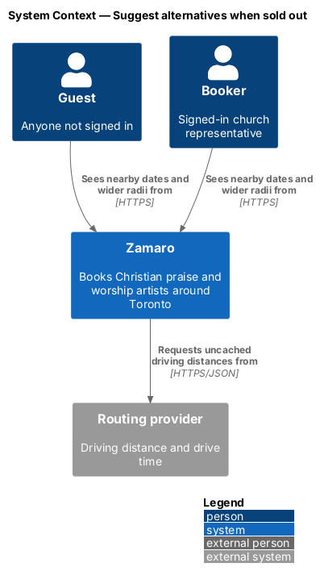
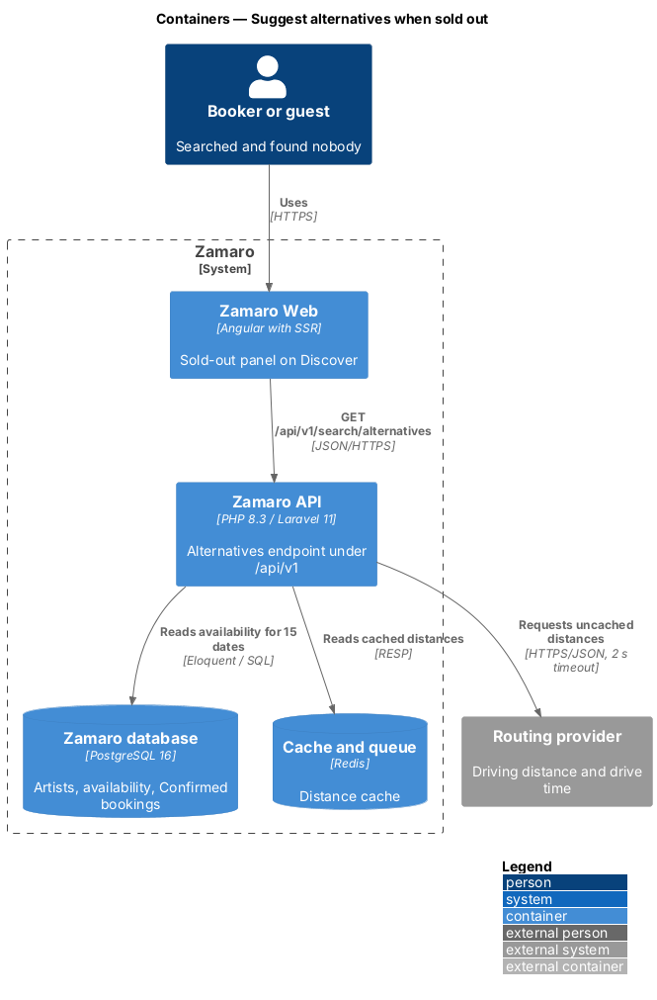
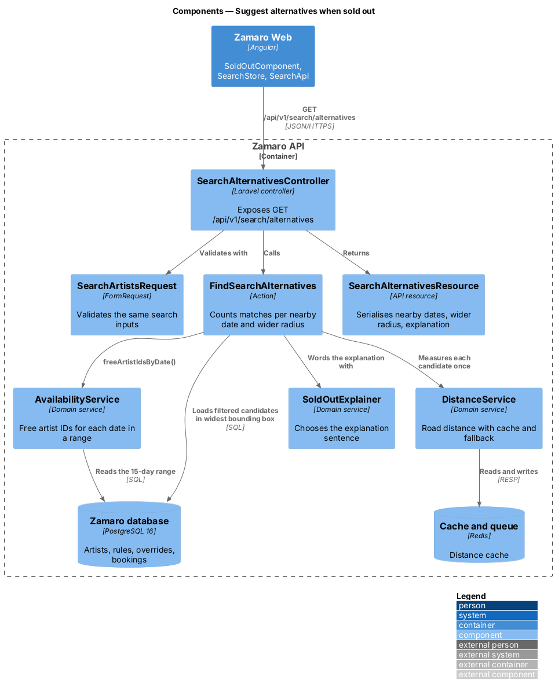
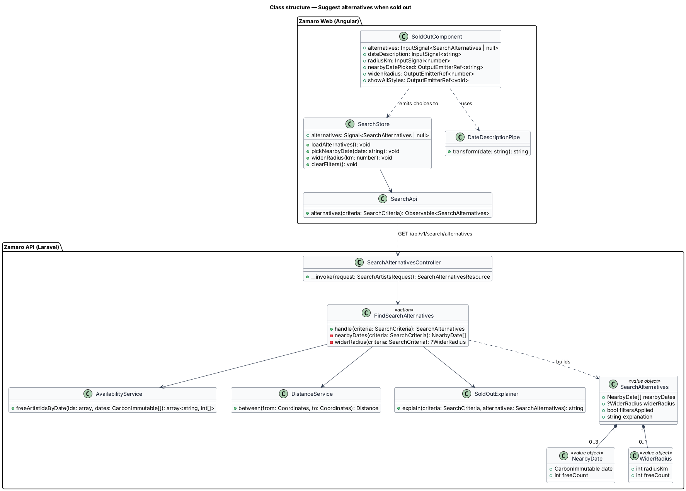
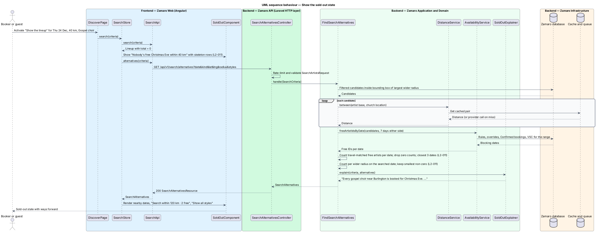
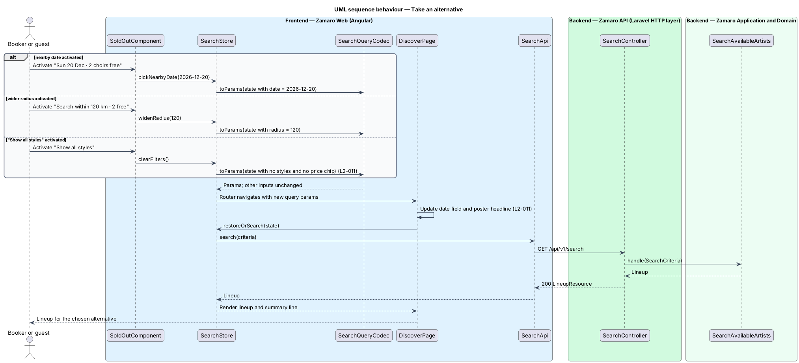

# Suggest alternatives when sold out

## Overview

Some searches on Discover return nobody. Christmas Eve is the busiest night of the
year for worship artists, and a 40 km radius around a small town may hold no gospel
choir at all. An empty list with no next step would end the visit. This feature
replaces the empty lineup with a "Sold out" state that explains why and offers
concrete ways forward: a nearby date, a wider radius, or all styles.

The feature sits at the end of the search flow. The search itself belongs to
`discovery/search-available-artists`. The sort order, filters and URL state belong
to `discovery/sort-and-filter-results`. This slice adds the state shown when the
filtered total is zero and the backend query that finds the alternatives.

Terms used in this design:

- **sold-out state** — lineup-area panel shown when a search has zero matches
- **date description** — phrase naming the searched date in the headline, either a named day such as "Christmas Eve" or the short date such as "Sat 14 Nov"
- **nearby date** — date within 7 days either side of the searched date on which at least one artist is free under the current filters
- **wider radius** — radius option from the set 40, 80, 120 and 200 km that is larger than the current one
- **alternatives** — nearby dates, smallest wider radius with matches, and whether filters are applied, computed for one zero-match search

Each alternative keeps every other input as entered. Nearby-date counts use the
current gathering kind, location, radius and filter set, and a date with a count of 0
is omitted (L2-011). The wider-radius button names the smallest wider radius that has
matches and its count. "Show all styles" appears only when a filter is applied.

## Description

The slice adds the sold-out panel to the Discover lineup region and an alternatives
endpoint to the Zamaro API. The main search stays unchanged, so its response time
target of a 500 ms 95th percentile (L2-085) is not spent on alternatives that most
searches never need.

**Frontend (Zamaro Web, `features/discover`)**

- **`SoldOutComponent`** — presentational component built on the design system
  empty-state pattern. It shows the "Sold out" eyebrow, the headline "Nobody's free
  {date description} within {radius} km", the explanation sentence, the list of
  nearby dates with their counts, the "Search within {radius} km · {n} free" button
  and, when filters are applied, the "Show all styles" button. While alternatives load,
  the panel shows the headline with skeleton rows in place of the ways forward.
- **`SearchStore`** (extended) — when a search returns a total of 0, it calls
  `SearchApi.alternatives()` with the same criteria and stores the result in an
  `alternatives` signal. Its three methods `pickNearbyDate()`, `widenRadius()` and
  `clearFilters()` each change one part of the search state and navigate through
  `SearchQueryCodec`. The URL change re-runs the search, so the date field and the
  poster headline follow the new date (L2-011).
- **`SearchApi`** (extended) — adds `alternatives(criteria)` for
  `GET /api/v1/search/alternatives`.
- **`DateDescriptionPipe`** — turns a date into its date description through
  `FormatService` and the translation catalogue. The list of named days, such as
  Christmas Eve, is `<TO SUPPLY>`. Every other date uses the short date.

**Backend (Zamaro API)**

- **`SearchAlternativesController`** — invokable controller for
  `GET /api/v1/search/alternatives`, behind the same search rate limiter (L2-077). It
  reuses `SearchArtistsRequest` for validation, ignoring the cursor.
- **`FindSearchAlternatives`** — action that computes the alternatives in one pass.
  1. It loads the filtered candidates inside the bounding box of the largest wider
     radius, or of the current radius when no wider one exists.
  2. It measures each candidate once with `DistanceService`. Distance does not depend
     on the date, so the measurements serve every date and radius below.
  3. It asks `AvailabilityService::freeArtistIdsByDate()` which candidates are free on
     each date from 7 days before to 7 days after the searched date. Dates outside the
     bookable window of 3 days to 18 months from today are skipped (L2-004).
  4. For each date it counts candidates that pass the travel match at the current
     radius. It keeps dates with a count above 0, orders them by distance in days from
     the searched date and takes the first 3. The tie-break between two dates the same
     number of days away is `<TO SUPPLY>`.
  5. For each wider radius in ascending order it counts candidates that pass the
     travel match on the searched date, and returns the first radius with a count above 0.
- **`AvailabilityService`** (extended) — adds `freeArtistIdsByDate(ids, dates)`, which
  reads rules, overrides, Confirmed bookings and, for Youth events, VSC records for the
  whole date range in one query per table.
- **`SoldOutExplainer`** — picks the explanation sentence from catalogue templates. It
  uses the gathering kind, the filter set, the location label and the best alternative,
  as in "Every gospel choir near Burlington is booked for Christmas Eve. Try a nearby
  date, or widen the radius: 2 choirs are free within 120 km." The full set of
  templates and the rule that chooses between them are `<TO SUPPLY>`.
- **`SearchAlternativesResource`** — serialises `nearbyDates` (date and count),
  `widerRadius` (km and count, or null), `filtersApplied` and `explanation`.

**Data**

The action reads the same tables as the search: `artists`, `artist_styles`,
`availability_rules`, `availability_overrides`, `bookings` (status `Confirmed`) and
`vulnerable_sector_checks`. Distances come from the Redis distance cache.

## Requirements

The feature realises the following level-2 (L2) requirement. It refines the level-1
(L1) requirement shown, and the text is quoted from `docs/specs/L2.md`.

| L2 ID | Refines (L1) | Requirement |
|-------|--------------|-------------|
| `L2-011` | `L1-002` | **No results.** When nobody matches, the lineup area shows a "Sold out" state with ways forward. Acceptance criteria: 1. Given zero matches, when results return, then the state reads "Nobody's free {date description} within {radius} km" with a sentence explaining why. 2. Given zero matches, when results return, then up to 3 nearby dates within 7 days either side are listed, closest first, each with the count of artists free that day under the current filters, and dates with a count of 0 are omitted. 3. Given a wider radius option would return results, when results return, then a button "Search within {radius} km · {n} free" is shown for the smallest wider radius that has matches. 4. Given filters are applied, when results return, then a "Show all styles" button clears the filters and re-runs the search. 5. Given a nearby date is activated, when the search re-runs, then the date field and poster headline update to that date. |

## Diagrams

### System context

Guests and bookers who find nobody free receive alternatives from Zamaro. The
routing provider supplies any distances not yet cached.

### Containers

Zamaro Web calls the alternatives endpoint only after a zero-match search. The
Zamaro API reads availability for 15 dates from the database and distances from Redis.

### Components

`FindSearchAlternatives` measures distances once through `DistanceService` and asks
`AvailabilityService` about the whole date range. `SoldOutExplainer` then words
the explanation.

### Class structure

`SearchAlternatives` holds up to 3 `NearbyDate` entries, an optional `WiderRadius`
and the explanation. On the frontend, `SoldOutComponent` renders it and `SearchStore`
turns each choice into a new search state.

### Behaviour — show the sold-out state

A zero total triggers the alternatives request. The action counts free,
travel-matched artists for each nearby date and each wider radius, and the panel
lists only non-zero options.

### Behaviour — take an alternative

Each way forward changes one input and navigates. The URL change re-runs the
search, so the date field, poster headline and lineup all follow.

