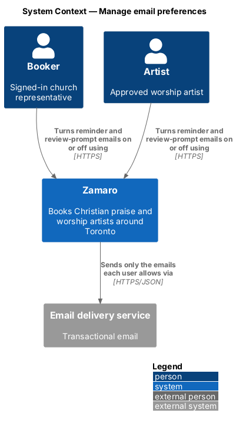
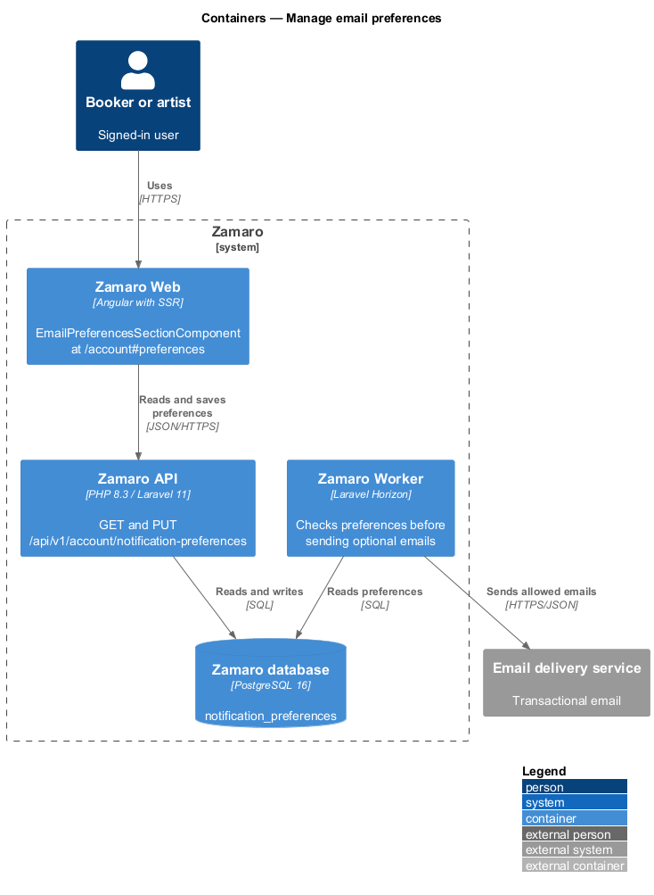
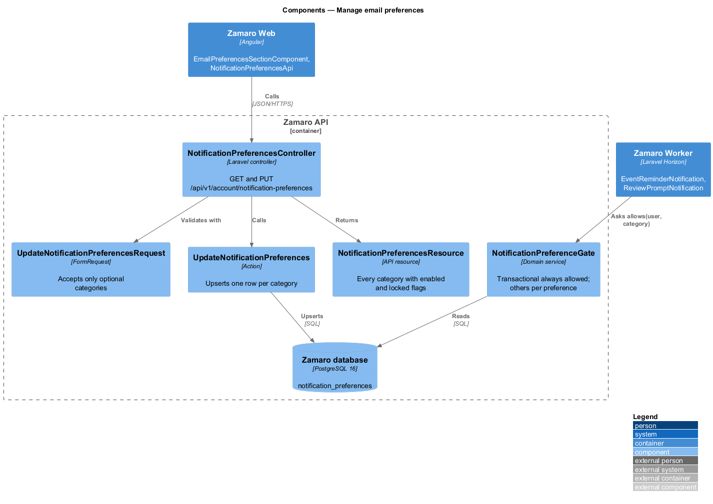
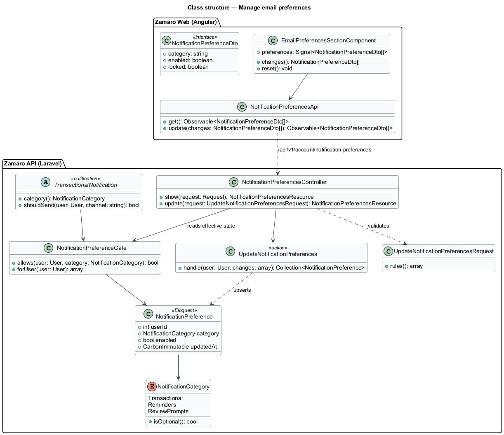
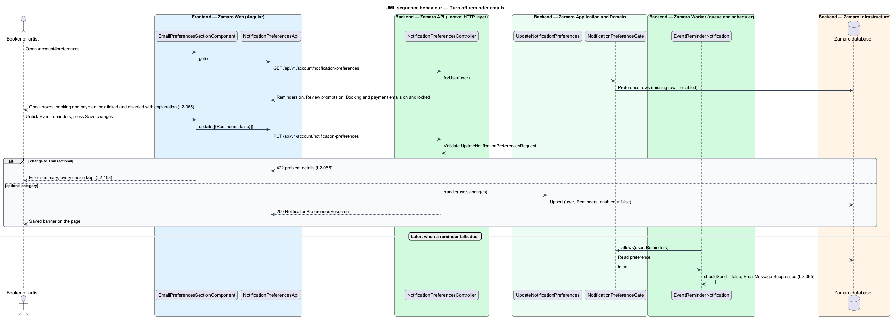

# Manage email preferences

## Overview

Zamaro sends two kinds of email. Some are essential to a booking or payment, such
as the deposit request or the balance-charged notice. Others are helpful but
optional, such as event reminders and prompts to leave a review. This feature lets
a signed-in user turn the optional kinds off. It also guarantees that every
sending path honours that choice, while the essential kinds stay on.

The slice belongs to the notifications subsystem. It owns the preference store and
the `NotificationPreferenceGate` that every notification consults through
`TransactionalNotification::shouldSend()` in `notifications/send-transactional-emails`.
Its first consumer is `EventReminderNotification` in
`notifications/send-event-reminders`. The review-prompt email, sent by the reviews
subsystem, is the second. Marketing-email consent under CASL (L2-080) is not a
notification preference: the same settings section shows it, but a change is
recorded as a consent record by `privacy/record-consent`.

Terms used in this design:

- **notification category** — group of emails that a user turns on or off together
- **transactional category** — category of emails about the user's own bookings and payments, which cannot be turned off
- **optional category** — category a user may turn off: event reminders or review prompts
- **notification preference** — stored on-or-off choice of one user for one optional category
- **notification settings** — Email preferences section `#preferences` of the account settings page at `/account`, where a user changes preferences

## Description

The slice runs from the Email preferences section of account settings in Zamaro Web
to the preference endpoints in the Zamaro API. The Zamaro Worker reads the
preferences at send time.

**Frontend (Zamaro Web, `features/account`)**

- **`EmailPreferencesSectionComponent`** — section `#preferences` of
  `AccountSettingsPage` (`accounts/manage-account-settings`), linked as
  `/account#preferences` from the footer of each optional email. Under "Email me
  about" it shows one design-system checkbox per category: "Bookings and payments"
  (ticked and disabled, "Always on: these are about your dates and your money."),
  "Event reminders" and "Review prompts" (L2-065). Artists see only their
  transactional category, labelled "Requests, bookings and payouts", and "Event
  reminders": review prompts go to bookers alone. Bookers also see the marketing choice
  "New artists near my church", which it saves through
  `POST /api/v1/account/consents/marketing` (`privacy/record-consent`). Changes are
  saved by the page's Save changes button with the rest of the form: the button is
  busy until the requests return (L2-108), a "Saved" banner confirms the save, and a
  failed save keeps every choice with an error message.
- **`NotificationPreferencesApi`** — typed client for the two endpoints below,
  returning `NotificationPreferenceDto` (`category`, `enabled`, `locked`).

**Mock screens** — the section is `#preferences` on
[`pages/account`](../../../mocks/pages/account/default.html); saving it uses the
page's [`submitting`](../../../mocks/pages/account/submitting.html),
[`success`](../../../mocks/pages/account/success.html) and
[`failed`](../../../mocks/pages/account/failed.html) states; the artist's version of the
section is on the [`artist`](../../../mocks/pages/account/artist.html) state. The undeliverable-address
banner of L2-065 is
[`notifications/system-banner/undeliverable`](../../../mocks/notifications/system-banner/undeliverable.html),
raised by `notifications/send-transactional-emails`.

**Backend (Zamaro API)**

- **`NotificationPreferencesController`** — controller for the signed-in user:
  - `GET /api/v1/account/notification-preferences` returns every category with its
    effective state from `NotificationPreferenceGate::forUser()`.
  - `PUT /api/v1/account/notification-preferences` validates
    `UpdateNotificationPreferencesRequest`, calls `UpdateNotificationPreferences` and
    returns the new state.
- **`UpdateNotificationPreferencesRequest`** — FormRequest that accepts a list of
  category and enabled pairs. Any change to `Transactional` fails with 422 and a
  field error (L2-065, L2-095).
- **`UpdateNotificationPreferences`** — action that upserts one
  `NotificationPreference` row per changed optional category inside a transaction.
- **`NotificationPreferenceGate`** — domain service in `App\Services\Notifications`.
  `allows(user, category)` returns true for `Transactional`. For an optional
  category it returns the stored choice, and a missing row means enabled. Every
  optional notification calls it at send time, so a change applies to the next email
  even if that email was queued earlier (L2-065).
- **`NotificationCategory`** — enum with `Transactional`, `Reminders` and
  `ReviewPrompts`. `isOptional()` is false only for `Transactional`. Every
  notification class declares its category through
  `TransactionalNotification::category()`.
- **Suppressed sends** — a notification that the gate refuses is recorded as
  `Suppressed` in `email_messages` (`notifications/send-transactional-emails`).

Whether optional emails also carry a one-click unsubscribe link that works without
signing in is `<TO SUPPLY>`. Each optional email links to `/account#preferences`.

**Data**

- `notification_preferences` — `user_id`, `category`, `enabled`, `updated_at`,
  unique on (`user_id`, `category`). Rows are deleted with the account (L2-082) and
  included in the personal data export (L2-081).

## Requirements

The feature realises the following level-2 (L2) requirement. It refines the
level-1 (L1) requirement shown, and the text is quoted from `docs/specs/L2.md`.

| L2 ID | Refines (L1) | Requirement |
|-------|--------------|-------------|
| `L2-065` | `L1-014` | **Email delivery and preferences.** Acceptance criteria: 1. Given the sending domain, when its DNS is checked, then SPF, DKIM and DMARC (policy quarantine or reject) are configured. 2. Given a transient send failure, when the email job runs, then it retries with exponential backoff up to 5 times before being marked failed and alerted. 3. Given a user opens notification settings, when they turn off reminder or review-prompt emails, then those stop; transactional emails about bookings and payments cannot be turned off. 4. Given a hard bounce, when it is reported, then the address is marked undeliverable and the user sees a banner asking them to update it. |

## Diagrams

### System context

Bookers and artists set their email preferences in Zamaro. Zamaro then sends
through the email delivery service only the emails each user allows.

### Containers

Zamaro Web reads and saves preferences through the Zamaro API. The Zamaro Worker
reads the same table before it sends an optional email.

### Components

`NotificationPreferencesController` validates changes and stores them through
`UpdateNotificationPreferences`. `NotificationPreferenceGate` is the single point that
both the API and the Worker use to read the effective choice.

### Class structure

Each `NotificationPreference` holds one user's choice for one `NotificationCategory`.
`TransactionalNotification` asks `NotificationPreferenceGate` before sending.

### Behaviour — turn off reminder emails

The user turns off reminders and saves the page. An attempt to turn off
booking and payment emails is rejected with 422. When a reminder later falls due,
the gate refuses it and the send is recorded as suppressed.

