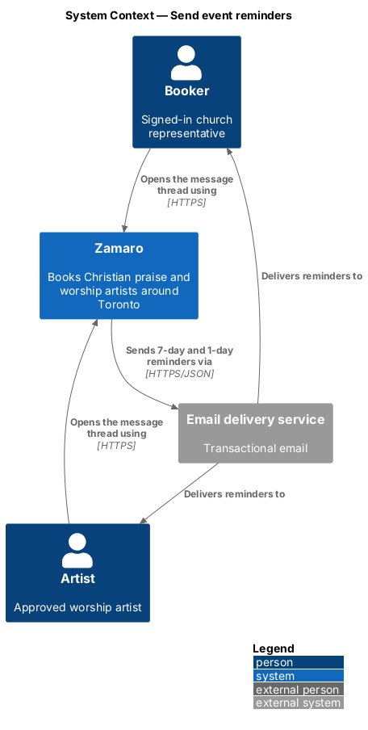
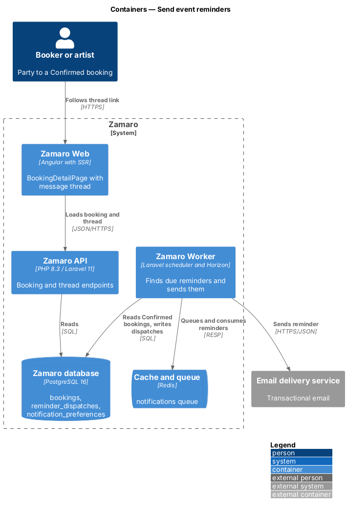
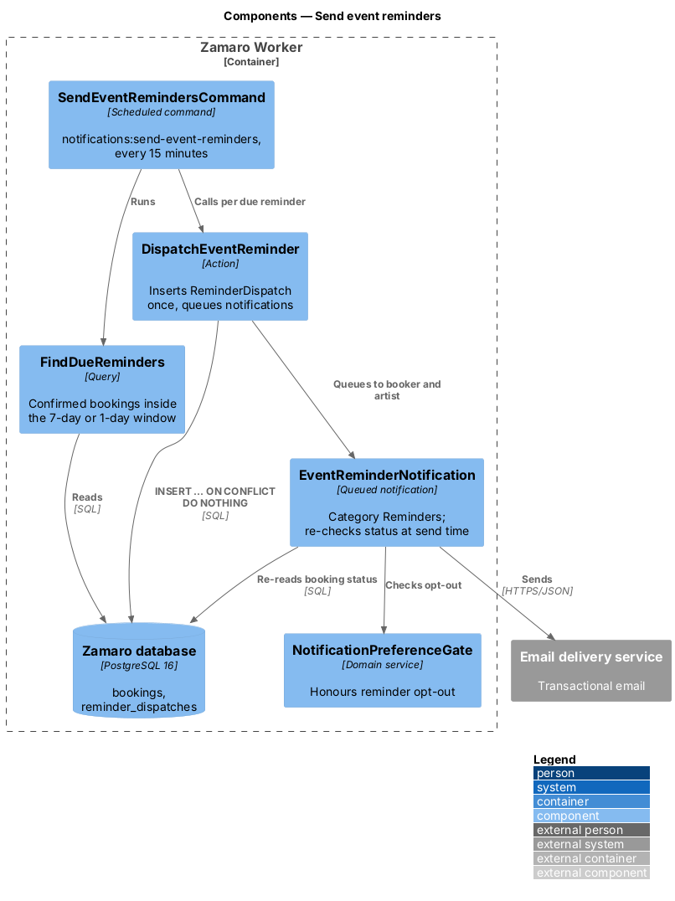
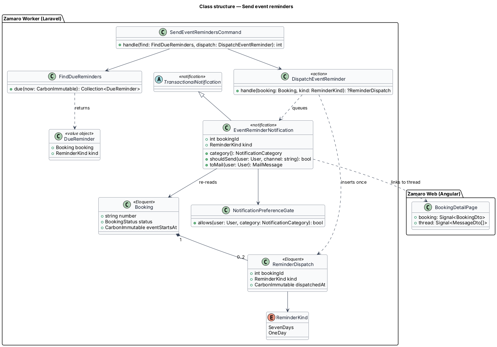
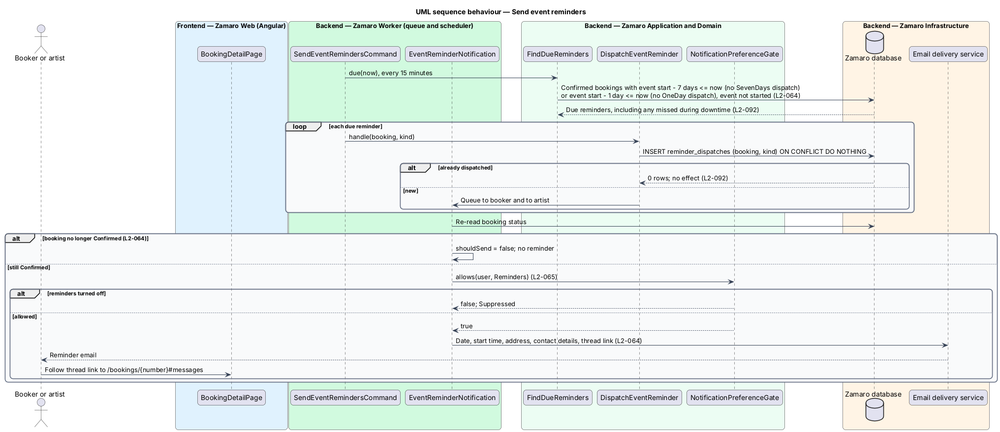

# Send event reminders

## Overview

A Zamaro booking is often confirmed weeks or months before the event. By the time
the date arrives, the booker and the artist both need the practical details in
front of them: date, start time, address and how to reach each other. This feature
sends each party of a Confirmed booking two reminder emails, one 7 days before the
event and one 1 day before. It sends nothing for a booking that is no longer
Confirmed.

The slice is a scheduled job in the notifications subsystem. It uses the delivery
rules and the `TransactionalNotification` base class from
`notifications/send-transactional-emails`. It respects the reminder opt-out from
`notifications/manage-email-preferences`. Cancellation (L2-042, L2-043) changes the
booking status that this slice checks. It needs no direct link to the cancellation
slices.

Terms used in this design:

- **event reminder** — email that tells a party of a Confirmed booking that the event is near
- **reminder kind** — which of the two reminders an email is: 7 days or 1 day before the event start
- **reminder window** — period from the reminder's due time until the event start, during which a missed reminder is still sent
- **reminder dispatch** — database record that a reminder of one kind was queued for one booking
- **contact details** — booker's church phone and the artist's contact phone and email, shown to both parties once a booking is Confirmed (L2-046)
- **thread link** — link to the booking's message thread

## Description

The slice runs entirely in the Zamaro Worker, from the scheduler to the email
delivery service. The recipient later sees the booking in Zamaro Web.

**Backend (Zamaro Worker)**

- **`SendEventRemindersCommand`** — scheduled command
  `notifications:send-event-reminders`, run every 15 minutes in `routes/console.php`.
  Every reminder is therefore sent within 15 minutes of its due time plus queue time.
- **`FindDueReminders`** — query that selects Confirmed bookings whose event start
  minus 7 days, or minus 1 day, is at or before now, whose event has not started, and
  which have no `ReminderDispatch` of that kind. Event start is the event date and
  start time in `America/Toronto` wall-clock time (L2-110). Because the query selects
  by state rather than by a narrow time slice, a run missed during downtime is caught
  up by the next run (L2-092). A booking confirmed fewer than 7 days before its event
  therefore receives the 7-day reminder at the next run. Whether that late 7-day
  reminder, or one that falls due together with the 1-day reminder, should be skipped
  is `<TO SUPPLY>`.
- **`DispatchEventReminder`** — action that inserts a `ReminderDispatch` with a unique
  (`booking_id`, `kind`) key using `INSERT ... ON CONFLICT DO NOTHING`. Only the run
  that inserts the row queues the notifications, so a second run has no effect
  (L2-092). It queues one `EventReminderNotification` to the booker and one to the
  artist.
- **`EventReminderNotification`** — queued notification that extends
  `TransactionalNotification` with category `NotificationCategory::Reminders`.
  - `shouldSend()` re-reads the booking and returns false unless it is still
    Confirmed. A booking cancelled after dispatch but before sending therefore gets
    no reminder (L2-064).
  - `shouldSend()` also asks `NotificationPreferenceGate` whether the recipient has
    reminders turned on (L2-065).
  - The email holds the event date, start time, church address, both parties'
    contact details and the thread link (L2-064), in HTML and plain text, with the
    booking number (L2-063).
  - The booker's thread link is `/bookings/{number}#messages`. The artist's link
    points to the booking in the artist workspace (route `<TO SUPPLY>`).
- **`NotificationPreferenceGate`** — domain service owned by
  `notifications/manage-email-preferences`.

**Frontend (Zamaro Web, `features/bookings`)**

No new component is introduced. `BookingDetailPage` at `/bookings/:number` opens at
the message thread when the URL fragment is `#messages`, and shows the contact
details for a Confirmed booking (L2-046).

**Data**

- `reminder_dispatches` — `booking_id`, `kind` (`SevenDays` or `OneDay`),
  `dispatched_at`, unique on (`booking_id`, `kind`).
- An index on `bookings (status, event_date)` supports the due query.

## Requirements

The feature realises the following level-2 (L2) requirement. It refines the
level-1 (L1) requirement shown, and the text is quoted from `docs/specs/L2.md`.

| L2 ID | Refines (L1) | Requirement |
|-------|--------------|-------------|
| `L2-064` | `L1-014` | **Event reminders.** Acceptance criteria: 1. Given a Confirmed booking, when the event is 7 days away and again 1 day away, then both parties are emailed a reminder with date, start time, address, contact details and the message thread link. 2. Given a booking cancelled before a reminder is due, when the reminder time arrives, then no reminder is sent. |

## Diagrams

### System context

Zamaro emails both parties of a Confirmed booking through the email delivery
service. Each party returns to Zamaro through the thread link.

### Containers

The Zamaro Worker finds due reminders in the database and sends them. Zamaro Web and
the Zamaro API serve the booking page the reminder links to.

### Components

`SendEventRemindersCommand` uses `FindDueReminders` and `DispatchEventReminder`.
`EventReminderNotification` re-checks the booking status and the opt-out before it
sends.

### Class structure

A `Booking` holds at most two `ReminderDispatch` rows, one per `ReminderKind`.
`EventReminderNotification` extends `TransactionalNotification` and consults
`NotificationPreferenceGate`.

### Behaviour — send reminders

Every 15 minutes the command selects due reminders and records each dispatch once.
At send time the notification skips bookings that are no longer Confirmed and
recipients who turned reminders off.

