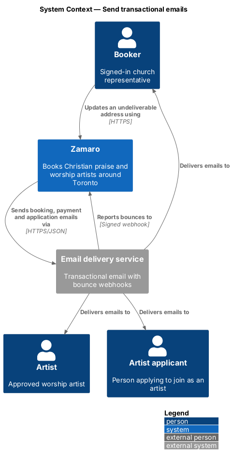
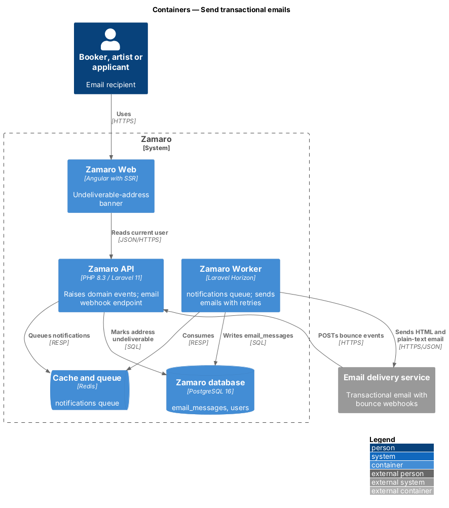
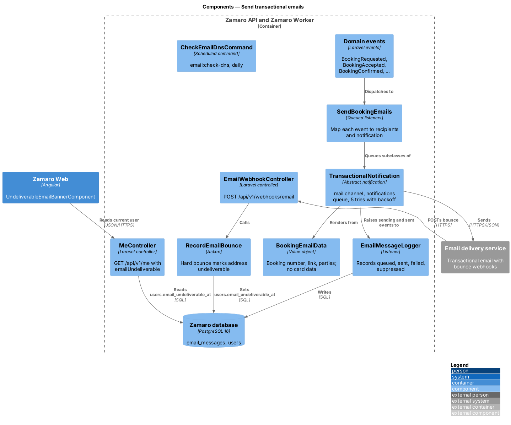
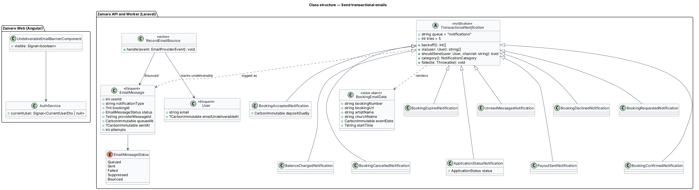
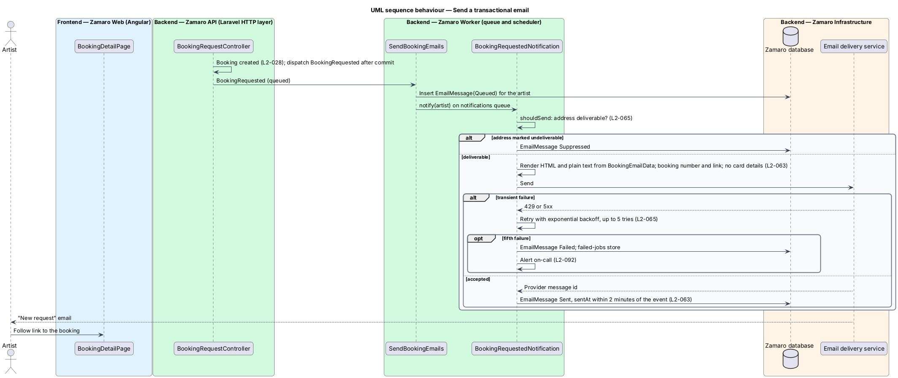
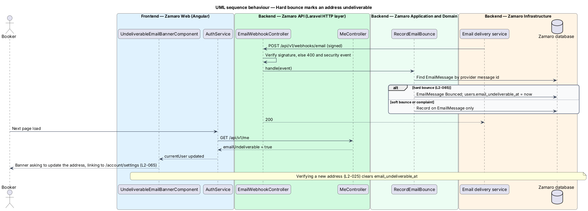

# Send transactional emails

## Overview

Bookings on Zamaro move through statuses without both parties watching the site.
An artist receives a request, a booker is asked for a deposit, a payout leaves
Zamaro. Each change reaches the right person by email within 2 minutes (L2-063). This
feature sends those emails. It maps each domain event to its recipients and a
notification. It delivers the emails through the email delivery service with
retries, and marks an address undeliverable when it hard-bounces.

The notifications subsystem has three slices. This one owns the event-driven
emails and the delivery rules every Zamaro email follows. `notifications/send-event-reminders`
sends the scheduled 7-day and 1-day reminders. `notifications/manage-email-preferences`
lets users turn off the optional categories. The events themselves are raised by
the slices that own each change, for example `payments/pay-deposit` and
`payments/pay-out-artists`. The receipt email is defined in `payments/issue-receipts`
on the same base class.

Terms used in this design:

- **transactional email** — email about a user's own booking, payment or application, sent because of an event in Zamaro
- **domain event** — Laravel event raised after a state change commits, for example `BookingConfirmed`
- **notification** — queued Laravel notification class that renders and sends one email to one recipient
- **hard bounce** — permanent delivery failure reported by the email delivery service, such as an unknown mailbox
- **undeliverable address** — email address marked after a hard bounce, so that Zamaro stops sending to it
- **sending domain** — domain in the From address of every Zamaro email (value `<TO SUPPLY>`)

## Description

The slice runs from domain events raised in the Zamaro API and Worker, through the
`notifications` queue, to the email delivery service. A webhook brings bounces back.

**Event-to-email map (L2-063)**

| Domain event | Notification | Recipients |
|--------------|--------------|------------|
| `BookingRequested` | `BookingRequestedNotification` | Artist |
| `BookingAccepted` | `BookingAcceptedNotification`, with deposit link and deadline | Booker |
| `BookingDeclined` | `BookingDeclinedNotification` | Booker |
| `BookingExpired` | `BookingExpiredNotification` | Booker and artist |
| `BookingConfirmed` | `BookingConfirmedNotification` | Booker and artist |
| `BalanceCharged` | `BalanceChargedNotification` | Booker |
| `PayoutSent` | `PayoutSentNotification` | Artist |
| `BookingCancelled` | `BookingCancelledNotification` | Booker and artist |
| `UnreadMessagesDue` | `UnreadMessagesNotification` | Other party (L2-045) |
| `ApplicationSubmitted`, `ApplicationApproved`, `ApplicationRejected` | `ApplicationStatusNotification` | Applicant |

The 15-minute digest window for messages belongs to the booking messages slice
(L2-045), which raises `UnreadMessagesDue` at most once per window. The extra
content required by other requirements is supplied by the raising slice. Examples
are the decline reason and similar artists (L2-030) and the cancellation policy line
(L2-044).

Other slices add notifications on the same base class: `ReceiptNotification`
(`payments/issue-receipts`), `BalancePaymentFailedNotification`
(`payments/collect-balance`), `AdministratorAlertNotification` (shared
`AlertAdministrators` action) and `EventReminderNotification`
(`notifications/send-event-reminders`).

**Backend (Zamaro API and Zamaro Worker)**

- **`SendBookingEmails`** — set of queued listeners, one per domain event in the map.
  Each resolves the recipients, writes an `EmailMessage` with status `Queued` and
  calls `notify()`. Events dispatch after the database transaction commits, so no
  email describes a rolled-back change.
- **`TransactionalNotification`** — abstract base class in `App\Notifications`. Every
  Zamaro email extends it.
  - It uses the `mail` channel on the `notifications` queue, which Horizon runs with
    dedicated workers to meet the 2-minute target (L2-063).
  - It sets `tries = 5` with an exponential `backoff()` (intervals `<TO SUPPLY>`).
    After the fifth failure, `failed()` marks the `EmailMessage` `Failed`, and the job
    moves to the failed-jobs store and alerts (L2-065, L2-092).
  - `shouldSend()` returns false for an undeliverable address and records
    `Suppressed`. For the optional categories it also asks `NotificationPreferenceGate`
    from `notifications/manage-email-preferences`.
  - `category()` returns `NotificationCategory::Transactional` unless a subclass
    overrides it.
- **`BookingEmailData`** — value object passed to every booking template: booking
  number, absolute booking link, artist name, church name, event date and start
  time. It has no card fields, so no template can print card details (L2-063).
  Receipts add only the brand and last 4 digits (L2-040).
- **Templates** — Laravel Markdown mail templates producing HTML and plain-text
  parts (L2-063), styled with the design-system email tokens. Text comes from
  translation files (L2-111). Dates, times and money use the en-CA formats of
  L2-110.
- **`EmailMessageLogger`** — listener on Laravel's `NotificationSending`,
  `NotificationSent` and `NotificationFailed` events. It stores the provider message
  ID and `sent_at`. The gap from `queued_at` to `sent_at` is exported as a metric
  (L2-093). The alert threshold for the 2-minute target is `<TO SUPPLY>`.
- **`EmailWebhookController`** — controller for `POST /api/v1/webhooks/email`. It
  verifies the provider's signature (400 and a security event when invalid) and
  calls `RecordEmailBounce`.
- **`RecordEmailBounce`** — action that marks the `EmailMessage` `Bounced`. On a hard
  bounce it sets `users.email_undeliverable_at` (L2-065). Soft bounces and
  complaints are recorded only. Verifying a new address through account settings
  (L2-025) clears the flag.
- **`CheckEmailDnsCommand`** — scheduled command `email:check-dns`, run daily. It
  resolves the sending domain's SPF, DKIM and DMARC records, checks that the DMARC
  policy is `quarantine` or `reject`, and alerts when a record is missing or weaker
  (L2-065). The records themselves are published in DNS by infrastructure
  configuration.
- **`MeController`** — existing `GET /api/v1/me` resource, extended with an
  `emailUndeliverable` flag.

**Frontend (Zamaro Web, app shell)**

- **`UndeliverableEmailBannerComponent`** — design-system alert banner in the
  signed-in app shell. It reads `AuthService.currentUser()` and, when
  `emailUndeliverable` is true, asks the user to update the address with a link to
  `/account/settings` (L2-065). Banner wording `<TO SUPPLY>`.

The email delivery service vendor is `<TO SUPPLY>`. Its adapter sits behind Laravel's
mail transport, so templates and notifications do not depend on the vendor.

**Data**

- `email_messages` — `user_id`, `notification_type`, `booking_id`, `status`,
  `provider_message_id`, `queued_at`, `sent_at`, `attempts`, `bounce_type`.
  Retention `<TO SUPPLY>`.
- `users.email_undeliverable_at` — set by a hard bounce, cleared by a verified
  address change.

## Requirements

The feature realises the following level-2 (L2) requirements. Each refines the
level-1 (L1) requirement shown, and the text is quoted from `docs/specs/L2.md`.

| L2 ID | Refines (L1) | Requirement |
|-------|--------------|-------------|
| `L2-063` | `L1-014` | **Email notifications.** Acceptance criteria: 1. Given each of these events, when it occurs, then the listed party is emailed within 2 minutes: request created (artist), request accepted (booker, with deposit link and deadline), request declined (booker), request expired (both), deposit paid and booking confirmed (both), balance charged (booker), payout sent (artist), booking cancelled (both), new messages (other party, L2-045), application received, approved or rejected (applicant). 2. Given each email, when it is sent, then it contains the booking number where relevant, a link to the booking, plain-text and HTML parts, and no payment card details. |
| `L2-065` | `L1-014` | **Email delivery and preferences.** Acceptance criteria: 1. Given the sending domain, when its DNS is checked, then SPF, DKIM and DMARC (policy quarantine or reject) are configured. 2. Given a transient send failure, when the email job runs, then it retries with exponential backoff up to 5 times before being marked failed and alerted. 3. Given a user opens notification settings, when they turn off reminder or review-prompt emails, then those stop; transactional emails about bookings and payments cannot be turned off. 4. Given a hard bounce, when it is reported, then the address is marked undeliverable and the user sees a banner asking them to update it. |

## Diagrams

### System context

Zamaro sends every booking, payment and application email through the email
delivery service. The service reports bounces back to Zamaro.

### Containers

The Zamaro API raises events and queues notifications. The Zamaro Worker sends
them and logs each message. Bounces arrive at the Zamaro API, and Zamaro Web shows
the resulting banner.

### Components

`SendBookingEmails` listeners turn domain events into `TransactionalNotification`
subclasses. `RecordEmailBounce` and `CheckEmailDnsCommand` cover the delivery side
of L2-065.

### Class structure

Every email extends `TransactionalNotification`, renders from `BookingEmailData`
and is logged as an `EmailMessage`. A hard bounce updates both the message and the
`User`.

### Behaviour — send an email

A new booking request raises `BookingRequested`, which queues one email to the
artist. Undeliverable addresses are suppressed. Transient failures retry with
exponential backoff up to 5 times before the message is marked failed and alerted.

### Behaviour — hard bounce

A signed bounce event marks the address undeliverable. The next page load shows the
banner that asks the user to update it.

