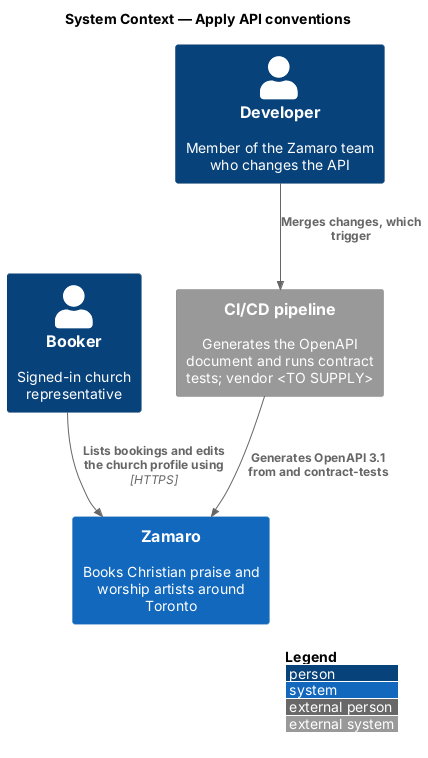
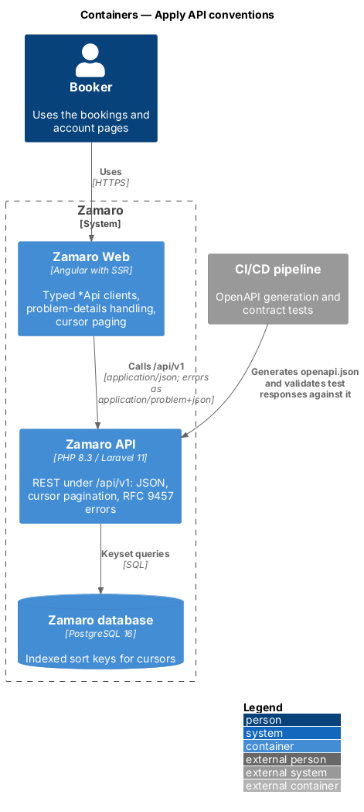
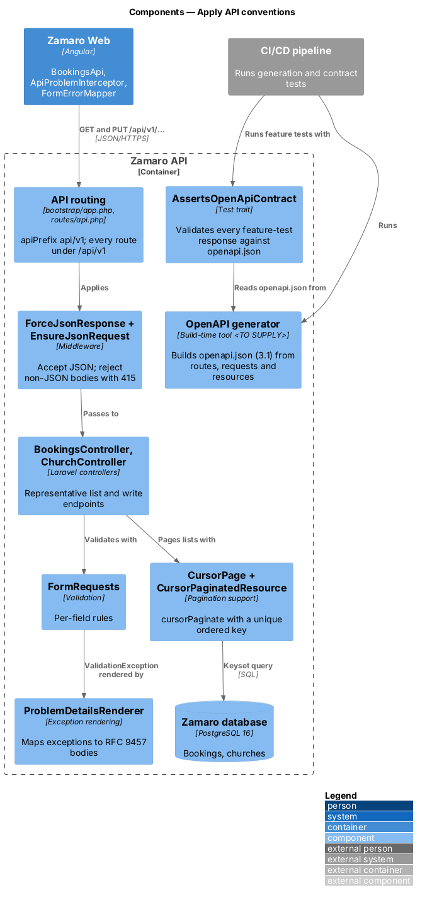
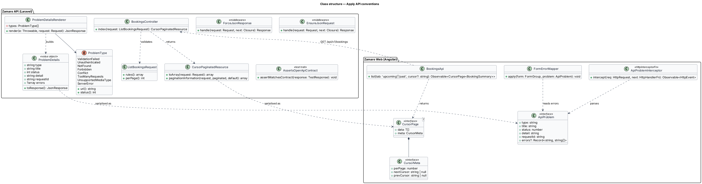
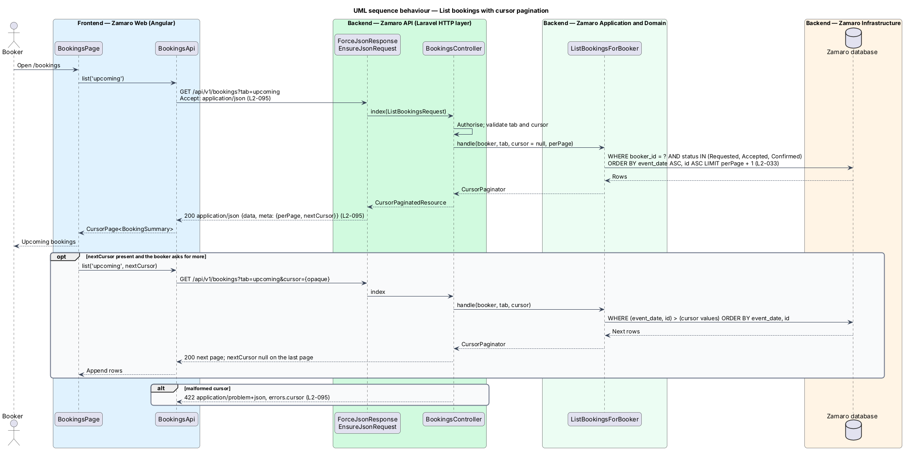
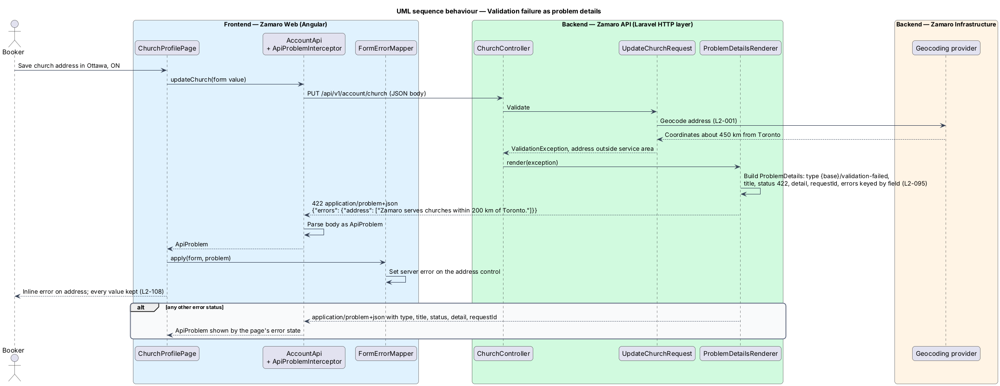

# Apply API conventions

## Overview

Zamaro Web talks to the Zamaro API for every search, profile, booking, message and
administrative action. L1-019 asks the system to be run reliably in production, and a
REST API whose routes, payloads, lists and errors behave the same way everywhere is a
large part of that. This feature fixes those shared rules once, so each feature slice
inherits them rather than inventing its own, and proves in CI that the published API
description matches what the API returns.

The slice follows two representative requests end to end: a booker paging through
`GET /api/v1/bookings` with an opaque cursor, and a church-profile save rejected with a
422 problem-details body whose field errors land on the right form control. A CI run
generates the OpenAPI document and checks every tested response against it.

Terms used in this design:

- **REST API** — set of HTTP endpoints under `/api/v1` that Zamaro Web and other clients call
- **cursor pagination** — list paging in which each page returns an opaque token naming the position after its last item, instead of a page number or offset
- **cursor** — opaque, URL-safe token that encodes the sort-key values of a list's last returned row
- **keyset query** — SQL query that continues after given sort-key values using a comparison on an index, rather than `OFFSET`
- **problem details** — JSON error body defined by RFC 9457, served as `application/problem+json`
- **problem type** — URI that identifies one class of error in a problem-details body
- **OpenAPI document** — machine-readable description of every route, parameter, request body and response, here in OpenAPI 3.1
- **contract test** — automated test that fails when an actual response does not match the OpenAPI document

Related slices: rate-limit responses (L2-077) and ownership 404s (L2-074) use the
problem-details shape defined here; the `requestId` member comes from
`operations/monitor-health-and-errors`; the contract tests run in the pipeline described
in `operations/back-up-deploy-and-host`; search paging in
`discovery/search-available-artists` uses the same cursor rules.

## Description

The slice spans Zamaro Web, the Zamaro API, PostgreSQL and the CI/CD pipeline.

**Routes and media types (L2-095 criterion 1)**

- **API routing** — `bootstrap/app.php` registers `routes/api.php` with
  `apiPrefix: 'api/v1'`, so every API route is under `/api/v1`. Operational endpoints
  (`/health/live`, `/health/ready`) and web routes such as `/sitemap.xml` sit outside the
  REST API. A future breaking change introduces `/api/v2` alongside `/api/v1`; the
  deprecation period is `<TO SUPPLY>`.
- **`ForceJsonResponse`** — middleware that sets `Accept: application/json` on every API
  request, so Laravel renders all responses, including framework exceptions, as JSON.
- **`EnsureJsonRequest`** — middleware that rejects a body-carrying request whose
  `Content-Type` is not `application/json` with 415. Upload endpoints that receive file
  chunks are the named exception (L2-051, L2-052).
- **JSON shape** — resources return `{ "data": ... }`. Dates are ISO 8601, money is
  integer cents with a currency code, and distances are whole kilometres. Property
  casing is `<TO SUPPLY>`; the diagrams use camelCase.

**Cursor pagination (L2-095 criterion 1)**

- **`CursorPaginatedResource`** — base resource collection for every list endpoint. It
  wraps Laravel's `cursorPaginate()` and overrides `paginationInformation()` to emit
  `meta.perPage`, `meta.nextCursor` and `meta.prevCursor`. `nextCursor` is `null` on the
  last page. No list returns a total count unless its requirement asks for one, as the
  search summary line does.
- **Ordering rule** — every paginated query orders by its business key followed by `id`,
  so the ordering is unique and the cursor is stable while rows are inserted. A
  composite index covers each ordering, for example `bookings (booker_id, event_date, id)`.
- **List requests** — each list FormRequest validates `cursor` and returns its page size
  (24 for search per L2-010, 10 for reviews per L2-018, `<TO SUPPLY>` elsewhere). A
  cursor that does not decode is a 422 with `errors.cursor`.
- **`CursorPage<T>`** and **`CursorMeta`** — matching TypeScript types used by every
  typed `*Api` client in Zamaro Web, for example `BookingsApi.list(tab, cursor)`.

**Problem details (L2-095 criterion 2)**

- **`ProblemDetailsRenderer`** — registered in `bootstrap/app.php` through
  `withExceptions()->render(...)` for `api/*` requests. It maps each exception to a
  `ProblemType` and returns a `ProblemDetails` body as `application/problem+json`.
- **`ProblemDetails`** — value object with `type`, `title`, `status`, `detail`, the
  `requestId` extension member and, for 422 only, `errors`: an object keyed by field
  path whose values are arrays of messages.
- **`ProblemType`** — enum of problem types. Each has a stable URI under a
  Zamaro-owned base (`<TO SUPPLY>`), a status and a title.

| Exception | Status | Problem type |
|-----------|--------|--------------|
| `ValidationException` | 422 | `ValidationFailed`, with `errors` |
| `AuthenticationException` | 401 | `Unauthenticated` |
| `ModelNotFoundException`, policy denial on ownership (L2-074) | 404 | `NotFound` |
| Policy denial where L2-059 states 403 | 403 | `Forbidden` |
| Disallowed booking transition (L2-029) | 409 | `Conflict` |
| `ThrottleRequestsException` (L2-077) | 429 | `TooManyRequests`, with `Retry-After` |
| Non-JSON body | 415 | `UnsupportedMediaType` |
| Any other `Throwable` | 500 | `ServerError`, generic `detail`, no stack trace |

- **`ApiProblemInterceptor`** — Angular HTTP interceptor that parses any
  `application/problem+json` error into an `ApiProblem` before the calling store sees it.
- **`FormErrorMapper`** — sets each entry of `ApiProblem.errors` as a server error on
  the matching reactive-form control, so the form shows inline errors and keeps every
  value (L2-108).

**OpenAPI and contract tests (L2-095 criterion 3)**

- **OpenAPI generator** — CI generates `openapi.json` in OpenAPI 3.1 from the routes,
  FormRequests and API resources. The generator is `<TO SUPPLY>`. The document is kept
  as a pipeline artifact; publishing it beyond the team is `<TO SUPPLY>`.
- **`AssertsOpenApiContract`** — test trait used by every API feature test. After each
  request it validates the status, headers and body against the operation in
  `openapi.json`, including the problem-details schema for errors. A mismatch fails the
  build. The validator library is `<TO SUPPLY>`.
- Generating the Angular `*Api` types from the same document is `<TO SUPPLY>`.

## Requirements

The feature realises the following level-2 (L2) requirement; the text is quoted from `docs/specs/L2.md`.

| L2 ID | Refines (L1) | Requirement |
|-------|--------------|-------------|
| `L2-095` | `L1-019` | **API conventions.** Acceptance criteria: 1. Given the REST API, when it is called, then every route is under `/api/v1`, accepts and returns JSON, and list endpoints use cursor pagination. 2. Given any error response, when it is returned, then the body follows RFC 9457 problem details with `type`, `title`, `status`, `detail` and, for 422, an `errors` object keyed by field. 3. Given the API, when CI runs, then an OpenAPI 3.1 document is generated and contract tests confirm responses match it. |

## Diagrams

### System context

Bookers use Zamaro through its REST API, and the CI/CD pipeline generates the OpenAPI
document and contract-tests the API on each merge.

### Containers

Zamaro Web calls `/api/v1` with JSON and receives problem details on errors. The Zamaro
API pages lists with keyset queries against PostgreSQL.

### Components

Routing places every endpoint under `/api/v1`, the JSON middleware fixes media types,
and `CursorPaginatedResource` and `ProblemDetailsRenderer` shape lists and errors. The
generator and `AssertsOpenApiContract` run in CI.

### Class structure

`ProblemDetails` and `CursorPaginatedResource` on the server serialise to the
`ApiProblem` and `CursorPage<T>` types the Angular clients consume.

### Behaviour — list bookings with cursor pagination

The first page has no cursor. Each later page continues after the last row's sort-key
values, and `nextCursor` is null on the last page.

### Behaviour — validation failure as problem details

An address outside the service area becomes a 422 problem-details body with
`errors.address`, which `FormErrorMapper` shows inline while the form keeps every value.

