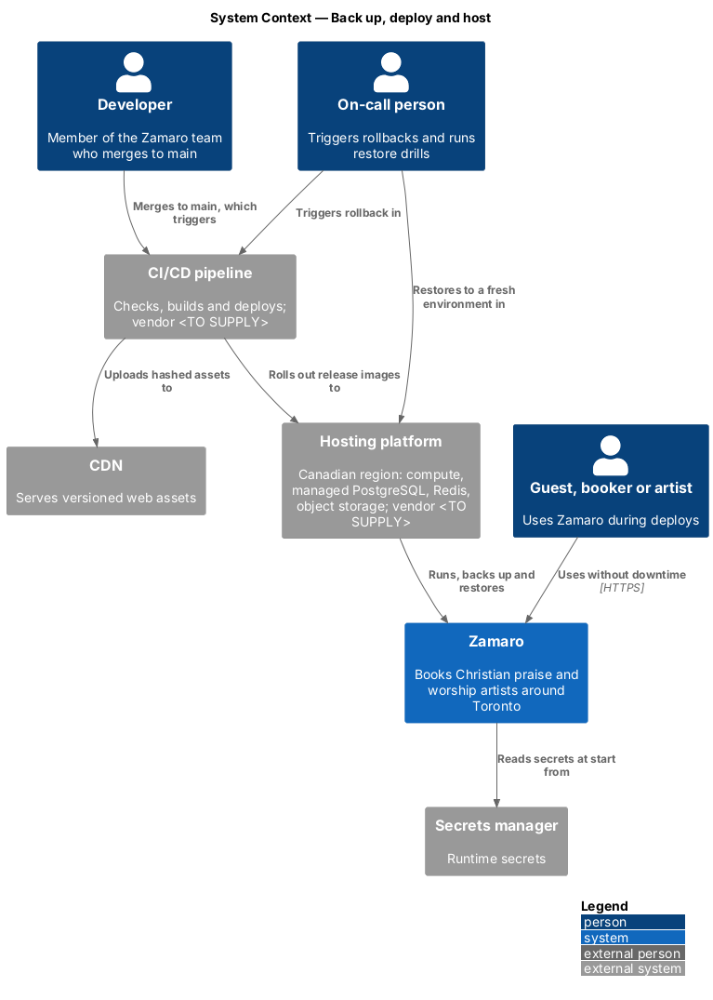
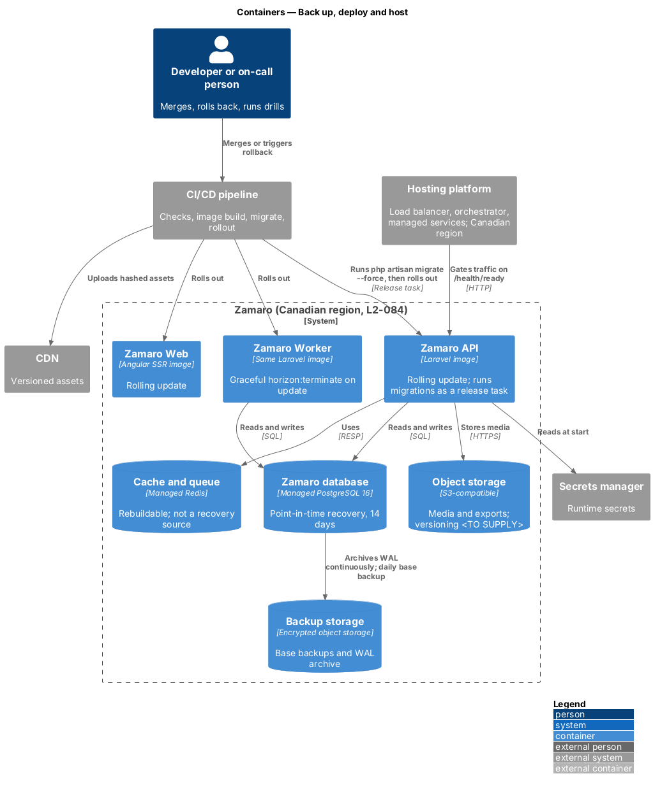
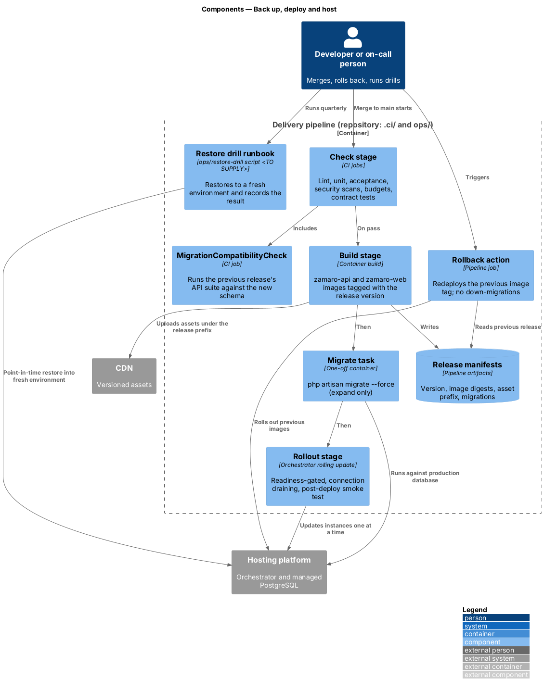
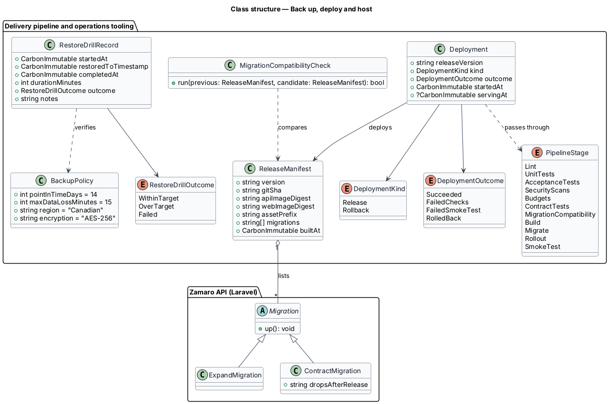
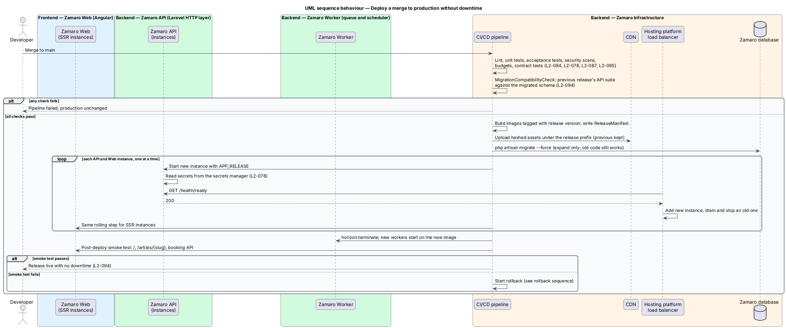
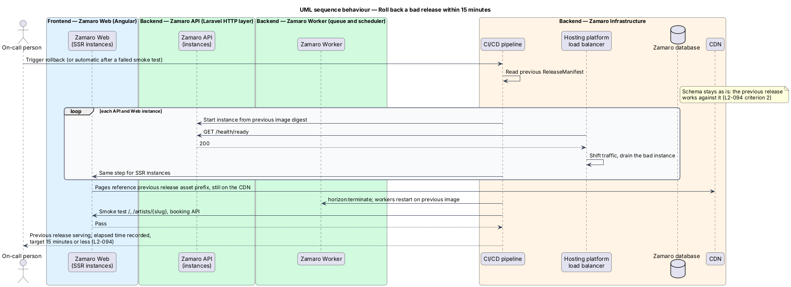
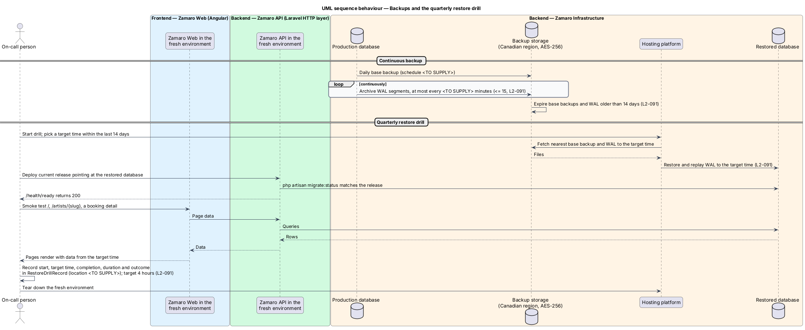

# Back up, deploy and host

## Overview

Zamaro holds bookings, payments and personal information about Canadian churches and
artists. L1-017 asks the system to handle that information in line with Canadian
privacy law, and L1-019 asks it to stay available and recover from failure without
losing bookings or payments. This feature covers where Zamaro runs, how a change reaches
production, how a bad change is undone and how data comes back after a loss.

The slice follows one representative pipeline run end to end: a merge to `main` passing
every check, migrating the database, rolling new instances behind the readiness probe
and passing a smoke test, with no visitor seeing downtime. Two further paths cover the
rollback of a bad release and the continuous backup that the quarterly restore drill
proves.

Terms used in this design:

- **release** — immutable set of container images and web assets built from one commit and named by a release version
- **release manifest** — pipeline artifact listing a release's version, commit, image digests, asset prefix and migrations
- **rolling update** — deployment that replaces instances one at a time, adding each new instance to the load balancer only when it is ready
- **backward-compatible migration** — schema change after which the previous release still runs correctly
- **expand–contract** — two-release pattern in which a migration only adds schema in one release and removes unused schema in a later release
- **rollback** — redeployment of the previous release's images without reversing migrations
- **point-in-time recovery (PITR)** — restore of a database to any chosen moment by replaying archived write-ahead log onto a base backup
- **write-ahead log (WAL)** — PostgreSQL's ordered record of every change, archived continuously for PITR
- **recovery point** — maximum span of data that may be lost, here 15 minutes
- **restore drill** — scheduled exercise that restores production data into a fresh environment and records the result
- **data residency** — requirement that data is stored in data centres in a named country, here Canada

Related slices: the readiness probe is defined in `operations/monitor-health-and-errors`;
bundle and Lighthouse budgets in `operations/deliver-fast-pages`; contract tests in
`operations/apply-api-conventions`; background-job recovery in
`operations/run-background-jobs`.

## Description

The slice spans the CI/CD pipeline, the hosting platform, the CDN, the secrets manager
and every Zamaro container. The pipeline vendor, hosting vendor and Canadian region are
`<TO SUPPLY>`.

**Hosting and data residency (L2-084)**

Every Zamaro container and data store runs in one Canadian region of the hosting
platform: Zamaro Web, the Zamaro API, the Zamaro Worker, managed PostgreSQL 16, managed
Redis, object storage and backup storage. Logs go to a log management service hosted in
a Canadian region (`operations/monitor-health-and-errors`). The error tracking service,
metrics and alerting service, real-user monitoring service and uptime monitor shall
either store data in Canada or receive no personal data; the choice per vendor is
`<TO SUPPLY>`. CDN edge locations may sit outside Canada, so the CDN caches only
public pages, assets and public media; responses with personal data carry
`Cache-Control: private, no-store` (L2-089).
Data at rest, including backups, is encrypted with AES-256 (L2-079).

**Pipeline (L2-094 criterion 1)**

Pipeline configuration lives in the repository (`.ci/`, layout `<TO SUPPLY>`). A merge to
`main` runs these stages, and any failure stops the run before production changes:

| Stage | Contents |
|-------|----------|
| Lint | PHP and TypeScript linters and static analysis (tools `<TO SUPPLY>`) |
| Unit tests | Laravel and Angular unit suites |
| Acceptance tests | End-to-end tests of the L2 acceptance criteria (tool `<TO SUPPLY>`) |
| Security scans | Secret scan, Composer and npm vulnerability audit (L2-078) |
| Budgets | Gzipped bundle budgets (L2-087) and Lighthouse (L2-086) |
| Contract tests | Responses against the generated OpenAPI 3.1 document (L2-095) |
| Migration compatibility | `MigrationCompatibilityCheck` |
| Build | `zamaro-api` image (also used by the Worker) and `zamaro-web` image, tagged with the release version; `ReleaseManifest` written |
| Migrate | One-off task running `php artisan migrate --force` |
| Rollout | Rolling update of API, Web and Worker, then the smoke test |

- **`MigrationCompatibilityCheck`** — applies the candidate's migrations to a test
  database, then runs the previous release's API test suite against it. A failure
  means the previous release would break on the new schema (L2-094 criterion 2).
- **Expand–contract** — migrations in a release only add tables, nullable columns and
  indexes (created concurrently). A `ContractMigration` that drops or renames schema
  names the release after which nothing reads that schema, and ships one release later.
- **Rollout** — the hosting platform starts each new instance with `APP_RELEASE` set,
  and the instance reads secrets from the secrets manager (L2-078). The platform adds it
  to the load balancer only after `/health/ready` returns 200, then drains and stops an
  old instance. Workers stop with `horizon:terminate`, which finishes in-flight jobs. The
  scheduler runs as a single instance.
- **Assets** — hashed bundles are uploaded to the CDN under a per-release prefix
  before rollout, and the previous release's prefix is kept, so old and new pages both
  find their scripts during the switch.
- **Smoke test** — after rollout the pipeline requests `/`, a published profile and a
  booking API route. A failure starts the rollback automatically.

**Rollback (L2-094 criterion 3)**

The rollback action reads the previous `ReleaseManifest` and runs the same
readiness-gated rolling update with the previous image digests. It never runs down
migrations, because the schema is backward compatible. The pipeline records the time
from trigger to the previous release serving; the target is 15 minutes or less.

**Backups and recovery (L2-091)**

- **PostgreSQL** — the managed service takes a daily base backup and archives WAL
  continuously to encrypted backup storage in the same Canadian region. Retention is
  14 days. The WAL archive interval is `<TO SUPPLY>` and shall not exceed 15 minutes.
- **Object storage** — versioning or replication for media and documents, and its
  retention, are `<TO SUPPLY>`.
- **Redis** — not a recovery source. It holds caches, sessions, locks and queues;
  scheduled commands re-derive due work from PostgreSQL (`operations/run-background-jobs`).
- **Restore drill** — once a quarter the on-call person runs the restore drill
  runbook (`ops/restore-drill`, `<TO SUPPLY>`). It restores to a chosen moment in the
  last 14 days into a fresh environment, deploys the current release against it, checks
  readiness and smoke-tests the main pages. The outcome is kept as a
  `RestoreDrillRecord` with start, target time, completion, duration and outcome; the
  target is 4 hours. Where the record is kept is `<TO SUPPLY>`.

## Requirements

The feature realises the following level-2 (L2) requirements; the text is quoted from `docs/specs/L2.md`.

| L2 ID | Refines (L1) | Requirement |
|-------|--------------|-------------|
| `L2-084` | `L1-017` | **Data residency.** Acceptance criteria: 1. Given the production database, object storage, backups and logs, when their location is checked, then they are hosted in Canadian data centre regions. |
| `L2-091` | `L1-019` | **Backups and recovery.** Acceptance criteria: 1. Given production data, when it is backed up, then point-in-time recovery allows restoring to any moment in the last 14 days with no more than 15 minutes of data loss. 2. Given a quarterly restore drill, when it runs, then production is restorable to a fresh environment within 4 hours and the result is recorded. |
| `L2-094` | `L1-019` | **Deployments.** Acceptance criteria: 1. Given a merge to the main branch, when CI passes (lint, unit tests, acceptance tests, security scans, budgets), then it deploys to production without downtime. 2. Given a database migration, when it is deployed, then it is backward compatible with the previous release. 3. Given a bad release, when rollback is triggered, then the previous release is serving within 15 minutes. |

## Diagrams

### System context

Developers and the on-call person act through the CI/CD pipeline, which deploys Zamaro
onto the hosting platform in a Canadian region. The platform also backs up and restores
Zamaro's data.

### Containers

Every Zamaro container and store sits in one Canadian region. The pipeline migrates the
database before rolling out the API, Web and Worker, and PostgreSQL archives to
encrypted backup storage.

### Components

The delivery pipeline runs checks, the migration compatibility check, build, migrate and
a readiness-gated rollout. The rollback action and the restore drill runbook reuse the
release manifests and the hosting platform.

### Class structure

`ReleaseManifest` and `Deployment` describe what is deployed and how it ended.
`BackupPolicy` holds the recovery targets that each `RestoreDrillRecord` verifies.

### Behaviour — deploy a merge to production without downtime

Checks run before anything changes. The expand-only migration runs next, then each
instance is replaced only after the new one reports ready, and a failed smoke test
triggers rollback.

### Behaviour — roll back a bad release within 15 minutes

Rollback redeploys the previous images through the same readiness-gated steps and leaves
the schema in place.

### Behaviour — backups and the quarterly restore drill

PostgreSQL archives WAL continuously so any moment in the last 14 days is restorable.
The drill restores into a fresh environment, smoke-tests it and records the outcome.

