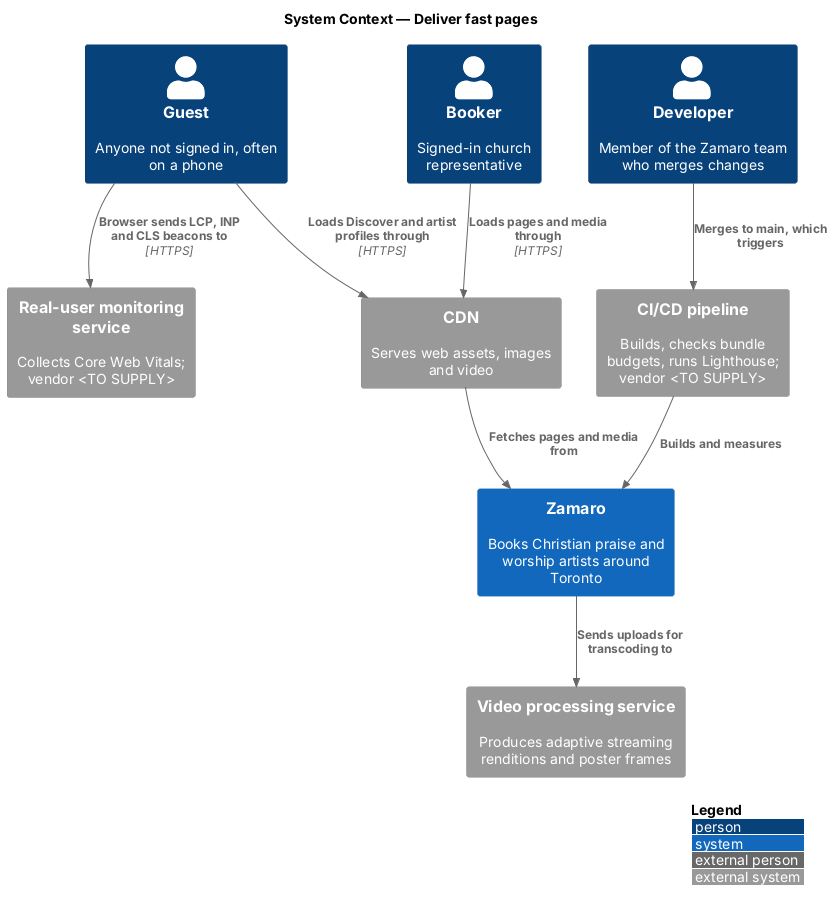
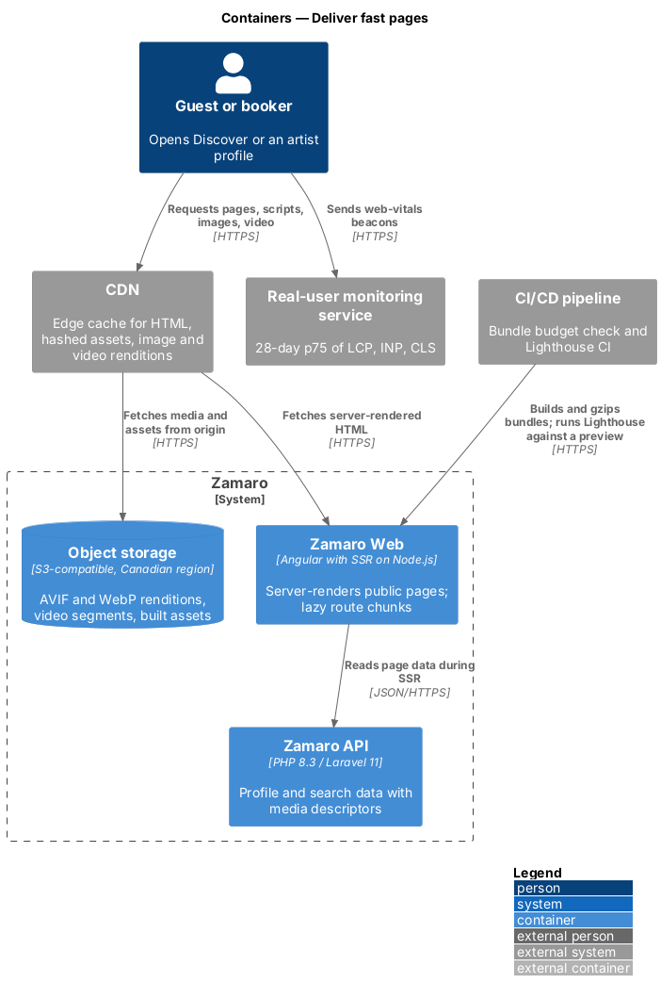
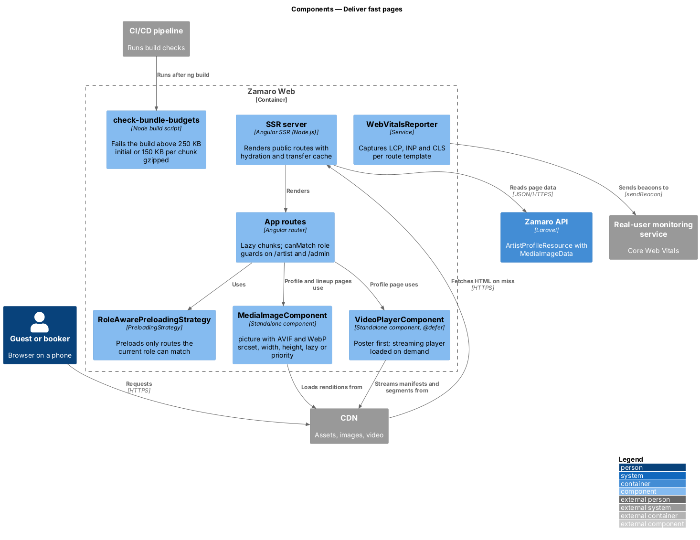
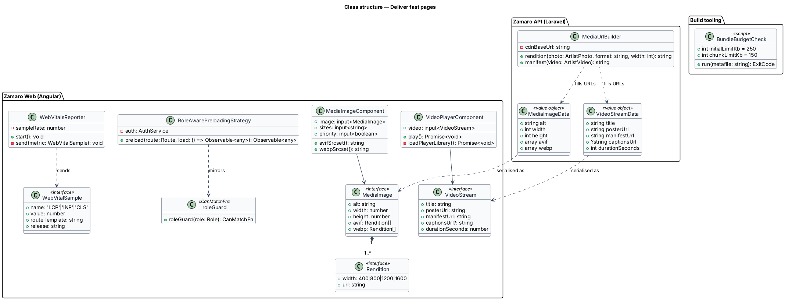
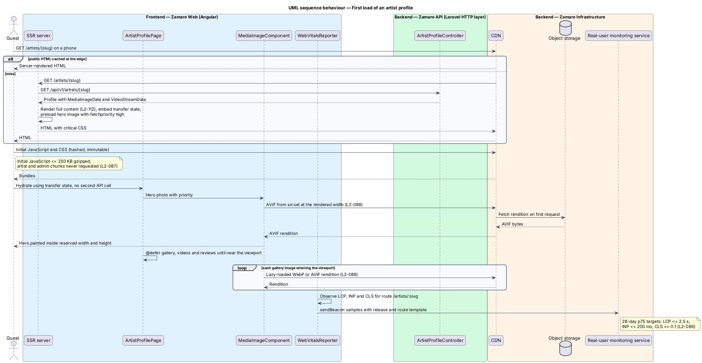
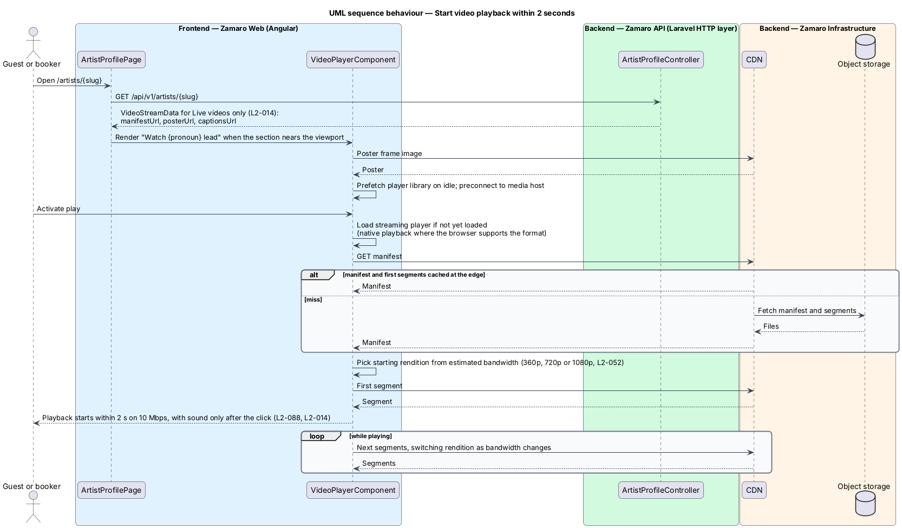
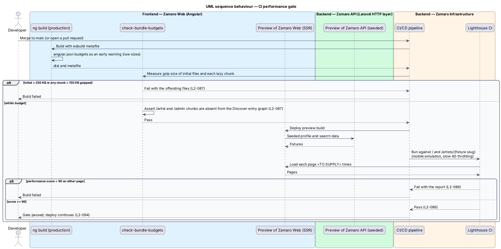

# Deliver fast pages

## Overview

Most visitors reach Zamaro on a phone, from a shared profile link or a search for a
worship artist near their church. L1-018 asks the system to feel fast on mobile
networks. This feature covers the browser side of that aim: how quickly Discover and
artist profiles paint and respond, how much JavaScript a visitor downloads, and how
images and video reach the screen.

The slice follows one representative request end to end: a guest's first load of
`/artists/{slug}` through the CDN, the Angular SSR server, hydration, image loading and
the real-user monitoring beacon. Two further paths cover video playback and the CI gate
that blocks a merge when bundles or Lighthouse scores fall outside their limits.

Terms used in this design:

- **Core Web Vitals** — set of three browser metrics for loading, responsiveness and visual stability
- **Largest Contentful Paint (LCP)** — time until the largest image or text block in the viewport is painted
- **Interaction to Next Paint (INP)** — latency from a user interaction to the next frame the browser paints
- **Cumulative Layout Shift (CLS)** — score for unexpected movement of visible content
- **real-user monitoring (RUM)** — collection of Core Web Vitals from real visitors' browsers
- **Lighthouse** — lab tool that loads a page under emulated device and network conditions and scores its performance from 0 to 100
- **initial JavaScript** — scripts the browser downloads before the first route renders
- **lazy route chunk** — script bundle downloaded only when its route is first matched
- **rendition** — one pre-encoded size and format of an image or video
- **above the fold** — inside the first viewport without scrolling
- **adaptive streaming** — video delivery in short segments at several bitrates, switched by the player as bandwidth changes

Related slices: API server time and HTTP caching belong to
`operations/meet-response-time-budgets`; the skeletons that keep layout shift low
(L2-105) and the Discover page itself belong to `discovery/search-available-artists`;
the pipeline that runs these checks belongs to `operations/back-up-deploy-and-host`.

## Description

The slice spans Zamaro Web (browser and SSR server), the Zamaro API, object storage,
the CDN, the real-user monitoring service and the CI/CD pipeline.

**Rendering and code splitting (L2-086, L2-087)**

- **SSR server** — Angular SSR on Node.js renders Discover, artist profiles and other
  public routes with full content (L2-112). It enables client hydration with the HTTP
  transfer cache, so the browser does not repeat the API calls made during rendering.
  It emits a `<link rel="preload">` with `fetchpriority="high"` for the LCP image.
- **App routes** — every area is a lazy route (`loadComponent` or `loadChildren`).
  `/artist/*` uses `canMatch: [roleGuard(Role.Artist)]` and `/admin/*` uses
  `canMatch: [roleGuard(Role.Administrator)]`. A route that fails `canMatch` is never
  loaded, so a booker on Discover never downloads artist or admin code (L2-087).
- **`RoleAwarePreloadingStrategy`** — preloads only routes flagged `data.preload` that
  the current role can match. Guests and bookers preload nothing from the artist or
  admin areas.
- **`@defer` blocks** — the profile's gallery, videos and reviews, and Discover content
  below the first lineup row, render when they near the viewport.
- **Layout stability** — every image has explicit `width` and `height`. Loading states
  use skeletons matching the final layout (L2-105). Web fonts use `font-display` and
  size-adjusted fallbacks from the design system (`<TO SUPPLY>`).

**Images (L2-088)**

- **`MediaImageComponent`** — renders a `<picture>` with an AVIF `<source>`, a WebP
  `<source>` and a WebP `` fallback. Each source has a `srcset` of the 400, 800,
  1200 and 1600 px renditions produced at upload (L2-051) and a `sizes` attribute
  from the caller. It sets `width`, `height`, `alt` and `loading="lazy"`. With
  `priority` set, used for the headliner photo and the profile hero, it sets
  `loading="eager"` and `fetchpriority="high"`.
- **`MediaImageData`** — API value object inside profile and lineup resources: alt
  text, intrinsic width and height, and the AVIF and WebP rendition URLs.
- **`MediaUrlBuilder`** — builds CDN URLs on the separate media domain (L2-076) for
  each rendition, poster and manifest.

Renditions live in object storage under random names and never change, so the CDN
and browsers cache them with `Cache-Control: public, max-age=31536000, immutable`.
Hashed JavaScript and CSS bundles use the same header.

**Video (L2-088)**

- **`VideoPlayerComponent`** — shows the poster frame first. It prefetches the
  streaming player library on idle and preconnects to the media host, so activating
  play only fetches the manifest and the first segment. It uses native playback where
  the browser supports the stream format. The player library is `<TO SUPPLY>`. It
  never autoplays with sound (L2-014).
- **`VideoStreamData`** — API value object with title, poster URL, manifest URL,
  optional WebVTT captions URL and duration, for `Live` videos only.
- Renditions (360p, 720p, 1080p where the source allows) and posters come from the
  video processing service (L2-052). Streaming format and segment duration are
  `<TO SUPPLY>`; shorter segments shorten the time to first frame.

**Measurement**

- **`WebVitalsReporter`** — root service that records LCP, INP and CLS with the
  `web-vitals` library. Each sample carries the route template (`/` or
  `/artists/:slug`), the release version and a device class, and is sent with
  `navigator.sendBeacon` to the real-user monitoring service. Sample rate and vendor
  are `<TO SUPPLY>`. The service reports the 28-day p75 for each route (L2-086).
- **`check-bundle-budgets`** — Node script run by CI after `ng build`. It reads the
  esbuild metafile, gzips each initial file and each lazy chunk, and exits non-zero
  when initial JavaScript exceeds 250 KB or any lazy chunk exceeds 150 KB (L2-087).
  It also asserts that no `/artist` or `/admin` chunk is reachable from the Discover
  entry graph. The `angular.json` budgets remain as an early warning; they measure
  uncompressed bytes, so the gzip check is the gate.
- **Lighthouse CI** — runs against `/` and one seeded artist profile on a preview
  deployment, with mobile emulation and slow 4G throttling, and fails below a
  performance score of 90 (L2-086). The number of runs per page is `<TO SUPPLY>`.

## Requirements

The feature realises the following level-2 (L2) requirements; the text is quoted from `docs/specs/L2.md`.

| L2 ID | Refines (L1) | Requirement |
|-------|--------------|-------------|
| `L2-086` | `L1-018` | **Page speed.** Acceptance criteria: 1. Given real-user monitoring over 28 days, when the 75th percentile is measured on Discover and artist profiles, then Largest Contentful Paint is 2.5 s or less, Interaction to Next Paint is 200 ms or less and Cumulative Layout Shift is 0.1 or less. 2. Given CI, when Lighthouse runs against Discover and an artist profile with mobile emulation and slow 4G throttling, then the performance score is 90 or higher. |
| `L2-087` | `L1-018` | **Frontend bundle budget.** Acceptance criteria: 1. Given a production build, when it is measured, then the initial JavaScript is 250 KB or less gzipped and each lazy-loaded route chunk is 150 KB or less gzipped, or the build fails. 2. Given the artist and admin areas, when a booker loads Discover, then their code is not downloaded. |
| `L2-088` | `L1-018` | **Media delivery.** Acceptance criteria: 1. Given any image, when it renders, then it is served from a CDN in AVIF or WebP using `srcset`, has explicit width and height, and is lazy-loaded unless it is above the fold. 2. Given a video on a 10 Mbps connection, when play is activated, then playback starts within 2 seconds. |

## Diagrams

### System context

Visitors load pages and media through the CDN, and their browsers report Core Web
Vitals to the real-user monitoring service. The CI/CD pipeline builds and measures
Zamaro on every merge.

### Containers

The CDN fronts the Zamaro Web SSR server for HTML and object storage for assets, image
renditions and video segments. The SSR server reads page data from the Zamaro API.

### Components

Inside Zamaro Web, role guards and `RoleAwarePreloadingStrategy` keep artist and admin
code out of a booker's download. `MediaImageComponent` and `VideoPlayerComponent` load
media from the CDN, and `WebVitalsReporter` sends field data.

### Class structure

`MediaImageData` and `VideoStreamData` on the API side map to the `MediaImage` and
`VideoStream` shapes the components consume. `BundleBudgetCheck` holds the two size
limits.

### Behaviour — first load of an artist profile

The page arrives fully rendered, hydrates without a second API call, paints the hero
image from an AVIF rendition and loads the rest lazily. The browser then reports its
Core Web Vitals.

### Behaviour — start video playback within 2 seconds

The poster shows first and the player library is prefetched while idle. Play then needs
only the manifest and the first segment from the CDN.

### Behaviour — CI performance gate

The build fails when gzipped bundles exceed their budgets or when Lighthouse scores
Discover or the profile below 90.

