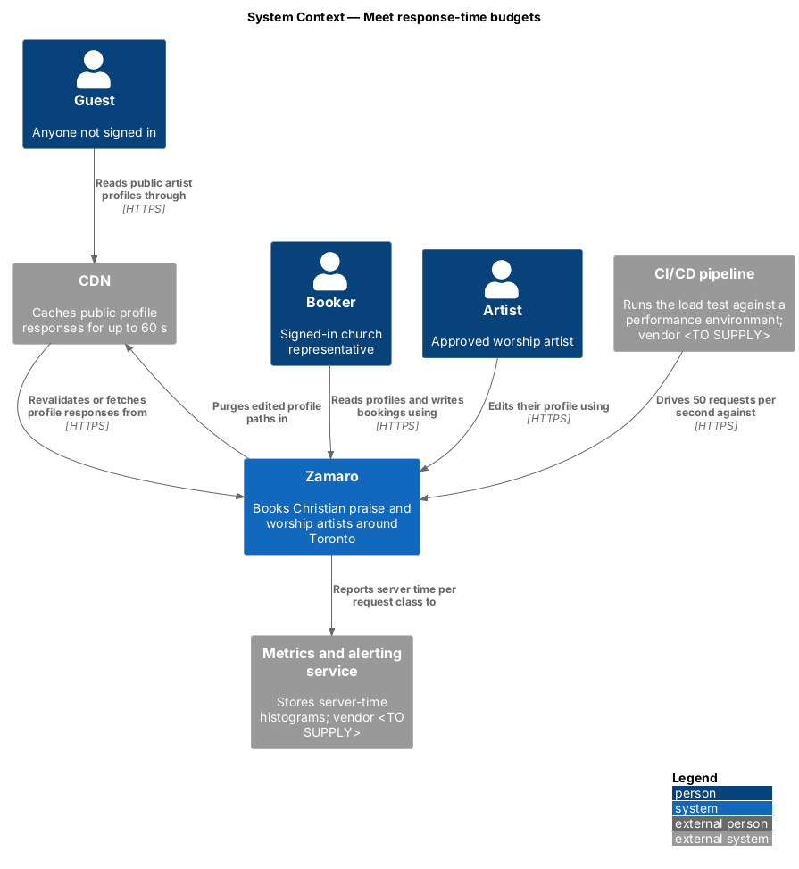
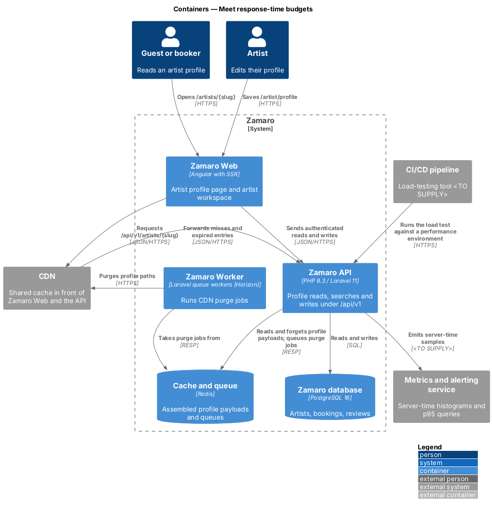
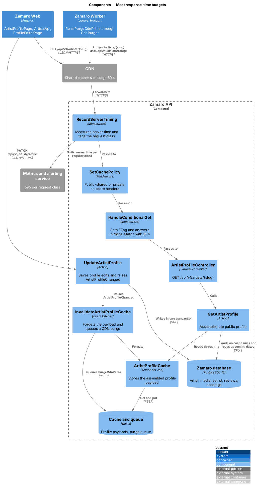
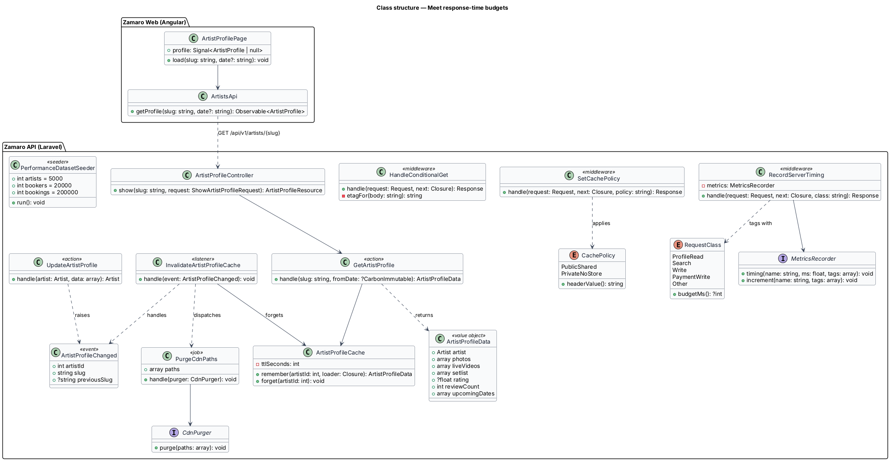
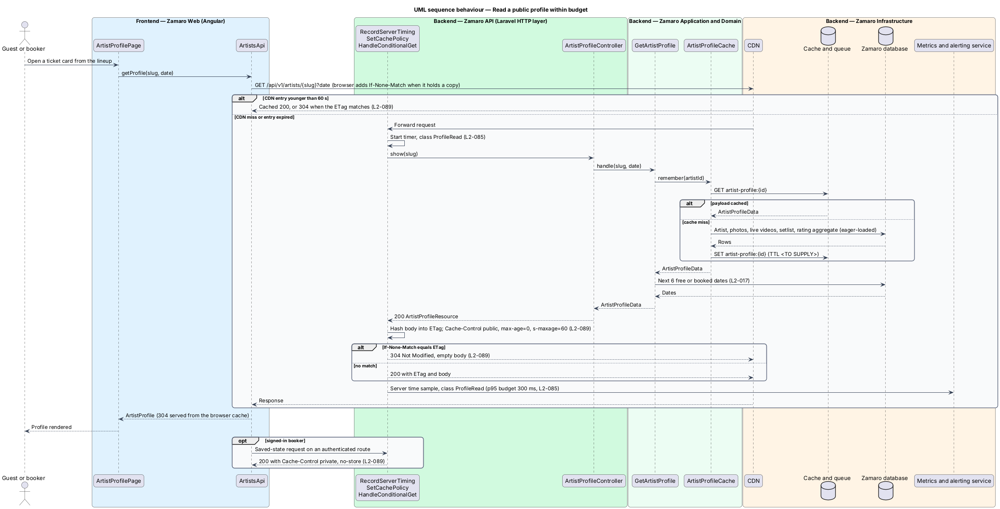
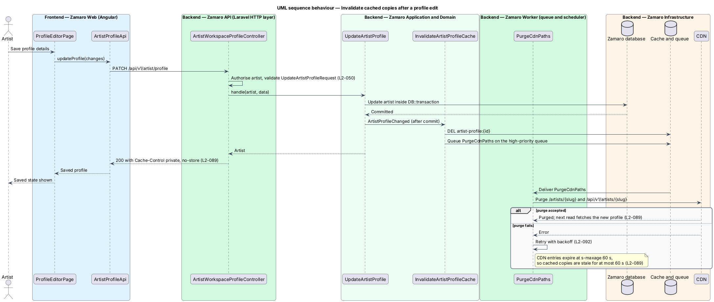

# Meet response-time budgets

## Overview

Zamaro books Christian praise and worship artists for churches in and around Toronto.
Churches compare artists on their phones, often between other tasks, so slow API
responses cost bookings. L1-018 asks the system to stay fast under expected peak load.
This feature turns that aim into measurable budgets for the Zamaro API and into the
HTTP caching that keeps the most-read response, the public artist profile, cheap to
serve.

The slice follows one representative request end to end: a guest or booker reading
`GET /api/v1/artists/{slug}` through the CDN, the API middleware, the profile cache
and the database, with the server time recorded against its budget. A second path
follows an artist's profile edit to the point where every cached copy is replaced. A
scheduled load test in the CI/CD pipeline proves the budgets on a fixed dataset.

Terms used in this design:

- **server time** — elapsed time inside the Zamaro API from receiving a request to finishing its response
- **request class** — category of API request that shares one budget: profile read, search, write without the payment processor, payment write, other
- **response-time budget** — upper bound on the 95th percentile (p95) server time for one request class
- **performance dataset** — seeded data set of 5,000 artists, 20,000 bookers and 200,000 bookings used by the load test
- **load test** — scripted run that drives a sustained 50 requests per second against a performance environment and compares p95 server times with the budgets
- **entity tag (ETag)** — opaque validator that identifies one version of a response body
- **conditional request** — request that carries `If-None-Match` with a previously received ETag
- **shared cache** — cache that serves many users, here the CDN
- **personal data** — information about an identifiable person, such as a booker's name, church address, bookings or saved artists

Related slices: the search budget is spent inside `discovery/search-available-artists`;
browser-side speed (Core Web Vitals, bundle size, media) belongs to
`operations/deliver-fast-pages`; the metrics pipeline and alerts belong to
`operations/monitor-health-and-errors`; response shapes follow
`operations/apply-api-conventions`.

## Description

The slice spans Zamaro Web, the Zamaro API, the Zamaro Worker, Redis, PostgreSQL, the
CDN, the metrics and alerting service and the CI/CD pipeline.

**Budgets (L2-085)**

| Request class | p95 server time | Examples |
|---------------|-----------------|----------|
| `ProfileRead` | 300 ms | `GET /api/v1/artists/{slug}` and its review pages |
| `Search` | 500 ms | `GET /api/v1/search` |
| `Write` | 800 ms | booking request, message, profile edit, availability change |
| `PaymentWrite` | none set | writes that call the payment processor |

The load test also requires an error rate below 0.1%.

**Frontend (Zamaro Web)**

- **`ArtistProfilePage`** — routed page for `/artists/:slug`. It asks `ArtistsApi` for
  the profile and renders it.
- **`ArtistsApi`** — typed client for `GET /api/v1/artists/{slug}`. It adds no cache
  logic of its own. The browser HTTP cache stores the response, sends `If-None-Match`
  on the next read and hands a 304 back to the client as the stored 200.
- **`ProfileEditorPage`** and **`ArtistProfileApi`** — artist workspace page and client
  for `/artist/profile`. They send `PATCH /api/v1/artist/profile`.

**Backend (Zamaro API)**

- **`RecordServerTiming`** — middleware applied to every API route group with a
  `RequestClass` parameter. It measures server time from the start of the request,
  emits a timing sample through `MetricsRecorder` tagged with the class, route name
  and status class, and adds a `Server-Timing` response header.
- **`MetricsRecorder`** — interface for metric emission with one adapter for the
  metrics and alerting service (vendor and protocol `<TO SUPPLY>`). Monthly p95 per
  class is a query in that service.
- **`SetCachePolicy`** — middleware that applies a `CachePolicy`. Public routes that
  carry no personal data (L2-083) use `PublicShared`:
  `Cache-Control: public, max-age=0, s-maxage=60`. Every authenticated route group
  (`auth:sanctum`) uses `PrivateNoStore`: `Cache-Control: private, no-store`
  (L2-089). A route without an explicit policy defaults to `PrivateNoStore`.
- **`HandleConditionalGet`** — middleware on public `GET` routes. It hashes the final
  response body into a strong ETag, compares it with `If-None-Match` and replaces the
  response with an empty 304 on a match (L2-089). Hash algorithm `<TO SUPPLY>`.
- **`ArtistProfileController`** — `GET /api/v1/artists/{slug}`. It calls
  `GetArtistProfile` and returns `ArtistProfileResource`. The response is identical
  for every viewer. Viewer-specific state, such as the Save toggle, comes from a
  separate authenticated request so the profile stays cacheable.
- **`GetArtistProfile`** — action that assembles `ArtistProfileData`. It reads the
  slow-changing part (artist, photos, live videos, setlist, rating aggregate) through
  `ArtistProfileCache` with eager loading, and computes the next 6 upcoming dates
  (L2-017) per request.
- **`ArtistProfileCache`** — Redis-backed read-through cache keyed
  `artist-profile:{artistId}`. Redis TTL `<TO SUPPLY>`.
- **`UpdateArtistProfile`** — action behind `PATCH /api/v1/artist/profile`. It writes
  inside `DB::transaction` and raises `ArtistProfileChanged` after commit. The same
  event is raised by the photo, video, setlist, slug and availability actions owned by
  the artist workspace slices.
- **`InvalidateArtistProfileCache`** — listener for `ArtistProfileChanged`. It forgets
  the Redis payload at once and dispatches `PurgeCdnPaths` for `/artists/{slug}` and
  `/api/v1/artists/{slug}`, including the previous slug after a slug change.
- **`PurgeCdnPaths`** — queued job on the high-priority queue that calls `CdnPurger`
  (one adapter for the CDN, vendor `<TO SUPPLY>`). It retries per L2-092. The 60-second
  `s-maxage` is the guarantee for L2-089 criterion 2. The purge shortens staleness when
  the CDN accepts it.

The CDN caches public responses only. It bypasses its cache for any request that
carries the Zamaro session cookie, so server-rendered HTML for a signed-in booker is
never shared.

**Load test (L2-085)**

- **`PerformanceDatasetSeeder`** — Laravel seeder that builds the performance dataset
  with factories: 5,000 artists, 20,000 bookers and 200,000 bookings spread over the
  statuses of L2-029.
- **Load scripts** in `tests/load/` — one scenario per request class, driven at a
  sustained 50 requests per second. Tool, request mix, duration and schedule (nightly
  or pre-release) are `<TO SUPPLY>`. The scenario fails when any p95 exceeds its budget
  or the error rate reaches 0.1%.
- **Performance environment** — production-like sizing `<TO SUPPLY>`, in a Canadian
  region (L2-084). The rate limits of L2-077 exempt the load generator's addresses in
  this environment only.

**Data**

The profile read touches `artists`, `artist_photos`, `artist_videos` (status `Live`),
`setlist_songs`, `reviews` (visible only, aggregated) and `bookings` (status
`Confirmed`, for upcoming dates). Indexes on `artists.slug`, on each child table's
`artist_id`, and on `bookings (artist_id, event_date)` keep the read inside budget.
The PHP runtime model (PHP-FPM with OPcache, or Laravel Octane) is `<TO SUPPLY>`.

## Requirements

The feature realises the following level-2 (L2) requirements; the text is quoted from `docs/specs/L2.md`.

| L2 ID | Refines (L1) | Requirement |
|-------|--------------|-------------|
| `L2-085` | `L1-018` | **API response times.** Measured with a dataset of 5,000 artists, 20,000 bookers and 200,000 bookings, at a sustained 50 requests per second. Acceptance criteria: 1. Given the load test, when artist profile reads run, then their 95th percentile server time is 300 ms or less. 2. Given the load test, when searches run, then their 95th percentile server time is 500 ms or less. 3. Given the load test, when writes that do not call the payment processor run, then their 95th percentile server time is 800 ms or less. 4. Given the load test, when it completes, then the error rate is below 0.1%. |
| `L2-089` | `L1-018` | **Caching.** Acceptance criteria: 1. Given a public profile response, when it is returned, then it carries an `ETag` and a conditional request with a matching `If-None-Match` returns 304. 2. Given a profile is edited, when the change is saved, then cached copies are invalidated within 60 seconds. 3. Given any response containing personal data, when it is returned, then it carries `Cache-Control: private, no-store`. |

## Diagrams

### System context

Guests read profiles through the CDN, artists edit profiles in Zamaro, and Zamaro
reports server time to the metrics and alerting service. The CI/CD pipeline drives the
load test.

### Containers

Public profile reads pass through the CDN to the Zamaro API, which reads Redis and
PostgreSQL. CDN purges run in the Zamaro Worker so profile writes stay inside the
800 ms budget.

### Components

`RecordServerTiming`, `SetCachePolicy` and `HandleConditionalGet` wrap
`ArtistProfileController`. `UpdateArtistProfile` raises `ArtistProfileChanged`, which
`InvalidateArtistProfileCache` turns into a Redis delete and a CDN purge.

### Class structure

`RequestClass` carries each budget and `CachePolicy` carries each header value.
`GetArtistProfile` reads through `ArtistProfileCache`, and the change event links the
write side to `PurgeCdnPaths`.

### Behaviour — read a public profile within budget

The CDN answers from its copy while the copy is younger than 60 seconds. On a miss the
API assembles the profile, sets the ETag, answers a matching conditional request with
304 and records the server time against the 300 ms budget.

### Behaviour — invalidate cached copies after a profile edit

The save commits, the Redis payload is deleted at once and a queued job purges the CDN
paths. A failed purge is retried, and the 60-second shared-cache lifetime bounds the
staleness either way.

