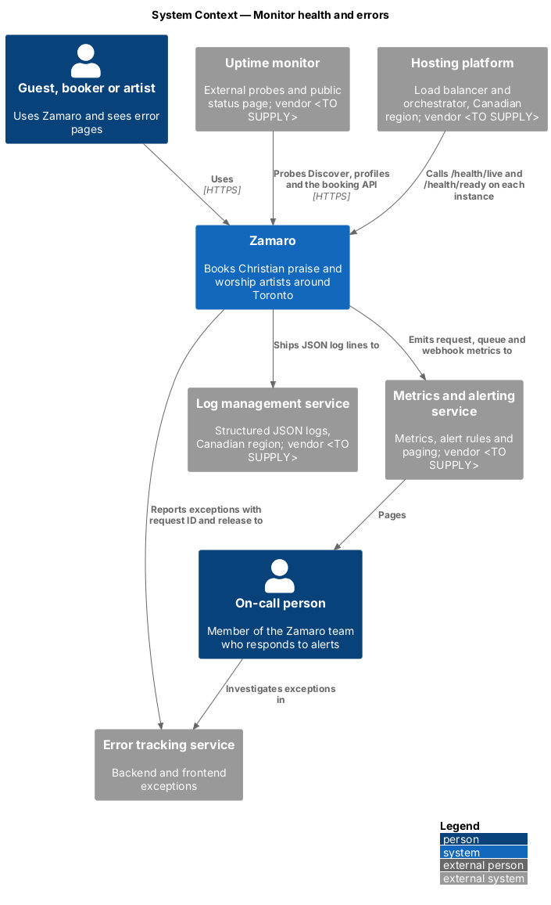
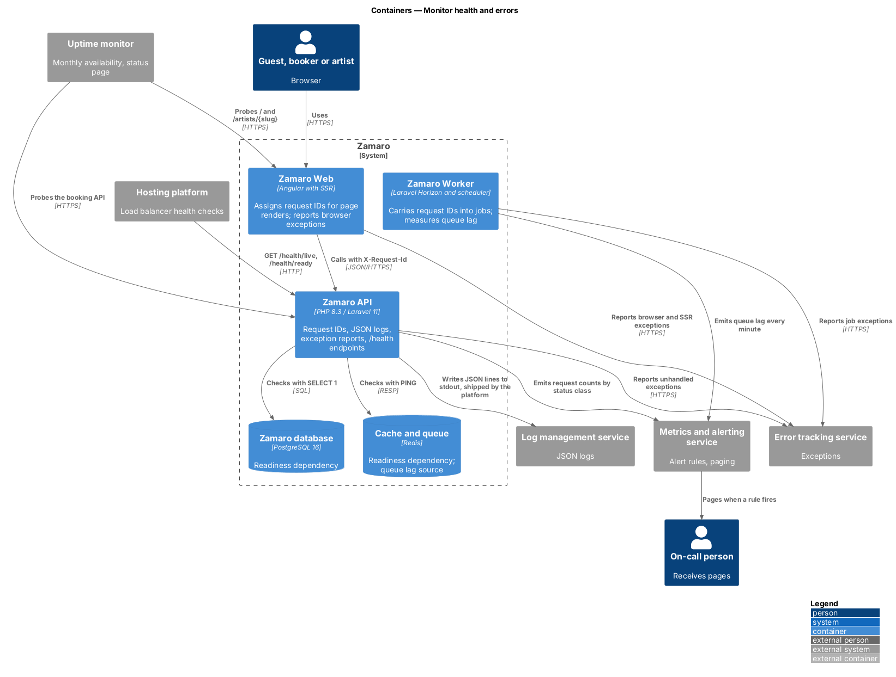
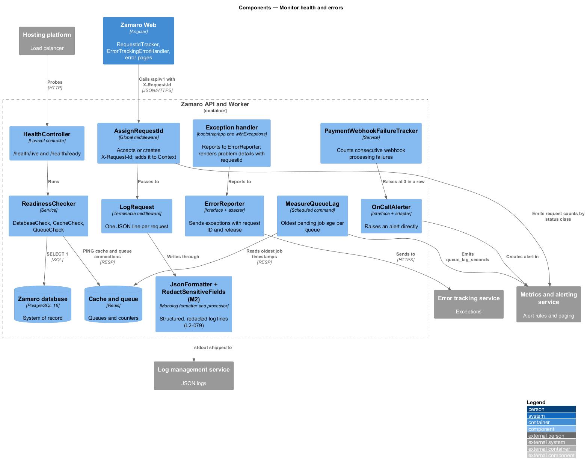
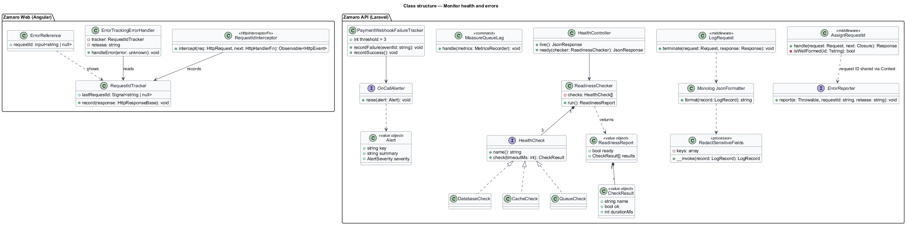
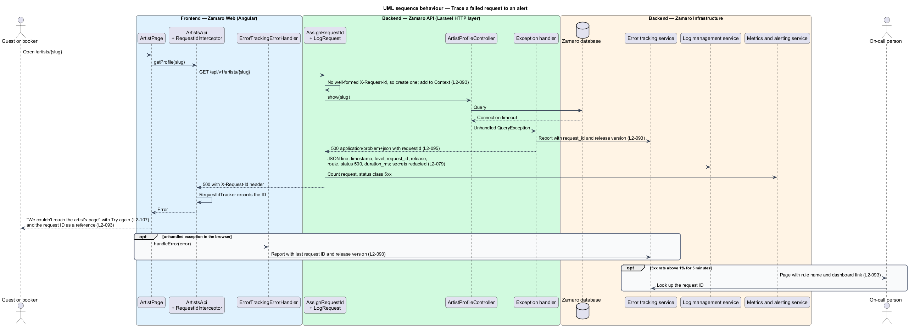
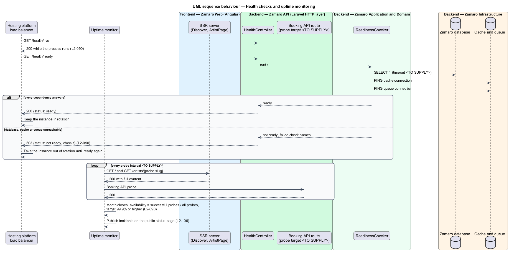

# Monitor health and errors

## Overview

Churches plan Sunday services and worship nights around confirmed bookings, so an
outage or a silent failure in Zamaro has real consequences. L1-019 asks the system to
stay available and to give the Zamaro team the visibility to run it in production.
This feature supplies that visibility: one request ID that ties a user's error page to
a log line and an exception report, health endpoints the hosting platform uses to route
traffic, external uptime probes, and alerts that page the on-call person.

The slice follows one representative request end to end: an artist profile read that
fails in the database, from the request ID assigned at the edge of the Zamaro API to
the log line, the exception report, the error page the visitor sees and the alert that
fires when failures persist. A second path covers the readiness probe and the uptime
monitor.

Terms used in this design:

- **request ID** — unique identifier assigned to one HTTP request and carried through its logs, exception reports, queued jobs and error responses
- **structured log line** — log entry written as one JSON object with named fields
- **release version** — identifier of the deployed build, set by the pipeline at deploy time
- **liveness** — condition that the process is running and able to answer HTTP
- **readiness** — condition that the instance can reach the database, the cache and the queue and so may receive traffic
- **uptime probe** — scheduled external request to a public page or API route that records success or failure
- **availability** — share of uptime probes in a calendar month that succeed
- **queue lag** — age of the oldest job still waiting in a queue
- **on-call person** — member of the Zamaro team who receives alerts during their rota

Related slices: the problem-details body that carries the request ID is defined in
`operations/apply-api-conventions`; retries, failed jobs and job alerts are in
`operations/run-background-jobs`; release versions and the readiness-gated rollout are
in `operations/back-up-deploy-and-host`; the "We lost the signal" search error is in
`discovery/search-available-artists`.

## Description

The slice spans Zamaro Web, the Zamaro API, the Zamaro Worker, PostgreSQL and Redis,
and five external systems: the error tracking service, the log management service,
the metrics and alerting service, the uptime monitor and the hosting platform. Every
vendor is `<TO SUPPLY>`, and each one stores data in a Canadian region or receives no
personal data (L2-084).

**Request IDs and logs (L2-093)**

- **`AssignRequestId`** — first global middleware in the Zamaro API. It accepts an
  inbound `X-Request-Id` only when it is a well-formed UUID, otherwise it creates a
  UUID. It stores the ID in Laravel `Context`, so every log line and every job queued
  during the request carries it. It sets the `X-Request-Id` response header and
  exposes it to the browser through `Access-Control-Expose-Headers` when the web and
  API origins differ.
- **`LogRequest`** — terminable middleware that writes one line per request with
  timestamp, level, `request_id`, `release`, method, route name, status, `duration_ms`
  and user ID when signed in.
- **JSON logs and `RedactSensitiveFields`** — the `stderr` channel uses Monolog's
  `JsonFormatter` (`config/logging.php`, built in S1). The `RedactSensitiveFields` processor
  arrives in M2 with the first sensitive fields; it removes passwords, tokens, session
  IDs, payment identifiers beyond the last 4 digits and message bodies (L2-079). The
  platform ships stdout and stderr to the log management service. Log retention is
  `<TO SUPPLY>`.
- **SSR server** — the Node.js server in Zamaro Web assigns its own request ID per page
  render, logs in JSON and forwards the ID to the API, so one render and its API calls
  share one ID.

**Exception reporting (L2-093)**

- **Exception handler** — configured in `bootstrap/app.php` with `withExceptions`.
  It sends every unhandled exception to `ErrorReporter` and renders the response as
  RFC 9457 problem details with a `requestId` member (L2-095). `APP_DEBUG` is false in
  production, so no stack trace reaches the client (L2-078).
- **`ErrorReporter`** — interface with one adapter for the error tracking service. Each
  report carries the request ID, the release version (`APP_RELEASE`) and the user ID,
  never request bodies.
- **`RequestIdInterceptor`** and **`RequestIdTracker`** — Angular HTTP interceptor and
  root service that record the `X-Request-Id` of each failed response.
- **`ErrorTrackingErrorHandler`** — Angular `ErrorHandler` that reports unhandled
  browser and SSR exceptions with the last request ID and the build's release version.
- **`ErrorReference`** — small presentational component on the server error
  page, as in the [`server-error`](../../../mocks/pages/server-error/default.html) mock:
  a design-system receipt with a "Reference" row holding the request ID and a "When"
  row with the Toronto time ("Fri 9 Oct, 10:42 a.m."), then "Email us the reference",
  a `mailto:` link whose subject is the request ID. The search and profile error states
  keep the copy fixed by L2-106 and L2-107 and put the request ID in the subject of
  their email link to the Zamaro team, so support can find the logs either way.

**Health checks (L2-090)**

- **`HealthController`** — `GET /health/live` returns 200 with no dependency checks.
  `GET /health/ready` runs `ReadinessChecker` and returns 200 when every check passes
  and 503 with the failed check names otherwise: `{"status":"ready"}` or
  `{"status":"not ready","failed":["cache"]}`. Both routes live in `routes/health.php`,
  outside `/api/v1`, skip session, CSRF and rate-limit middleware, and are blocked at the
  CDN.
- **`ReadinessChecker`** (`app/Services/Operations/Readiness`) — runs `DatabaseCheck`
  (`SELECT 1`), a `RedisCheck` named `cache` (`PING` on the cache connection) and one
  named `queue` (`PING` on the queue connection). A refused connection fails at once; a
  per-check timeout for a hung dependency is `<TO SUPPLY>` (ADR-0005).
- **Hosting platform** — calls both endpoints on every API instance, restarts an
  instance that fails liveness and removes an instance that fails readiness from the
  load balancer.

**Uptime (L2-090)**

The uptime monitor probes Discover (`/`), one published artist profile and one booking
API route from outside Zamaro. The probe interval, the probe profile and the booking API
target (an authenticated synthetic check or an unauthenticated route) are `<TO SUPPLY>`.
Availability for the month is the share of successful probes, with a target of 99.9% or
higher. The same service hosts the public status page linked after the third failed
search (L2-106).

**Alerts (L2-093)**

| Condition | Source | Rule |
|-----------|--------|------|
| 5xx rate above 1% | request counts by status class from the API | over 5 minutes |
| Queue lag above 5 minutes | `MeasureQueueLag`, scheduled every minute in `routes/console.php`, emits `queue_lag_seconds` per queue | any queue |
| Payment webhook fails 3 times in a row | `PaymentWebhookFailureTracker`, a Redis counter incremented by the webhook job on failure and reset on success | raised directly through `OnCallAlerter` |

The metrics and alerting service evaluates the first two rules and pages the on-call
person. `OnCallAlerter` is the interface, with one adapter, that application code uses
to raise an alert directly. The rota and escalation policy are `<TO SUPPLY>`.

## Requirements

The feature realises the following level-2 (L2) requirements; the text is quoted from `docs/specs/L2.md`.

| L2 ID | Refines (L1) | Requirement |
|-------|--------------|-------------|
| `L2-090` | `L1-019` | **Availability target and health checks.** Acceptance criteria: 1. Given monthly uptime monitoring of Discover, profiles and the booking API, when the month closes, then availability is 99.9% or higher. 2. Given `/health/live`, when the process is running, then it returns 200; given `/health/ready`, when the database, cache or queue is unreachable, then it returns 503. |
| `L2-093` | `L1-019` | **Observability.** Acceptance criteria: 1. Given any request, when it is logged, then the log line is structured JSON containing a request ID that is also returned in the `X-Request-Id` response header and shown on error pages. 2. Given an unhandled exception in the backend or the frontend, when it occurs, then it is reported to error tracking with the request ID and release version. 3. Given production, when the 5xx rate exceeds 1% for 5 minutes, queue lag exceeds 5 minutes, or a payment webhook fails 3 times in a row, then the on-call person is alerted. |

## Diagrams

### System context

Zamaro reports to the error tracking, log management and metrics services. The uptime
monitor and the hosting platform probe it from outside, and the metrics service pages
the on-call person.

### Containers

Zamaro Web and the Zamaro API both report exceptions and pass request IDs between them.
The API serves the health endpoints and checks PostgreSQL and Redis, and the Worker
measures queue lag.

### Components

`AssignRequestId` and `LogRequest` wrap every API request. The exception handler
reports through `ErrorReporter`, and `HealthController` runs the three readiness
checks. `MeasureQueueLag` and `PaymentWebhookFailureTracker` feed the alerts.

### Class structure

The browser keeps the last request ID in `RequestIdTracker` for error pages and
reports. On the server, `ReadinessChecker` composes three `HealthCheck`
implementations.

### Behaviour — trace a failed request to an alert

A database timeout becomes an exception report, a redacted JSON log line and a problem
response that share one request ID. The profile error page shows that ID, and a
sustained 5xx rate pages the on-call person.

### Behaviour — health checks and uptime monitoring

The load balancer keeps an instance in rotation only while `/health/ready` returns 200.
The uptime monitor probes public pages and the booking API and computes monthly
availability.

