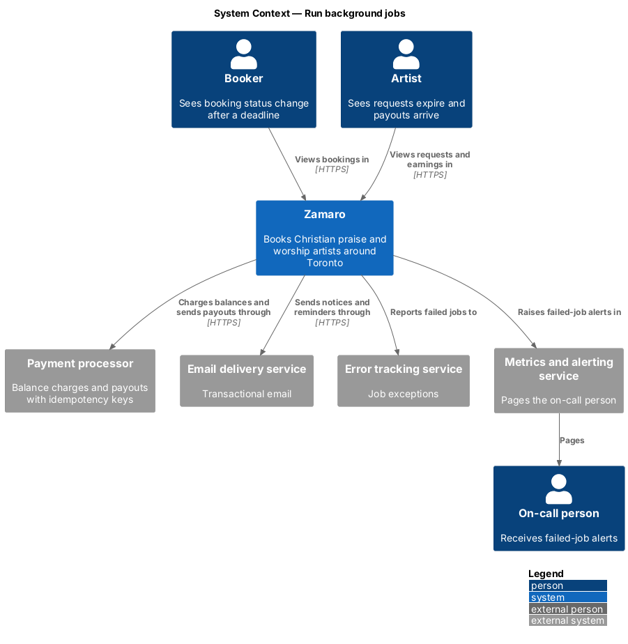
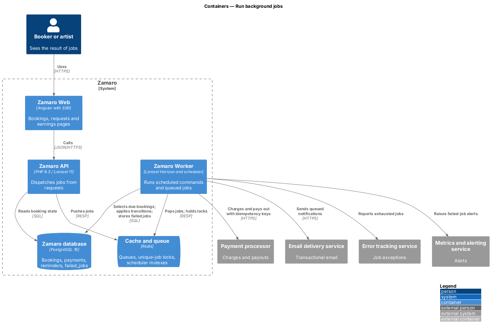
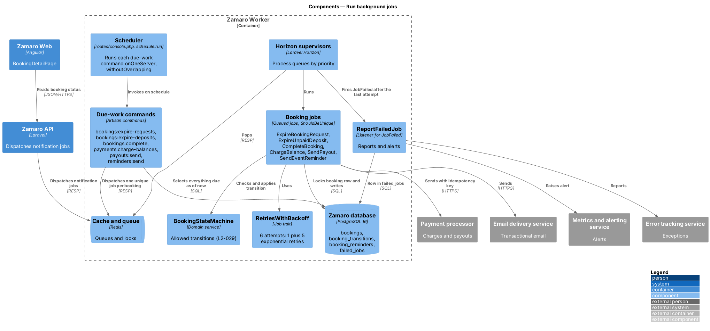
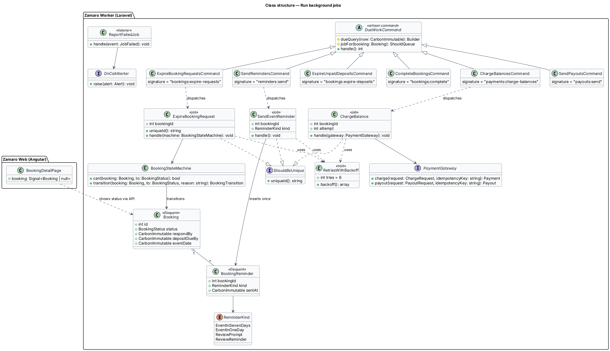
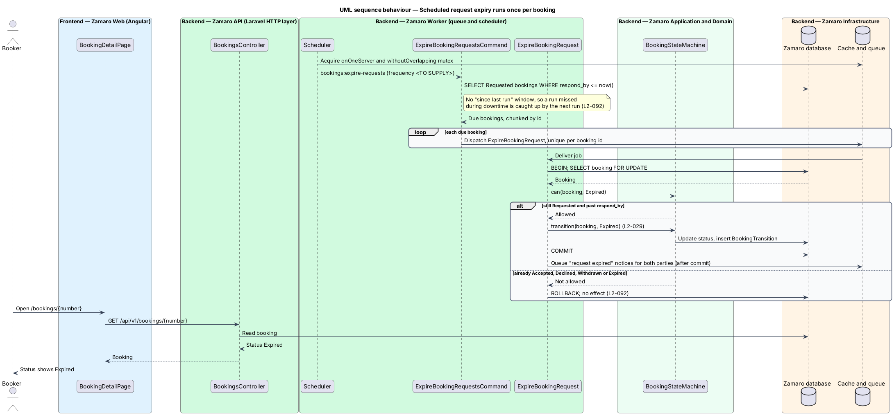
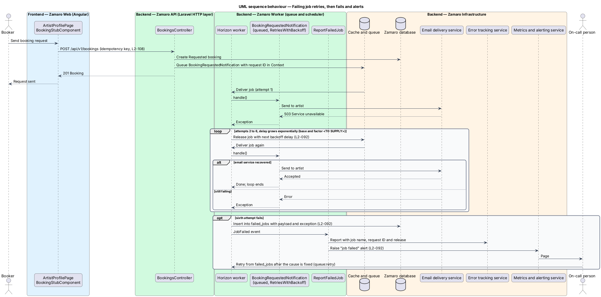

# Run background jobs

## Overview

Much of a Zamaro booking moves forward without anyone pressing a button. A request
nobody answers expires, an unpaid deposit releases the date, a finished event becomes
Completed, the balance is charged, the artist is paid and both parties are reminded.
Emails, webhook processing and media work also run outside the web request. L1-019
asks the system to recover from failure without losing bookings or payments. This
feature defines how that background work runs so that a crash, a retry or a missed
schedule never charges twice, never skips work and never fails silently.

The slice follows one representative pipeline run end to end: the scheduler starting
`bookings:expire-requests`, the command selecting every overdue request, one queued job
per booking applying the Expired transition exactly once, and the booker later seeing
the result. A second path follows a failing job through its retries to the failed-jobs
store and the on-call alert.

Terms used in this design:

- **job** — unit of work pushed onto a Redis queue and run by a Zamaro Worker process
- **scheduled command** — Artisan command started by the Laravel scheduler at a fixed frequency
- **due work** — set of rows whose stored deadline is at or before the current time and whose status still calls for action
- **attempt** — one execution of a job, the first or a retry
- **backoff** — delay before the next attempt
- **failed-jobs store** — `failed_jobs` table holding each job that exhausted its attempts, with payload and exception
- **idempotent** — property of an operation whose second run, with the same input, has no further effect
- **idempotency key** — identifier sent with a payment processor request so the processor performs the operation at most once

Related slices: queue-lag monitoring and the alert channel are in
`operations/monitor-health-and-errors`; the booking lifecycle and its deadlines are
owned by the booking slices (L2-029, L2-030, L2-037, L2-038, L2-039, L2-064), which
supply the domain actions these jobs call.

## Description

The slice spans the Zamaro Worker (Horizon and the scheduler), Redis, PostgreSQL, the
payment processor, the email delivery service, the error tracking service and the
metrics and alerting service. Zamaro Web and the Zamaro API appear where jobs are
dispatched and where their results are seen.

**Retry policy (L2-092 criterion 1)**

- **`RetriesWithBackoff`** — trait used by every job and queued notification. It sets
  `$tries = 6`, one attempt plus up to 5 retries, and `backoff()` returns 5 delays that
  grow exponentially. Base delay, multiplier and jitter are `<TO SUPPLY>`.
- **Horizon supervisors** — process the queues in priority order. Queue names and
  process counts are `<TO SUPPLY>`; payment, webhook and CDN-purge jobs run on a
  high-priority queue.
- **`ReportFailedJob`** — listener for Laravel's `JobFailed` event, fired when a job
  exhausts its attempts. Laravel stores the job in `failed_jobs` (`database-uuids`
  driver). The listener reports the exception with the job name, request ID and
  release version, and raises a "job failed" alert through `OnCallAlerter`. The on-call
  person re-runs the job with `queue:retry` once the cause is fixed.

Domain retries are separate from job retries. A failed balance charge is retried after
1, 3 and 7 days by L2-038; each of those is a new due-work selection, not a job backoff.

**Scheduled work (L2-092 criteria 2 and 3)**

Each command extends **`DueWorkCommand`**. It selects every row that is due as of now,
in id-ordered chunks, and dispatches one job per booking. The query never uses a "since
the last run" window, so the next run after downtime processes everything that became
due while the scheduler was stopped. Each command is registered in `routes/console.php`
with `onOneServer()` and `withoutOverlapping()`. Frequencies are `<TO SUPPLY>`.

| Command | Due when | Job | Rule |
|---------|----------|-----|------|
| `bookings:expire-requests` | status `Requested` and `respond_by <= now()` | `ExpireBookingRequest` | L2-030 |
| `bookings:expire-deposits` | status `Accepted` and `deposit_due_by <= now()` | `ExpireUnpaidDeposit` | L2-037 |
| `bookings:complete` | status `Confirmed` and event start plus 24 hours `<= now()` | `CompleteBooking` | L2-029 |
| `payments:charge-balances` | status `Completed`, event start plus 48 hours `<= now()`, no problem report, no successful balance payment | `ChargeBalance` | L2-038 |
| `payouts:send` | balance collected and no payout | `SendPayout` | L2-039 |
| `reminders:send` | 7 days and 1 day before a `Confirmed` event; review prompt and reminder after completion | `SendEventReminder` | L2-064, L2-059 |

**Idempotency (L2-092 criterion 2)**

- **Unique dispatch** — every booking job implements `ShouldBeUnique` with
  `uniqueId()` built from the operation and booking id. A second dispatch while the
  first is still queued is dropped.
- **State-checked transitions** — `ExpireBookingRequest`, `ExpireUnpaidDeposit` and
  `CompleteBooking` lock the booking row (`SELECT ... FOR UPDATE`) inside
  `DB::transaction` and ask `BookingStateMachine::can()` before acting. A booking that
  already moved on is left unchanged. Notifications are queued after commit.
- **Payment operations** — `ChargeBalance` and `SendPayout` send an idempotency key
  derived from the booking and operation (L2-041), for example the booking id, `balance`
  and the attempt number. A partial unique index on `payments (booking_id, kind)` for
  succeeded payments, and a unique index on `payouts (booking_id)`, reject a second
  record.
- **Reminders** — `SendEventReminder` re-checks that the booking is still `Confirmed`
  (L2-064) and claims the reminder by inserting into `booking_reminders`, unique on
  `(booking_id, kind)`. A conflicting insert means the reminder was already sent.

**Context**

Laravel `Context` carries the request ID from the dispatching request into each job, so
job logs and failure reports join the request's trace (L2-093). Redis holds only queues,
locks and caches. If Redis loses its data, the next run of each command re-derives due
work from PostgreSQL.

## Requirements

The feature realises the following level-2 (L2) requirement; the text is quoted from `docs/specs/L2.md`.

| L2 ID | Refines (L1) | Requirement |
|-------|--------------|-------------|
| `L2-092` | `L1-019` | **Background jobs.** Acceptance criteria: 1. Given a failing job, when it runs, then it retries with exponential backoff up to 5 times and then moves to a failed-jobs store and alerts. 2. Given scheduled jobs (request expiry, deposit expiry, completion, balance charges, payouts, reminders), when one runs twice for the same booking, then the second run has no effect. 3. Given the scheduler, when a run is missed during downtime, then the next run processes everything that became due. |

## Diagrams

### System context

Background work changes what bookers and artists see, calls the payment processor and
the email delivery service, and reports failures to the on-call person.

### Containers

The Zamaro Worker runs scheduled commands and queued jobs from Redis against
PostgreSQL. The Zamaro API also pushes jobs, and Zamaro Web shows the results.

### Components

The scheduler starts due-work commands, which dispatch unique booking jobs. Horizon
runs them with `RetriesWithBackoff`, and `ReportFailedJob` handles jobs that exhaust
their attempts.

### Class structure

Six commands share `DueWorkCommand`. Each booking job implements `ShouldBeUnique` and
uses `RetriesWithBackoff`, and the jobs act through `BookingStateMachine`,
`PaymentGateway` and `BookingReminder`.

### Behaviour — scheduled request expiry runs once per booking

The command selects every overdue request, including any missed during downtime. Each
job locks its booking and applies the Expired transition only if the booking is still
Requested, so a second run has no effect.

### Behaviour — failing job retries, then fails and alerts

A queued notification that cannot reach the email delivery service is retried 5 times
with growing delays. After the sixth failed attempt it moves to `failed_jobs`, and the
on-call person is paged.

