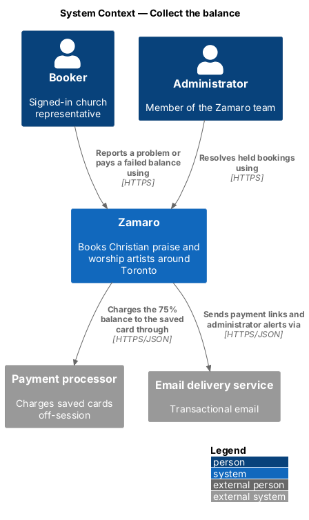
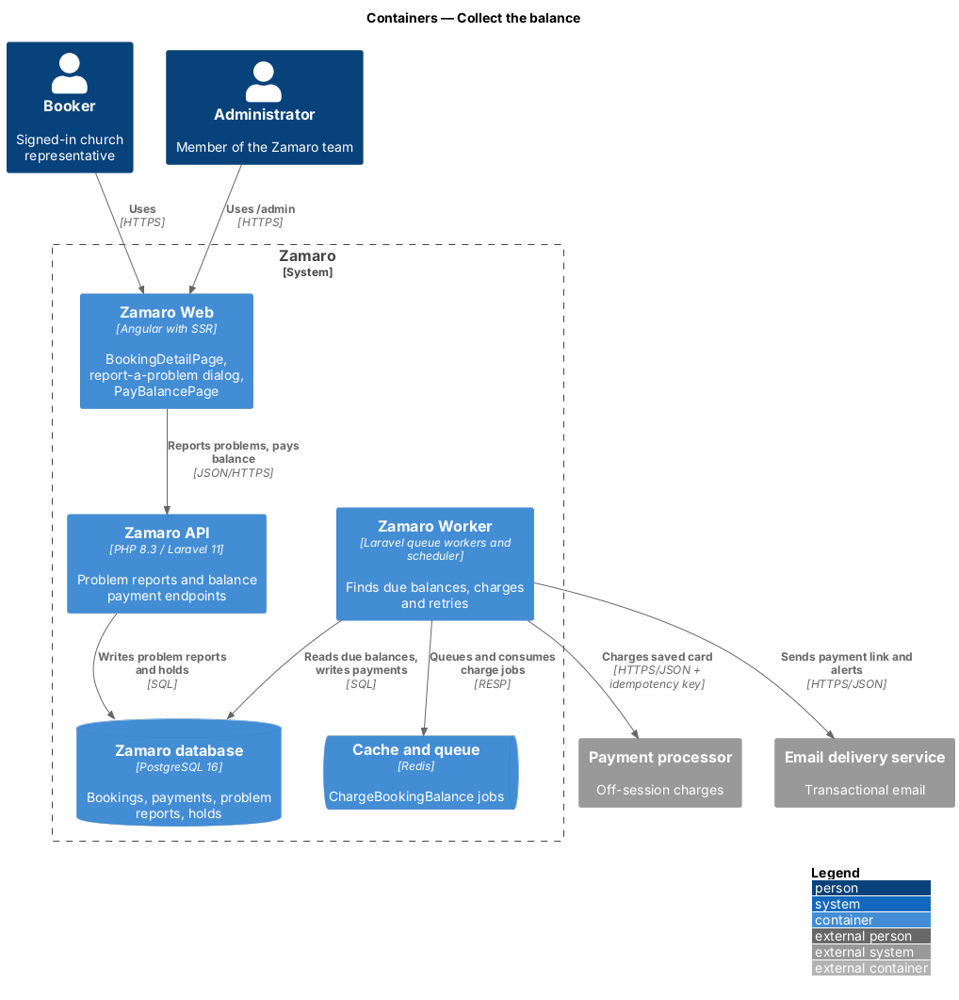
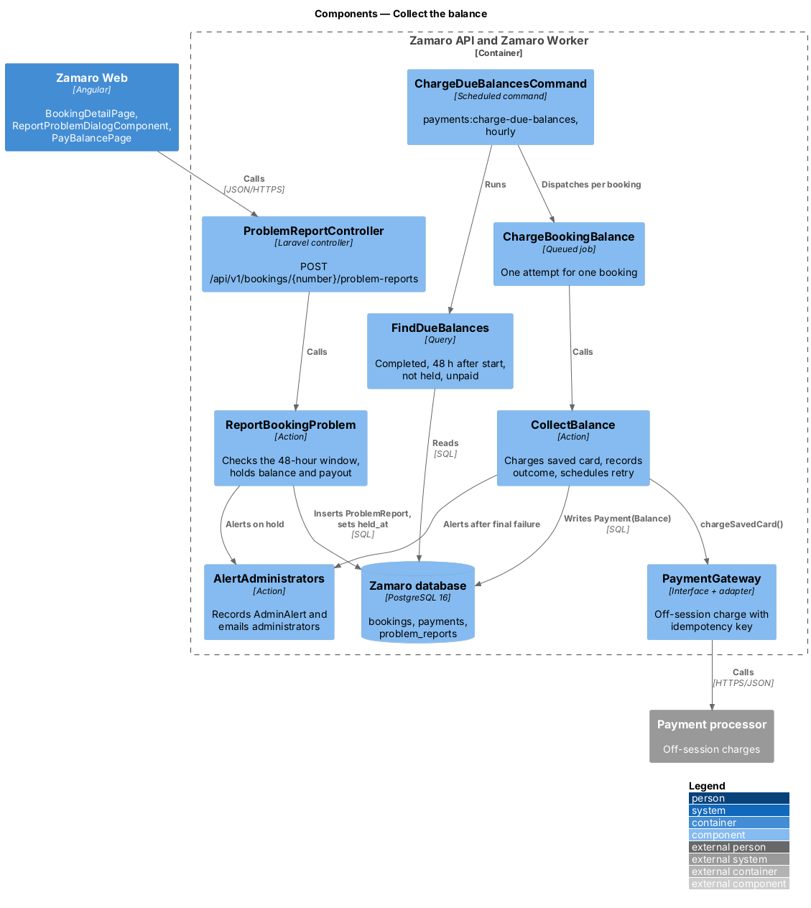
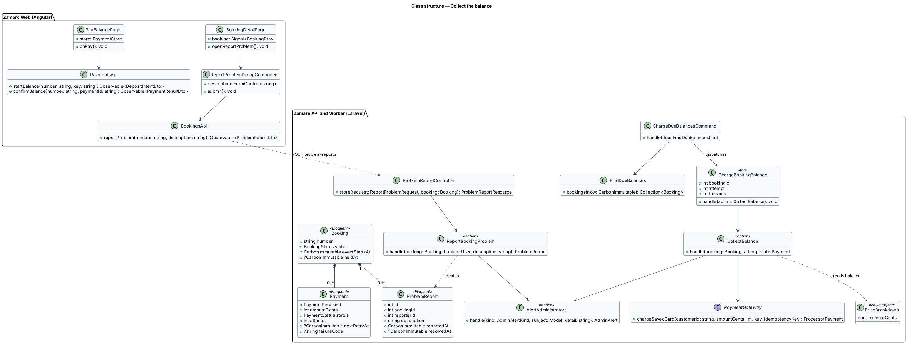
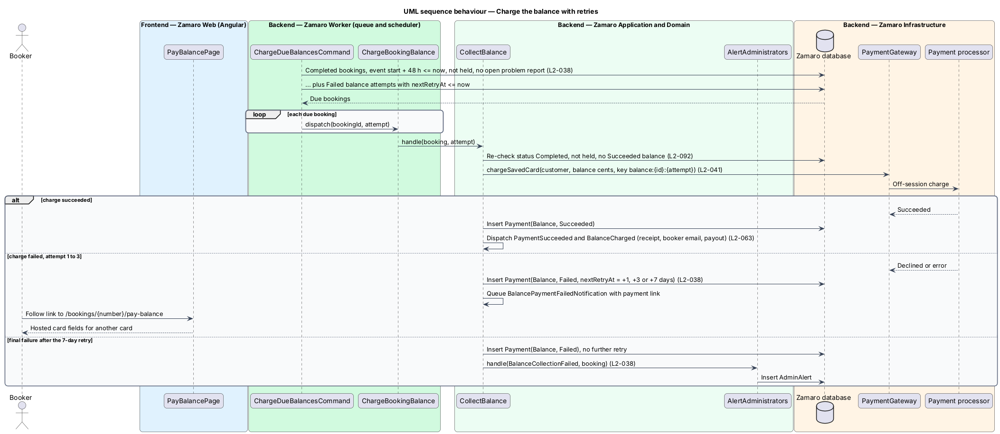
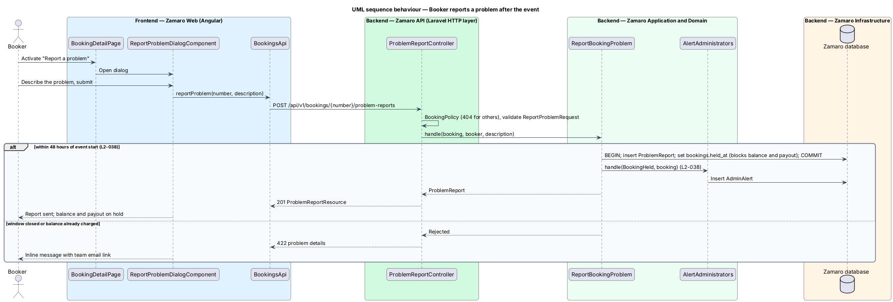

# Collect the balance

## Overview

A Zamaro booking is paid in two parts. The booker pays a 25 % deposit to confirm
the booking (`payments/pay-deposit`) and the remaining 75 % after the event. This
feature collects that second part. It charges the card saved during the deposit,
retries a failed charge, and stops collection when the booker reports a problem
with the event.

The slice starts once a booking is Completed, which happens 24 hours after the
event start time (L2-029). Collection runs in the Zamaro Worker without the booker
present. The booker sees its outcome in the receipt email (`payments/issue-receipts`),
the balance-charged email (`notifications/send-transactional-emails`) and the
payment history on `/bookings/:number`. A successful charge releases the artist's
payout (`payments/pay-out-artists`). Resolution of a held booking by an
administrator is the booking and payment support area (L2-068).

Terms used in this design:

- **balance** — second payment on a booking, equal to the total minus the deposit
- **saved card** — card the booker consented to keep with the payment processor when paying the deposit
- **off-session charge** — card charge the processor makes without the cardholder present
- **collection point** — moment 48 hours after the event start time, when the balance becomes due
- **problem report** — booker's statement, filed within 48 hours of the event start, that something went wrong
- **hold** — flag on a booking that stops the balance charge and the artist payout until an administrator resolves it
- **payment link** — link in an email to `/bookings/:number/pay-balance`, where the booker pays with another card
- **administrator alert** — `AdminAlert` record plus an email to each administrator

## Description

The slice runs from a scheduled command in the Zamaro Worker to the payment
processor, and from the booking page in Zamaro Web to the problem-report endpoint
in the Zamaro API.

**Frontend (Zamaro Web, `features/bookings`)**

- **`BookingDetailPage`** — routed page for `/bookings/:number`. For a Confirmed or
  Completed booking within 48 hours of the event start, it offers "Report a
  problem". It lists each payment with its status.
- **`ReportProblemDialogComponent`** — design-system dialog with a required
  description field. It submits through `BookingsApi.reportProblem()` and confirms
  that the balance and payout are on hold.
- **`PayBalancePage`** — routed page for `/bookings/:number/pay-balance`, the target
  of the payment link. It reuses `PaymentSummaryComponent`, `CardFieldsService` and
  `PaymentStore` from `payments/pay-deposit` to pay the balance with another card.
- **`BookingsApi`**, **`PaymentsApi`** — typed clients for the endpoints below.

**Backend (Zamaro API and Zamaro Worker)**

- **`ProblemReportController`** — controller for
  `POST /api/v1/bookings/{number}/problem-reports`, authorised by `BookingPolicy`
  (404 for any user other than the booker). `ReportProblemRequest` validates the
  description (length limit `<TO SUPPLY>`).
- **`ReportBookingProblem`** — action that accepts a report only within 48 hours of
  the event start time and only while the balance is uncharged. In one transaction
  it inserts a `ProblemReport` and sets `bookings.held_at`. It then calls
  `AlertAdministrators` (L2-038). Reports after the window are rejected with 422 and
  a team email link. Whether such late reports should reach an administrator instead
  is `<TO SUPPLY>`.
- **`ChargeDueBalancesCommand`** — scheduled command `payments:charge-due-balances`,
  run hourly. It uses `FindDueBalances` to select Completed bookings past the
  collection point with no hold, no open problem report and no succeeded balance
  payment. It also selects failed attempts whose `next_retry_at` has passed. It
  dispatches one `ChargeBookingBalance` job per booking. Because it selects by state,
  a run missed during downtime is caught up by the next one (L2-092).
- **`ChargeBookingBalance`** — queued job carrying the booking ID and attempt number.
  Infrastructure errors retry with exponential backoff up to 5 times (L2-092). A card
  decline is a business outcome and does not retry the job.
- **`CollectBalance`** — action that re-checks the booking state, then calls
  `PaymentGateway::chargeSavedCard()` for `PriceBreakdown::balanceCents`. The
  idempotency key is `balance:{bookingId}:{attempt}`, so each scheduled attempt
  charges at most once (L2-041).
  - On success it inserts a `Payment` of kind `Balance` and status `Succeeded` and
    dispatches `PaymentSucceeded` and `BalanceCharged`. Their listeners issue the
    receipt (L2-040), queue the booker email (L2-063) and create the payout (L2-039).
  - On failure it inserts a `Failed` payment and sets `next_retry_at` for the next of
    the 1-, 3- and 7-day retries. It queues `BalancePaymentFailedNotification` with
    the payment link after each failure (L2-038).
  - After the final failure it calls `AlertAdministrators` (L2-038).
  Whether the 1-, 3- and 7-day offsets count from the first failure or from each
  previous failure is `<TO SUPPLY>`.
- **`AlertAdministrators`** — action in `App\Actions\Admin` that inserts an
  `AdminAlert` (kind, subject, detail) and queues `AdministratorAlertNotification` to
  every administrator. Alert kinds in this slice: `BookingHeld` and
  `BalanceCollectionFailed`.
- **`PaymentGateway`** — interface shared with `payments/pay-deposit`; this slice
  adds `chargeSavedCard()`.

A balance paid through the payment link uses the deposit flow's
intent-and-confirm pattern with kind `Balance` and the key
`balance:{bookingId}:link`. Endpoint names for it follow `payments/pay-deposit`:
`POST /api/v1/bookings/{number}/balance` and `.../balance/confirm`. A successful
payment clears any pending retry.

**Data**

- `problem_reports` — `booking_id`, `reporter_id`, `description`, `reported_at`,
  `resolved_at`, `resolution`.
- `bookings.held_at` — set by a problem report, cleared by the administrator's
  resolution (L2-068).
- `payments` — balance attempts with `attempt`, `next_retry_at` and `failure_code`.
- `admin_alerts` — `kind`, `subject_type`, `subject_id`, `detail`, `created_at`,
  `acknowledged_at`.

## Requirements

The feature realises the following level-2 (L2) requirement. It refines the
level-1 (L1) requirement shown, and the text is quoted from `docs/specs/L2.md`.

| L2 ID | Refines (L1) | Requirement |
|-------|--------------|-------------|
| `L2-038` | `L1-007` | **Balance collection.** Acceptance criteria: 1. Given a Completed booking, when 48 hours have passed since the event start time and the booker has not reported a problem, then the 75% balance is charged to the saved card. 2. Given a booker reports a problem within 48 hours of the event start time, when the report is filed, then the balance charge and the artist payout are held and an administrator is alerted. 3. Given the balance charge fails, when it fails, then it retries after 1, 3 and 7 days, the booker is emailed a payment link after each failure, and after the final failure an administrator is alerted. |

## Diagrams

### System context

Zamaro charges the booker's saved card through the payment processor without the
booker present. Bookers and administrators reach Zamaro only to report or resolve a
problem, or to pay with another card.

### Containers

The Zamaro Worker finds due balances, charges them and sends payment links. The
Zamaro API records problem reports that put a booking on hold.

### Components

`ChargeDueBalancesCommand` dispatches one `ChargeBookingBalance` job per due
booking, and `CollectBalance` makes the charge. `ReportBookingProblem` sets the hold
that both the command and the payout run respect.

### Class structure

A `Booking` owns its balance `Payment` attempts and any `ProblemReport`.
`CollectBalance` and `ReportBookingProblem` both raise administrator alerts through
`AlertAdministrators`.

### Behaviour — charge the balance

The command selects Completed bookings 48 hours past the event start and charges
each saved card with a per-attempt idempotency key. Failures schedule retries after
1, 3 and 7 days with a payment link each time, and the final failure alerts an
administrator.

### Behaviour — report a problem

A report filed within 48 hours of the event start puts the booking on hold, which
stops both the balance charge and the payout, and alerts an administrator.

