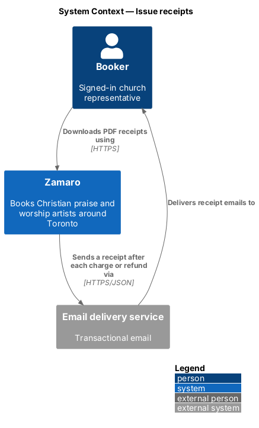
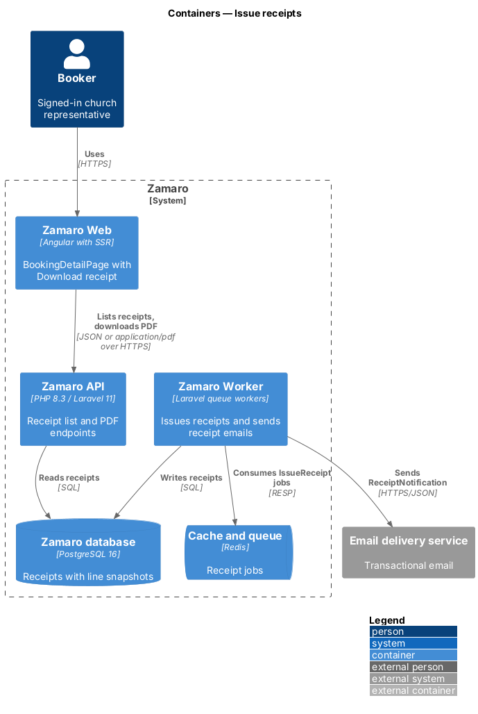
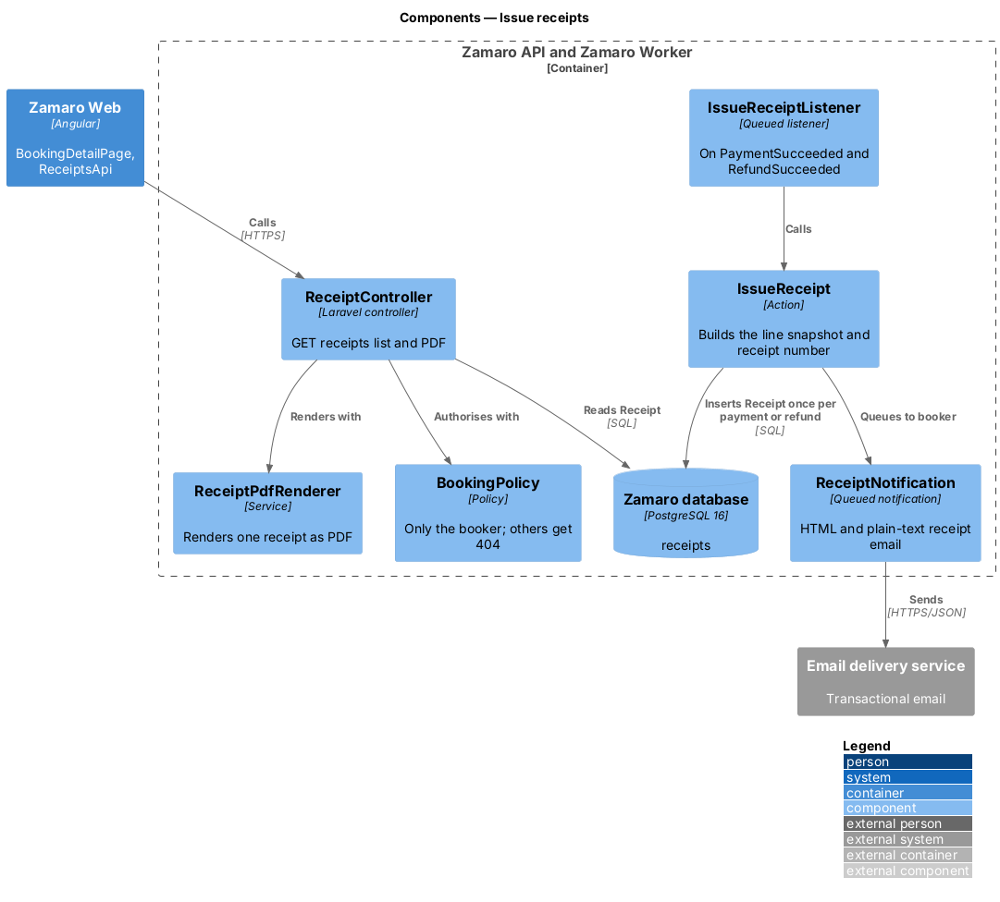
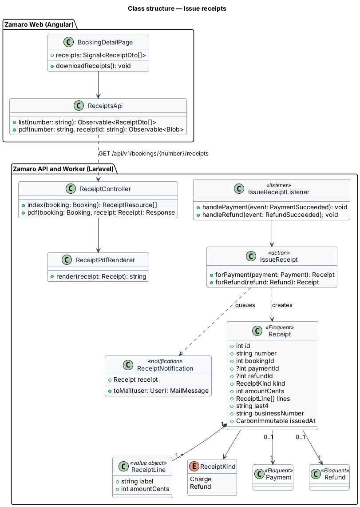
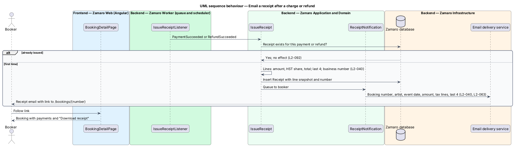
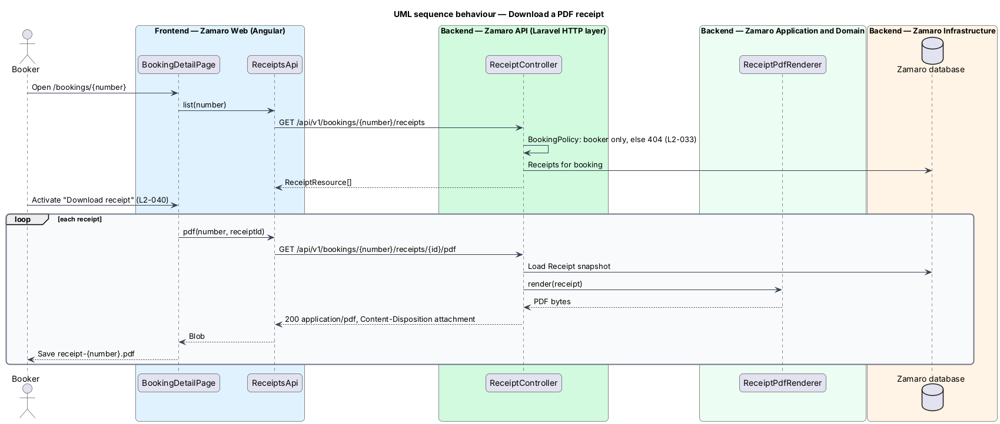

# Issue receipts

## Overview

Churches pay Zamaro in up to two charges per booking, a deposit and a balance, and
can receive refunds after a cancellation or an administrator decision. A church
treasurer needs a record of each movement of money. This feature produces that
record. It emails a receipt after every successful charge or refund, and lets the
booker download each receipt as a PDF from the booking page.

The slice consumes events raised elsewhere in the payments subsystem.
`payments/pay-deposit` and `payments/collect-balance` raise `PaymentSucceeded`. The
refund paths raise `RefundSucceeded`: the lost race in `payments/pay-deposit`, the
cancellations (L2-042, L2-043) and administrator refunds (L2-068). Processor
confirmations of refunds arrive through `payments/reconcile-payment-events`. The
general email rules come from `notifications/send-transactional-emails`. Those rules
cover plain-text and HTML parts, retries and the ban on card details beyond the
last 4 digits.

Terms used in this design:

- **receipt** — immutable record of one successful charge or refund, with its own receipt number
- **line snapshot** — receipt's copy of its amounts and labels, frozen when the receipt is issued
- **tax line** — receipt line that shows the HST share of the amount, present only when the artist has an HST number
- **business number** — Zamaro's Canada Revenue Agency business number printed on every receipt

## Description

The slice runs from a queued listener in the Zamaro Worker to the email delivery
service, and from the booking page in Zamaro Web to the receipt endpoints in the
Zamaro API.

**Frontend (Zamaro Web, `features/bookings`)**

- **`BookingDetailPage`** — routed page for `/bookings/:number`. Its payment history
  lists each charge and refund. A "Download receipt" button appears once at least
  one receipt exists (L2-040).
- **`ReceiptsApi`** — typed client. `list()` calls
  `GET /api/v1/bookings/{number}/receipts`. `pdf()` calls
  `GET /api/v1/bookings/{number}/receipts/{receipt}/pdf` and returns a `Blob`, which
  the page saves as `receipt-{receipt number}.pdf`.

Activating "Download receipt" downloads one PDF per payment and refund on the
booking (L2-040). The packaging when a booking has more than one receipt is
`<TO SUPPLY>`: separate files in turn, or one combined PDF with a page per receipt.

**Backend (Zamaro Worker)**

- **`IssueReceiptListener`** — queued listener on `PaymentSucceeded` and
  `RefundSucceeded`. It calls `IssueReceipt`.
- **`IssueReceipt`** — action that issues at most one receipt per payment or refund.
  A unique index on `receipts.payment_id` and on `receipts.refund_id` enforces this,
  so a repeated event has no effect (L2-092). It builds the line snapshot. The lines
  are the amount and, when HST applies, the HST share from `PriceBreakdown`. The
  snapshot also holds the booking number, artist display name, event date, the last
  4 card digits from the `Payment` and the business number from configuration key
  `zamaro.business_number` (value `<TO SUPPLY>`). It then queues
  `ReceiptNotification` to the booker.
- **`ReceiptNotification`** — queued notification that extends
  `TransactionalNotification` from `notifications/send-transactional-emails`. It
  renders HTML and plain-text parts with every field required by L2-040 and a link to
  `/bookings/{number}`. Card brand and last 4 digits are the only card data it holds.

**Backend (Zamaro API)**

- **`ReceiptController`** — controller with `index` and `pdf` actions. Both are
  authorised by `BookingPolicy`, so any user other than the booking's booker
  receives 404 (L2-033). Administrator access to receipts belongs to booking and
  payment support (L2-068).
- **`ReceiptPdfRenderer`** — service that renders one receipt from its line snapshot
  to PDF with an HTML-to-PDF library (library `<TO SUPPLY>`). Rendering on request
  from the frozen snapshot avoids storing PDFs. The receipt therefore never changes
  after it is issued, even when the artist's name or price changes later.

Amounts follow `FormatService` rules in the email and PDF: "$" with two decimals
unless whole dollars (L2-110). The receipt number format is `<TO SUPPLY>`.

**Data**

- `receipts` — `number` (unique), `booking_id`, `payment_id` (unique, nullable),
  `refund_id` (unique, nullable), `kind` (`Charge` or `Refund`), `amount_cents`,
  `lines` (JSON line snapshot), `card_brand`, `last4`, `business_number`, `issued_at`.

## Requirements

The feature realises the following level-2 (L2) requirement. It refines the
level-1 (L1) requirement shown, and the text is quoted from `docs/specs/L2.md`.

| L2 ID | Refines (L1) | Requirement |
|-------|--------------|-------------|
| `L2-040` | `L1-007` | **Receipts.** Acceptance criteria: 1. Given any successful charge or refund, when it completes, then the booker is emailed a receipt with booking number, artist, event date, amount, tax lines, last 4 card digits and Zamaro's business number. 2. Given a booker on a booking page, when they activate "Download receipt", then a PDF receipt for each payment is downloaded. |

## Diagrams

### System context

Zamaro emails the booker a receipt through the email delivery service after each
charge or refund. The booker downloads PDF copies from Zamaro.

### Containers

The Zamaro Worker issues receipts and sends the emails. The Zamaro API serves the
receipt list and PDFs to Zamaro Web.

### Components

`IssueReceiptListener` calls `IssueReceipt`, which writes the snapshot and queues
`ReceiptNotification`. `ReceiptController` renders PDFs on request through
`ReceiptPdfRenderer`.

### Class structure

A `Receipt` belongs to exactly one `Payment` or one `Refund` and owns its
`ReceiptLine` snapshot. The frontend reaches receipts only through `ReceiptsApi`.

### Behaviour — email a receipt

Each succeeded payment or refund produces one receipt and one email to the booker.
A repeated event finds the existing receipt and changes nothing.

### Behaviour — download a PDF receipt

The booking page lists the receipts. "Download receipt" fetches one PDF per receipt,
each rendered from its frozen snapshot.

