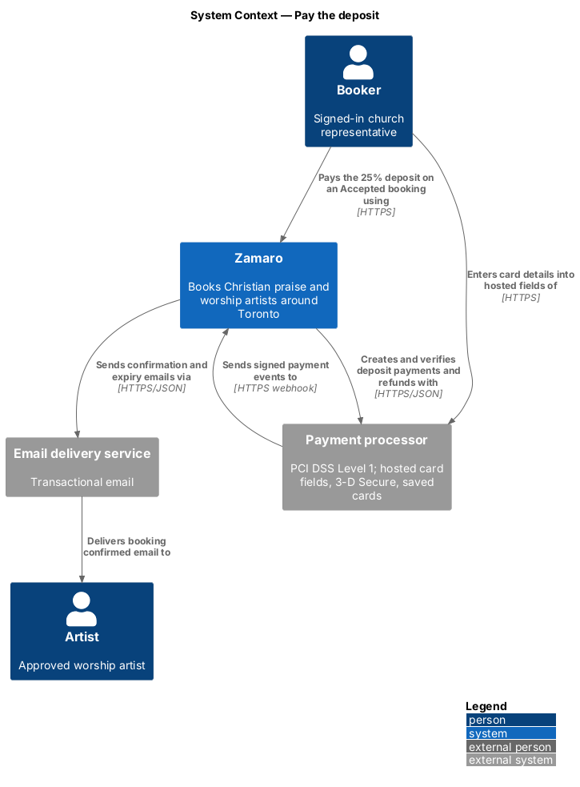
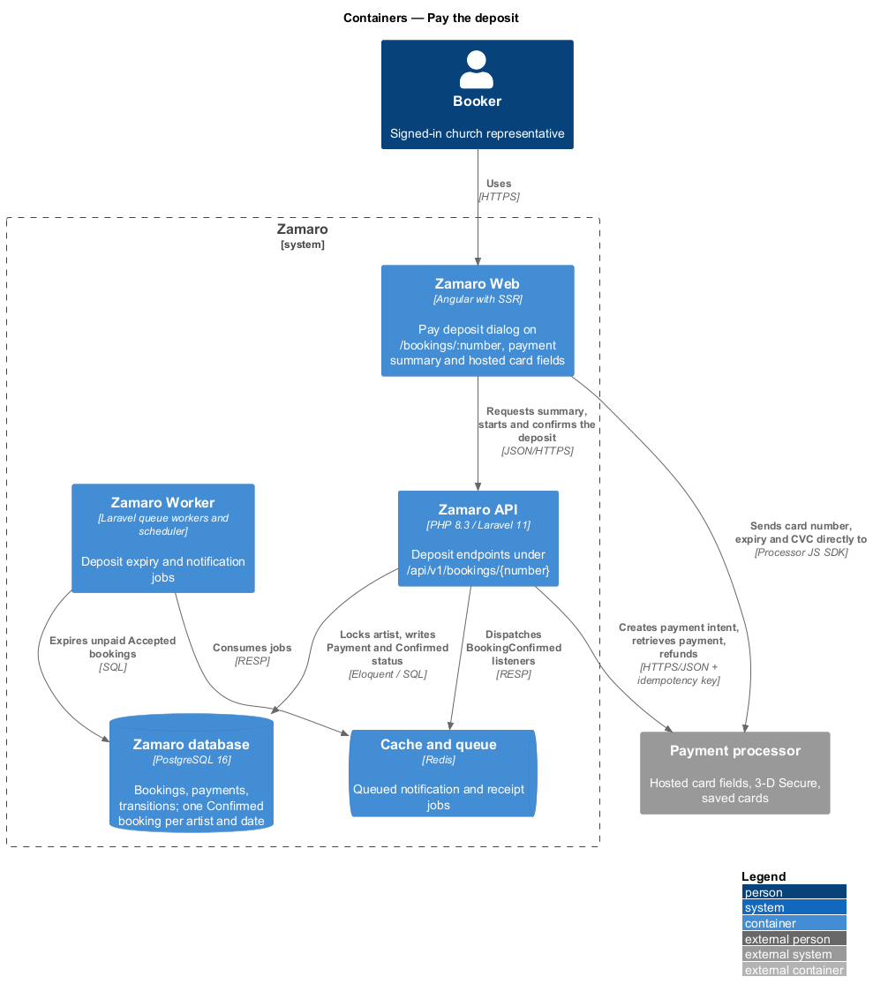
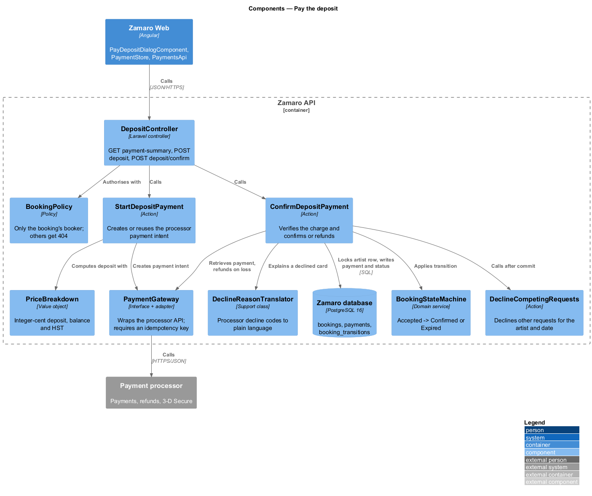
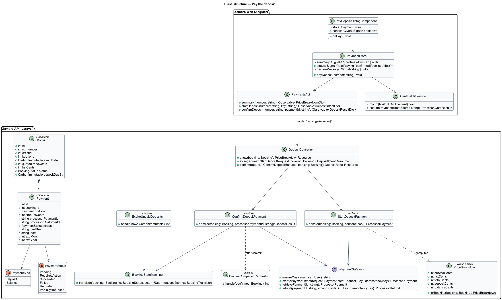
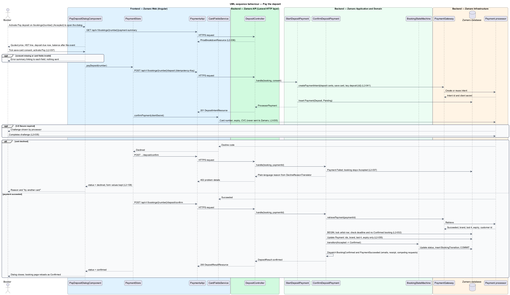
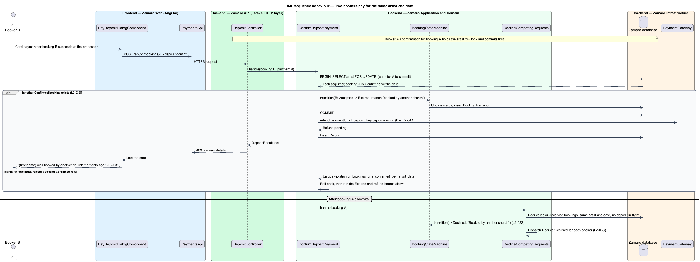
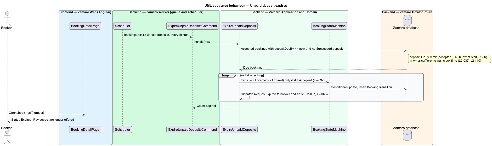

# Pay the deposit

## Overview

Zamaro lets churches around Toronto book Christian praise and worship artists. A
booking starts as a request (L2-028). When the artist accepts, the booking becomes
Accepted and the booker is asked to pay a deposit. Payment of the deposit is the
step that turns an Accepted booking into a Confirmed one and reserves the artist's
date.

This feature is that payment, from the payment dialog on Zamaro Web to the charge
at the payment processor and the Confirmed status in the Zamaro database. It also
covers the two ways a deposit fails to confirm: the deadline passes, or another
church pays for the same artist and date first. Collection of the remaining 75 % is
the sibling slice `payments/collect-balance`. Emails and PDF receipts that follow a
successful deposit belong to `notifications/send-transactional-emails` and
`payments/issue-receipts`. Webhook intake and idempotency keys are shared with
`payments/reconcile-payment-events`.

Terms used in this design:

- **deposit** — first payment on a booking, equal to 25 % of the total including any HST
- **balance** — remaining payment on a booking, charged after the event
- **quoted price** — artist's "From" price locked on the booking when the request is created
- **payment summary** — breakdown of quoted price, HST, deposit due now and balance due after the event
- **hosted card fields** — card inputs served by the payment processor inside Zamaro Web, so card data never reaches Zamaro
- **payment intent** — processor-side object that represents one attempt to collect a set amount, reused across card retries
- **3-D Secure** — card-issuer challenge that the processor shows before it authorises some payments
- **deposit deadline** — earlier of 48 hours after acceptance and 12 hours before the event start time
- **competing request** — Requested or Accepted booking for the same artist and date as a booking that becomes Confirmed

Three rules govern the slice. Card data goes directly to a PCI DSS Level 1
processor, and Zamaro keeps only identifiers, brand, last 4 digits and expiry
(L2-035). Every amount is integer cents with half-up rounding, and the deposit plus
balance equals the total (L2-036). An artist holds at most one Confirmed booking
per date, enforced by a row lock and a partial unique index (L2-032).

## Description

The slice runs from the payment dialog in Zamaro Web through the deposit endpoints
of the Zamaro API to the payment processor and the Zamaro database. A scheduled
command in the Zamaro Worker expires unpaid deposits.

**Frontend (Zamaro Web, `features/bookings`)**

- **`PayDepositDialogComponent`** — CDK dialog opened by the "Pay ${deposit} deposit"
  button on `BookingDetailPage` (`/bookings/:number`) while the booking is Accepted.
  The "Pay ${deposit} deposit" next action on `/bookings` navigates to that page; there
  is no separate payment route. The dialog shows the booking number, status and
  date, the deposit deadline ("Due by {date, time}"), the payment summary, the hosted
  card fields with name on card and billing postal code, a required save-card consent
  checkbox ("Save this card for the ${balance} balance", charged 48 hours after the
  event unless the booker reports a problem), the cancellation policy line and a Pay
  button. Pay stays enabled. Pressing it without consent or with invalid card fields
  shows an error summary that links to each field, and nothing is sent (L2-037,
  L2-108). Under 576 px (XS) the dialog fills the screen (L2-099).
- **`PaymentSummaryComponent`** — presentational component that renders the quoted
  price, the HST line when the artist has an HST number, the deposit due now and
  the balance due after the event, formatted by `FormatService` (L2-036, L2-110).
- **`CardFieldsService`** — wraps the processor's JavaScript SDK. It mounts the
  hosted card fields and confirms the payment intent with its client secret. The
  SDK shows any 3-D Secure challenge (L2-035). Card number, expiry and CVC go only
  to the processor.
- **`PaymentStore`** — signal-based store holding the summary, a status (`idle`,
  `paying`, `confirmed`, `declined`, `lost`) and the plain-language decline message.
  It generates one idempotency key per payment attempt and reuses it on a network
  retry (L2-108).
- **`PaymentsApi`** — typed client for the three deposit endpoints below.

The Pay button shows a busy state and blocks a second submission while a request
is pending; Not now and Close are disabled until the processor answers. A declined
card keeps the dialog open with the reason at the top, the processor's card fields
cleared for another card, and the name, postal code and consent kept (L2-037,
L2-108). On success the dialog closes and the booking page reloads as Confirmed.

**Backend (Zamaro API)**

- **`DepositController`** — controller with three routes, each authorised by
  `BookingPolicy` so that any user other than the booking's booker receives 404:
  - `GET /api/v1/bookings/{number}/payment-summary` returns a
    `PriceBreakdownResource`.
  - `POST /api/v1/bookings/{number}/deposit` validates `StartDepositRequest`
    (consent flag) and returns a `DepositIntentResource` holding the client secret.
  - `POST /api/v1/bookings/{number}/deposit/confirm` validates
    `ConfirmDepositRequest` (processor payment ID) and returns a
    `DepositResultResource`. A lost race returns 409 and a declined card returns
    402, both as RFC 9457 problem details.
- **`PriceBreakdown`** — value object in `App\Support`. `forBooking()` computes the
  quoted price, 13 % HST when the artist has an HST number, the total, the deposit
  (25 % of the quoted price plus 25 % of the HST, each rounded half-up) and the
  balance as total minus deposit. For a $650 quote without HST it yields $162.50 and
  $487.50 (L2-036).
- **`StartDepositPayment`** — action that checks the booking is Accepted and before
  its deposit deadline, calls `PaymentGateway::ensureCustomer()` for the booker, and
  creates or reuses one payment intent for the deposit amount. The intent asks the
  processor to save the card for off-session use, because the booker consented on
  the form (L2-037). It inserts a `Payment` of kind `Deposit` and status `Pending`.
- **`ConfirmDepositPayment`** — action shared by the confirm endpoint and the
  payment-succeeded webhook handler in `payments/reconcile-payment-events`, and safe
  to run twice. It retrieves the payment from the processor rather than trusting
  the browser. On success it opens a transaction, locks the artist row with
  `SELECT ... FOR UPDATE`, and checks that the booking is still Accepted, the
  deadline has not passed and no Confirmed booking exists for the artist and date.
  It then stores the processor payment and customer identifiers, card brand, last 4
  digits and expiry (L2-035) and applies Accepted → Confirmed through
  `BookingStateMachine`.
- **Lost race** — when another booking already holds the date, or the partial
  unique index rejects the update, `ConfirmDepositPayment` moves the booking to
  Expired and refunds the deposit in full. The booker sees "{first name} was booked
  by another church moments ago." (L2-032). A payment that succeeds after the
  booking already expired is refunded the same way.
- **Declined card** — `DeclineReasonTranslator` maps the processor's decline code to
  plain language under the heading "Your bank declined the card", one sentence per
  code. For insufficient funds the sentence is "The bank said there isn't enough
  credit on it." Wording for the other decline codes is `<TO SUPPLY>`. The `Payment` becomes `Failed` and the
  booking stays Accepted (L2-037).
- **`DeclineCompetingRequests`** — action run after the confirming transaction
  commits. It declines each competing request with the reason "Booked by another
  church" and dispatches `RequestDeclined` to each booker (L2-032). Competing
  bookings whose own deposit payment is in flight are left Accepted, so their own
  confirmation resolves them as a lost race. The window that counts as "in flight"
  is `<TO SUPPLY>`.
- **`BookingConfirmed`** and **`PaymentSucceeded`** — domain events dispatched after
  commit. Listeners on `BookingConfirmed` queue the confirmation emails (L2-063) and
  the competing-request step. The listener on `PaymentSucceeded` issues the receipt
  (L2-040). A refund dispatches `RefundSucceeded` once the processor confirms it.
- **`ExpireUnpaidDeposits`** — action run by the scheduled command
  `bookings:expire-unpaid-deposits` every minute. It moves each Accepted booking past
  its deposit deadline, with no succeeded deposit, to Expired. The update applies
  only while the status is still Accepted, so a repeated run has no effect (L2-092).
  It dispatches `RequestExpired` to both parties (L2-037, L2-063). The deadline is
  stored as `bookings.deposit_due_by` when the artist accepts, in `America/Toronto`
  wall-clock time (L2-110).
- **`PaymentGateway`** — interface in `App\Services\Payments` with one adapter for
  the payment processor (vendor `<TO SUPPLY>`). Each mutating call takes an
  `IdempotencyKey` derived from the booking and operation, for example
  `deposit:{bookingId}` and `deposit-refund:{bookingId}` (L2-041).

**Data**

- `payments` — one row per payment attempt: `booking_id`, `kind`, `amount_cents`,
  `processor_payment_id`, `processor_customer_id`, `status`, `card_brand`, `last4`,
  `exp_month`, `exp_year`. A partial unique index allows one `Succeeded` payment per
  booking and kind.
- `refunds` — `payment_id`, `amount_cents`, `processor_refund_id`, `status`, `reason`.
- `bookings` — the partial unique index `bookings_one_confirmed_per_artist_date` on
  (`artist_id`, `event_date`) `WHERE status = 'Confirmed'` rejects a second Confirmed
  booking (L2-032).
- `booking_transitions` — one row per status change, written by
  `BookingStateMachine`.

The processor customer identifier is stored on `users.processor_customer_id` and on
each payment. Whether the balance charge also needs a stored processor
payment-method identifier, or uses the customer's default card at the processor,
is `<TO SUPPLY>` once the vendor is chosen.

**Mock screens** — the Pay deposit dialog in states
[default](../../../mocks/dialogs/pay-deposit/default.html),
[busy](../../../mocks/dialogs/pay-deposit/busy.html),
[invalid](../../../mocks/dialogs/pay-deposit/invalid.html),
[failed](../../../mocks/dialogs/pay-deposit/failed.html) (declined card) and
[conflict](../../../mocks/dialogs/pay-deposit/conflict.html) (lost race, "Abigail was
booked by another church moments ago." with the full refund), opened from the
[accepted](../../../mocks/pages/booking-detail/accepted.html) booking page. The
[confirmed](../../../mocks/pages/booking-detail/confirmed.html) booking page shows a
paid deposit, the
[deposit-expired](../../../mocks/pages/booking-detail/deposit-expired.html) booking
page shows a deposit left unpaid past its deadline, and the [booking toast](../../../mocks/notifications/booking-toast/danger.html)
(danger and warning states) reports a declined card and, once an unpaid deposit
is due within 24 hours, shows an in-app deposit-due reminder (there is no reminder
email; L2-063 lists the emails).

## Requirements

The feature realises the following level-2 (L2) requirements. Each refines the
level-1 (L1) requirement shown, and the text is quoted from `docs/specs/L2.md`.

| L2 ID | Refines (L1) | Requirement |
|-------|--------------|-------------|
| `L2-035` | `L1-007` | **Payment processor and card data.** Card payments are taken through a PCI DSS Level 1 payment processor using its hosted fields or hosted checkout. Acceptance criteria: 1. Given a booker pays, when the card is entered, then the card number, expiry and CVC are sent directly to the processor and never reach Zamaro servers, logs or database. 2. Given a successful payment, when it is recorded, then Zamaro stores only the processor's payment and customer identifiers, card brand, last 4 digits and expiry month and year. 3. Given the processor requires 3-D Secure, when the booker pays, then the challenge is shown and the booking only confirms after it succeeds. |
| `L2-036` | `L1-007` | **Prices and tax.** Acceptance criteria: 1. Given an artist's quoted price of $650, when the booker views the payment summary, then it shows the quoted price, the deposit due now ($162.50), and the balance due after the event ($487.50). 2. Given an artist has registered an HST number, when the payment summary renders, then 13% HST on the quoted price is added as a separate line and included in the deposit and balance proportionally. 3. Given any amount, when it is calculated, then it is computed in integer cents and rounded half-up, and the deposit plus balance always equals the total exactly. |
| `L2-037` | `L1-007` | **Deposit.** Acceptance criteria: 1. Given an Accepted booking, when the booker pays the 25% deposit within 48 hours of acceptance, then the booking becomes Confirmed and the card is saved with the processor for the balance, with the booker's explicit consent shown on the payment form. 2. Given an Accepted booking whose deposit is unpaid 48 hours after acceptance, or 12 hours before the event, whichever is sooner, when the deadline passes, then the booking becomes Expired and both parties are notified. 3. Given a declined card, when the deposit fails, then the booking stays Accepted, the booker sees the processor's decline reason in plain language and can retry with another card. |
| `L2-032` | `L1-006` | **No double booking.** An artist has at most one Confirmed booking per calendar date. Acceptance criteria: 1. Given two Accepted bookings for the same artist and date, when both bookers pay the deposit at the same moment, then exactly one booking becomes Confirmed and the other payment is refunded in full and its booking becomes Expired with the message "{first name} was booked by another church moments ago." 2. Given a booking becomes Confirmed, when other Requested or Accepted bookings exist for that artist and date, then they become Declined automatically with the reason "Booked by another church" and their bookers are notified. 3. Given the database, when two Confirmed bookings for the same artist and date are inserted, then a uniqueness constraint rejects the second. |

## Diagrams

### System context

The booker pays Zamaro, but enters card details into the processor's hosted fields.
Zamaro creates and verifies the payment with the processor and emails both parties
once the booking is confirmed.

### Containers

Zamaro Web sends card data straight to the processor and calls the Zamaro API only
with identifiers. The API writes the confirmed status, and the Zamaro Worker expires
deposits left unpaid.

### Components

`DepositController` delegates to `StartDepositPayment` and `ConfirmDepositPayment`.
Only `ConfirmDepositPayment` changes booking status, through `BookingStateMachine`,
and every processor call passes through `PaymentGateway`.

### Class structure

A `Booking` owns its `Payment` rows, each typed by `PaymentKind` and
`PaymentStatus`. `PriceBreakdown` supplies the amounts, and the frontend store
mirrors the three deposit endpoints.

### Behaviour — pay the deposit

The booker opens the Pay deposit dialog from the booking page, sees the summary,
consents to saving the card and pays through the hosted fields, with a 3-D Secure
challenge when the processor asks for one. Missing consent or invalid card fields
stop at an error summary. A
declined card leaves the booking Accepted, and a successful charge confirms it
under the artist row lock.

### Behaviour — two bookers pay for the same date

When two Accepted bookings for one artist and date are paid together, the artist
row lock serialises the confirmations. The second booking becomes Expired and its
deposit is refunded in full, and the remaining competing requests are declined.

### Behaviour — unpaid deposit expires

Every minute the scheduler expires Accepted bookings whose deposit deadline has
passed and notifies both parties. A repeated run changes nothing.

