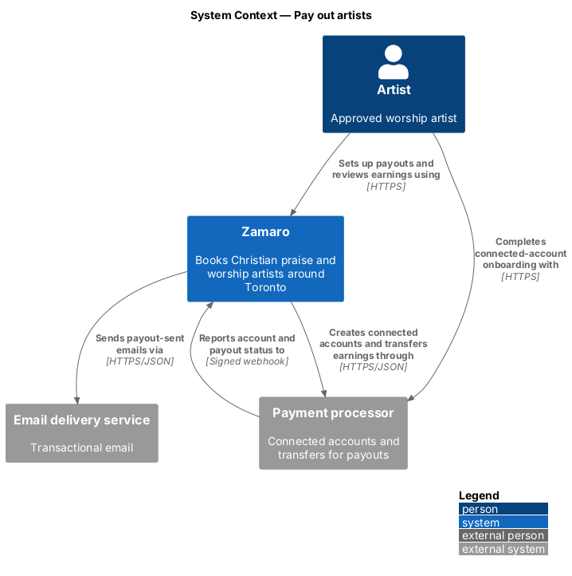
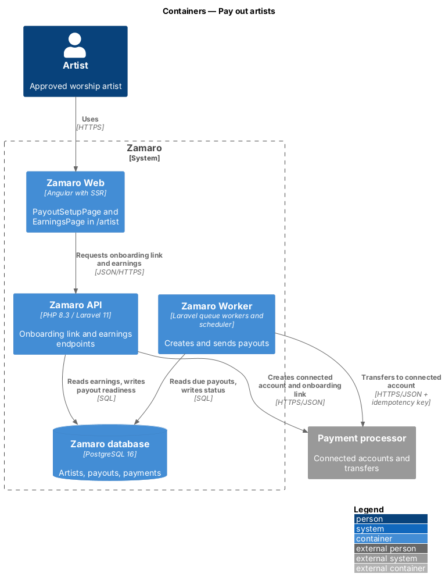
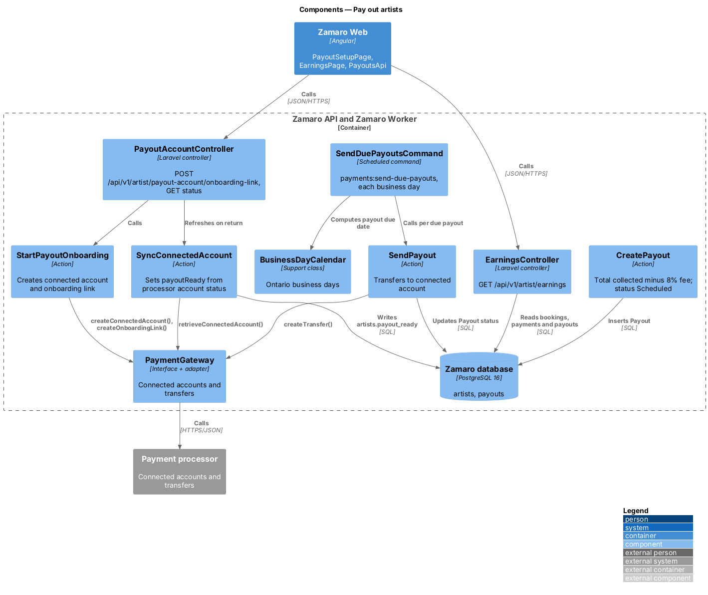
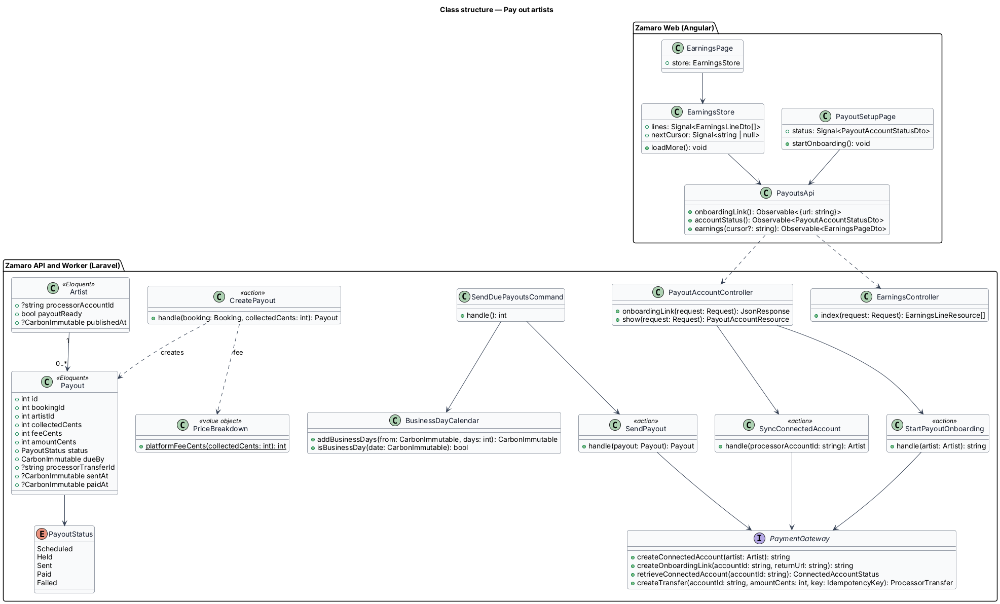
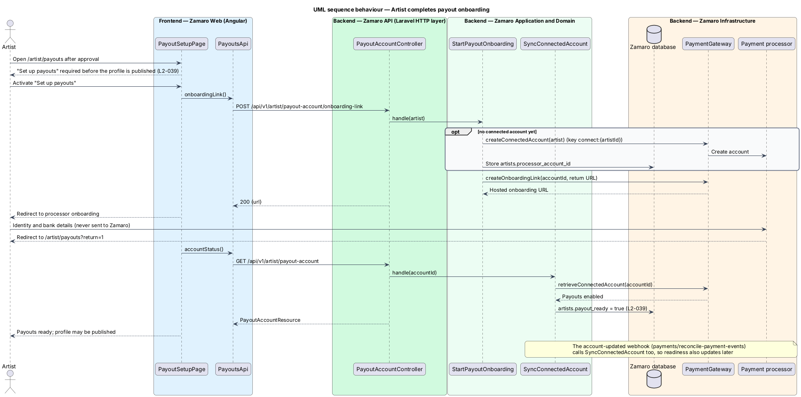
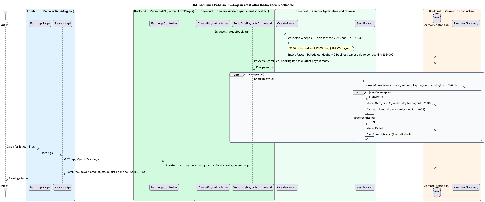

# Pay out artists

## Overview

Zamaro collects money from churches and pays artists what they earned, minus a
platform fee. This feature covers the artist side of that money flow. It covers
three parts: the artist's connected account at the payment processor, the payout
for each booking once the balance is collected, and the earnings page where the
artist follows each payout.

The slice sits at the end of the payments subsystem. It depends on
`payments/pay-deposit`, which holds the deposit in Zamaro's own processor balance,
and on `payments/collect-balance`, whose `BalanceCharged` event releases the
payout. Payout status changes reported by the processor arrive through
`payments/reconcile-payment-events`. The payout-sent email belongs to
`notifications/send-transactional-emails`. Artist approval and profile publication
belong to the artist subsystem. This slice supplies the `payoutReady` flag that
publication checks (L2-039).

Terms used in this design:

- **connected account** — artist's account at the payment processor that receives payouts
- **onboarding** — processor-hosted flow in which the artist supplies identity and bank details for the connected account
- **payout ready** — state of an artist whose connected account the processor reports as able to receive payouts
- **platform fee** — Zamaro's share, 8 % of the total collected on a booking
- **payout** — transfer of the total collected minus the platform fee from Zamaro's processor balance to the artist's connected account
- **business day** — weekday that is not a statutory holiday
- **held deposit** — deposit kept in Zamaro's processor balance until the balance is collected or the booking is cancelled

## Description

The slice runs from the artist workspace in Zamaro Web to the payout endpoints in
the Zamaro API, and from the `BalanceCharged` event to a scheduled command in the
Zamaro Worker.

**Frontend (Zamaro Web, `features/artist-workspace`)**

- **`PayoutSetupPage`** — routed page for `/artist/payouts`. It shows the connected
  account status and a "Set up payouts" action that redirects to the processor's
  hosted onboarding. On return it refreshes the status. The artist workspace shows
  this step as required before publication (L2-039).
- **`EarningsPage`** — routed page for `/artist/earnings`. It renders a design-system
  table with one row per booking: booking number, total, fee, payout amount, payout
  status and payout date (L2-039). Amounts use `FormatService` (L2-110).
- **`EarningsStore`** — signal-based store holding the loaded rows and the next
  cursor.
- **`PayoutsApi`** — typed client for the three endpoints below.

**Backend (Zamaro API)**

- **`PayoutAccountController`** — controller restricted to the `Artist` role:
  - `POST /api/v1/artist/payout-account/onboarding-link` calls
    `StartPayoutOnboarding` and returns the hosted onboarding URL.
  - `GET /api/v1/artist/payout-account` calls `SyncConnectedAccount` and returns a
    `PayoutAccountResource`.
- **`StartPayoutOnboarding`** — action that creates the connected account on first
  use, stores `artists.processor_account_id`, and requests a single-use onboarding
  link. Identity and bank details go only to the processor.
- **`SyncConnectedAccount`** — action that reads the connected account status from
  the processor and sets `artists.payout_ready`. The account-updated webhook calls
  it as well. When an account loses payout capability, the artist's profile stays
  published and new payouts stay `Scheduled` until it returns; whether the profile
  should be hidden instead is `<TO SUPPLY>`.
- **`EarningsController`** — controller for `GET /api/v1/artist/earnings`. It returns
  `EarningsLineResource` rows for the signed-in artist's bookings with collected
  money, using cursor pagination (L2-095).

**Backend (Zamaro Worker)**

- **`CreatePayoutListener`** — queued listener on `BalanceCharged`. It calls
  `CreatePayout`.
- **`CreatePayout`** — action that sums the succeeded deposit and balance payments
  less refunds. It computes the fee with `PriceBreakdown::platformFeeCents()` (8 %,
  integer cents, rounded half-up) and inserts a `Payout` with status `Scheduled`.
  `due_by` is 2 business days after the balance was collected. For a $650 booking
  the payout is $598.00 and the fee $52.00 (L2-039). A unique index on
  `payouts.booking_id` makes a repeated event harmless (L2-092). The cancellation
  slices call the same action for a late booker cancellation, where the payout is the
  deposit minus the fee (L2-042).
- **`SendDuePayoutsCommand`** — scheduled command `payments:send-due-payouts`, run
  hourly on business days. It selects `Scheduled` payouts whose booking has no hold
  (L2-038) and whose artist is payout ready, and calls `SendPayout` for each.
- **`SendPayout`** — action that calls `PaymentGateway::createTransfer()` with the key
  `payout:{bookingId}` (L2-041).
  - On acceptance it sets status `Sent` and `sent_at`, and records an `AuditEntry`
    (L2-069). It dispatches `PayoutSent` for the artist email (L2-063).
  - On rejection it sets `Failed` and calls `AlertAdministrators`.
  - A later processor event moves `Sent` to `Paid` with `paid_at`.
- **`BusinessDayCalendar`** — support class that counts business days in
  `America/Toronto`. The holiday list (Ontario or federal statutory holidays) is
  `<TO SUPPLY>`.
- **`PaymentGateway`** — interface shared across the payments subsystem. This slice
  adds `createConnectedAccount()`, `createOnboardingLink()`,
  `retrieveConnectedAccount()` and `createTransfer()`.

Card payments are charged to Zamaro's own processor account, not to the artist's
connected account. As a result the deposit stays in Zamaro's balance until a payout
or refund moves it (L2-039). The payout schedule, from the connected account to the
artist's bank, follows the processor's settings for that account (`<TO SUPPLY>`).

Whether the 8 % fee applies to the HST portion of the total, and whether the HST
passes to the artist in full, is `<TO SUPPLY>`. The worked example in L2-039 has no
HST.

**Data**

- `payouts` — `booking_id` (unique), `artist_id`, `collected_cents`, `fee_cents`,
  `amount_cents`, `status`, `due_by`, `processor_transfer_id`, `sent_at`, `paid_at`,
  `failure_code`.
- `artists` — `processor_account_id`, `payout_ready`.

## Requirements

The feature realises the following level-2 (L2) requirement. It refines the
level-1 (L1) requirement shown, and the text is quoted from `docs/specs/L2.md`.

| L2 ID | Refines (L1) | Requirement |
|-------|--------------|-------------|
| `L2-039` | `L1-007` | **Artist payouts.** Acceptance criteria: 1. Given an artist, when they are approved, then they must complete the processor's connected-account onboarding before their profile is published. 2. Given a booking's balance is collected, when payouts run, then the artist is paid the total collected minus the 8% platform fee (for $650: $598.00 paid, $52.00 fee) within 2 business days. 3. Given the deposit is collected, when the event has not happened yet, then the deposit is held by Zamaro and not paid out until the balance is collected or the booking is cancelled. 4. Given an artist, when they open `/artist/earnings`, then they see each booking's total, fee, payout amount, payout status and payout date. |

## Diagrams

### System context

The artist completes onboarding directly with the payment processor and reviews
earnings in Zamaro. Zamaro moves earnings to the connected account and learns the
outcome from signed webhooks.

### Containers

The Zamaro API handles onboarding and the earnings view. The Zamaro Worker creates
and sends payouts.

### Components

`StartPayoutOnboarding` and `SyncConnectedAccount` manage the connected account.
`CreatePayout` and `SendPayout` turn a collected balance into a transfer through
`PaymentGateway`.

### Class structure

Each `Payout` belongs to one booking and one `Artist`, and moves through
`PayoutStatus`. `PriceBreakdown` supplies the fee and `BusinessDayCalendar` the due
date.

### Behaviour — complete payout onboarding

The artist leaves Zamaro for the processor's hosted onboarding and returns to
`/artist/payouts`. Zamaro then reads the account status and marks the artist payout
ready, which publication requires.

### Behaviour — send a payout

A collected balance creates one scheduled payout with the 8 % fee deducted. The
hourly command transfers it within 2 business days unless the booking is held, and
the artist sees the result on `/artist/earnings`.

