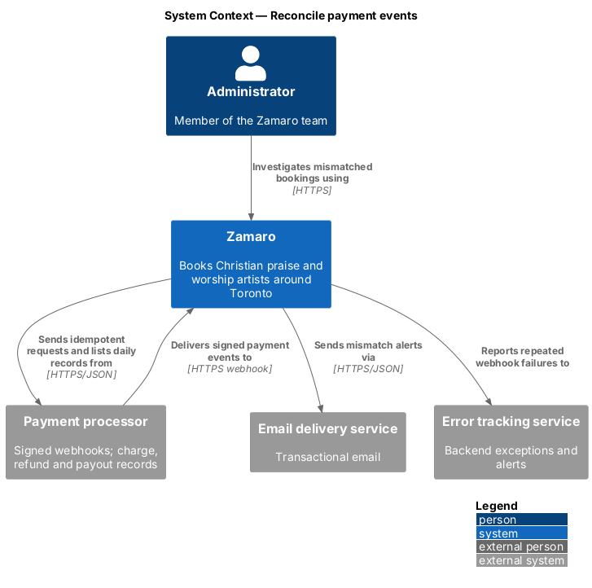
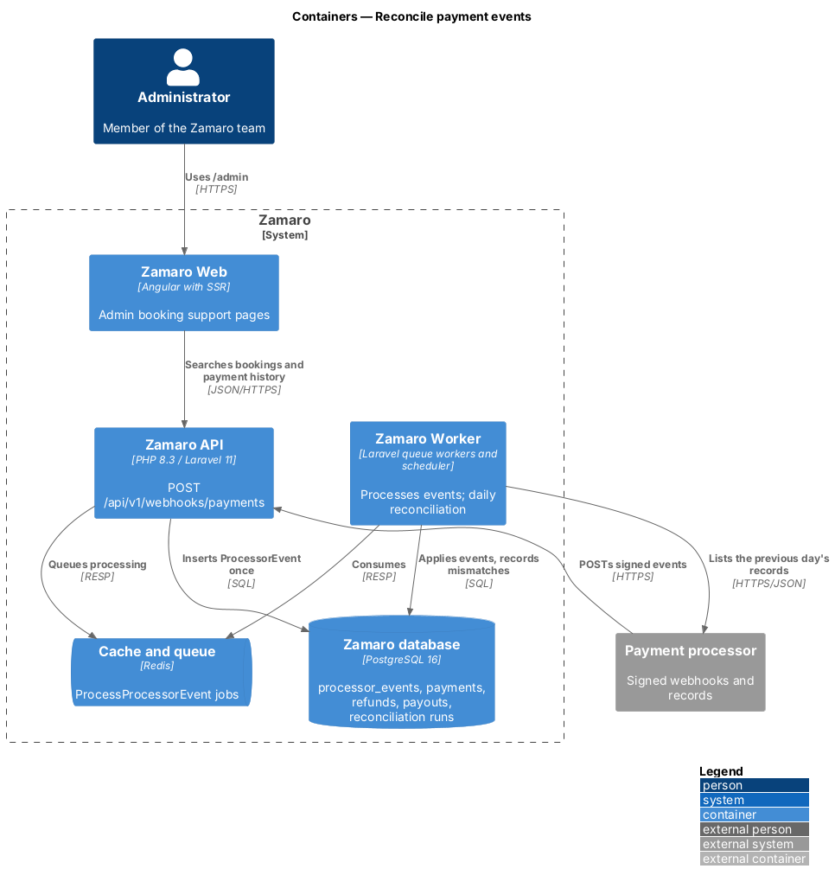
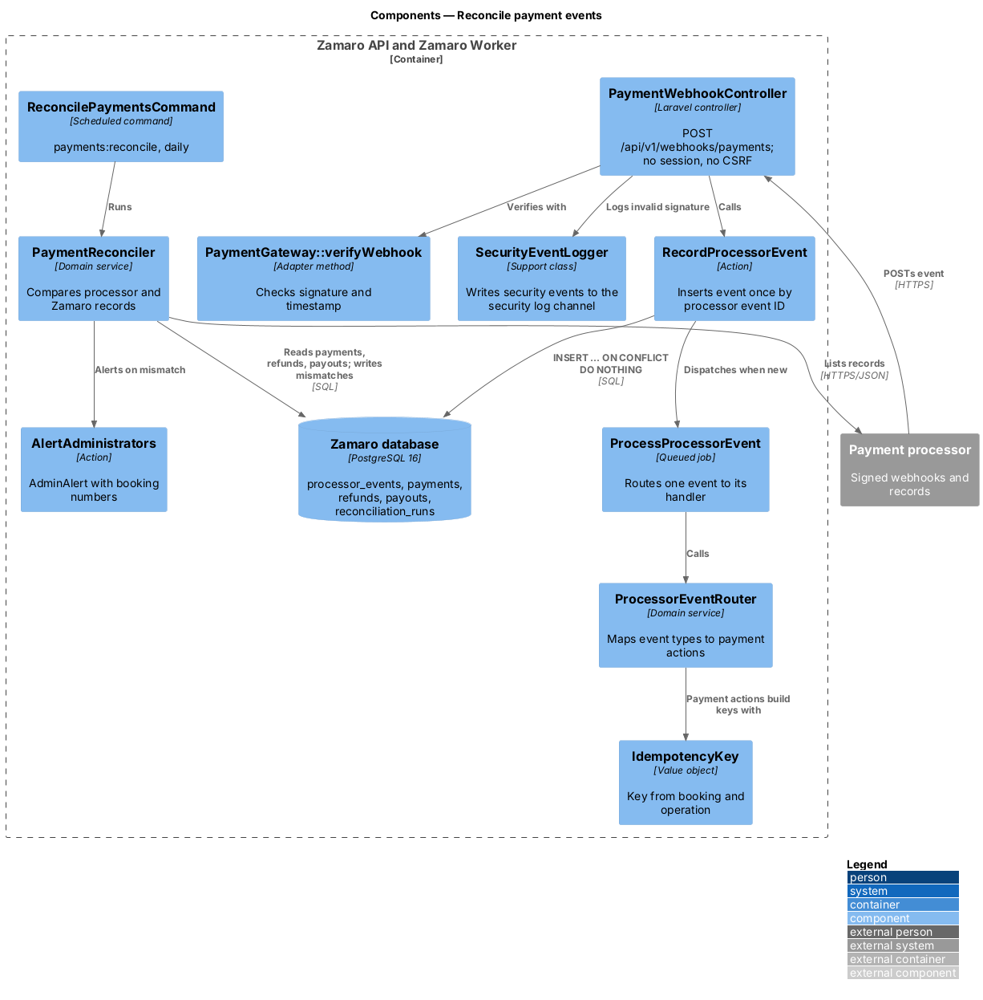
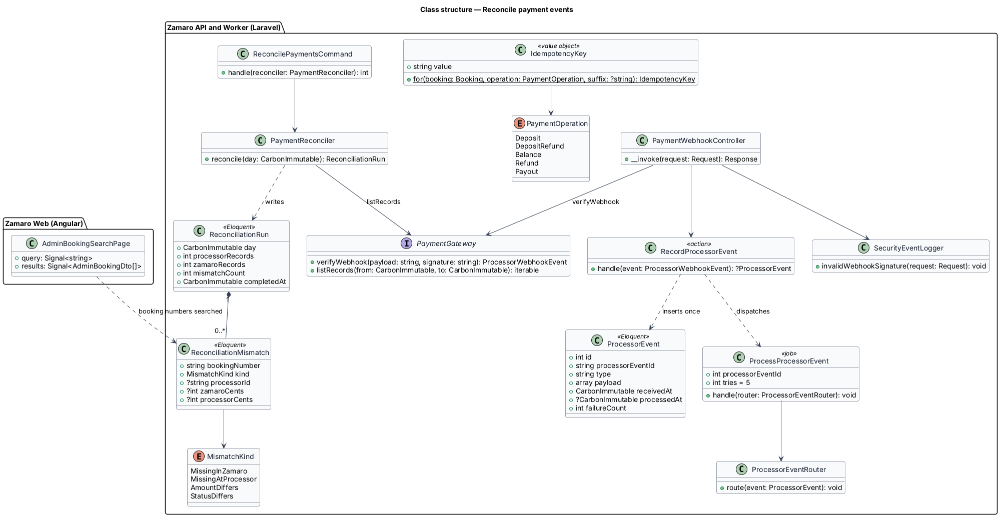
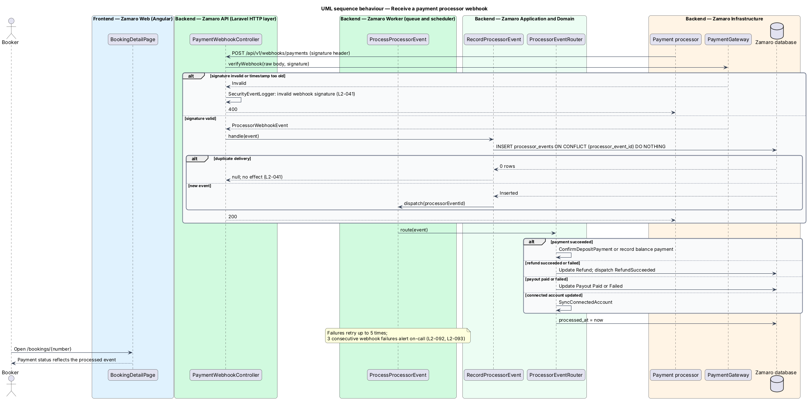
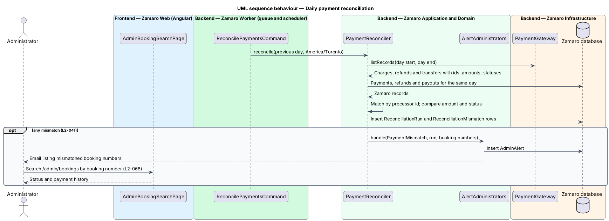

# Reconcile payment events

## Overview

Money in Zamaro moves at the payment processor, while Zamaro's own records decide
what a booking's status is. The two sets of records drift apart when a request is
retried, a webhook is delivered twice, or a webhook never arrives. This feature
keeps them in step. It receives the processor's signed webhooks safely, makes every
request to the processor idempotent, and compares both sets of records every day.

The slice is the shared plumbing of the payments subsystem. It routes processed
events to actions owned by the sibling slices: `ConfirmDepositPayment`
(`payments/pay-deposit`), balance outcomes (`payments/collect-balance`), payout
status and connected-account readiness (`payments/pay-out-artists`), and
`RefundSucceeded`, which `payments/issue-receipts` turns into a receipt. Searching
bookings by number for investigation is administrator booking support (L2-068).

Terms used in this design:

- **webhook** — HTTPS request the payment processor sends to Zamaro to report an event
- **webhook signature** — keyed hash in a request header that proves a webhook came from the processor
- **security event** — log entry on the dedicated `security` channel for a suspected attack
- **processor event ID** — processor's unique identifier for one event, the same across repeated deliveries
- **idempotency key** — string sent with a mutating request so that the processor applies a repeated request only once
- **payment operation** — kind of money movement for a booking: deposit, deposit refund, balance, refund or payout
- **reconciliation** — daily comparison of the processor's records with Zamaro's for one calendar day
- **mismatch** — record that exists on one side only, or whose amount or status differs between sides

## Description

The slice runs from the webhook endpoint in the Zamaro API through queued jobs and
a daily command in the Zamaro Worker. Its frontend presence is limited to the pages
where the corrected state is later seen.

**Backend (Zamaro API)**

- **`PaymentWebhookController`** — invokable controller for
  `POST /api/v1/webhooks/payments`. The route sits outside the session and CSRF
  middleware and reads the raw request body. It calls
  `PaymentGateway::verifyWebhook()`, which checks the signature with the webhook
  secret from the secrets manager and rejects stale timestamps (tolerance
  `<TO SUPPLY>`).
  - On an invalid signature it returns 400 and calls `SecurityEventLogger` with the
    request ID, source IP and event type, never the payload (L2-041, L2-079).
  - On a valid signature it calls `RecordProcessorEvent` and returns 200.
- **`RecordProcessorEvent`** — action that inserts a `ProcessorEvent` with
  `INSERT ... ON CONFLICT (processor_event_id) DO NOTHING`. A second delivery of the
  same event inserts nothing and is not processed again (L2-041). A new event
  dispatches `ProcessProcessorEvent`.
- **`SecurityEventLogger`** — support class that writes structured JSON security
  events with the request ID (L2-093).

**Backend (Zamaro Worker)**

- **`ProcessProcessorEvent`** — queued job that loads one event and calls
  `ProcessorEventRouter`. It retries with exponential backoff up to 5 times and then
  moves to the failed-jobs store and alerts (L2-092). Three consecutive failures
  alert the on-call person through error tracking (L2-093). On success it sets
  `processed_at`.
- **`ProcessorEventRouter`** — domain service that maps processor event types to
  the owning actions. The mapping covers payment succeeded or failed, refund
  succeeded or failed, transfer and payout paid or failed, and connected account
  updated. Each target action checks current state first, so an event that arrives
  after the browser already confirmed the deposit changes nothing. Unknown types are
  recorded and ignored. The exact processor event names are `<TO SUPPLY>` with the
  vendor.
- **`IdempotencyKey`** — value object in `App\Support`. `for(booking, operation,
  suffix)` builds keys such as `deposit:{bookingId}`, `deposit-refund:{bookingId}`,
  `balance:{bookingId}:{attempt}`, `refund:{refundId}` and `payout:{bookingId}`
  (L2-041). The `PaymentGateway` adapter refuses any charge, refund or transfer
  request without a key. The browser's per-attempt key from L2-108 maps to the same
  server key, so a resubmitted payment reaches the same payment intent.
- **`ReconcilePaymentsCommand`** — scheduled command `payments:reconcile`, run daily
  (time `<TO SUPPLY>`). It reconciles the previous calendar day in `America/Toronto`.
- **`PaymentReconciler`** — domain service that pages through
  `PaymentGateway::listRecords()` for the day and loads Zamaro's payments, refunds
  and payouts for the same day. It matches both sides by processor identifier. It
  records a `ReconciliationRun` with one `ReconciliationMismatch` per difference.
  When any mismatch exists it calls `AlertAdministrators` with the mismatched booking
  numbers (L2-041). Rerunning the same day replaces that day's run, so the command is
  safe to repeat (L2-092).
- **`AlertAdministrators`** — shared action from `payments/collect-balance`, used
  here with alert kind `PaymentMismatch`.

**Frontend (Zamaro Web)**

No new page is introduced. Bookers see the effect of processed events on
`BookingDetailPage` (`/bookings/:number`). Administrators open the mismatched
booking numbers from the alert in `AdminBookingSearchPage` (`/admin/bookings`,
L2-068). A dedicated reconciliation report page is `<TO SUPPLY>`.

**Data**

- `processor_events` — `processor_event_id` (unique), `type`, `payload` (JSON,
  card data never present), `received_at`, `processed_at`, `failure_count`.
  Retention period `<TO SUPPLY>`.
- `reconciliation_runs` — `day` (unique), `processor_records`, `zamaro_records`,
  `mismatch_count`, `completed_at`.
- `reconciliation_mismatches` — `run_id`, `booking_number`, `kind`, `processor_id`,
  `zamaro_cents`, `processor_cents`.

**Mock screens** — this slice has no screen of its own. Its outcomes show on the
booking page states [confirmed](../../../mocks/pages/booking-detail/confirmed.html),
[cancelled](../../../mocks/pages/booking-detail/cancelled.html) and
[completed](../../../mocks/pages/booking-detail/completed.html), and as payout statuses on
the [earnings](../../../mocks/pages/earnings/default.html) page. Administrators follow a
mismatch alert to [`pages/admin-bookings`](../../../mocks/pages/admin-bookings/default.html)
and [`pages/admin-booking`](../../../mocks/pages/admin-booking/default.html), which belong to
`administration/support-bookings-and-payments`; the reconciliation report itself is not
mocked.

## Requirements

The feature realises the following level-2 (L2) requirement. It refines the
level-1 (L1) requirement shown, and the text is quoted from `docs/specs/L2.md`.

| L2 ID | Refines (L1) | Requirement |
|-------|--------------|-------------|
| `L2-041` | `L1-007` | **Payment events and reconciliation.** Acceptance criteria: 1. Given a webhook from the payment processor, when its signature is invalid, then it is rejected with 400 and logged as a security event. 2. Given the same webhook event delivered twice, when it is processed, then the second delivery has no effect. 3. Given every charge, refund and payout request, when it is sent to the processor, then it carries an idempotency key derived from the booking and operation. 4. Given the daily reconciliation job, when processor records and Zamaro records disagree, then an administrator is alerted with the mismatched booking numbers. |

## Diagrams

### System context

The payment processor pushes signed events to Zamaro and supplies its daily
records. Zamaro alerts administrators by email when the two disagree, and reports
repeated webhook failures to error tracking.

### Containers

The Zamaro API accepts and deduplicates webhooks. The Zamaro Worker processes them
and runs the daily reconciliation.

### Components

`PaymentWebhookController` verifies and records each event, and
`ProcessProcessorEvent` routes it. `ReconcilePaymentsCommand` runs
`PaymentReconciler`, which raises an administrator alert on any mismatch.

### Class structure

`ProcessorEvent` holds each delivered event once. `IdempotencyKey` and
`PaymentOperation` name every outbound request, and each `ReconciliationRun` owns
its `ReconciliationMismatch` rows.

### Behaviour — receive a webhook

An invalid signature gets 400 and a security event. A valid event is inserted once
by its processor event ID, so a repeated delivery has no effect. The queued job
then routes the event to the action that owns it.

### Behaviour — reconcile the day

Each day the command compares the previous day's processor records with Zamaro's.
It stores every mismatch and alerts administrators with the booking numbers to
investigate.

